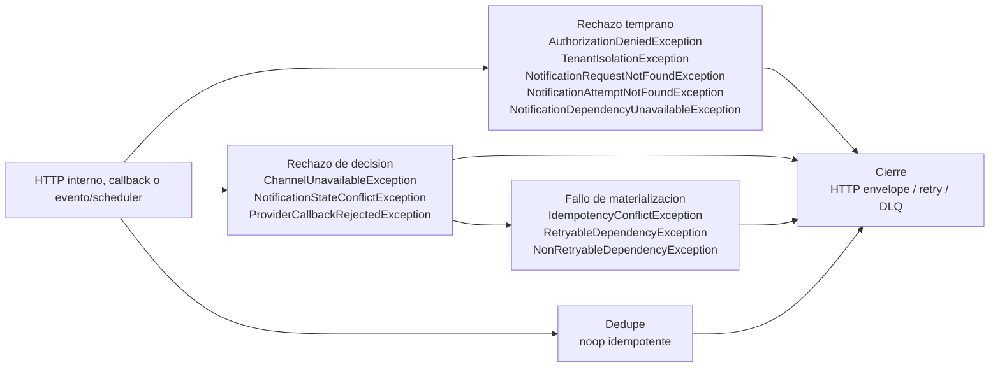

## Proposito
Definir los runtimes tecnicos de `notification-service` para todos sus casos de uso, incluyendo happy path, rutas de rechazo funcional, fallos tecnicos, dedupe, callbacks, cache, reproceso y publicacion asincrona.

## Alcance y fronteras
- Incluye comandos HTTP internos, callbacks de proveedor, consultas operativas, listeners de eventos y schedulers del servicio.
- Incluye interaccion con `api-gateway-service`, `order-service`, `inventory-service`, `reporting-service`, `identity-access-service`, `directory-service`, `provider-api`, `redis-cache`, `kafka-cluster` y `Notification DB`.
- Incluye rutas de rechazo funcional, fallos tecnicos posteriores a la decision, dedupe de eventos consumidos, invalidacion de cache y relay de outbox.
- Excluye decisiones de despliegue, cluster, topologia fisica y configuracion infra externa al limite del servicio.

## Casos de uso cubiertos por Notification
| Caso | Tipo | Trigger principal | Resultado esperado |
|---|---|---|---|
| `RequestNotificationByEvent` | command evento | `order-service`, `inventory-service`, `directory-service`, `reporting-service` | solicitud creada en `PENDING` con outbox listo para publicar |
| `RequestNotificationByApi` | command HTTP interno | servicio interno autorizado | solicitud creada en `PENDING` con respuesta sincronica |
| `DispatchNotification` | command HTTP interno | operador tecnico | estado `SENT` o `FAILED` consolidado |
| `RetryNotification` | command scheduler | `RetrySchedulerListener` | reprograma retry o descarta definitivamente segun politica |
| `DiscardNotification` | command HTTP interno | operador tecnico | estado `DISCARDED` consolidado |
| `ProcessProviderCallback` | command HTTP callback | proveedor externo | reconciliacion de solicitud e intento |
| `ListPendingNotifications` | query HTTP interno | operador tecnico | pagina operativa de solicitudes pendientes/fallidas |
| `GetNotificationDetail` | query HTTP interno | operador tecnico | detalle completo de solicitud e intentos |
| `ListNotificationAttempts` | query HTTP interno | operador tecnico | historial paginado de intentos por solicitud |
| `DispatchNotificationBatch` | command scheduler | `DispatchSchedulerListener` | lote procesado con metricas y delegacion a dispatch individual |
| `ReprocessNotificationDlq` | command scheduler | `NotificationDlqReprocessorListener` | reproceso idempotente o descarte tecnico de mensajes DLQ |
| `HandleUserBlocked` | command evento | `identity-access-service` | solicitud de seguridad creada para evento `UserBlocked` |

## Regla de lectura de los diagramas
- `Panorama global` puede incluir actores externos como broker, servicios vecinos, cache y proveedor para ubicar el borde del flujo.
- Los diagramas por fases de cada caso representan **arquitectura interna del servicio** y usan solo clases definidas en `Vista de Codigo`.
- `Exito` describe el happy path principal del caso.
- `Rechazo` separa `Rechazo temprano`, `Rechazo de decision`, `Fallo de materializacion` y `Fallo de propagacion` cuando esas rutas aplican.

## Modelo runtime de autenticacion y autorizacion
| Tipo de flujo | Regla aplicada |
|---|---|
| HTTP interno | `api-gateway-service` autentica la llamada cuando el trigger entra por borde web. El servicio materializa `PrincipalContext` y valida `tenant`, `callerRef` y operacion permitida antes de decidir en dominio. |
| callback de proveedor | No se modela como JWT de usuario. El servicio materializa `TriggerContext` mediante un `TriggerContextResolver` tecnico del callback y valida la legitimidad del cambio sobre la solicitud o el intento. |
| evento / scheduler | No se asume JWT de usuario. El servicio materializa `TriggerContext` mediante `TriggerContextResolver`, valida `tenant`, dedupe y legitimidad del trigger antes de crear, despachar o reprocesar notificaciones. |

## Modelo runtime de errores y excepciones
| Tipo de flujo | Regla aplicada |
|---|---|
| HTTP interno | `api-gateway-service` autentica la llamada cuando el trigger entra por borde web. El servicio materializa `PrincipalContext` y convierte rechazo temprano, decision o fallo tecnico en una salida operativa coherente. |
| callback de proveedor | No se modela como JWT de usuario. El servicio materializa `TriggerContext` tecnico del callback y clasifica el fallo como semantico, retryable o no retryable segun el estado de la solicitud y el intento. |
| evento / scheduler | `TriggerContext`, dedupe y `RetryPolicy` emiten error semantico o `noop idempotente`; si el fallo es tecnico se clasifica como retryable/no-retryable para reintento o DLQ. |

### Diagrama runtime de excepciones concretas

## Patron de fases runtime
| Fase | Que explica | Elementos incluidos | Regla de lectura |
|---|---|---|---|
| `Ingreso` | Recibe el trigger del caso de uso y adapta la entrada al servicio. | `request` o mensaje de entrada, `controller` / `listener` / `scheduler`, mapper de entrada cuando aplica, `command` / `query` y `port in`. | Describe el borde interno del servicio y el punto exacto donde el flujo entra a `Application service`. |
| `Preparacion` | Transforma la entrada en contexto semantico interno antes de consultar dependencias externas. | `use case`, assembler implicito, `value objects` y contexto derivado del trigger. | No hace I/O externo; solo prepara el caso para poder contextualizar y decidir correctamente. |
| `Contextualizacion` | Obtiene datos y validaciones tecnicas necesarias antes de decidir. | `ports out`, `adapters out`, cache, repositorios, reloj, callbacks, dedupe y clientes externos. | Aqui no se decide todavia el resultado de negocio; solo se reune el contexto necesario para la decision. |
| `Decision` | Explica la decision real del caso dentro del dominio. | Agregados, entidades, `value objects` de decision, politicas y eventos nacidos de la decision. | Solo dominio; se divide por agregado o foco semantico cuando el caso toca mas de un submodelo. |
| `Materializacion` | Hace efectiva la decision ya tomada por el dominio. | `ports out` y `adapters out` de salida, persistencia, auditoria, cache, dedupe, persistencia de callbacks y outbox. | Aqui no se vuelve a decidir negocio; solo se ejecuta tecnicamente lo ya resuelto por dominio. |
| `Proyeccion` | Convierte el resultado interno en una salida consumible por el trigger. | `response mappers`, `responses` o cierre tecnico del trigger interno. | Se usa en flujos HTTP y tambien como cierre tecnico en listeners, callbacks o schedulers. |
| `Propagacion` | Publica o distribuye efectos asincronos derivados del caso ya materializado. | Outbox, relay, publisher y entrega al broker. | Ocurre despues de materializar y normalmente no redefine el resultado funcional del caso principal. |

### Regla para rutas alternativas
- `Rechazo temprano`: corte funcional o tecnico antes de entrar a la decision de dominio.
- `Rechazo de decision`: corte funcional dentro del dominio.
- `Fallo de materializacion`: error tecnico despues de decidir pero antes de cerrar el caso.
- `Fallo de propagacion`: error asincrono al publicar efectos ya materializados.

## Diagramas runtime por caso de uso


{}
{}
> El bloque `Exito` describe el `happy path` de `RequestNotificationByEvent`. El bloque `Rechazo` agrupa `Rechazo temprano`, `Rechazo de decision`, `Fallo de materializacion`, `Fallo de propagacion`. Este flujo cubre eventos de `order-service`, `inventory-service`, `directory-service` y `reporting-service`; `HandleUserBlocked` se documenta aparte por su politica especifica. En algunas variantes de rechazo se usa `OrderEventListener` como representante de cierre tecnico para todos los listeners de entrada.

<table>
  <thead>
    <tr>
      <th>Etapa</th>
      <th>Clases para RequestNotificationByEvent</th>
      <th>Responsabilidad</th>
    </tr>
  </thead>
  <tbody>
    <tr>
      <td>Ingreso</td>
      <td><code>OrderEventListener</code>, <code>InventoryEventListener</code>, <code>DirectoryEventListener</code>, <code>ReportingEventListener</code>, <code>TriggerContextResolver</code>, <code>NotificationCommandMapper</code>, <code>RequestNotificationCommand</code>, <code>RequestNotificationPort</code></td>
      <td>Recibe el trigger del caso ya dentro del servicio y lo traduce al contrato de aplicacion que inicia el flujo interno.</td>
    </tr>
    <tr>
      <td>Preparacion</td>
      <td><code>RequestNotificationUseCase</code>, <code>NotificationKey</code></td>
      <td>Normaliza la intencion del caso y construye el contexto semantico interno sin hacer I/O externo.</td>
    </tr>
    <tr>
      <td>Contextualizacion - Dedupe</td>
      <td><code>RequestNotificationUseCase</code>, <code>ProcessedEventPort</code>, <code>ProcessedEventR2dbcRepositoryAdapter</code>, <code>ProcessedEventEntity</code></td>
      <td>Obtiene datos, autorizaciones, dedupe, cache, concurrencia o validaciones tecnicas necesarias antes de decidir en dominio.</td>
    </tr>
    <tr>
      <td>Contextualizacion - Routing y destinatario</td>
      <td><code>RequestNotificationUseCase</code>, <code>ChannelPolicyRepositoryPort</code>, <code>ChannelPolicyR2dbcRepositoryAdapter</code>, <code>ChannelPolicyEntity</code>, <code>NotificationTemplateRepositoryPort</code>, <code>NotificationTemplateR2dbcRepositoryAdapter</code>, <code>NotificationTemplateEntity</code>, <code>RecipientResolverPort</code>, <code>RecipientResolverDirectoryHttpClientAdapter</code></td>
      <td>Obtiene datos, autorizaciones, dedupe, cache, concurrencia o validaciones tecnicas necesarias antes de decidir en dominio.</td>
    </tr>
    <tr>
      <td>Decision - Notification</td>
      <td><code>RequestNotificationUseCase</code>, <code>TenantIsolationPolicy</code>, <code>NotificationDedupPolicy</code>, <code>ChannelRoutingPolicy</code>, <code>PayloadSanitizationPolicy</code>, <code>NotificationAggregate</code>, <code>NotificationRequestedEvent</code></td>
      <td>Evalua invariantes, reglas y politicas del dominio para aceptar, rechazar o consolidar el resultado del caso.</td>
    </tr>
    <tr>
      <td>Materializacion</td>
      <td><code>RequestNotificationUseCase</code>, <code>NotificationRequestRepositoryPort</code>, <code>NotificationRequestR2dbcRepositoryAdapter</code>, <code>NotificationRequestPersistenceMapper</code>, <code>NotificationRequestEntity</code>, <code>NotificationAuditPort</code>, <code>NotificationAuditR2dbcAdapter</code>, <code>NotificationAuditPersistenceMapper</code>, <code>NotificationAuditEntity</code>, <code>ProcessedEventPort</code>, <code>ProcessedEventR2dbcRepositoryAdapter</code>, <code>ProcessedEventEntity</code>, <code>OutboxPort</code>, <code>OutboxPersistenceAdapter</code>, <code>OutboxEventEntity</code></td>
      <td>Hace efectiva la decision tomada: persistencia, auditoria, cache, dedupe, callbacks, outbox y side effects tecnicos segun corresponda.</td>
    </tr>
    <tr>
      <td>Proyeccion</td>
      <td><code>RequestNotificationUseCase</code>, <code>OrderEventListener</code>, <code>InventoryEventListener</code>, <code>DirectoryEventListener</code>, <code>ReportingEventListener</code></td>
      <td>Cierra el trigger interno con el resultado operativo del caso sin exponer una respuesta HTTP externa.</td>
    </tr>
    <tr>
      <td>Propagacion</td>
      <td><code>OutboxPublisherScheduler</code>, <code>OutboxEventEntity</code>, <code>DomainEventPublisherPort</code>, <code>KafkaDomainEventPublisherAdapter</code>, <code>NotificationRequestedEvent</code></td>
      <td>Publica los efectos asincronos ya materializados mediante outbox, relay y broker.</td>
    </tr>
    <tr>
      <td>Rechazo temprano</td>
      <td><code>RequestNotificationUseCase</code>, <code>ProcessedEventPort</code>, <code>ChannelPolicyRepositoryPort</code>, <code>RecipientResolverPort</code>, <code>OrderEventListener</code></td>
      <td>Corta el flujo antes de decidir en dominio por dedupe, conflicto de contexto externo, validacion tecnica o autorizacion.</td>
    </tr>
    <tr>
      <td>Rechazo de decision</td>
      <td><code>RequestNotificationUseCase</code>, <code>TenantIsolationPolicy</code>, <code>NotificationDedupPolicy</code>, <code>NotificationAggregate</code>, <code>OrderEventListener</code></td>
      <td>Corta el flujo despues de evaluar reglas, invariantes o politicas del dominio.</td>
    </tr>
    <tr>
      <td>Fallo de materializacion</td>
      <td><code>RequestNotificationUseCase</code>, <code>NotificationRequestRepositoryPort</code>, <code>NotificationAuditPort</code>, <code>ProcessedEventPort</code>, <code>OutboxPort</code>, <code>OrderEventListener</code></td>
      <td>Representa un error tecnico posterior a la decision al persistir, auditar, actualizar cache, registrar dedupe o escribir outbox.</td>
    </tr>
    <tr>
      <td>Fallo de propagacion</td>
      <td><code>OutboxPublisherScheduler</code>, <code>OutboxEventEntity</code>, <code>DomainEventPublisherPort</code>, <code>KafkaDomainEventPublisherAdapter</code></td>
      <td>Representa un error asincrono al publicar efectos ya materializados hacia el broker o relay.</td>
    </tr>
  </tbody>
</table>
{}
{}
{}
{}

sequenceDiagram
  participant P1 as OrderEventListener
  participant P2 as InventoryEventListener
  participant P3 as DirectoryEventListener
  participant P4 as ReportingEventListener
  participant P5 as NotificationCommandMapper
  participant P6 as RequestNotificationCommand
  participant P7 as RequestNotificationPort
  P1->>P2: activa variante
  P2->>P3: activa variante
  P3->>P4: activa variante
  P4->>P5: mapea envelope
  P5->>P6: crea command
  P6->>P7: entra por port in


**Descripcion de la fase.** Recibe el trigger del caso ya dentro del servicio y lo traduce al contrato de aplicacion que inicia el flujo interno.

**Capa predominante.** Se ubica principalmente en `Adapter-in`, con cruce controlado hacia el puerto de entrada de `Application service`.

<table>
  <thead>
    <tr>
      <th>Paso</th>
      <th>Clase</th>
      <th>Accion</th>
    </tr>
  </thead>
  <tbody>
    <tr>
      <td>1</td>
      <td><code>OrderEventListener</code></td>
      <td>Recibe eventos de pedido y crea el trigger interno que inicia la solicitud de notificacion.</td>
    </tr>
    <tr>
      <td>2</td>
      <td><code>InventoryEventListener</code></td>
      <td>Recibe eventos operativos de inventario que deben derivar en una notificacion.</td>
    </tr>
    <tr>
      <td>3</td>
      <td><code>DirectoryEventListener</code></td>
      <td>Recibe eventos institucionales de directorio que ajustan destinatarios y contexto operativo.</td>
    </tr>
    <tr>
      <td>4</td>
      <td><code>ReportingEventListener</code></td>
      <td>Recibe eventos de reporting que disparan una solicitud asincrona de comunicacion.</td>
    </tr>
    <tr>
      <td>5</td>
      <td><code>NotificationCommandMapper</code></td>
      <td>Traduce el envelope de negocio al contrato interno comun de solicitud.</td>
    </tr>
    <tr>
      <td>6</td>
      <td><code>RequestNotificationCommand</code></td>
      <td>Representa la solicitud interna con tenant, evento, destinatario, payload y clave de correlacion.</td>
    </tr>
    <tr>
      <td>7</td>
      <td><code>RequestNotificationPort</code></td>
      <td>Entrega el comando al puerto de entrada que inicia el caso de uso.</td>
    </tr>
  </tbody>
</table>
{}
{}

sequenceDiagram
  participant P1 as RequestNotificationUseCase
  participant P2 as NotificationKey
  P1->>P2: construye clave


**Descripcion de la fase.** Normaliza la intencion del caso y construye el contexto semantico interno sin hacer I/O externo.

**Capa predominante.** Se ubica principalmente en `Application service`, preparando tipos y contexto antes de consultar dependencias externas.

<table>
  <thead>
    <tr>
      <th>Paso</th>
      <th>Clase</th>
      <th>Accion</th>
    </tr>
  </thead>
  <tbody>
    <tr>
      <td>1</td>
      <td><code>RequestNotificationUseCase</code></td>
      <td>Normaliza el trigger, extrae metadatos semanticos y prepara el contexto interno de la solicitud.</td>
    </tr>
    <tr>
      <td>2</td>
      <td><code>NotificationKey</code></td>
      <td>Compone la clave semantica usada para dedupe natural de la notificacion.</td>
    </tr>
  </tbody>
</table>
{}
{}

sequenceDiagram
  participant P1 as RequestNotificationUseCase
  participant P2 as ProcessedEventPort
  participant P3 as ProcessedEventR2dbcRepositoryAdapter
  participant P4 as ProcessedEventEntity
  P1->>P2: consulta dedupe
  P2->>P3: lee procesados
  P3->>P4: representa registro


**Descripcion de la fase.** Obtiene datos, autorizaciones, dedupe, cache, concurrencia o validaciones tecnicas necesarias antes de decidir en dominio.

**Capa predominante.** Se ubica en la frontera entre `Application service` y `Adapter-out`.

<table>
  <thead>
    <tr>
      <th>Paso</th>
      <th>Clase</th>
      <th>Accion</th>
    </tr>
  </thead>
  <tbody>
    <tr>
      <td>1</td>
      <td><code>RequestNotificationUseCase</code></td>
      <td>Consulta si el evento ya fue procesado antes de abrir una nueva solicitud.</td>
    </tr>
    <tr>
      <td>2</td>
      <td><code>ProcessedEventPort</code></td>
      <td>Expone la consulta de dedupe por evento y consumer dentro del servicio.</td>
    </tr>
    <tr>
      <td>3</td>
      <td><code>ProcessedEventR2dbcRepositoryAdapter</code></td>
      <td>Busca el registro tecnico de eventos ya consumidos por Notification.</td>
    </tr>
    <tr>
      <td>4</td>
      <td><code>ProcessedEventEntity</code></td>
      <td>Materializa el registro persistido usado para evitar side effects duplicados.</td>
    </tr>
  </tbody>
</table>
{}
{}

sequenceDiagram
  participant P1 as RequestNotificationUseCase
  participant P2 as ChannelPolicyRepositoryPort
  participant P3 as ChannelPolicyR2dbcRepositoryAdapter
  participant P4 as ChannelPolicyEntity
  participant P5 as NotificationTemplateRepositoryPort
  participant P6 as NotificationTemplateR2dbcRepositoryAdapter
  participant P7 as NotificationTemplateEntity
  participant P8 as RecipientResolverPort
  participant P9 as RecipientResolverDirectoryHttpClientAdapter
  P1->>P2: carga politica
  P2->>P3: lee politica
  P3->>P4: representa politica
  P4->>P5: carga plantilla
  P5->>P6: lee plantilla
  P6->>P7: representa plantilla
  P7->>P8: resuelve destinatario
  P8->>P9: consulta directory


**Descripcion de la fase.** Obtiene datos, autorizaciones, dedupe, cache, concurrencia o validaciones tecnicas necesarias antes de decidir en dominio.

**Capa predominante.** Se ubica en la frontera entre `Application service` y `Adapter-out`.

<table>
  <thead>
    <tr>
      <th>Paso</th>
      <th>Clase</th>
      <th>Accion</th>
    </tr>
  </thead>
  <tbody>
    <tr>
      <td>1</td>
      <td><code>RequestNotificationUseCase</code></td>
      <td>Obtiene politica, plantilla y destinatario antes de pedir una decision de dominio.</td>
    </tr>
    <tr>
      <td>2</td>
      <td><code>ChannelPolicyRepositoryPort</code></td>
      <td>Expone la obtencion de politicas de canal configuradas para el tenant y tipo de evento.</td>
    </tr>
    <tr>
      <td>3</td>
      <td><code>ChannelPolicyR2dbcRepositoryAdapter</code></td>
      <td>Recupera la politica de canal y reintentos desde persistencia.</td>
    </tr>
    <tr>
      <td>4</td>
      <td><code>ChannelPolicyEntity</code></td>
      <td>Modela la fila persistida con canal por defecto, fallback y maximos de reintento.</td>
    </tr>
    <tr>
      <td>5</td>
      <td><code>NotificationTemplateRepositoryPort</code></td>
      <td>Expone la busqueda de plantilla activa para el evento y canal seleccionados.</td>
    </tr>
    <tr>
      <td>6</td>
      <td><code>NotificationTemplateR2dbcRepositoryAdapter</code></td>
      <td>Recupera la plantilla activa que luego sera aplicada al payload.</td>
    </tr>
    <tr>
      <td>7</td>
      <td><code>NotificationTemplateEntity</code></td>
      <td>Modela la configuracion persistida de subject y body del canal.</td>
    </tr>
    <tr>
      <td>8</td>
      <td><code>RecipientResolverPort</code></td>
      <td>Expone la dependencia externa encargada de ubicar el destinatario final.</td>
    </tr>
    <tr>
      <td>9</td>
      <td><code>RecipientResolverDirectoryHttpClientAdapter</code></td>
      <td>Resuelve el destinatario real consultando `directory-service`.</td>
    </tr>
  </tbody>
</table>
{}
{}

sequenceDiagram
  participant P1 as RequestNotificationUseCase
  participant P2 as TenantIsolationPolicy
  participant P3 as NotificationDedupPolicy
  participant P4 as ChannelRoutingPolicy
  participant P5 as PayloadSanitizationPolicy
  participant P6 as NotificationAggregate
  participant P7 as NotificationRequestedEvent
  P1->>P2: valida tenant
  P2->>P3: evalua duplicado
  P3->>P4: define canal
  P4->>P5: sanitiza payload
  P5->>P6: solicita notificacion
  P6->>P7: emite evento


**Descripcion de la fase.** Evalua invariantes, reglas y politicas del dominio para aceptar, rechazar o consolidar el resultado del caso.

**Capa predominante.** Se ubica principalmente en `Domain`, orquestada por `Application service` sin delegar la decision de negocio a infraestructura.

<table>
  <thead>
    <tr>
      <th>Paso</th>
      <th>Clase</th>
      <th>Accion</th>
    </tr>
  </thead>
  <tbody>
    <tr>
      <td>1</td>
      <td><code>RequestNotificationUseCase</code></td>
      <td>Orquesta la evaluacion de dominio con todo el contexto ya cargado y validado.</td>
    </tr>
    <tr>
      <td>2</td>
      <td><code>TenantIsolationPolicy</code></td>
      <td>Garantiza que el trigger solo pueda operar sobre el tenant permitido para la solicitud.</td>
    </tr>
    <tr>
      <td>3</td>
      <td><code>NotificationDedupPolicy</code></td>
      <td>Determina si la clave natural de la notificacion ya representa un side effect existente.</td>
    </tr>
    <tr>
      <td>4</td>
      <td><code>ChannelRoutingPolicy</code></td>
      <td>Selecciona canal y plantilla efectivos para el evento dentro del tenant.</td>
    </tr>
    <tr>
      <td>5</td>
      <td><code>PayloadSanitizationPolicy</code></td>
      <td>Normaliza y filtra el payload antes de consolidarlo en el agregado.</td>
    </tr>
    <tr>
      <td>6</td>
      <td><code>NotificationAggregate</code></td>
      <td>Crea o consolida la solicitud en estado `PENDING` preservando invariantes del ciclo de vida.</td>
    </tr>
    <tr>
      <td>7</td>
      <td><code>NotificationRequestedEvent</code></td>
      <td>Representa el hecho de dominio que deja la solicitud lista para ser publicada via outbox.</td>
    </tr>
  </tbody>
</table>
{}
{}

sequenceDiagram
  participant P1 as RequestNotificationUseCase
  participant P2 as NotificationRequestRepositoryPort
  participant P3 as NotificationRequestR2dbcRepositoryAdapter
  participant P4 as NotificationRequestPersistenceMapper
  participant P5 as NotificationRequestEntity
  participant P6 as NotificationAuditPort
  participant P7 as NotificationAuditR2dbcAdapter
  participant P8 as NotificationAuditPersistenceMapper
  participant P9 as NotificationAuditEntity
  participant P10 as ProcessedEventPort
  participant P11 as ProcessedEventR2dbcRepositoryAdapter
  participant P12 as ProcessedEventEntity
  participant P13 as OutboxPort
  participant P14 as OutboxPersistenceAdapter
  participant P15 as OutboxEventEntity
  P1->>P2: guarda solicitud
  P2->>P3: persiste solicitud
  P3->>P4: mapea entidad
  P4->>P5: representa fila
  P5->>P6: registra auditoria
  P6->>P7: persiste auditoria
  P7->>P8: mapea auditoria
  P8->>P9: representa auditoria
  P9->>P10: marca procesado
  P10->>P11: persiste dedupe
  P11->>P12: representa dedupe
  P12->>P13: escribe outbox
  P13->>P14: persiste outbox
  P14->>P15: representa outbox


**Descripcion de la fase.** Hace efectiva la decision tomada: persistencia, auditoria, cache, dedupe, callbacks, outbox y side effects tecnicos segun corresponda.

**Capa predominante.** Se ubica en la frontera entre `Application service` y `Adapter-out`.

<table>
  <thead>
    <tr>
      <th>Paso</th>
      <th>Clase</th>
      <th>Accion</th>
    </tr>
  </thead>
  <tbody>
    <tr>
      <td>1</td>
      <td><code>RequestNotificationUseCase</code></td>
      <td>Materializa la solicitud, la auditoria, el dedupe y el outbox derivados de la decision.</td>
    </tr>
    <tr>
      <td>2</td>
      <td><code>NotificationRequestRepositoryPort</code></td>
      <td>Expone la persistencia reactiva de la solicitud consolidada.</td>
    </tr>
    <tr>
      <td>3</td>
      <td><code>NotificationRequestR2dbcRepositoryAdapter</code></td>
      <td>Guarda la solicitud en la base de datos del servicio.</td>
    </tr>
    <tr>
      <td>4</td>
      <td><code>NotificationRequestPersistenceMapper</code></td>
      <td>Convierte el agregado a la entidad persistible que representa la solicitud.</td>
    </tr>
    <tr>
      <td>5</td>
      <td><code>NotificationRequestEntity</code></td>
      <td>Materializa la fila almacenada con el estado pendiente de despacho.</td>
    </tr>
    <tr>
      <td>6</td>
      <td><code>NotificationAuditPort</code></td>
      <td>Expone el registro auditable del caso y su resultado operacional.</td>
    </tr>
    <tr>
      <td>7</td>
      <td><code>NotificationAuditR2dbcAdapter</code></td>
      <td>Guarda la traza operativa del alta de solicitud y sus metadatos.</td>
    </tr>
    <tr>
      <td>8</td>
      <td><code>NotificationAuditPersistenceMapper</code></td>
      <td>Convierte la evidencia operacional a su entidad persistible.</td>
    </tr>
    <tr>
      <td>9</td>
      <td><code>NotificationAuditEntity</code></td>
      <td>Materializa el registro auditable de la transaccion local.</td>
    </tr>
    <tr>
      <td>10</td>
      <td><code>ProcessedEventPort</code></td>
      <td>Expone el registro tecnico que evita reprocesar el mismo evento entrante.</td>
    </tr>
    <tr>
      <td>11</td>
      <td><code>ProcessedEventR2dbcRepositoryAdapter</code></td>
      <td>Marca el evento como procesado dentro del consumer Notification.</td>
    </tr>
    <tr>
      <td>12</td>
      <td><code>ProcessedEventEntity</code></td>
      <td>Materializa el registro persistido del evento consumido.</td>
    </tr>
    <tr>
      <td>13</td>
      <td><code>OutboxPort</code></td>
      <td>Expone la escritura del evento de dominio en el outbox transaccional.</td>
    </tr>
    <tr>
      <td>14</td>
      <td><code>OutboxPersistenceAdapter</code></td>
      <td>Guarda el evento pendiente de publicacion asincrona.</td>
    </tr>
    <tr>
      <td>15</td>
      <td><code>OutboxEventEntity</code></td>
      <td>Materializa el registro de outbox asociado a `NotificationRequestedEvent`.</td>
    </tr>
  </tbody>
</table>
{}
{}

sequenceDiagram
  participant P1 as RequestNotificationUseCase
  participant P2 as OrderEventListener
  participant P3 as InventoryEventListener
  participant P4 as DirectoryEventListener
  participant P5 as ReportingEventListener
  P1->>P2: cierra evento
  P2->>P3: cierra variante
  P3->>P4: cierra variante
  P4->>P5: cierra variante


**Descripcion de la fase.** Cierra el trigger interno con el resultado operativo del caso sin exponer una respuesta HTTP externa.

**Capa predominante.** Se ubica entre `Application service` y `Adapter-in`, cerrando el trigger tecnico sin exponer una API externa.

<table>
  <thead>
    <tr>
      <th>Paso</th>
      <th>Clase</th>
      <th>Accion</th>
    </tr>
  </thead>
  <tbody>
    <tr>
      <td>1</td>
      <td><code>RequestNotificationUseCase</code></td>
      <td>Cierra el caso internamente una vez la transaccion local y el outbox quedaron consistentes.</td>
    </tr>
    <tr>
      <td>2</td>
      <td><code>OrderEventListener</code></td>
      <td>Finaliza el consumo de eventos de pedido sin devolver respuesta HTTP.</td>
    </tr>
    <tr>
      <td>3</td>
      <td><code>InventoryEventListener</code></td>
      <td>Finaliza el consumo de eventos de inventario sobre el mismo contrato interno.</td>
    </tr>
    <tr>
      <td>4</td>
      <td><code>DirectoryEventListener</code></td>
      <td>Finaliza el consumo de eventos institucionales de directorio sobre el mismo contrato interno.</td>
    </tr>
    <tr>
      <td>5</td>
      <td><code>ReportingEventListener</code></td>
      <td>Finaliza el consumo de eventos de reporting dejando trazabilidad local.</td>
    </tr>
  </tbody>
</table>
{}
{}

sequenceDiagram
  participant P1 as OutboxPublisherScheduler
  participant P2 as OutboxEventEntity
  participant P3 as DomainEventPublisherPort
  participant P4 as KafkaDomainEventPublisherAdapter
  participant P5 as NotificationRequestedEvent
  P1->>P2: lee outbox
  P2->>P3: solicita publish
  P3->>P4: publica broker
  P4->>P5: confirma entrega


**Descripcion de la fase.** Publica los efectos asincronos ya materializados mediante outbox, relay y broker.

**Capa predominante.** Se ubica principalmente en `Adapter-out`, desacoplando la publicacion del cierre transaccional del caso.

<table>
  <thead>
    <tr>
      <th>Paso</th>
      <th>Clase</th>
      <th>Accion</th>
    </tr>
  </thead>
  <tbody>
    <tr>
      <td>1</td>
      <td><code>OutboxPublisherScheduler</code></td>
      <td>Encuentra el evento persistido en outbox y lo prepara para publicacion desacoplada.</td>
    </tr>
    <tr>
      <td>2</td>
      <td><code>OutboxEventEntity</code></td>
      <td>Representa el evento `NotificationRequestedEvent` ya materializado en la base de datos.</td>
    </tr>
    <tr>
      <td>3</td>
      <td><code>DomainEventPublisherPort</code></td>
      <td>Expone la publicacion asincrona del evento de dominio.</td>
    </tr>
    <tr>
      <td>4</td>
      <td><code>KafkaDomainEventPublisherAdapter</code></td>
      <td>Entrega `NotificationRequestedEvent` al broker con el topic canonico del servicio.</td>
    </tr>
    <tr>
      <td>5</td>
      <td><code>NotificationRequestedEvent</code></td>
      <td>Representa el hecho de negocio que otras capacidades pueden consumir aguas abajo.</td>
    </tr>
  </tbody>
</table>
{}
{}
{}
{}
{}
{}

sequenceDiagram
  participant P1 as RequestNotificationUseCase
  participant P2 as ProcessedEventPort
  participant P3 as ChannelPolicyRepositoryPort
  participant P4 as RecipientResolverPort
  participant P5 as OrderEventListener
  P1->>P2: detecta duplicado
  P2->>P3: no encuentra politica
  P3->>P4: falla resolucion
  P4->>P5: cierra trigger


**Descripcion de la fase.** Corta el flujo antes de decidir en dominio por dedupe, conflicto de contexto externo, validacion tecnica o autorizacion.

**Capa predominante.** Se ubica entre `Adapter-in`, `Application service` y `Adapter-out`, cortando el trigger antes de entrar al dominio.

<table>
  <thead>
    <tr>
      <th>Paso</th>
      <th>Clase</th>
      <th>Accion</th>
    </tr>
  </thead>
  <tbody>
    <tr>
      <td>1</td>
      <td><code>RequestNotificationUseCase</code></td>
      <td>Detecta una condicion tecnica o de contexto que impide continuar antes de decidir en dominio.</td>
    </tr>
    <tr>
      <td>2</td>
      <td><code>ProcessedEventPort</code></td>
      <td>Evita reprocesar el mismo evento cuando ya existe evidencia tecnica de consumo previo.</td>
    </tr>
    <tr>
      <td>3</td>
      <td><code>ChannelPolicyRepositoryPort</code></td>
      <td>Detecta ausencia de politica de canal para el tipo de evento y tenant del trigger.</td>
    </tr>
    <tr>
      <td>4</td>
      <td><code>RecipientResolverPort</code></td>
      <td>No logra obtener un destinatario valido y obliga a cortar el caso antes del dominio.</td>
    </tr>
    <tr>
      <td>5</td>
      <td><code>OrderEventListener</code></td>
      <td>Recibe la senal de rechazo temprano y corta el flujo interno dejando evidencia operativa del descarte.</td>
    </tr>
  </tbody>
</table>
{}
{}

sequenceDiagram
  participant P1 as RequestNotificationUseCase
  participant P2 as TenantIsolationPolicy
  participant P3 as NotificationDedupPolicy
  participant P4 as NotificationAggregate
  participant P5 as OrderEventListener
  P1->>P2: rechaza tenant
  P2->>P3: rechaza duplicado
  P3->>P4: rechaza solicitud
  P4->>P5: cierra rechazo


**Descripcion de la fase.** Corta el flujo despues de evaluar reglas, invariantes o politicas del dominio.

**Capa predominante.** Se ubica principalmente en `Domain`, con cierre operativo hacia el trigger interno del servicio.

<table>
  <thead>
    <tr>
      <th>Paso</th>
      <th>Clase</th>
      <th>Accion</th>
    </tr>
  </thead>
  <tbody>
    <tr>
      <td>1</td>
      <td><code>RequestNotificationUseCase</code></td>
      <td>Llega al dominio con contexto valido, pero una politica o agregado rechaza la operacion.</td>
    </tr>
    <tr>
      <td>2</td>
      <td><code>TenantIsolationPolicy</code></td>
      <td>Bloquea la solicitud cuando el evento no pertenece al tenant autorizado.</td>
    </tr>
    <tr>
      <td>3</td>
      <td><code>NotificationDedupPolicy</code></td>
      <td>Evita generar una nueva solicitud si la clave natural ya representa el mismo efecto.</td>
    </tr>
    <tr>
      <td>4</td>
      <td><code>NotificationAggregate</code></td>
      <td>No permite consolidar la notificacion cuando las invariantes del agregado no se satisfacen.</td>
    </tr>
    <tr>
      <td>5</td>
      <td><code>OrderEventListener</code></td>
      <td>Recibe la salida de rechazo de negocio y cierra el trigger interno sin materializar cambios adicionales.</td>
    </tr>
  </tbody>
</table>
{}
{}

sequenceDiagram
  participant P1 as RequestNotificationUseCase
  participant P2 as NotificationRequestRepositoryPort
  participant P3 as NotificationAuditPort
  participant P4 as ProcessedEventPort
  participant P5 as OutboxPort
  participant P6 as OrderEventListener
  P1->>P2: falla persistencia
  P2->>P3: falla auditoria
  P3->>P4: falla dedupe
  P4->>P5: falla outbox
  P5->>P6: reporta fallo


**Descripcion de la fase.** Representa un error tecnico posterior a la decision al persistir, auditar, actualizar cache, registrar dedupe o escribir outbox.

**Capa predominante.** Se ubica en la frontera entre `Application service` y `Adapter-out`.

<table>
  <thead>
    <tr>
      <th>Paso</th>
      <th>Clase</th>
      <th>Accion</th>
    </tr>
  </thead>
  <tbody>
    <tr>
      <td>1</td>
      <td><code>RequestNotificationUseCase</code></td>
      <td>Ya existe una decision valida, pero una dependencia de salida falla al hacerla efectiva.</td>
    </tr>
    <tr>
      <td>2</td>
      <td><code>NotificationRequestRepositoryPort</code></td>
      <td>No logra materializar la solicitud despues de que el dominio ya decidio crearla.</td>
    </tr>
    <tr>
      <td>3</td>
      <td><code>NotificationAuditPort</code></td>
      <td>No logra registrar la evidencia operacional exigida por el servicio.</td>
    </tr>
    <tr>
      <td>4</td>
      <td><code>ProcessedEventPort</code></td>
      <td>No logra marcar el evento como procesado y deja el consumo sin cierre tecnico seguro.</td>
    </tr>
    <tr>
      <td>5</td>
      <td><code>OutboxPort</code></td>
      <td>No logra guardar el evento para publicacion asincrona.</td>
    </tr>
    <tr>
      <td>6</td>
      <td><code>OrderEventListener</code></td>
      <td>Recibe o observa el error tecnico y corta el cierre operativo del caso, dejandolo visible para reintento o atencion operacional.</td>
    </tr>
  </tbody>
</table>
{}
{}

sequenceDiagram
  participant P1 as OutboxPublisherScheduler
  participant P2 as OutboxEventEntity
  participant P3 as DomainEventPublisherPort
  participant P4 as KafkaDomainEventPublisherAdapter
  P1->>P2: lee outbox
  P2->>P3: solicita publish
  P3->>P4: publica broker


**Descripcion de la fase.** Representa un error asincrono al publicar efectos ya materializados hacia el broker o relay.

**Capa predominante.** Se ubica principalmente en `Adapter-out`, despues de que la transaccion principal ya quedo definida.

<table>
  <thead>
    <tr>
      <th>Paso</th>
      <th>Clase</th>
      <th>Accion</th>
    </tr>
  </thead>
  <tbody>
    <tr>
      <td>1</td>
      <td><code>OutboxPublisherScheduler</code></td>
      <td>Encuentra eventos ya materializados pendientes de publicacion asincrona.</td>
    </tr>
    <tr>
      <td>2</td>
      <td><code>OutboxEventEntity</code></td>
      <td>Representa el evento persistido cuya publicacion debe completarse sin reabrir la transaccion principal.</td>
    </tr>
    <tr>
      <td>3</td>
      <td><code>DomainEventPublisherPort</code></td>
      <td>Expone la abstraccion de publicacion asincrona consumida por el relay.</td>
    </tr>
    <tr>
      <td>4</td>
      <td><code>KafkaDomainEventPublisherAdapter</code></td>
      <td>Entrega `NotificationRequestedEvent` al broker con la clave y payload pactados por Notification.</td>
    </tr>
  </tbody>
</table>
{}
{}
{}
{}


{}
{}
> El bloque `Exito` describe el `happy path` de `RequestNotificationByApi`. El bloque `Rechazo` agrupa `Rechazo temprano`, `Rechazo de decision`, `Fallo de materializacion`, `Fallo de propagacion`.

<table>
  <thead>
    <tr>
      <th>Etapa</th>
      <th>Clases para RequestNotificationByApi</th>
      <th>Responsabilidad</th>
    </tr>
  </thead>
  <tbody>
    <tr>
      <td>Ingreso</td>
      <td><code>InternalNotificationController</code>, <code>NotificationCommandMapper</code>, <code>RequestNotificationCommand</code>, <code>RequestNotificationPort</code></td>
      <td>Recibe el trigger del caso ya dentro del servicio y lo traduce al contrato de aplicacion que inicia el flujo interno.</td>
    </tr>
    <tr>
      <td>Preparacion</td>
      <td><code>RequestNotificationUseCase</code>, <code>NotificationKey</code></td>
      <td>Normaliza la intencion del caso y construye el contexto semantico interno sin hacer I/O externo.</td>
    </tr>
    <tr>
      <td>Contextualizacion - Routing y destinatario</td>
      <td><code>RequestNotificationUseCase</code>, <code>ChannelPolicyRepositoryPort</code>, <code>ChannelPolicyR2dbcRepositoryAdapter</code>, <code>ChannelPolicyEntity</code>, <code>NotificationTemplateRepositoryPort</code>, <code>NotificationTemplateR2dbcRepositoryAdapter</code>, <code>NotificationTemplateEntity</code>, <code>RecipientResolverPort</code>, <code>RecipientResolverDirectoryHttpClientAdapter</code></td>
      <td>Obtiene datos, autorizaciones, dedupe, cache, concurrencia o validaciones tecnicas necesarias antes de decidir en dominio.</td>
    </tr>
    <tr>
      <td>Contextualizacion - Estado actual</td>
      <td><code>RequestNotificationUseCase</code>, <code>NotificationRequestRepositoryPort</code>, <code>NotificationRequestR2dbcRepositoryAdapter</code>, <code>NotificationRequestEntity</code></td>
      <td>Obtiene datos, autorizaciones, dedupe, cache, concurrencia o validaciones tecnicas necesarias antes de decidir en dominio.</td>
    </tr>
    <tr>
      <td>Decision - Notification</td>
      <td><code>RequestNotificationUseCase</code>, <code>TenantIsolationPolicy</code>, <code>NotificationDedupPolicy</code>, <code>ChannelRoutingPolicy</code>, <code>PayloadSanitizationPolicy</code>, <code>NotificationAggregate</code>, <code>NotificationRequestedEvent</code></td>
      <td>Evalua invariantes, reglas y politicas del dominio para aceptar, rechazar o consolidar el resultado del caso.</td>
    </tr>
    <tr>
      <td>Materializacion</td>
      <td><code>RequestNotificationUseCase</code>, <code>NotificationRequestRepositoryPort</code>, <code>NotificationRequestR2dbcRepositoryAdapter</code>, <code>NotificationRequestPersistenceMapper</code>, <code>NotificationRequestEntity</code>, <code>NotificationAuditPort</code>, <code>NotificationAuditR2dbcAdapter</code>, <code>NotificationAuditPersistenceMapper</code>, <code>NotificationAuditEntity</code>, <code>OutboxPort</code>, <code>OutboxPersistenceAdapter</code>, <code>OutboxEventEntity</code></td>
      <td>Hace efectiva la decision tomada: persistencia, auditoria, cache, dedupe, callbacks, outbox y side effects tecnicos segun corresponda.</td>
    </tr>
    <tr>
      <td>Proyeccion</td>
      <td><code>RequestNotificationUseCase</code>, <code>NotificationResponseMapper</code>, <code>NotificationRequestResponse</code>, <code>InternalNotificationController</code></td>
      <td>Convierte el estado final del caso en la respuesta expuesta por el servicio.</td>
    </tr>
    <tr>
      <td>Propagacion</td>
      <td><code>OutboxPublisherScheduler</code>, <code>OutboxEventEntity</code>, <code>DomainEventPublisherPort</code>, <code>KafkaDomainEventPublisherAdapter</code>, <code>NotificationRequestedEvent</code></td>
      <td>Publica los efectos asincronos ya materializados mediante outbox, relay y broker.</td>
    </tr>
    <tr>
      <td>Rechazo temprano</td>
      <td><code>RequestNotificationUseCase</code>, <code>ChannelPolicyRepositoryPort</code>, <code>NotificationTemplateRepositoryPort</code>, <code>RecipientResolverPort</code>, <code>NotificationRequestRepositoryPort</code>, <code>InternalNotificationController</code></td>
      <td>Corta el flujo antes de decidir en dominio por dedupe, conflicto de contexto externo, validacion tecnica o autorizacion.</td>
    </tr>
    <tr>
      <td>Rechazo de decision</td>
      <td><code>RequestNotificationUseCase</code>, <code>TenantIsolationPolicy</code>, <code>NotificationDedupPolicy</code>, <code>NotificationAggregate</code>, <code>InternalNotificationController</code></td>
      <td>Corta el flujo despues de evaluar reglas, invariantes o politicas del dominio.</td>
    </tr>
    <tr>
      <td>Fallo de materializacion</td>
      <td><code>RequestNotificationUseCase</code>, <code>NotificationRequestRepositoryPort</code>, <code>NotificationAuditPort</code>, <code>OutboxPort</code>, <code>InternalNotificationController</code></td>
      <td>Representa un error tecnico posterior a la decision al persistir, auditar, actualizar cache, registrar dedupe o escribir outbox.</td>
    </tr>
    <tr>
      <td>Fallo de propagacion</td>
      <td><code>OutboxPublisherScheduler</code>, <code>OutboxEventEntity</code>, <code>DomainEventPublisherPort</code>, <code>KafkaDomainEventPublisherAdapter</code></td>
      <td>Representa un error asincrono al publicar efectos ya materializados hacia el broker o relay.</td>
    </tr>
  </tbody>
</table>
{}
{}
{}
{}

sequenceDiagram
  participant P1 as InternalNotificationController
  participant P2 as NotificationCommandMapper
  participant P3 as RequestNotificationCommand
  participant P4 as RequestNotificationPort
  P1->>P2: mapea request
  P2->>P3: crea command
  P3->>P4: entra por port in


**Descripcion de la fase.** Recibe el trigger del caso ya dentro del servicio y lo traduce al contrato de aplicacion que inicia el flujo interno.

**Capa predominante.** Se ubica principalmente en `Adapter-in`, con cruce controlado hacia el puerto de entrada de `Application service`.

<table>
  <thead>
    <tr>
      <th>Paso</th>
      <th>Clase</th>
      <th>Accion</th>
    </tr>
  </thead>
  <tbody>
    <tr>
      <td>1</td>
      <td><code>InternalNotificationController</code></td>
      <td>Recibe la solicitud HTTP interna y la encamina al contrato de aplicacion del servicio.</td>
    </tr>
    <tr>
      <td>2</td>
      <td><code>NotificationCommandMapper</code></td>
      <td>Transforma el payload interno al comando de solicitud sin contaminar el dominio con detalles HTTP.</td>
    </tr>
    <tr>
      <td>3</td>
      <td><code>RequestNotificationCommand</code></td>
      <td>Representa la solicitud interna con tenant, evento, payload y metadatos de trazabilidad.</td>
    </tr>
    <tr>
      <td>4</td>
      <td><code>RequestNotificationPort</code></td>
      <td>Entrega el comando al puerto de entrada que inicia el caso mutante.</td>
    </tr>
  </tbody>
</table>
{}
{}

sequenceDiagram
  participant P1 as RequestNotificationUseCase
  participant P2 as NotificationKey
  P1->>P2: construye clave


**Descripcion de la fase.** Normaliza la intencion del caso y construye el contexto semantico interno sin hacer I/O externo.

**Capa predominante.** Se ubica principalmente en `Application service`, preparando tipos y contexto antes de consultar dependencias externas.

<table>
  <thead>
    <tr>
      <th>Paso</th>
      <th>Clase</th>
      <th>Accion</th>
    </tr>
  </thead>
  <tbody>
    <tr>
      <td>1</td>
      <td><code>RequestNotificationUseCase</code></td>
      <td>Normaliza el trigger interno y prepara la clave semantica que guiara la deduplicacion.</td>
    </tr>
    <tr>
      <td>2</td>
      <td><code>NotificationKey</code></td>
      <td>Compone la clave natural del efecto a partir de evento, destinatario y canal.</td>
    </tr>
  </tbody>
</table>
{}
{}

sequenceDiagram
  participant P1 as RequestNotificationUseCase
  participant P2 as ChannelPolicyRepositoryPort
  participant P3 as ChannelPolicyR2dbcRepositoryAdapter
  participant P4 as ChannelPolicyEntity
  participant P5 as NotificationTemplateRepositoryPort
  participant P6 as NotificationTemplateR2dbcRepositoryAdapter
  participant P7 as NotificationTemplateEntity
  participant P8 as RecipientResolverPort
  participant P9 as RecipientResolverDirectoryHttpClientAdapter
  P1->>P2: carga politica
  P2->>P3: lee politica
  P3->>P4: representa politica
  P4->>P5: carga plantilla
  P5->>P6: lee plantilla
  P6->>P7: representa plantilla
  P7->>P8: resuelve destinatario
  P8->>P9: consulta directory


**Descripcion de la fase.** Obtiene datos, autorizaciones, dedupe, cache, concurrencia o validaciones tecnicas necesarias antes de decidir en dominio.

**Capa predominante.** Se ubica en la frontera entre `Application service` y `Adapter-out`.

<table>
  <thead>
    <tr>
      <th>Paso</th>
      <th>Clase</th>
      <th>Accion</th>
    </tr>
  </thead>
  <tbody>
    <tr>
      <td>1</td>
      <td><code>RequestNotificationUseCase</code></td>
      <td>Carga politicas, plantilla y destinatario antes de pedir la decision del agregado.</td>
    </tr>
    <tr>
      <td>2</td>
      <td><code>ChannelPolicyRepositoryPort</code></td>
      <td>Expone la obtencion de la politica de canal aplicable a la solicitud interna.</td>
    </tr>
    <tr>
      <td>3</td>
      <td><code>ChannelPolicyR2dbcRepositoryAdapter</code></td>
      <td>Recupera la politica de canal desde la persistencia del servicio.</td>
    </tr>
    <tr>
      <td>4</td>
      <td><code>ChannelPolicyEntity</code></td>
      <td>Materializa la configuracion persistida con canal por defecto, fallback y maximos.</td>
    </tr>
    <tr>
      <td>5</td>
      <td><code>NotificationTemplateRepositoryPort</code></td>
      <td>Expone la busqueda de plantilla activa para el evento solicitado.</td>
    </tr>
    <tr>
      <td>6</td>
      <td><code>NotificationTemplateR2dbcRepositoryAdapter</code></td>
      <td>Recupera la plantilla activa que sera aplicada al payload.</td>
    </tr>
    <tr>
      <td>7</td>
      <td><code>NotificationTemplateEntity</code></td>
      <td>Materializa subject y body persistidos para el canal elegido.</td>
    </tr>
    <tr>
      <td>8</td>
      <td><code>RecipientResolverPort</code></td>
      <td>Expone la consulta externa del destinatario final de la notificacion.</td>
    </tr>
    <tr>
      <td>9</td>
      <td><code>RecipientResolverDirectoryHttpClientAdapter</code></td>
      <td>Resuelve el destinatario real consultando `directory-service`.</td>
    </tr>
  </tbody>
</table>
{}
{}

sequenceDiagram
  participant P1 as RequestNotificationUseCase
  participant P2 as NotificationRequestRepositoryPort
  participant P3 as NotificationRequestR2dbcRepositoryAdapter
  participant P4 as NotificationRequestEntity
  P1->>P2: busca solicitud
  P2->>P3: lee solicitud
  P3->>P4: representa solicitud


**Descripcion de la fase.** Obtiene datos, autorizaciones, dedupe, cache, concurrencia o validaciones tecnicas necesarias antes de decidir en dominio.

**Capa predominante.** Se ubica en la frontera entre `Application service` y `Adapter-out`.

<table>
  <thead>
    <tr>
      <th>Paso</th>
      <th>Clase</th>
      <th>Accion</th>
    </tr>
  </thead>
  <tbody>
    <tr>
      <td>1</td>
      <td><code>RequestNotificationUseCase</code></td>
      <td>Verifica si ya existe una solicitud equivalente antes de pedir una nueva decision.</td>
    </tr>
    <tr>
      <td>2</td>
      <td><code>NotificationRequestRepositoryPort</code></td>
      <td>Expone la lectura de solicitudes previas para dedupe funcional.</td>
    </tr>
    <tr>
      <td>3</td>
      <td><code>NotificationRequestR2dbcRepositoryAdapter</code></td>
      <td>Consulta en la base local si la notificacion ya existe para la clave natural.</td>
    </tr>
    <tr>
      <td>4</td>
      <td><code>NotificationRequestEntity</code></td>
      <td>Materializa la fila persistida usada para detectar duplicados o reuso.</td>
    </tr>
  </tbody>
</table>
{}
{}

sequenceDiagram
  participant P1 as RequestNotificationUseCase
  participant P2 as TenantIsolationPolicy
  participant P3 as NotificationDedupPolicy
  participant P4 as ChannelRoutingPolicy
  participant P5 as PayloadSanitizationPolicy
  participant P6 as NotificationAggregate
  participant P7 as NotificationRequestedEvent
  P1->>P2: valida tenant
  P2->>P3: evalua duplicado
  P3->>P4: define canal
  P4->>P5: sanitiza payload
  P5->>P6: solicita notificacion
  P6->>P7: emite evento


**Descripcion de la fase.** Evalua invariantes, reglas y politicas del dominio para aceptar, rechazar o consolidar el resultado del caso.

**Capa predominante.** Se ubica principalmente en `Domain`, orquestada por `Application service` sin delegar la decision de negocio a infraestructura.

<table>
  <thead>
    <tr>
      <th>Paso</th>
      <th>Clase</th>
      <th>Accion</th>
    </tr>
  </thead>
  <tbody>
    <tr>
      <td>1</td>
      <td><code>RequestNotificationUseCase</code></td>
      <td>Orquesta la evaluacion del dominio con politica, plantilla, destinatario y estado previo ya cargados.</td>
    </tr>
    <tr>
      <td>2</td>
      <td><code>TenantIsolationPolicy</code></td>
      <td>Garantiza que el caller interno solo opere sobre el tenant autorizado.</td>
    </tr>
    <tr>
      <td>3</td>
      <td><code>NotificationDedupPolicy</code></td>
      <td>Determina si la solicitud propuesta representa un side effect ya existente.</td>
    </tr>
    <tr>
      <td>4</td>
      <td><code>ChannelRoutingPolicy</code></td>
      <td>Selecciona el canal y plantilla efectivos para la solicitud concreta.</td>
    </tr>
    <tr>
      <td>5</td>
      <td><code>PayloadSanitizationPolicy</code></td>
      <td>Asegura que el payload quede en formato apto para persistir y enviar.</td>
    </tr>
    <tr>
      <td>6</td>
      <td><code>NotificationAggregate</code></td>
      <td>Consolida la notificacion en estado `PENDING` respetando invariantes del agregado.</td>
    </tr>
    <tr>
      <td>7</td>
      <td><code>NotificationRequestedEvent</code></td>
      <td>Representa el hecho de dominio listo para salir por outbox.</td>
    </tr>
  </tbody>
</table>
{}
{}

sequenceDiagram
  participant P1 as RequestNotificationUseCase
  participant P2 as NotificationRequestRepositoryPort
  participant P3 as NotificationRequestR2dbcRepositoryAdapter
  participant P4 as NotificationRequestPersistenceMapper
  participant P5 as NotificationRequestEntity
  participant P6 as NotificationAuditPort
  participant P7 as NotificationAuditR2dbcAdapter
  participant P8 as NotificationAuditPersistenceMapper
  participant P9 as NotificationAuditEntity
  participant P10 as OutboxPort
  participant P11 as OutboxPersistenceAdapter
  participant P12 as OutboxEventEntity
  P1->>P2: guarda solicitud
  P2->>P3: persiste solicitud
  P3->>P4: mapea entidad
  P4->>P5: representa fila
  P5->>P6: registra auditoria
  P6->>P7: persiste auditoria
  P7->>P8: mapea auditoria
  P8->>P9: representa auditoria
  P9->>P10: escribe outbox
  P10->>P11: persiste outbox
  P11->>P12: representa outbox


**Descripcion de la fase.** Hace efectiva la decision tomada: persistencia, auditoria, cache, dedupe, callbacks, outbox y side effects tecnicos segun corresponda.

**Capa predominante.** Se ubica en la frontera entre `Application service` y `Adapter-out`.

<table>
  <thead>
    <tr>
      <th>Paso</th>
      <th>Clase</th>
      <th>Accion</th>
    </tr>
  </thead>
  <tbody>
    <tr>
      <td>1</td>
      <td><code>RequestNotificationUseCase</code></td>
      <td>Materializa solicitud, auditoria y outbox derivados de la decision de dominio.</td>
    </tr>
    <tr>
      <td>2</td>
      <td><code>NotificationRequestRepositoryPort</code></td>
      <td>Expone la persistencia reactiva de la solicitud ya consolidada.</td>
    </tr>
    <tr>
      <td>3</td>
      <td><code>NotificationRequestR2dbcRepositoryAdapter</code></td>
      <td>Guarda la solicitud pendiente en la base del servicio.</td>
    </tr>
    <tr>
      <td>4</td>
      <td><code>NotificationRequestPersistenceMapper</code></td>
      <td>Convierte el agregado a la entidad persistible de solicitud.</td>
    </tr>
    <tr>
      <td>5</td>
      <td><code>NotificationRequestEntity</code></td>
      <td>Materializa la fila que registra la solicitud pendiente.</td>
    </tr>
    <tr>
      <td>6</td>
      <td><code>NotificationAuditPort</code></td>
      <td>Expone la traza operativa obligatoria del caso interno.</td>
    </tr>
    <tr>
      <td>7</td>
      <td><code>NotificationAuditR2dbcAdapter</code></td>
      <td>Guarda el registro de auditoria asociado a la solicitud creada.</td>
    </tr>
    <tr>
      <td>8</td>
      <td><code>NotificationAuditPersistenceMapper</code></td>
      <td>Convierte la evidencia operacional a su entidad persistible.</td>
    </tr>
    <tr>
      <td>9</td>
      <td><code>NotificationAuditEntity</code></td>
      <td>Materializa el registro auditable de la transaccion local.</td>
    </tr>
    <tr>
      <td>10</td>
      <td><code>OutboxPort</code></td>
      <td>Expone la escritura del hecho de dominio en outbox transaccional.</td>
    </tr>
    <tr>
      <td>11</td>
      <td><code>OutboxPersistenceAdapter</code></td>
      <td>Guarda el evento pendiente de publicacion asincrona.</td>
    </tr>
    <tr>
      <td>12</td>
      <td><code>OutboxEventEntity</code></td>
      <td>Materializa el registro persistido de `NotificationRequestedEvent`.</td>
    </tr>
  </tbody>
</table>
{}
{}

sequenceDiagram
  participant P1 as RequestNotificationUseCase
  participant P2 as NotificationResponseMapper
  participant P3 as NotificationRequestResponse
  participant P4 as InternalNotificationController
  P1->>P2: mapea response
  P2->>P3: representa salida
  P3->>P4: retorna response


**Descripcion de la fase.** Convierte el estado final del caso en la respuesta expuesta por el servicio.

**Capa predominante.** Se ubica entre `Application service` y `Adapter-in`, proyectando el resultado al contrato de salida.

<table>
  <thead>
    <tr>
      <th>Paso</th>
      <th>Clase</th>
      <th>Accion</th>
    </tr>
  </thead>
  <tbody>
    <tr>
      <td>1</td>
      <td><code>RequestNotificationUseCase</code></td>
      <td>Entrega el agregado materializado para construir la respuesta interna del servicio.</td>
    </tr>
    <tr>
      <td>2</td>
      <td><code>NotificationResponseMapper</code></td>
      <td>Convierte el agregado de notificacion al contrato de salida expuesto por la API interna.</td>
    </tr>
    <tr>
      <td>3</td>
      <td><code>NotificationRequestResponse</code></td>
      <td>Expone identificador, estado, canal, plantilla y trazabilidad de la solicitud creada.</td>
    </tr>
    <tr>
      <td>4</td>
      <td><code>InternalNotificationController</code></td>
      <td>Devuelve la respuesta HTTP interna con el estado final de la solicitud.</td>
    </tr>
  </tbody>
</table>
{}
{}

sequenceDiagram
  participant P1 as OutboxPublisherScheduler
  participant P2 as OutboxEventEntity
  participant P3 as DomainEventPublisherPort
  participant P4 as KafkaDomainEventPublisherAdapter
  participant P5 as NotificationRequestedEvent
  P1->>P2: lee outbox
  P2->>P3: solicita publish
  P3->>P4: publica broker
  P4->>P5: confirma entrega


**Descripcion de la fase.** Publica los efectos asincronos ya materializados mediante outbox, relay y broker.

**Capa predominante.** Se ubica principalmente en `Adapter-out`, desacoplando la publicacion del cierre transaccional del caso.

<table>
  <thead>
    <tr>
      <th>Paso</th>
      <th>Clase</th>
      <th>Accion</th>
    </tr>
  </thead>
  <tbody>
    <tr>
      <td>1</td>
      <td><code>OutboxPublisherScheduler</code></td>
      <td>Encuentra el evento persistido y lo prepara para publicacion desacoplada.</td>
    </tr>
    <tr>
      <td>2</td>
      <td><code>OutboxEventEntity</code></td>
      <td>Representa el `NotificationRequestedEvent` ya guardado en la base de datos.</td>
    </tr>
    <tr>
      <td>3</td>
      <td><code>DomainEventPublisherPort</code></td>
      <td>Expone la publicacion asincrona consumida por el relay.</td>
    </tr>
    <tr>
      <td>4</td>
      <td><code>KafkaDomainEventPublisherAdapter</code></td>
      <td>Entrega `NotificationRequestedEvent` al broker con el topic canonico de Notification.</td>
    </tr>
    <tr>
      <td>5</td>
      <td><code>NotificationRequestedEvent</code></td>
      <td>Representa el hecho de dominio difundido a las capacidades consumidoras.</td>
    </tr>
  </tbody>
</table>
{}
{}
{}
{}
{}
{}

sequenceDiagram
  participant P1 as RequestNotificationUseCase
  participant P2 as ChannelPolicyRepositoryPort
  participant P3 as NotificationTemplateRepositoryPort
  participant P4 as RecipientResolverPort
  participant P5 as NotificationRequestRepositoryPort
  participant P6 as InternalNotificationController
  P1->>P2: no encuentra politica
  P2->>P3: no encuentra plantilla
  P3->>P4: falla resolucion
  P4->>P5: detecta conflicto
  P5->>P6: cierra rechazo


**Descripcion de la fase.** Corta el flujo antes de decidir en dominio por dedupe, conflicto de contexto externo, validacion tecnica o autorizacion.

**Capa predominante.** Se ubica en la frontera `Adapter-in` / `Application service` con apoyo de `Adapter-out`.

<table>
  <thead>
    <tr>
      <th>Paso</th>
      <th>Clase</th>
      <th>Accion</th>
    </tr>
  </thead>
  <tbody>
    <tr>
      <td>1</td>
      <td><code>RequestNotificationUseCase</code></td>
      <td>Detecta una condicion tecnica, de dedupe, de autorizacion o de contexto que impide continuar antes de decidir en dominio.</td>
    </tr>
    <tr>
      <td>2</td>
      <td><code>ChannelPolicyRepositoryPort</code></td>
      <td>Detecta ausencia de politica de canal para la solicitud pedida por la API interna.</td>
    </tr>
    <tr>
      <td>3</td>
      <td><code>NotificationTemplateRepositoryPort</code></td>
      <td>Detecta ausencia de plantilla activa para el canal o evento solicitado.</td>
    </tr>
    <tr>
      <td>4</td>
      <td><code>RecipientResolverPort</code></td>
      <td>No logra resolver un destinatario valido y obliga a cortar el caso.</td>
    </tr>
    <tr>
      <td>5</td>
      <td><code>NotificationRequestRepositoryPort</code></td>
      <td>Detecta un estado previo incompatible con la solicitud entrante.</td>
    </tr>
    <tr>
      <td>6</td>
      <td><code>InternalNotificationController</code></td>
      <td>Recibe la senal de rechazo temprano y responde sin permitir que el caso avance hacia dominio o salida exitosa.</td>
    </tr>
  </tbody>
</table>
{}
{}

sequenceDiagram
  participant P1 as RequestNotificationUseCase
  participant P2 as TenantIsolationPolicy
  participant P3 as NotificationDedupPolicy
  participant P4 as NotificationAggregate
  participant P5 as InternalNotificationController
  P1->>P2: rechaza tenant
  P2->>P3: rechaza duplicado
  P3->>P4: rechaza solicitud
  P4->>P5: retorna rechazo


**Descripcion de la fase.** Corta el flujo despues de evaluar reglas, invariantes o politicas del dominio.

**Capa predominante.** Se ubica principalmente en `Domain`, con cierre de error hacia `Adapter-in`.

<table>
  <thead>
    <tr>
      <th>Paso</th>
      <th>Clase</th>
      <th>Accion</th>
    </tr>
  </thead>
  <tbody>
    <tr>
      <td>1</td>
      <td><code>RequestNotificationUseCase</code></td>
      <td>Llega al dominio con contexto valido, pero una politica o agregado rechaza la operacion.</td>
    </tr>
    <tr>
      <td>2</td>
      <td><code>TenantIsolationPolicy</code></td>
      <td>Bloquea la solicitud cuando el caller interno no corresponde al tenant permitido.</td>
    </tr>
    <tr>
      <td>3</td>
      <td><code>NotificationDedupPolicy</code></td>
      <td>Evita volver a crear la misma notificacion si el efecto ya existe.</td>
    </tr>
    <tr>
      <td>4</td>
      <td><code>NotificationAggregate</code></td>
      <td>No permite consolidar la solicitud cuando las invariantes del agregado no se satisfacen.</td>
    </tr>
    <tr>
      <td>5</td>
      <td><code>InternalNotificationController</code></td>
      <td>Recibe el rechazo de negocio y cierra el caso sin materializar cambios adicionales.</td>
    </tr>
  </tbody>
</table>
{}
{}

sequenceDiagram
  participant P1 as RequestNotificationUseCase
  participant P2 as NotificationRequestRepositoryPort
  participant P3 as NotificationAuditPort
  participant P4 as OutboxPort
  participant P5 as InternalNotificationController
  P1->>P2: falla persistencia
  P2->>P3: falla auditoria
  P3->>P4: falla outbox
  P4->>P5: propaga fallo


**Descripcion de la fase.** Representa un error tecnico posterior a la decision al persistir, auditar, actualizar cache, registrar dedupe o escribir outbox.

**Capa predominante.** Se ubica en la frontera entre `Application service` y `Adapter-out`.

<table>
  <thead>
    <tr>
      <th>Paso</th>
      <th>Clase</th>
      <th>Accion</th>
    </tr>
  </thead>
  <tbody>
    <tr>
      <td>1</td>
      <td><code>RequestNotificationUseCase</code></td>
      <td>Ya existe una decision valida, pero una dependencia de salida falla al hacerla efectiva.</td>
    </tr>
    <tr>
      <td>2</td>
      <td><code>NotificationRequestRepositoryPort</code></td>
      <td>No logra guardar la solicitud ya decidida por dominio.</td>
    </tr>
    <tr>
      <td>3</td>
      <td><code>NotificationAuditPort</code></td>
      <td>No logra registrar la evidencia operacional del caso.</td>
    </tr>
    <tr>
      <td>4</td>
      <td><code>OutboxPort</code></td>
      <td>No logra escribir el evento que debe publicarse asincronamente.</td>
    </tr>
    <tr>
      <td>5</td>
      <td><code>InternalNotificationController</code></td>
      <td>Recibe la falla tecnica y corta la respuesta exitosa del caso dejando la trazabilidad correspondiente.</td>
    </tr>
  </tbody>
</table>
{}
{}

sequenceDiagram
  participant P1 as OutboxPublisherScheduler
  participant P2 as OutboxEventEntity
  participant P3 as DomainEventPublisherPort
  participant P4 as KafkaDomainEventPublisherAdapter
  P1->>P2: lee outbox
  P2->>P3: solicita publish
  P3->>P4: publica broker


**Descripcion de la fase.** Representa un error asincrono al publicar efectos ya materializados hacia el broker o relay.

**Capa predominante.** Se ubica principalmente en `Adapter-out`, despues de que la transaccion principal ya quedo definida.

<table>
  <thead>
    <tr>
      <th>Paso</th>
      <th>Clase</th>
      <th>Accion</th>
    </tr>
  </thead>
  <tbody>
    <tr>
      <td>1</td>
      <td><code>OutboxPublisherScheduler</code></td>
      <td>Encuentra eventos ya materializados pendientes de publicacion asincrona.</td>
    </tr>
    <tr>
      <td>2</td>
      <td><code>OutboxEventEntity</code></td>
      <td>Representa el evento persistido cuya publicacion debe completarse sin reabrir la transaccion principal.</td>
    </tr>
    <tr>
      <td>3</td>
      <td><code>DomainEventPublisherPort</code></td>
      <td>Expone la abstraccion de publicacion asincrona consumida por el relay.</td>
    </tr>
    <tr>
      <td>4</td>
      <td><code>KafkaDomainEventPublisherAdapter</code></td>
      <td>Entrega `NotificationRequestedEvent` al broker con la clave y payload pactados por Notification.</td>
    </tr>
  </tbody>
</table>
{}
{}
{}
{}


{}
{}
> El bloque `Exito` describe el `happy path` de `DispatchNotification`. El bloque `Rechazo` agrupa `Rechazo temprano`, `Rechazo de decision`, `Fallo de materializacion`, `Fallo de propagacion`. El scheduler de batch reutiliza el mismo `DispatchNotificationUseCase`, pero su orquestacion de lote se documenta en `DispatchNotificationBatch`.

<table>
  <thead>
    <tr>
      <th>Etapa</th>
      <th>Clases para DispatchNotification</th>
      <th>Responsabilidad</th>
    </tr>
  </thead>
  <tbody>
    <tr>
      <td>Ingreso</td>
      <td><code>InternalNotificationController</code>, <code>NotificationCommandMapper</code>, <code>DispatchNotificationCommand</code>, <code>DispatchNotificationPort</code></td>
      <td>Recibe el trigger del caso ya dentro del servicio y lo traduce al contrato de aplicacion que inicia el flujo interno.</td>
    </tr>
    <tr>
      <td>Preparacion</td>
      <td><code>DispatchNotificationUseCase</code>, <code>NotificationStatus</code>, <code>NotificationAttemptStatus</code></td>
      <td>Normaliza la intencion del caso y construye el contexto semantico interno sin hacer I/O externo.</td>
    </tr>
    <tr>
      <td>Contextualizacion - Solicitud</td>
      <td><code>DispatchNotificationUseCase</code>, <code>NotificationRequestRepositoryPort</code>, <code>NotificationRequestR2dbcRepositoryAdapter</code>, <code>NotificationRequestPersistenceMapper</code>, <code>NotificationRequestEntity</code>, <code>ChannelPolicyRepositoryPort</code>, <code>ChannelPolicyR2dbcRepositoryAdapter</code>, <code>ChannelPolicyEntity</code></td>
      <td>Obtiene datos, autorizaciones, dedupe, cache, concurrencia o validaciones tecnicas necesarias antes de decidir en dominio.</td>
    </tr>
    <tr>
      <td>Contextualizacion - Intento y reloj</td>
      <td><code>DispatchNotificationUseCase</code>, <code>NotificationAttemptRepositoryPort</code>, <code>NotificationAttemptR2dbcRepositoryAdapter</code>, <code>NotificationAttemptPersistenceMapper</code>, <code>NotificationAttemptEntity</code>, <code>ClockPort</code>, <code>SystemClockAdapter</code></td>
      <td>Obtiene datos, autorizaciones, dedupe, cache, concurrencia o validaciones tecnicas necesarias antes de decidir en dominio.</td>
    </tr>
    <tr>
      <td>Decision - Dispatch</td>
      <td><code>DispatchNotificationUseCase</code>, <code>TenantIsolationPolicy</code>, <code>PayloadSanitizationPolicy</code>, <code>NotificationAggregate</code>, <code>NotificationAttempt</code></td>
      <td>Evalua invariantes, reglas y politicas del dominio para aceptar, rechazar o consolidar el resultado del caso.</td>
    </tr>
    <tr>
      <td>Materializacion</td>
      <td><code>DispatchNotificationUseCase</code>, <code>ProviderClientPort</code>, <code>ProviderHttpClientAdapter</code>, <code>NotificationAttemptRepositoryPort</code>, <code>NotificationAttemptR2dbcRepositoryAdapter</code>, <code>NotificationAttemptPersistenceMapper</code>, <code>NotificationAttemptEntity</code>, <code>NotificationRequestRepositoryPort</code>, <code>NotificationRequestR2dbcRepositoryAdapter</code>, <code>NotificationRequestPersistenceMapper</code>, <code>NotificationRequestEntity</code>, <code>NotificationAuditPort</code>, <code>NotificationAuditR2dbcAdapter</code>, <code>NotificationAuditPersistenceMapper</code>, <code>NotificationAuditEntity</code>, <code>NotificationCachePort</code>, <code>NotificationCacheRedisAdapter</code>, <code>OutboxPort</code>, <code>OutboxPersistenceAdapter</code>, <code>OutboxEventEntity</code></td>
      <td>Hace efectiva la decision tomada: persistencia, auditoria, cache, dedupe, callbacks, outbox y side effects tecnicos segun corresponda.</td>
    </tr>
    <tr>
      <td>Proyeccion</td>
      <td><code>DispatchNotificationUseCase</code>, <code>NotificationResponseMapper</code>, <code>NotificationDispatchResponse</code>, <code>InternalNotificationController</code></td>
      <td>Convierte el estado final del caso en la respuesta expuesta por el servicio.</td>
    </tr>
    <tr>
      <td>Propagacion</td>
      <td><code>OutboxPublisherScheduler</code>, <code>OutboxEventEntity</code>, <code>DomainEventPublisherPort</code>, <code>KafkaDomainEventPublisherAdapter</code>, <code>NotificationSentEvent</code>, <code>NotificationFailedEvent</code></td>
      <td>Publica los efectos asincronos ya materializados mediante outbox, relay y broker.</td>
    </tr>
    <tr>
      <td>Rechazo temprano</td>
      <td><code>DispatchNotificationUseCase</code>, <code>NotificationRequestRepositoryPort</code>, <code>ChannelPolicyRepositoryPort</code>, <code>ClockPort</code>, <code>InternalNotificationController</code></td>
      <td>Corta el flujo antes de decidir en dominio por dedupe, conflicto de contexto externo, validacion tecnica o autorizacion.</td>
    </tr>
    <tr>
      <td>Rechazo de decision</td>
      <td><code>DispatchNotificationUseCase</code>, <code>TenantIsolationPolicy</code>, <code>NotificationAggregate</code>, <code>NotificationAttempt</code>, <code>InternalNotificationController</code></td>
      <td>Corta el flujo despues de evaluar reglas, invariantes o politicas del dominio.</td>
    </tr>
    <tr>
      <td>Fallo de materializacion</td>
      <td><code>DispatchNotificationUseCase</code>, <code>ProviderClientPort</code>, <code>NotificationAttemptRepositoryPort</code>, <code>NotificationRequestRepositoryPort</code>, <code>NotificationAuditPort</code>, <code>OutboxPort</code>, <code>InternalNotificationController</code></td>
      <td>Representa un error tecnico posterior a la decision al persistir, auditar, actualizar cache, registrar dedupe o escribir outbox.</td>
    </tr>
    <tr>
      <td>Fallo de propagacion</td>
      <td><code>OutboxPublisherScheduler</code>, <code>OutboxEventEntity</code>, <code>DomainEventPublisherPort</code>, <code>KafkaDomainEventPublisherAdapter</code></td>
      <td>Representa un error asincrono al publicar efectos ya materializados hacia el broker o relay.</td>
    </tr>
  </tbody>
</table>
{}
{}
{}
{}

sequenceDiagram
  participant P1 as InternalNotificationController
  participant P2 as NotificationCommandMapper
  participant P3 as DispatchNotificationCommand
  participant P4 as DispatchNotificationPort
  P1->>P2: mapea request
  P2->>P3: crea command
  P3->>P4: entra por port in


**Descripcion de la fase.** Recibe el trigger del caso ya dentro del servicio y lo traduce al contrato de aplicacion que inicia el flujo interno.

**Capa predominante.** Se ubica principalmente en `Adapter-in`, con cruce controlado hacia el puerto de entrada de `Application service`.

<table>
  <thead>
    <tr>
      <th>Paso</th>
      <th>Clase</th>
      <th>Accion</th>
    </tr>
  </thead>
  <tbody>
    <tr>
      <td>1</td>
      <td><code>InternalNotificationController</code></td>
      <td>Recibe la orden tecnica de despacho individual y la traduce al contrato interno del caso.</td>
    </tr>
    <tr>
      <td>2</td>
      <td><code>NotificationCommandMapper</code></td>
      <td>Construye el comando de dispatch a partir del request interno y su trazabilidad.</td>
    </tr>
    <tr>
      <td>3</td>
      <td><code>DispatchNotificationCommand</code></td>
      <td>Representa el intento de despacho con notificationId, provider, intento e idempotencia tecnica.</td>
    </tr>
    <tr>
      <td>4</td>
      <td><code>DispatchNotificationPort</code></td>
      <td>Entrega el comando al puerto de entrada mutante del caso.</td>
    </tr>
  </tbody>
</table>
{}
{}

sequenceDiagram
  participant P1 as DispatchNotificationUseCase
  participant P2 as NotificationStatus
  participant P3 as NotificationAttemptStatus
  P1->>P2: normaliza estado
  P2->>P3: normaliza intento


**Descripcion de la fase.** Normaliza la intencion del caso y construye el contexto semantico interno sin hacer I/O externo.

**Capa predominante.** Se ubica principalmente en `Application service`, preparando tipos y contexto antes de consultar dependencias externas.

<table>
  <thead>
    <tr>
      <th>Paso</th>
      <th>Clase</th>
      <th>Accion</th>
    </tr>
  </thead>
  <tbody>
    <tr>
      <td>1</td>
      <td><code>DispatchNotificationUseCase</code></td>
      <td>Normaliza el trigger de dispatch y prepara el contexto semantico minimo del intento.</td>
    </tr>
    <tr>
      <td>2</td>
      <td><code>NotificationStatus</code></td>
      <td>Aporta la semantica del estado actual de la solicitud a despachar.</td>
    </tr>
    <tr>
      <td>3</td>
      <td><code>NotificationAttemptStatus</code></td>
      <td>Aporta la semantica del estado tecnico del intento de entrega.</td>
    </tr>
  </tbody>
</table>
{}
{}

sequenceDiagram
  participant P1 as DispatchNotificationUseCase
  participant P2 as NotificationRequestRepositoryPort
  participant P3 as NotificationRequestR2dbcRepositoryAdapter
  participant P4 as NotificationRequestPersistenceMapper
  participant P5 as NotificationRequestEntity
  participant P6 as ChannelPolicyRepositoryPort
  participant P7 as ChannelPolicyR2dbcRepositoryAdapter
  participant P8 as ChannelPolicyEntity
  P1->>P2: carga solicitud
  P2->>P3: lee solicitud
  P3->>P4: mapea agregado
  P4->>P5: representa solicitud
  P5->>P6: carga politica
  P6->>P7: lee politica
  P7->>P8: representa politica


**Descripcion de la fase.** Obtiene datos, autorizaciones, dedupe, cache, concurrencia o validaciones tecnicas necesarias antes de decidir en dominio.

**Capa predominante.** Se ubica en la frontera entre `Application service` y `Adapter-out`.

<table>
  <thead>
    <tr>
      <th>Paso</th>
      <th>Clase</th>
      <th>Accion</th>
    </tr>
  </thead>
  <tbody>
    <tr>
      <td>1</td>
      <td><code>DispatchNotificationUseCase</code></td>
      <td>Carga la solicitud de notificacion y la politica necesaria antes de decidir si el despacho procede.</td>
    </tr>
    <tr>
      <td>2</td>
      <td><code>NotificationRequestRepositoryPort</code></td>
      <td>Expone la recuperacion de la solicitud a despachar.</td>
    </tr>
    <tr>
      <td>3</td>
      <td><code>NotificationRequestR2dbcRepositoryAdapter</code></td>
      <td>Recupera el agregado persistido desde la base local.</td>
    </tr>
    <tr>
      <td>4</td>
      <td><code>NotificationRequestPersistenceMapper</code></td>
      <td>Convierte la entidad recuperada al agregado de dominio correspondiente.</td>
    </tr>
    <tr>
      <td>5</td>
      <td><code>NotificationRequestEntity</code></td>
      <td>Materializa la fila persistida con estado, canal, payload y contador de intentos.</td>
    </tr>
    <tr>
      <td>6</td>
      <td><code>ChannelPolicyRepositoryPort</code></td>
      <td>Expone la politica de canal y reintento asociada a la solicitud.</td>
    </tr>
    <tr>
      <td>7</td>
      <td><code>ChannelPolicyR2dbcRepositoryAdapter</code></td>
      <td>Obtiene la politica de reintentos y fallback desde persistencia.</td>
    </tr>
    <tr>
      <td>8</td>
      <td><code>ChannelPolicyEntity</code></td>
      <td>Materializa la configuracion con maximos y backoff del canal.</td>
    </tr>
  </tbody>
</table>
{}
{}

sequenceDiagram
  participant P1 as DispatchNotificationUseCase
  participant P2 as NotificationAttemptRepositoryPort
  participant P3 as NotificationAttemptR2dbcRepositoryAdapter
  participant P4 as NotificationAttemptPersistenceMapper
  participant P5 as NotificationAttemptEntity
  participant P6 as ClockPort
  participant P7 as SystemClockAdapter
  P1->>P2: carga intentos
  P2->>P3: lee intentos
  P3->>P4: mapea intentos
  P4->>P5: representa intento
  P5->>P6: obtiene tiempo
  P6->>P7: devuelve ahora


**Descripcion de la fase.** Obtiene datos, autorizaciones, dedupe, cache, concurrencia o validaciones tecnicas necesarias antes de decidir en dominio.

**Capa predominante.** Se ubica en la frontera entre `Application service` y `Adapter-out`.

<table>
  <thead>
    <tr>
      <th>Paso</th>
      <th>Clase</th>
      <th>Accion</th>
    </tr>
  </thead>
  <tbody>
    <tr>
      <td>1</td>
      <td><code>DispatchNotificationUseCase</code></td>
      <td>Carga el historial de intentos y el tiempo tecnico necesario para decidir el despacho.</td>
    </tr>
    <tr>
      <td>2</td>
      <td><code>NotificationAttemptRepositoryPort</code></td>
      <td>Expone la lectura del historial de intentos asociados a la solicitud.</td>
    </tr>
    <tr>
      <td>3</td>
      <td><code>NotificationAttemptR2dbcRepositoryAdapter</code></td>
      <td>Recupera intentos previos para controlar concurrencia y secuencia de entrega.</td>
    </tr>
    <tr>
      <td>4</td>
      <td><code>NotificationAttemptPersistenceMapper</code></td>
      <td>Convierte los registros persistidos a entidades de dominio de intento.</td>
    </tr>
    <tr>
      <td>5</td>
      <td><code>NotificationAttemptEntity</code></td>
      <td>Materializa el intento previo con provider, resultado y retryability.</td>
    </tr>
    <tr>
      <td>6</td>
      <td><code>ClockPort</code></td>
      <td>Expone el tiempo tecnico usado para sellar el nuevo intento.</td>
    </tr>
    <tr>
      <td>7</td>
      <td><code>SystemClockAdapter</code></td>
      <td>Entrega el instante actual consistente para el caso.</td>
    </tr>
  </tbody>
</table>
{}
{}

sequenceDiagram
  participant P1 as DispatchNotificationUseCase
  participant P2 as TenantIsolationPolicy
  participant P3 as PayloadSanitizationPolicy
  participant P4 as NotificationAggregate
  participant P5 as NotificationAttempt
  P1->>P2: valida tenant
  P2->>P3: normaliza payload
  P3->>P4: autoriza envio
  P4->>P5: crea intento


**Descripcion de la fase.** Evalua invariantes, reglas y politicas del dominio para aceptar, rechazar o consolidar el resultado del caso.

**Capa predominante.** Se ubica principalmente en `Domain`, orquestada por `Application service` sin delegar la decision de negocio a infraestructura.

<table>
  <thead>
    <tr>
      <th>Paso</th>
      <th>Clase</th>
      <th>Accion</th>
    </tr>
  </thead>
  <tbody>
    <tr>
      <td>1</td>
      <td><code>DispatchNotificationUseCase</code></td>
      <td>Orquesta la evaluacion del dominio con solicitud, politica, historial y tiempo ya cargados.</td>
    </tr>
    <tr>
      <td>2</td>
      <td><code>TenantIsolationPolicy</code></td>
      <td>Garantiza que el despacho solo opere sobre el tenant autorizado.</td>
    </tr>
    <tr>
      <td>3</td>
      <td><code>PayloadSanitizationPolicy</code></td>
      <td>Asegura que el payload a enviar cumpla las reglas del canal y del proveedor.</td>
    </tr>
    <tr>
      <td>4</td>
      <td><code>NotificationAggregate</code></td>
      <td>Determina si la solicitud esta en un estado que admite despacho y prepara la transicion esperada.</td>
    </tr>
    <tr>
      <td>5</td>
      <td><code>NotificationAttempt</code></td>
      <td>Consolida el nuevo intento de entrega con el numero correlativo y su metadata tecnica.</td>
    </tr>
  </tbody>
</table>
{}
{}

sequenceDiagram
  participant P1 as DispatchNotificationUseCase
  participant P2 as ProviderClientPort
  participant P3 as ProviderHttpClientAdapter
  participant P4 as NotificationAttemptRepositoryPort
  participant P5 as NotificationAttemptR2dbcRepositoryAdapter
  participant P6 as NotificationAttemptPersistenceMapper
  participant P7 as NotificationAttemptEntity
  participant P8 as NotificationRequestRepositoryPort
  participant P9 as NotificationRequestR2dbcRepositoryAdapter
  participant P10 as NotificationRequestPersistenceMapper
  participant P11 as NotificationRequestEntity
  participant P12 as NotificationAuditPort
  participant P13 as NotificationAuditR2dbcAdapter
  participant P14 as NotificationAuditPersistenceMapper
  participant P15 as NotificationAuditEntity
  participant P16 as NotificationCachePort
  participant P17 as NotificationCacheRedisAdapter
  participant P18 as OutboxPort
  participant P19 as OutboxPersistenceAdapter
  participant P20 as OutboxEventEntity
  P1->>P2: envia provider
  P2->>P3: invoca provider
  P3->>P4: guarda intento
  P4->>P5: persiste intento
  P5->>P6: mapea intento
  P6->>P7: representa intento
  P7->>P8: actualiza solicitud
  P8->>P9: persiste solicitud
  P9->>P10: mapea solicitud
  P10->>P11: representa solicitud
  P11->>P12: registra auditoria
  P12->>P13: persiste auditoria
  P13->>P14: mapea auditoria
  P14->>P15: representa auditoria
  P15->>P16: evict cache
  P16->>P17: invalida cache
  P17->>P18: escribe outbox
  P18->>P19: persiste outbox
  P19->>P20: representa outbox


**Descripcion de la fase.** Hace efectiva la decision tomada: persistencia, auditoria, cache, dedupe, callbacks, outbox y side effects tecnicos segun corresponda.

**Capa predominante.** Se ubica en la frontera entre `Application service` y `Adapter-out`.

<table>
  <thead>
    <tr>
      <th>Paso</th>
      <th>Clase</th>
      <th>Accion</th>
    </tr>
  </thead>
  <tbody>
    <tr>
      <td>1</td>
      <td><code>DispatchNotificationUseCase</code></td>
      <td>Materializa el envio al proveedor, la persistencia del resultado, la auditoria, la cache y el outbox.</td>
    </tr>
    <tr>
      <td>2</td>
      <td><code>ProviderClientPort</code></td>
      <td>Expone el envio tecnico del mensaje al proveedor configurado.</td>
    </tr>
    <tr>
      <td>3</td>
      <td><code>ProviderHttpClientAdapter</code></td>
      <td>Realiza la llamada externa al proveedor y obtiene su resultado tecnico.</td>
    </tr>
    <tr>
      <td>4</td>
      <td><code>NotificationAttemptRepositoryPort</code></td>
      <td>Expone la persistencia del nuevo intento de entrega.</td>
    </tr>
    <tr>
      <td>5</td>
      <td><code>NotificationAttemptR2dbcRepositoryAdapter</code></td>
      <td>Guarda el resultado del intento realizado contra el proveedor.</td>
    </tr>
    <tr>
      <td>6</td>
      <td><code>NotificationAttemptPersistenceMapper</code></td>
      <td>Convierte el intento de dominio a su representacion persistible.</td>
    </tr>
    <tr>
      <td>7</td>
      <td><code>NotificationAttemptEntity</code></td>
      <td>Materializa la fila del intento con providerRef, status y error si aplica.</td>
    </tr>
    <tr>
      <td>8</td>
      <td><code>NotificationRequestRepositoryPort</code></td>
      <td>Expone la actualizacion del estado agregado de la solicitud despues del envio.</td>
    </tr>
    <tr>
      <td>9</td>
      <td><code>NotificationRequestR2dbcRepositoryAdapter</code></td>
      <td>Guarda la solicitud en estado `SENT` o `FAILED` segun el resultado tecnico.</td>
    </tr>
    <tr>
      <td>10</td>
      <td><code>NotificationRequestPersistenceMapper</code></td>
      <td>Convierte el agregado actualizado a su entidad persistible.</td>
    </tr>
    <tr>
      <td>11</td>
      <td><code>NotificationRequestEntity</code></td>
      <td>Materializa la fila persistida con el nuevo estado y contador de intentos.</td>
    </tr>
    <tr>
      <td>12</td>
      <td><code>NotificationAuditPort</code></td>
      <td>Expone la traza operativa del despacho y su resultado tecnico.</td>
    </tr>
    <tr>
      <td>13</td>
      <td><code>NotificationAuditR2dbcAdapter</code></td>
      <td>Guarda la evidencia operacional del intento de despacho.</td>
    </tr>
    <tr>
      <td>14</td>
      <td><code>NotificationAuditPersistenceMapper</code></td>
      <td>Convierte la auditoria del envio a su entidad persistible.</td>
    </tr>
    <tr>
      <td>15</td>
      <td><code>NotificationAuditEntity</code></td>
      <td>Materializa la fila de auditoria del dispatch.</td>
    </tr>
    <tr>
      <td>16</td>
      <td><code>NotificationCachePort</code></td>
      <td>Expone la invalidacion tecnica de cache asociada a la solicitud cambiada.</td>
    </tr>
    <tr>
      <td>17</td>
      <td><code>NotificationCacheRedisAdapter</code></td>
      <td>Elimina entradas de cache stale para futuras consultas operativas.</td>
    </tr>
    <tr>
      <td>18</td>
      <td><code>OutboxPort</code></td>
      <td>Expone la escritura del evento de resultado en outbox.</td>
    </tr>
    <tr>
      <td>19</td>
      <td><code>OutboxPersistenceAdapter</code></td>
      <td>Guarda el evento de salida `NotificationSentEvent` o `NotificationFailedEvent`.</td>
    </tr>
    <tr>
      <td>20</td>
      <td><code>OutboxEventEntity</code></td>
      <td>Materializa el evento persistido pendiente de publicacion.</td>
    </tr>
  </tbody>
</table>
{}
{}

sequenceDiagram
  participant P1 as DispatchNotificationUseCase
  participant P2 as NotificationResponseMapper
  participant P3 as NotificationDispatchResponse
  participant P4 as InternalNotificationController
  P1->>P2: mapea response
  P2->>P3: representa salida
  P3->>P4: retorna response


**Descripcion de la fase.** Convierte el estado final del caso en la respuesta expuesta por el servicio.

**Capa predominante.** Se ubica entre `Application service` y `Adapter-in`, proyectando el resultado al contrato de salida.

<table>
  <thead>
    <tr>
      <th>Paso</th>
      <th>Clase</th>
      <th>Accion</th>
    </tr>
  </thead>
  <tbody>
    <tr>
      <td>1</td>
      <td><code>DispatchNotificationUseCase</code></td>
      <td>Entrega el estado final del dispatch y el intento resultante para construir la salida del servicio.</td>
    </tr>
    <tr>
      <td>2</td>
      <td><code>NotificationResponseMapper</code></td>
      <td>Convierte el agregado y el intento al contrato de respuesta del despacho.</td>
    </tr>
    <tr>
      <td>3</td>
      <td><code>NotificationDispatchResponse</code></td>
      <td>Expone estado, providerRef, numero de intento, timestamp y trazabilidad del dispatch.</td>
    </tr>
    <tr>
      <td>4</td>
      <td><code>InternalNotificationController</code></td>
      <td>Devuelve la respuesta HTTP interna con el resultado del dispatch.</td>
    </tr>
  </tbody>
</table>
{}
{}

sequenceDiagram
  participant P1 as OutboxPublisherScheduler
  participant P2 as OutboxEventEntity
  participant P3 as DomainEventPublisherPort
  participant P4 as KafkaDomainEventPublisherAdapter
  participant P5 as NotificationSentEvent
  participant P6 as NotificationFailedEvent
  P1->>P2: lee outbox
  P2->>P3: solicita publish
  P3->>P4: publica broker
  P4->>P5: confirma exito
  P5->>P6: confirma fallo


**Descripcion de la fase.** Publica los efectos asincronos ya materializados mediante outbox, relay y broker.

**Capa predominante.** Se ubica principalmente en `Adapter-out`, desacoplando la publicacion del cierre transaccional del caso.

<table>
  <thead>
    <tr>
      <th>Paso</th>
      <th>Clase</th>
      <th>Accion</th>
    </tr>
  </thead>
  <tbody>
    <tr>
      <td>1</td>
      <td><code>OutboxPublisherScheduler</code></td>
      <td>Encuentra el evento de resultado ya persistido y lo prepara para publicacion asincrona.</td>
    </tr>
    <tr>
      <td>2</td>
      <td><code>OutboxEventEntity</code></td>
      <td>Representa el evento `NotificationSentEvent` o `NotificationFailedEvent` ya guardado.</td>
    </tr>
    <tr>
      <td>3</td>
      <td><code>DomainEventPublisherPort</code></td>
      <td>Expone la publicacion del evento de resultado del dispatch.</td>
    </tr>
    <tr>
      <td>4</td>
      <td><code>KafkaDomainEventPublisherAdapter</code></td>
      <td>Entrega el evento de resultado al broker en el topic canonico de Notification.</td>
    </tr>
    <tr>
      <td>5</td>
      <td><code>NotificationSentEvent</code></td>
      <td>Representa el resultado de exito del dispatch cuando el proveedor acepta la entrega.</td>
    </tr>
    <tr>
      <td>6</td>
      <td><code>NotificationFailedEvent</code></td>
      <td>Representa el resultado de fallo retryable o definitivo del dispatch.</td>
    </tr>
  </tbody>
</table>
{}
{}
{}
{}
{}
{}

sequenceDiagram
  participant P1 as DispatchNotificationUseCase
  participant P2 as NotificationRequestRepositoryPort
  participant P3 as ChannelPolicyRepositoryPort
  participant P4 as ClockPort
  participant P5 as InternalNotificationController
  P1->>P2: no encuentra solicitud
  P2->>P3: no encuentra politica
  P3->>P4: falla reloj
  P4->>P5: cierra rechazo


**Descripcion de la fase.** Corta el flujo antes de decidir en dominio por dedupe, conflicto de contexto externo, validacion tecnica o autorizacion.

**Capa predominante.** Se ubica en la frontera `Adapter-in` / `Application service` con apoyo de `Adapter-out`.

<table>
  <thead>
    <tr>
      <th>Paso</th>
      <th>Clase</th>
      <th>Accion</th>
    </tr>
  </thead>
  <tbody>
    <tr>
      <td>1</td>
      <td><code>DispatchNotificationUseCase</code></td>
      <td>Detecta una condicion tecnica, de dedupe, de autorizacion o de contexto que impide continuar antes de decidir en dominio.</td>
    </tr>
    <tr>
      <td>2</td>
      <td><code>NotificationRequestRepositoryPort</code></td>
      <td>No logra cargar la solicitud objetivo o encuentra un estado tecnico incompatible.</td>
    </tr>
    <tr>
      <td>3</td>
      <td><code>ChannelPolicyRepositoryPort</code></td>
      <td>No encuentra la politica de canal requerida para calcular el dispatch.</td>
    </tr>
    <tr>
      <td>4</td>
      <td><code>ClockPort</code></td>
      <td>No obtiene el tiempo tecnico necesario para sellar el intento.</td>
    </tr>
    <tr>
      <td>5</td>
      <td><code>InternalNotificationController</code></td>
      <td>Recibe la senal de rechazo temprano y responde sin permitir que el caso avance hacia dominio o salida exitosa.</td>
    </tr>
  </tbody>
</table>
{}
{}

sequenceDiagram
  participant P1 as DispatchNotificationUseCase
  participant P2 as TenantIsolationPolicy
  participant P3 as NotificationAggregate
  participant P4 as NotificationAttempt
  participant P5 as InternalNotificationController
  P1->>P2: rechaza tenant
  P2->>P3: rechaza estado
  P3->>P4: rechaza intento
  P4->>P5: retorna rechazo


**Descripcion de la fase.** Corta el flujo despues de evaluar reglas, invariantes o politicas del dominio.

**Capa predominante.** Se ubica principalmente en `Domain`, con cierre de error hacia `Adapter-in`.

<table>
  <thead>
    <tr>
      <th>Paso</th>
      <th>Clase</th>
      <th>Accion</th>
    </tr>
  </thead>
  <tbody>
    <tr>
      <td>1</td>
      <td><code>DispatchNotificationUseCase</code></td>
      <td>Llega al dominio con contexto valido, pero una politica o agregado rechaza la operacion.</td>
    </tr>
    <tr>
      <td>2</td>
      <td><code>TenantIsolationPolicy</code></td>
      <td>Bloquea el dispatch cuando el tenant del trigger no corresponde al de la solicitud.</td>
    </tr>
    <tr>
      <td>3</td>
      <td><code>NotificationAggregate</code></td>
      <td>No permite despachar una solicitud que ya fue enviada, descartada o quedo en estado invalido.</td>
    </tr>
    <tr>
      <td>4</td>
      <td><code>NotificationAttempt</code></td>
      <td>Impide abrir un nuevo intento cuando las reglas tecnicas del intento no se satisfacen.</td>
    </tr>
    <tr>
      <td>5</td>
      <td><code>InternalNotificationController</code></td>
      <td>Recibe el rechazo de negocio y cierra el caso sin materializar cambios adicionales.</td>
    </tr>
  </tbody>
</table>
{}
{}

sequenceDiagram
  participant P1 as DispatchNotificationUseCase
  participant P2 as ProviderClientPort
  participant P3 as NotificationAttemptRepositoryPort
  participant P4 as NotificationRequestRepositoryPort
  participant P5 as NotificationAuditPort
  participant P6 as OutboxPort
  participant P7 as InternalNotificationController
  P1->>P2: falla provider
  P2->>P3: falla intento
  P3->>P4: falla solicitud
  P4->>P5: falla auditoria
  P5->>P6: falla outbox
  P6->>P7: propaga fallo


**Descripcion de la fase.** Representa un error tecnico posterior a la decision al persistir, auditar, actualizar cache, registrar dedupe o escribir outbox.

**Capa predominante.** Se ubica en la frontera entre `Application service` y `Adapter-out`.

<table>
  <thead>
    <tr>
      <th>Paso</th>
      <th>Clase</th>
      <th>Accion</th>
    </tr>
  </thead>
  <tbody>
    <tr>
      <td>1</td>
      <td><code>DispatchNotificationUseCase</code></td>
      <td>Ya existe una decision valida, pero una dependencia de salida falla al hacerla efectiva.</td>
    </tr>
    <tr>
      <td>2</td>
      <td><code>ProviderClientPort</code></td>
      <td>No logra completar el envio tecnico al proveedor luego de que el dominio autorizo el dispatch.</td>
    </tr>
    <tr>
      <td>3</td>
      <td><code>NotificationAttemptRepositoryPort</code></td>
      <td>No logra persistir el nuevo intento de entrega.</td>
    </tr>
    <tr>
      <td>4</td>
      <td><code>NotificationRequestRepositoryPort</code></td>
      <td>No logra consolidar el nuevo estado de la solicitud tras el provider call.</td>
    </tr>
    <tr>
      <td>5</td>
      <td><code>NotificationAuditPort</code></td>
      <td>No logra registrar la evidencia del dispatch.</td>
    </tr>
    <tr>
      <td>6</td>
      <td><code>OutboxPort</code></td>
      <td>No logra guardar el evento de resultado para publicacion asincrona.</td>
    </tr>
    <tr>
      <td>7</td>
      <td><code>InternalNotificationController</code></td>
      <td>Recibe la falla tecnica y corta la respuesta exitosa del caso dejando la trazabilidad correspondiente.</td>
    </tr>
  </tbody>
</table>
{}
{}

sequenceDiagram
  participant P1 as OutboxPublisherScheduler
  participant P2 as OutboxEventEntity
  participant P3 as DomainEventPublisherPort
  participant P4 as KafkaDomainEventPublisherAdapter
  P1->>P2: lee outbox
  P2->>P3: solicita publish
  P3->>P4: publica broker


**Descripcion de la fase.** Representa un error asincrono al publicar efectos ya materializados hacia el broker o relay.

**Capa predominante.** Se ubica principalmente en `Adapter-out`, despues de que la transaccion principal ya quedo definida.

<table>
  <thead>
    <tr>
      <th>Paso</th>
      <th>Clase</th>
      <th>Accion</th>
    </tr>
  </thead>
  <tbody>
    <tr>
      <td>1</td>
      <td><code>OutboxPublisherScheduler</code></td>
      <td>Encuentra eventos ya materializados pendientes de publicacion asincrona.</td>
    </tr>
    <tr>
      <td>2</td>
      <td><code>OutboxEventEntity</code></td>
      <td>Representa el evento persistido cuya publicacion debe completarse sin reabrir la transaccion principal.</td>
    </tr>
    <tr>
      <td>3</td>
      <td><code>DomainEventPublisherPort</code></td>
      <td>Expone la abstraccion de publicacion asincrona consumida por el relay.</td>
    </tr>
    <tr>
      <td>4</td>
      <td><code>KafkaDomainEventPublisherAdapter</code></td>
      <td>Entrega `NotificationSentEvent / NotificationFailedEvent` al broker con la clave y payload pactados por Notification.</td>
    </tr>
  </tbody>
</table>
{}
{}
{}
{}


{}
{}
> El bloque `Exito` describe el `happy path` de `RetryNotification`. El bloque `Rechazo` agrupa `Rechazo temprano`, `Rechazo de decision`, `Fallo de materializacion`, `Fallo de propagacion`. Este caso puede terminar sin publicar evento adicional cuando solo reprograma la ventana tecnica de retry.

<table>
  <thead>
    <tr>
      <th>Etapa</th>
      <th>Clases para RetryNotification</th>
      <th>Responsabilidad</th>
    </tr>
  </thead>
  <tbody>
    <tr>
      <td>Ingreso</td>
      <td><code>RetrySchedulerListener</code>, <code>NotificationCommandMapper</code>, <code>RetryNotificationCommand</code>, <code>RetryNotificationPort</code></td>
      <td>Recibe el trigger del caso ya dentro del servicio y lo traduce al contrato de aplicacion que inicia el flujo interno.</td>
    </tr>
    <tr>
      <td>Preparacion</td>
      <td><code>RetryNotificationUseCase</code>, <code>NotificationStatus</code>, <code>NotificationAttemptStatus</code></td>
      <td>Normaliza la intencion del caso y construye el contexto semantico interno sin hacer I/O externo.</td>
    </tr>
    <tr>
      <td>Contextualizacion - Solicitud e intentos</td>
      <td><code>RetryNotificationUseCase</code>, <code>NotificationRequestRepositoryPort</code>, <code>NotificationRequestR2dbcRepositoryAdapter</code>, <code>NotificationRequestPersistenceMapper</code>, <code>NotificationRequestEntity</code>, <code>NotificationAttemptRepositoryPort</code>, <code>NotificationAttemptR2dbcRepositoryAdapter</code>, <code>NotificationAttemptPersistenceMapper</code>, <code>NotificationAttemptEntity</code>, <code>ChannelPolicyRepositoryPort</code>, <code>ChannelPolicyR2dbcRepositoryAdapter</code>, <code>ChannelPolicyEntity</code>, <code>ClockPort</code>, <code>SystemClockAdapter</code></td>
      <td>Obtiene datos, autorizaciones, dedupe, cache, concurrencia o validaciones tecnicas necesarias antes de decidir en dominio.</td>
    </tr>
    <tr>
      <td>Decision - Retry</td>
      <td><code>RetryNotificationUseCase</code>, <code>TenantIsolationPolicy</code>, <code>RetryPolicy</code>, <code>NotificationAggregate</code>, <code>NotificationAttempt</code></td>
      <td>Evalua invariantes, reglas y politicas del dominio para aceptar, rechazar o consolidar el resultado del caso.</td>
    </tr>
    <tr>
      <td>Materializacion</td>
      <td><code>RetryNotificationUseCase</code>, <code>NotificationRequestRepositoryPort</code>, <code>NotificationRequestR2dbcRepositoryAdapter</code>, <code>NotificationRequestPersistenceMapper</code>, <code>NotificationRequestEntity</code>, <code>NotificationAuditPort</code>, <code>NotificationAuditR2dbcAdapter</code>, <code>NotificationAuditPersistenceMapper</code>, <code>NotificationAuditEntity</code>, <code>OutboxPort</code>, <code>OutboxPersistenceAdapter</code>, <code>OutboxEventEntity</code></td>
      <td>Hace efectiva la decision tomada: persistencia, auditoria, cache, dedupe, callbacks, outbox y side effects tecnicos segun corresponda.</td>
    </tr>
    <tr>
      <td>Proyeccion</td>
      <td><code>RetryNotificationUseCase</code>, <code>RetrySchedulerListener</code></td>
      <td>Cierra el trigger interno con el resultado operativo del caso sin exponer una respuesta HTTP externa.</td>
    </tr>
    <tr>
      <td>Rechazo temprano</td>
      <td><code>RetryNotificationUseCase</code>, <code>NotificationRequestRepositoryPort</code>, <code>ChannelPolicyRepositoryPort</code>, <code>ClockPort</code>, <code>RetrySchedulerListener</code></td>
      <td>Corta el flujo antes de decidir en dominio por dedupe, conflicto de contexto externo, validacion tecnica o autorizacion.</td>
    </tr>
    <tr>
      <td>Rechazo de decision</td>
      <td><code>RetryNotificationUseCase</code>, <code>TenantIsolationPolicy</code>, <code>RetryPolicy</code>, <code>NotificationAggregate</code>, <code>RetrySchedulerListener</code></td>
      <td>Corta el flujo despues de evaluar reglas, invariantes o politicas del dominio.</td>
    </tr>
    <tr>
      <td>Fallo de materializacion</td>
      <td><code>RetryNotificationUseCase</code>, <code>NotificationRequestRepositoryPort</code>, <code>NotificationAuditPort</code>, <code>OutboxPort</code>, <code>RetrySchedulerListener</code></td>
      <td>Representa un error tecnico posterior a la decision al persistir, auditar, actualizar cache, registrar dedupe o escribir outbox.</td>
    </tr>
    <tr>
      <td>Fallo de propagacion</td>
      <td><code>OutboxPublisherScheduler</code>, <code>OutboxEventEntity</code>, <code>DomainEventPublisherPort</code>, <code>KafkaDomainEventPublisherAdapter</code></td>
      <td>Representa un error asincrono al publicar efectos ya materializados hacia el broker o relay.</td>
    </tr>
  </tbody>
</table>
{}
{}
{}
{}

sequenceDiagram
  participant P1 as RetrySchedulerListener
  participant P2 as NotificationCommandMapper
  participant P3 as RetryNotificationCommand
  participant P4 as RetryNotificationPort
  P1->>P2: mapea trigger
  P2->>P3: crea command
  P3->>P4: entra por port in


**Descripcion de la fase.** Recibe el trigger del caso ya dentro del servicio y lo traduce al contrato de aplicacion que inicia el flujo interno.

**Capa predominante.** Se ubica principalmente en `Adapter-in`, con cruce controlado hacia el puerto de entrada de `Application service`.

<table>
  <thead>
    <tr>
      <th>Paso</th>
      <th>Clase</th>
      <th>Accion</th>
    </tr>
  </thead>
  <tbody>
    <tr>
      <td>1</td>
      <td><code>RetrySchedulerListener</code></td>
      <td>Dispara el reproceso de solicitudes fallidas segun la ventana tecnica de reintentos.</td>
    </tr>
    <tr>
      <td>2</td>
      <td><code>NotificationCommandMapper</code></td>
      <td>Construye el comando interno de retry para la solicitud seleccionada.</td>
    </tr>
    <tr>
      <td>3</td>
      <td><code>RetryNotificationCommand</code></td>
      <td>Representa el intento de reprogramar una notificacion fallida con razon y trazabilidad.</td>
    </tr>
    <tr>
      <td>4</td>
      <td><code>RetryNotificationPort</code></td>
      <td>Entrega el comando al puerto de entrada que inicia el caso de retry.</td>
    </tr>
  </tbody>
</table>
{}
{}

sequenceDiagram
  participant P1 as RetryNotificationUseCase
  participant P2 as NotificationStatus
  participant P3 as NotificationAttemptStatus
  P1->>P2: normaliza estado
  P2->>P3: normaliza intento


**Descripcion de la fase.** Normaliza la intencion del caso y construye el contexto semantico interno sin hacer I/O externo.

**Capa predominante.** Se ubica principalmente en `Application service`, preparando tipos y contexto antes de consultar dependencias externas.

<table>
  <thead>
    <tr>
      <th>Paso</th>
      <th>Clase</th>
      <th>Accion</th>
    </tr>
  </thead>
  <tbody>
    <tr>
      <td>1</td>
      <td><code>RetryNotificationUseCase</code></td>
      <td>Normaliza el trigger de retry y prepara el contexto semantico del caso.</td>
    </tr>
    <tr>
      <td>2</td>
      <td><code>NotificationStatus</code></td>
      <td>Aporta la semantica del estado agregado de la solicitud que se quiere reintentar.</td>
    </tr>
    <tr>
      <td>3</td>
      <td><code>NotificationAttemptStatus</code></td>
      <td>Aporta la semantica del ultimo intento registrado para la solicitud.</td>
    </tr>
  </tbody>
</table>
{}
{}

sequenceDiagram
  participant P1 as RetryNotificationUseCase
  participant P2 as NotificationRequestRepositoryPort
  participant P3 as NotificationRequestR2dbcRepositoryAdapter
  participant P4 as NotificationRequestPersistenceMapper
  participant P5 as NotificationRequestEntity
  participant P6 as NotificationAttemptRepositoryPort
  participant P7 as NotificationAttemptR2dbcRepositoryAdapter
  participant P8 as NotificationAttemptPersistenceMapper
  participant P9 as NotificationAttemptEntity
  participant P10 as ChannelPolicyRepositoryPort
  participant P11 as ChannelPolicyR2dbcRepositoryAdapter
  participant P12 as ChannelPolicyEntity
  participant P13 as ClockPort
  participant P14 as SystemClockAdapter
  P1->>P2: carga solicitud
  P2->>P3: lee solicitud
  P3->>P4: mapea solicitud
  P4->>P5: representa solicitud
  P5->>P6: carga intentos
  P6->>P7: lee intentos
  P7->>P8: mapea intentos
  P8->>P9: representa intento
  P9->>P10: carga politica
  P10->>P11: lee politica
  P11->>P12: representa politica
  P12->>P13: obtiene tiempo
  P13->>P14: devuelve ahora


**Descripcion de la fase.** Obtiene datos, autorizaciones, dedupe, cache, concurrencia o validaciones tecnicas necesarias antes de decidir en dominio.

**Capa predominante.** Se ubica en la frontera entre `Application service` y `Adapter-out`.

<table>
  <thead>
    <tr>
      <th>Paso</th>
      <th>Clase</th>
      <th>Accion</th>
    </tr>
  </thead>
  <tbody>
    <tr>
      <td>1</td>
      <td><code>RetryNotificationUseCase</code></td>
      <td>Carga la solicitud fallida, su historial y la politica aplicable antes de decidir un nuevo retry.</td>
    </tr>
    <tr>
      <td>2</td>
      <td><code>NotificationRequestRepositoryPort</code></td>
      <td>Expone la recuperacion de la solicitud que podria reintentarse.</td>
    </tr>
    <tr>
      <td>3</td>
      <td><code>NotificationRequestR2dbcRepositoryAdapter</code></td>
      <td>Recupera la solicitud desde la base local de Notification.</td>
    </tr>
    <tr>
      <td>4</td>
      <td><code>NotificationRequestPersistenceMapper</code></td>
      <td>Convierte la entidad a agregado de dominio.</td>
    </tr>
    <tr>
      <td>5</td>
      <td><code>NotificationRequestEntity</code></td>
      <td>Materializa la fila persistida con el estado actual de la notificacion.</td>
    </tr>
    <tr>
      <td>6</td>
      <td><code>NotificationAttemptRepositoryPort</code></td>
      <td>Expone la lectura del historial de intentos previos.</td>
    </tr>
    <tr>
      <td>7</td>
      <td><code>NotificationAttemptR2dbcRepositoryAdapter</code></td>
      <td>Recupera intentos previos para calcular el retry permitido.</td>
    </tr>
    <tr>
      <td>8</td>
      <td><code>NotificationAttemptPersistenceMapper</code></td>
      <td>Convierte los registros persistidos a entidades de dominio de intento.</td>
    </tr>
    <tr>
      <td>9</td>
      <td><code>NotificationAttemptEntity</code></td>
      <td>Materializa el ultimo intento usado para tomar la decision de retry.</td>
    </tr>
    <tr>
      <td>10</td>
      <td><code>ChannelPolicyRepositoryPort</code></td>
      <td>Expone la politica de canal y maximos de reintento del caso.</td>
    </tr>
    <tr>
      <td>11</td>
      <td><code>ChannelPolicyR2dbcRepositoryAdapter</code></td>
      <td>Recupera maximos y backoff configurados para la solicitud.</td>
    </tr>
    <tr>
      <td>12</td>
      <td><code>ChannelPolicyEntity</code></td>
      <td>Materializa la configuracion de maximos de intento y backoff.</td>
    </tr>
    <tr>
      <td>13</td>
      <td><code>ClockPort</code></td>
      <td>Expone el tiempo tecnico usado para programar el siguiente retry.</td>
    </tr>
    <tr>
      <td>14</td>
      <td><code>SystemClockAdapter</code></td>
      <td>Entrega el instante actual con el que se calcula la siguiente ventana.</td>
    </tr>
  </tbody>
</table>
{}
{}

sequenceDiagram
  participant P1 as RetryNotificationUseCase
  participant P2 as TenantIsolationPolicy
  participant P3 as RetryPolicy
  participant P4 as NotificationAggregate
  participant P5 as NotificationAttempt
  P1->>P2: valida tenant
  P2->>P3: evalua reintento
  P3->>P4: programa retry
  P4->>P5: consolida historial


**Descripcion de la fase.** Evalua invariantes, reglas y politicas del dominio para aceptar, rechazar o consolidar el resultado del caso.

**Capa predominante.** Se ubica principalmente en `Domain`, orquestada por `Application service` sin delegar la decision de negocio a infraestructura.

<table>
  <thead>
    <tr>
      <th>Paso</th>
      <th>Clase</th>
      <th>Accion</th>
    </tr>
  </thead>
  <tbody>
    <tr>
      <td>1</td>
      <td><code>RetryNotificationUseCase</code></td>
      <td>Orquesta la evaluacion del dominio con solicitud, intentos, politica y tiempo ya cargados.</td>
    </tr>
    <tr>
      <td>2</td>
      <td><code>TenantIsolationPolicy</code></td>
      <td>Garantiza que el retry opere dentro del tenant correcto.</td>
    </tr>
    <tr>
      <td>3</td>
      <td><code>RetryPolicy</code></td>
      <td>Determina si la solicitud puede reintentarse y calcula la siguiente ventana tecnica.</td>
    </tr>
    <tr>
      <td>4</td>
      <td><code>NotificationAggregate</code></td>
      <td>Consolida el nuevo estado de la solicitud para dejarla lista para un nuevo despacho.</td>
    </tr>
    <tr>
      <td>5</td>
      <td><code>NotificationAttempt</code></td>
      <td>Aporta el estado del ultimo intento que justifica el nuevo retry.</td>
    </tr>
  </tbody>
</table>
{}
{}

sequenceDiagram
  participant P1 as RetryNotificationUseCase
  participant P2 as NotificationRequestRepositoryPort
  participant P3 as NotificationRequestR2dbcRepositoryAdapter
  participant P4 as NotificationRequestPersistenceMapper
  participant P5 as NotificationRequestEntity
  participant P6 as NotificationAuditPort
  participant P7 as NotificationAuditR2dbcAdapter
  participant P8 as NotificationAuditPersistenceMapper
  participant P9 as NotificationAuditEntity
  participant P10 as OutboxPort
  participant P11 as OutboxPersistenceAdapter
  participant P12 as OutboxEventEntity
  P1->>P2: actualiza solicitud
  P2->>P3: persiste solicitud
  P3->>P4: mapea solicitud
  P4->>P5: representa solicitud
  P5->>P6: registra auditoria
  P6->>P7: persiste auditoria
  P7->>P8: mapea auditoria
  P8->>P9: representa auditoria
  P9->>P10: escribe outbox si descarta
  P10->>P11: persiste outbox
  P11->>P12: representa outbox


**Descripcion de la fase.** Hace efectiva la decision tomada: persistencia, auditoria, cache, dedupe, callbacks, outbox y side effects tecnicos segun corresponda.

**Capa predominante.** Se ubica en la frontera entre `Application service` y `Adapter-out`.

<table>
  <thead>
    <tr>
      <th>Paso</th>
      <th>Clase</th>
      <th>Accion</th>
    </tr>
  </thead>
  <tbody>
    <tr>
      <td>1</td>
      <td><code>RetryNotificationUseCase</code></td>
      <td>Materializa el nuevo estado de retry, la auditoria y el outbox cuando aplica descarte definitivo.</td>
    </tr>
    <tr>
      <td>2</td>
      <td><code>NotificationRequestRepositoryPort</code></td>
      <td>Expone la persistencia del nuevo estado de la solicitud retriable.</td>
    </tr>
    <tr>
      <td>3</td>
      <td><code>NotificationRequestR2dbcRepositoryAdapter</code></td>
      <td>Guarda la solicitud con su nueva ventana o estado consolidado.</td>
    </tr>
    <tr>
      <td>4</td>
      <td><code>NotificationRequestPersistenceMapper</code></td>
      <td>Convierte el agregado actualizado a la entidad persistible.</td>
    </tr>
    <tr>
      <td>5</td>
      <td><code>NotificationRequestEntity</code></td>
      <td>Materializa la fila persistida con el nuevo estado del retry.</td>
    </tr>
    <tr>
      <td>6</td>
      <td><code>NotificationAuditPort</code></td>
      <td>Expone la evidencia operacional del retry programado o descartado.</td>
    </tr>
    <tr>
      <td>7</td>
      <td><code>NotificationAuditR2dbcAdapter</code></td>
      <td>Guarda la auditoria del retry tecnico.</td>
    </tr>
    <tr>
      <td>8</td>
      <td><code>NotificationAuditPersistenceMapper</code></td>
      <td>Convierte la traza del caso a entidad persistible.</td>
    </tr>
    <tr>
      <td>9</td>
      <td><code>NotificationAuditEntity</code></td>
      <td>Materializa la fila de auditoria del retry.</td>
    </tr>
    <tr>
      <td>10</td>
      <td><code>OutboxPort</code></td>
      <td>Expone la escritura del evento de descarte cuando la politica decide cerrar definitivamente la solicitud.</td>
    </tr>
    <tr>
      <td>11</td>
      <td><code>OutboxPersistenceAdapter</code></td>
      <td>Guarda el `NotificationDiscardedEvent` cuando el retry deriva en descarte final.</td>
    </tr>
    <tr>
      <td>12</td>
      <td><code>OutboxEventEntity</code></td>
      <td>Materializa el registro de outbox asociado al descarte definitivo si aplica.</td>
    </tr>
  </tbody>
</table>
{}
{}

sequenceDiagram
  participant P1 as RetryNotificationUseCase
  participant P2 as RetrySchedulerListener
  P1->>P2: cierra scheduler


**Descripcion de la fase.** Cierra el trigger interno con el resultado operativo del caso sin exponer una respuesta HTTP externa.

**Capa predominante.** Se ubica entre `Application service` y `Adapter-in`, cerrando el trigger tecnico sin exponer una API externa.

<table>
  <thead>
    <tr>
      <th>Paso</th>
      <th>Clase</th>
      <th>Accion</th>
    </tr>
  </thead>
  <tbody>
    <tr>
      <td>1</td>
      <td><code>RetryNotificationUseCase</code></td>
      <td>Cierra el trigger del scheduler dejando el resultado tecnico del retry disponible para observabilidad.</td>
    </tr>
    <tr>
      <td>2</td>
      <td><code>RetrySchedulerListener</code></td>
      <td>Finaliza el ciclo interno del scheduler sin exponer respuesta HTTP.</td>
    </tr>
  </tbody>
</table>
{}
{}
{}
{}
{}
{}

sequenceDiagram
  participant P1 as RetryNotificationUseCase
  participant P2 as NotificationRequestRepositoryPort
  participant P3 as ChannelPolicyRepositoryPort
  participant P4 as ClockPort
  participant P5 as RetrySchedulerListener
  P1->>P2: no encuentra solicitud
  P2->>P3: no encuentra politica
  P3->>P4: falla reloj
  P4->>P5: cierra trigger


**Descripcion de la fase.** Corta el flujo antes de decidir en dominio por dedupe, conflicto de contexto externo, validacion tecnica o autorizacion.

**Capa predominante.** Se ubica entre `Adapter-in`, `Application service` y `Adapter-out`, cortando el trigger antes de entrar al dominio.

<table>
  <thead>
    <tr>
      <th>Paso</th>
      <th>Clase</th>
      <th>Accion</th>
    </tr>
  </thead>
  <tbody>
    <tr>
      <td>1</td>
      <td><code>RetryNotificationUseCase</code></td>
      <td>Detecta una condicion tecnica o de contexto que impide continuar antes de decidir en dominio.</td>
    </tr>
    <tr>
      <td>2</td>
      <td><code>NotificationRequestRepositoryPort</code></td>
      <td>No logra cargar la solicitud fallida que el scheduler esperaba reintentar.</td>
    </tr>
    <tr>
      <td>3</td>
      <td><code>ChannelPolicyRepositoryPort</code></td>
      <td>No obtiene la politica de reintento necesaria para el caso.</td>
    </tr>
    <tr>
      <td>4</td>
      <td><code>ClockPort</code></td>
      <td>No obtiene el tiempo tecnico necesario para programar el siguiente retry.</td>
    </tr>
    <tr>
      <td>5</td>
      <td><code>RetrySchedulerListener</code></td>
      <td>Recibe la senal de rechazo temprano y corta el flujo interno dejando evidencia operativa del descarte.</td>
    </tr>
  </tbody>
</table>
{}
{}

sequenceDiagram
  participant P1 as RetryNotificationUseCase
  participant P2 as TenantIsolationPolicy
  participant P3 as RetryPolicy
  participant P4 as NotificationAggregate
  participant P5 as RetrySchedulerListener
  P1->>P2: rechaza tenant
  P2->>P3: rechaza retry
  P3->>P4: rechaza reprogramacion
  P4->>P5: cierra rechazo


**Descripcion de la fase.** Corta el flujo despues de evaluar reglas, invariantes o politicas del dominio.

**Capa predominante.** Se ubica principalmente en `Domain`, con cierre operativo hacia el trigger interno del servicio.

<table>
  <thead>
    <tr>
      <th>Paso</th>
      <th>Clase</th>
      <th>Accion</th>
    </tr>
  </thead>
  <tbody>
    <tr>
      <td>1</td>
      <td><code>RetryNotificationUseCase</code></td>
      <td>Llega al dominio con contexto valido, pero una politica o agregado rechaza la operacion.</td>
    </tr>
    <tr>
      <td>2</td>
      <td><code>TenantIsolationPolicy</code></td>
      <td>Bloquea el retry cuando el tenant de contexto no corresponde al de la solicitud.</td>
    </tr>
    <tr>
      <td>3</td>
      <td><code>RetryPolicy</code></td>
      <td>Determina que la solicitud ya no puede reintentarse segun politica.</td>
    </tr>
    <tr>
      <td>4</td>
      <td><code>NotificationAggregate</code></td>
      <td>Impide dejar la solicitud en una nueva ventana de retry cuando el estado ya no lo permite.</td>
    </tr>
    <tr>
      <td>5</td>
      <td><code>RetrySchedulerListener</code></td>
      <td>Recibe la salida de rechazo de negocio y cierra el trigger interno sin materializar cambios adicionales.</td>
    </tr>
  </tbody>
</table>
{}
{}

sequenceDiagram
  participant P1 as RetryNotificationUseCase
  participant P2 as NotificationRequestRepositoryPort
  participant P3 as NotificationAuditPort
  participant P4 as OutboxPort
  participant P5 as RetrySchedulerListener
  P1->>P2: falla persistencia
  P2->>P3: falla auditoria
  P3->>P4: falla outbox
  P4->>P5: reporta fallo


**Descripcion de la fase.** Representa un error tecnico posterior a la decision al persistir, auditar, actualizar cache, registrar dedupe o escribir outbox.

**Capa predominante.** Se ubica en la frontera entre `Application service` y `Adapter-out`.

<table>
  <thead>
    <tr>
      <th>Paso</th>
      <th>Clase</th>
      <th>Accion</th>
    </tr>
  </thead>
  <tbody>
    <tr>
      <td>1</td>
      <td><code>RetryNotificationUseCase</code></td>
      <td>Ya existe una decision valida, pero una dependencia de salida falla al hacerla efectiva.</td>
    </tr>
    <tr>
      <td>2</td>
      <td><code>NotificationRequestRepositoryPort</code></td>
      <td>No logra guardar el nuevo estado de retry o descarte definitivo.</td>
    </tr>
    <tr>
      <td>3</td>
      <td><code>NotificationAuditPort</code></td>
      <td>No logra registrar la evidencia operacional del retry.</td>
    </tr>
    <tr>
      <td>4</td>
      <td><code>OutboxPort</code></td>
      <td>No logra persistir el descarte definitivo cuando la politica lo exige.</td>
    </tr>
    <tr>
      <td>5</td>
      <td><code>RetrySchedulerListener</code></td>
      <td>Recibe o observa el error tecnico y corta el cierre operativo del caso, dejandolo visible para reintento o atencion operacional.</td>
    </tr>
  </tbody>
</table>
{}
{}

sequenceDiagram
  participant P1 as OutboxPublisherScheduler
  participant P2 as OutboxEventEntity
  participant P3 as DomainEventPublisherPort
  participant P4 as KafkaDomainEventPublisherAdapter
  P1->>P2: lee outbox
  P2->>P3: solicita publish
  P3->>P4: publica broker


**Descripcion de la fase.** Representa un error asincrono al publicar efectos ya materializados hacia el broker o relay.

**Capa predominante.** Se ubica principalmente en `Adapter-out`, despues de que la transaccion principal ya quedo definida.

<table>
  <thead>
    <tr>
      <th>Paso</th>
      <th>Clase</th>
      <th>Accion</th>
    </tr>
  </thead>
  <tbody>
    <tr>
      <td>1</td>
      <td><code>OutboxPublisherScheduler</code></td>
      <td>Encuentra eventos ya materializados pendientes de publicacion asincrona.</td>
    </tr>
    <tr>
      <td>2</td>
      <td><code>OutboxEventEntity</code></td>
      <td>Representa el evento persistido cuya publicacion debe completarse sin reabrir la transaccion principal.</td>
    </tr>
    <tr>
      <td>3</td>
      <td><code>DomainEventPublisherPort</code></td>
      <td>Expone la abstraccion de publicacion asincrona consumida por el relay.</td>
    </tr>
    <tr>
      <td>4</td>
      <td><code>KafkaDomainEventPublisherAdapter</code></td>
      <td>Entrega `NotificationDiscardedEvent` al broker con la clave y payload pactados por Notification.</td>
    </tr>
  </tbody>
</table>
{}
{}
{}
{}


{}
{}
> El bloque `Exito` describe el `happy path` de `DiscardNotification`. El bloque `Rechazo` agrupa `Rechazo temprano`, `Rechazo de decision`, `Fallo de materializacion`, `Fallo de propagacion`.

<table>
  <thead>
    <tr>
      <th>Etapa</th>
      <th>Clases para DiscardNotification</th>
      <th>Responsabilidad</th>
    </tr>
  </thead>
  <tbody>
    <tr>
      <td>Ingreso</td>
      <td><code>InternalNotificationController</code>, <code>NotificationCommandMapper</code>, <code>DiscardNotificationCommand</code>, <code>DiscardNotificationPort</code></td>
      <td>Recibe el trigger del caso ya dentro del servicio y lo traduce al contrato de aplicacion que inicia el flujo interno.</td>
    </tr>
    <tr>
      <td>Preparacion</td>
      <td><code>DiscardNotificationUseCase</code>, <code>NotificationStatus</code></td>
      <td>Normaliza la intencion del caso y construye el contexto semantico interno sin hacer I/O externo.</td>
    </tr>
    <tr>
      <td>Contextualizacion - Solicitud</td>
      <td><code>DiscardNotificationUseCase</code>, <code>NotificationRequestRepositoryPort</code>, <code>NotificationRequestR2dbcRepositoryAdapter</code>, <code>NotificationRequestPersistenceMapper</code>, <code>NotificationRequestEntity</code></td>
      <td>Obtiene datos, autorizaciones, dedupe, cache, concurrencia o validaciones tecnicas necesarias antes de decidir en dominio.</td>
    </tr>
    <tr>
      <td>Decision - Notification</td>
      <td><code>DiscardNotificationUseCase</code>, <code>TenantIsolationPolicy</code>, <code>NotificationAggregate</code>, <code>NotificationDiscardedEvent</code></td>
      <td>Evalua invariantes, reglas y politicas del dominio para aceptar, rechazar o consolidar el resultado del caso.</td>
    </tr>
    <tr>
      <td>Materializacion</td>
      <td><code>DiscardNotificationUseCase</code>, <code>NotificationRequestRepositoryPort</code>, <code>NotificationRequestR2dbcRepositoryAdapter</code>, <code>NotificationRequestPersistenceMapper</code>, <code>NotificationRequestEntity</code>, <code>NotificationAuditPort</code>, <code>NotificationAuditR2dbcAdapter</code>, <code>NotificationAuditPersistenceMapper</code>, <code>NotificationAuditEntity</code>, <code>OutboxPort</code>, <code>OutboxPersistenceAdapter</code>, <code>OutboxEventEntity</code></td>
      <td>Hace efectiva la decision tomada: persistencia, auditoria, cache, dedupe, callbacks, outbox y side effects tecnicos segun corresponda.</td>
    </tr>
    <tr>
      <td>Proyeccion</td>
      <td><code>DiscardNotificationUseCase</code>, <code>NotificationResponseMapper</code>, <code>NotificationDiscardResponse</code>, <code>InternalNotificationController</code></td>
      <td>Convierte el estado final del caso en la respuesta expuesta por el servicio.</td>
    </tr>
    <tr>
      <td>Propagacion</td>
      <td><code>OutboxPublisherScheduler</code>, <code>OutboxEventEntity</code>, <code>DomainEventPublisherPort</code>, <code>KafkaDomainEventPublisherAdapter</code>, <code>NotificationDiscardedEvent</code></td>
      <td>Publica los efectos asincronos ya materializados mediante outbox, relay y broker.</td>
    </tr>
    <tr>
      <td>Rechazo temprano</td>
      <td><code>DiscardNotificationUseCase</code>, <code>NotificationRequestRepositoryPort</code>, <code>InternalNotificationController</code></td>
      <td>Corta el flujo antes de decidir en dominio por dedupe, conflicto de contexto externo, validacion tecnica o autorizacion.</td>
    </tr>
    <tr>
      <td>Rechazo de decision</td>
      <td><code>DiscardNotificationUseCase</code>, <code>TenantIsolationPolicy</code>, <code>NotificationAggregate</code>, <code>InternalNotificationController</code></td>
      <td>Corta el flujo despues de evaluar reglas, invariantes o politicas del dominio.</td>
    </tr>
    <tr>
      <td>Fallo de materializacion</td>
      <td><code>DiscardNotificationUseCase</code>, <code>NotificationRequestRepositoryPort</code>, <code>NotificationAuditPort</code>, <code>OutboxPort</code>, <code>InternalNotificationController</code></td>
      <td>Representa un error tecnico posterior a la decision al persistir, auditar, actualizar cache, registrar dedupe o escribir outbox.</td>
    </tr>
    <tr>
      <td>Fallo de propagacion</td>
      <td><code>OutboxPublisherScheduler</code>, <code>OutboxEventEntity</code>, <code>DomainEventPublisherPort</code>, <code>KafkaDomainEventPublisherAdapter</code></td>
      <td>Representa un error asincrono al publicar efectos ya materializados hacia el broker o relay.</td>
    </tr>
  </tbody>
</table>
{}
{}
{}
{}

sequenceDiagram
  participant P1 as InternalNotificationController
  participant P2 as NotificationCommandMapper
  participant P3 as DiscardNotificationCommand
  participant P4 as DiscardNotificationPort
  P1->>P2: mapea request
  P2->>P3: crea command
  P3->>P4: entra por port in


**Descripcion de la fase.** Recibe el trigger del caso ya dentro del servicio y lo traduce al contrato de aplicacion que inicia el flujo interno.

**Capa predominante.** Se ubica principalmente en `Adapter-in`, con cruce controlado hacia el puerto de entrada de `Application service`.

<table>
  <thead>
    <tr>
      <th>Paso</th>
      <th>Clase</th>
      <th>Accion</th>
    </tr>
  </thead>
  <tbody>
    <tr>
      <td>1</td>
      <td><code>InternalNotificationController</code></td>
      <td>Recibe la orden interna de descarte y la encamina al contrato de aplicacion correspondiente.</td>
    </tr>
    <tr>
      <td>2</td>
      <td><code>NotificationCommandMapper</code></td>
      <td>Construye el comando interno de descarte con tenant, motivo e idempotencia tecnica.</td>
    </tr>
    <tr>
      <td>3</td>
      <td><code>DiscardNotificationCommand</code></td>
      <td>Representa la intencion de cerrar definitivamente una solicitud de notificacion.</td>
    </tr>
    <tr>
      <td>4</td>
      <td><code>DiscardNotificationPort</code></td>
      <td>Entrega el comando al puerto de entrada mutante del caso.</td>
    </tr>
  </tbody>
</table>
{}
{}

sequenceDiagram
  participant P1 as DiscardNotificationUseCase
  participant P2 as NotificationStatus
  P1->>P2: normaliza estado


**Descripcion de la fase.** Normaliza la intencion del caso y construye el contexto semantico interno sin hacer I/O externo.

**Capa predominante.** Se ubica principalmente en `Application service`, preparando tipos y contexto antes de consultar dependencias externas.

<table>
  <thead>
    <tr>
      <th>Paso</th>
      <th>Clase</th>
      <th>Accion</th>
    </tr>
  </thead>
  <tbody>
    <tr>
      <td>1</td>
      <td><code>DiscardNotificationUseCase</code></td>
      <td>Normaliza el motivo de descarte y el contexto semantico del caso antes de consultar persistencia.</td>
    </tr>
    <tr>
      <td>2</td>
      <td><code>NotificationStatus</code></td>
      <td>Aporta la semantica del estado actual de la solicitud a descartar.</td>
    </tr>
  </tbody>
</table>
{}
{}

sequenceDiagram
  participant P1 as DiscardNotificationUseCase
  participant P2 as NotificationRequestRepositoryPort
  participant P3 as NotificationRequestR2dbcRepositoryAdapter
  participant P4 as NotificationRequestPersistenceMapper
  participant P5 as NotificationRequestEntity
  P1->>P2: carga solicitud
  P2->>P3: lee solicitud
  P3->>P4: mapea solicitud
  P4->>P5: representa solicitud


**Descripcion de la fase.** Obtiene datos, autorizaciones, dedupe, cache, concurrencia o validaciones tecnicas necesarias antes de decidir en dominio.

**Capa predominante.** Se ubica en la frontera entre `Application service` y `Adapter-out`.

<table>
  <thead>
    <tr>
      <th>Paso</th>
      <th>Clase</th>
      <th>Accion</th>
    </tr>
  </thead>
  <tbody>
    <tr>
      <td>1</td>
      <td><code>DiscardNotificationUseCase</code></td>
      <td>Carga la solicitud que podria pasar a descarte definitivo.</td>
    </tr>
    <tr>
      <td>2</td>
      <td><code>NotificationRequestRepositoryPort</code></td>
      <td>Expone la recuperacion de la solicitud objetivo.</td>
    </tr>
    <tr>
      <td>3</td>
      <td><code>NotificationRequestR2dbcRepositoryAdapter</code></td>
      <td>Recupera la solicitud desde la base de Notification.</td>
    </tr>
    <tr>
      <td>4</td>
      <td><code>NotificationRequestPersistenceMapper</code></td>
      <td>Convierte la entidad recuperada al agregado correspondiente.</td>
    </tr>
    <tr>
      <td>5</td>
      <td><code>NotificationRequestEntity</code></td>
      <td>Materializa la fila persistida usada para la decision de descarte.</td>
    </tr>
  </tbody>
</table>
{}
{}

sequenceDiagram
  participant P1 as DiscardNotificationUseCase
  participant P2 as TenantIsolationPolicy
  participant P3 as NotificationAggregate
  participant P4 as NotificationDiscardedEvent
  P1->>P2: valida tenant
  P2->>P3: descarta solicitud
  P3->>P4: emite evento


**Descripcion de la fase.** Evalua invariantes, reglas y politicas del dominio para aceptar, rechazar o consolidar el resultado del caso.

**Capa predominante.** Se ubica principalmente en `Domain`, orquestada por `Application service` sin delegar la decision de negocio a infraestructura.

<table>
  <thead>
    <tr>
      <th>Paso</th>
      <th>Clase</th>
      <th>Accion</th>
    </tr>
  </thead>
  <tbody>
    <tr>
      <td>1</td>
      <td><code>DiscardNotificationUseCase</code></td>
      <td>Orquesta la evaluacion del dominio con la solicitud ya cargada y el motivo de descarte normalizado.</td>
    </tr>
    <tr>
      <td>2</td>
      <td><code>TenantIsolationPolicy</code></td>
      <td>Garantiza que el descarte solo opere sobre el tenant autorizado.</td>
    </tr>
    <tr>
      <td>3</td>
      <td><code>NotificationAggregate</code></td>
      <td>Transiciona la solicitud a `DISCARDED` cuando las invariantes lo permiten.</td>
    </tr>
    <tr>
      <td>4</td>
      <td><code>NotificationDiscardedEvent</code></td>
      <td>Representa el cierre definitivo listo para salir via outbox.</td>
    </tr>
  </tbody>
</table>
{}
{}

sequenceDiagram
  participant P1 as DiscardNotificationUseCase
  participant P2 as NotificationRequestRepositoryPort
  participant P3 as NotificationRequestR2dbcRepositoryAdapter
  participant P4 as NotificationRequestPersistenceMapper
  participant P5 as NotificationRequestEntity
  participant P6 as NotificationAuditPort
  participant P7 as NotificationAuditR2dbcAdapter
  participant P8 as NotificationAuditPersistenceMapper
  participant P9 as NotificationAuditEntity
  participant P10 as OutboxPort
  participant P11 as OutboxPersistenceAdapter
  participant P12 as OutboxEventEntity
  P1->>P2: guarda solicitud
  P2->>P3: persiste solicitud
  P3->>P4: mapea solicitud
  P4->>P5: representa solicitud
  P5->>P6: registra auditoria
  P6->>P7: persiste auditoria
  P7->>P8: mapea auditoria
  P8->>P9: representa auditoria
  P9->>P10: escribe outbox
  P10->>P11: persiste outbox
  P11->>P12: representa outbox


**Descripcion de la fase.** Hace efectiva la decision tomada: persistencia, auditoria, cache, dedupe, callbacks, outbox y side effects tecnicos segun corresponda.

**Capa predominante.** Se ubica en la frontera entre `Application service` y `Adapter-out`.

<table>
  <thead>
    <tr>
      <th>Paso</th>
      <th>Clase</th>
      <th>Accion</th>
    </tr>
  </thead>
  <tbody>
    <tr>
      <td>1</td>
      <td><code>DiscardNotificationUseCase</code></td>
      <td>Materializa el descarte definitivo, la auditoria y el outbox del caso.</td>
    </tr>
    <tr>
      <td>2</td>
      <td><code>NotificationRequestRepositoryPort</code></td>
      <td>Expone la persistencia del nuevo estado `DISCARDED`.</td>
    </tr>
    <tr>
      <td>3</td>
      <td><code>NotificationRequestR2dbcRepositoryAdapter</code></td>
      <td>Guarda la solicitud con cierre definitivo en la base del servicio.</td>
    </tr>
    <tr>
      <td>4</td>
      <td><code>NotificationRequestPersistenceMapper</code></td>
      <td>Convierte el agregado descartado a la entidad persistible.</td>
    </tr>
    <tr>
      <td>5</td>
      <td><code>NotificationRequestEntity</code></td>
      <td>Materializa la fila persistida con el estado final del caso.</td>
    </tr>
    <tr>
      <td>6</td>
      <td><code>NotificationAuditPort</code></td>
      <td>Expone la traza operacional del descarte definitivo.</td>
    </tr>
    <tr>
      <td>7</td>
      <td><code>NotificationAuditR2dbcAdapter</code></td>
      <td>Guarda la evidencia del descarte y su razon.</td>
    </tr>
    <tr>
      <td>8</td>
      <td><code>NotificationAuditPersistenceMapper</code></td>
      <td>Convierte la evidencia de descarte a su entidad persistible.</td>
    </tr>
    <tr>
      <td>9</td>
      <td><code>NotificationAuditEntity</code></td>
      <td>Materializa la fila de auditoria del descarte.</td>
    </tr>
    <tr>
      <td>10</td>
      <td><code>OutboxPort</code></td>
      <td>Expone la escritura del `NotificationDiscardedEvent` en outbox.</td>
    </tr>
    <tr>
      <td>11</td>
      <td><code>OutboxPersistenceAdapter</code></td>
      <td>Guarda el evento pendiente de publicacion asincrona.</td>
    </tr>
    <tr>
      <td>12</td>
      <td><code>OutboxEventEntity</code></td>
      <td>Materializa el registro de outbox del descarte.</td>
    </tr>
  </tbody>
</table>
{}
{}

sequenceDiagram
  participant P1 as DiscardNotificationUseCase
  participant P2 as NotificationResponseMapper
  participant P3 as NotificationDiscardResponse
  participant P4 as InternalNotificationController
  P1->>P2: mapea response
  P2->>P3: representa salida
  P3->>P4: retorna response


**Descripcion de la fase.** Convierte el estado final del caso en la respuesta expuesta por el servicio.

**Capa predominante.** Se ubica entre `Application service` y `Adapter-in`, proyectando el resultado al contrato de salida.

<table>
  <thead>
    <tr>
      <th>Paso</th>
      <th>Clase</th>
      <th>Accion</th>
    </tr>
  </thead>
  <tbody>
    <tr>
      <td>1</td>
      <td><code>DiscardNotificationUseCase</code></td>
      <td>Entrega el agregado descartado para construir la respuesta interna del servicio.</td>
    </tr>
    <tr>
      <td>2</td>
      <td><code>NotificationResponseMapper</code></td>
      <td>Convierte el estado final del agregado a la respuesta de descarte.</td>
    </tr>
    <tr>
      <td>3</td>
      <td><code>NotificationDiscardResponse</code></td>
      <td>Expone identificador, estado final, timestamp y trazabilidad del descarte.</td>
    </tr>
    <tr>
      <td>4</td>
      <td><code>InternalNotificationController</code></td>
      <td>Devuelve la respuesta HTTP interna del descarte exitoso.</td>
    </tr>
  </tbody>
</table>
{}
{}

sequenceDiagram
  participant P1 as OutboxPublisherScheduler
  participant P2 as OutboxEventEntity
  participant P3 as DomainEventPublisherPort
  participant P4 as KafkaDomainEventPublisherAdapter
  participant P5 as NotificationDiscardedEvent
  P1->>P2: lee outbox
  P2->>P3: solicita publish
  P3->>P4: publica broker
  P4->>P5: confirma entrega


**Descripcion de la fase.** Publica los efectos asincronos ya materializados mediante outbox, relay y broker.

**Capa predominante.** Se ubica principalmente en `Adapter-out`, desacoplando la publicacion del cierre transaccional del caso.

<table>
  <thead>
    <tr>
      <th>Paso</th>
      <th>Clase</th>
      <th>Accion</th>
    </tr>
  </thead>
  <tbody>
    <tr>
      <td>1</td>
      <td><code>OutboxPublisherScheduler</code></td>
      <td>Encuentra el evento de descarte persistido y lo prepara para publicacion desacoplada.</td>
    </tr>
    <tr>
      <td>2</td>
      <td><code>OutboxEventEntity</code></td>
      <td>Representa el `NotificationDiscardedEvent` ya guardado en la base local.</td>
    </tr>
    <tr>
      <td>3</td>
      <td><code>DomainEventPublisherPort</code></td>
      <td>Expone la publicacion asincrona del descarte definitivo.</td>
    </tr>
    <tr>
      <td>4</td>
      <td><code>KafkaDomainEventPublisherAdapter</code></td>
      <td>Entrega `NotificationDiscardedEvent` al broker con el topic de Notification.</td>
    </tr>
    <tr>
      <td>5</td>
      <td><code>NotificationDiscardedEvent</code></td>
      <td>Representa el hecho de negocio difundido a consumidores operativos.</td>
    </tr>
  </tbody>
</table>
{}
{}
{}
{}
{}
{}

sequenceDiagram
  participant P1 as DiscardNotificationUseCase
  participant P2 as NotificationRequestRepositoryPort
  participant P3 as InternalNotificationController
  P1->>P2: no encuentra solicitud
  P2->>P3: cierra rechazo


**Descripcion de la fase.** Corta el flujo antes de decidir en dominio por dedupe, conflicto de contexto externo, validacion tecnica o autorizacion.

**Capa predominante.** Se ubica en la frontera `Adapter-in` / `Application service` con apoyo de `Adapter-out`.

<table>
  <thead>
    <tr>
      <th>Paso</th>
      <th>Clase</th>
      <th>Accion</th>
    </tr>
  </thead>
  <tbody>
    <tr>
      <td>1</td>
      <td><code>DiscardNotificationUseCase</code></td>
      <td>Detecta una condicion tecnica, de dedupe, de autorizacion o de contexto que impide continuar antes de decidir en dominio.</td>
    </tr>
    <tr>
      <td>2</td>
      <td><code>NotificationRequestRepositoryPort</code></td>
      <td>No logra recuperar la solicitud indicada para descarte.</td>
    </tr>
    <tr>
      <td>3</td>
      <td><code>InternalNotificationController</code></td>
      <td>Recibe la senal de rechazo temprano y responde sin permitir que el caso avance hacia dominio o salida exitosa.</td>
    </tr>
  </tbody>
</table>
{}
{}

sequenceDiagram
  participant P1 as DiscardNotificationUseCase
  participant P2 as TenantIsolationPolicy
  participant P3 as NotificationAggregate
  participant P4 as InternalNotificationController
  P1->>P2: rechaza tenant
  P2->>P3: rechaza descarte
  P3->>P4: retorna rechazo


**Descripcion de la fase.** Corta el flujo despues de evaluar reglas, invariantes o politicas del dominio.

**Capa predominante.** Se ubica principalmente en `Domain`, con cierre de error hacia `Adapter-in`.

<table>
  <thead>
    <tr>
      <th>Paso</th>
      <th>Clase</th>
      <th>Accion</th>
    </tr>
  </thead>
  <tbody>
    <tr>
      <td>1</td>
      <td><code>DiscardNotificationUseCase</code></td>
      <td>Llega al dominio con contexto valido, pero una politica o agregado rechaza la operacion.</td>
    </tr>
    <tr>
      <td>2</td>
      <td><code>TenantIsolationPolicy</code></td>
      <td>Bloquea el descarte cuando el tenant de contexto no corresponde al de la solicitud.</td>
    </tr>
    <tr>
      <td>3</td>
      <td><code>NotificationAggregate</code></td>
      <td>No permite descartar una solicitud cuyo estado ya no admite esa transicion.</td>
    </tr>
    <tr>
      <td>4</td>
      <td><code>InternalNotificationController</code></td>
      <td>Recibe el rechazo de negocio y cierra el caso sin materializar cambios adicionales.</td>
    </tr>
  </tbody>
</table>
{}
{}

sequenceDiagram
  participant P1 as DiscardNotificationUseCase
  participant P2 as NotificationRequestRepositoryPort
  participant P3 as NotificationAuditPort
  participant P4 as OutboxPort
  participant P5 as InternalNotificationController
  P1->>P2: falla persistencia
  P2->>P3: falla auditoria
  P3->>P4: falla outbox
  P4->>P5: propaga fallo


**Descripcion de la fase.** Representa un error tecnico posterior a la decision al persistir, auditar, actualizar cache, registrar dedupe o escribir outbox.

**Capa predominante.** Se ubica en la frontera entre `Application service` y `Adapter-out`.

<table>
  <thead>
    <tr>
      <th>Paso</th>
      <th>Clase</th>
      <th>Accion</th>
    </tr>
  </thead>
  <tbody>
    <tr>
      <td>1</td>
      <td><code>DiscardNotificationUseCase</code></td>
      <td>Ya existe una decision valida, pero una dependencia de salida falla al hacerla efectiva.</td>
    </tr>
    <tr>
      <td>2</td>
      <td><code>NotificationRequestRepositoryPort</code></td>
      <td>No logra consolidar el nuevo estado descartado en la base del servicio.</td>
    </tr>
    <tr>
      <td>3</td>
      <td><code>NotificationAuditPort</code></td>
      <td>No logra registrar la evidencia operacional del descarte.</td>
    </tr>
    <tr>
      <td>4</td>
      <td><code>OutboxPort</code></td>
      <td>No logra guardar el evento definitivo de descarte.</td>
    </tr>
    <tr>
      <td>5</td>
      <td><code>InternalNotificationController</code></td>
      <td>Recibe la falla tecnica y corta la respuesta exitosa del caso dejando la trazabilidad correspondiente.</td>
    </tr>
  </tbody>
</table>
{}
{}

sequenceDiagram
  participant P1 as OutboxPublisherScheduler
  participant P2 as OutboxEventEntity
  participant P3 as DomainEventPublisherPort
  participant P4 as KafkaDomainEventPublisherAdapter
  P1->>P2: lee outbox
  P2->>P3: solicita publish
  P3->>P4: publica broker


**Descripcion de la fase.** Representa un error asincrono al publicar efectos ya materializados hacia el broker o relay.

**Capa predominante.** Se ubica principalmente en `Adapter-out`, despues de que la transaccion principal ya quedo definida.

<table>
  <thead>
    <tr>
      <th>Paso</th>
      <th>Clase</th>
      <th>Accion</th>
    </tr>
  </thead>
  <tbody>
    <tr>
      <td>1</td>
      <td><code>OutboxPublisherScheduler</code></td>
      <td>Encuentra eventos ya materializados pendientes de publicacion asincrona.</td>
    </tr>
    <tr>
      <td>2</td>
      <td><code>OutboxEventEntity</code></td>
      <td>Representa el evento persistido cuya publicacion debe completarse sin reabrir la transaccion principal.</td>
    </tr>
    <tr>
      <td>3</td>
      <td><code>DomainEventPublisherPort</code></td>
      <td>Expone la abstraccion de publicacion asincrona consumida por el relay.</td>
    </tr>
    <tr>
      <td>4</td>
      <td><code>KafkaDomainEventPublisherAdapter</code></td>
      <td>Entrega `NotificationDiscardedEvent` al broker con la clave y payload pactados por Notification.</td>
    </tr>
  </tbody>
</table>
{}
{}
{}
{}


{}
{}
> El bloque `Exito` describe el `happy path` de `ProcessProviderCallback`. El bloque `Rechazo` agrupa `Rechazo temprano`, `Rechazo de decision`, `Fallo de materializacion`, `Fallo de propagacion`.

<table>
  <thead>
    <tr>
      <th>Etapa</th>
      <th>Clases para ProcessProviderCallback</th>
      <th>Responsabilidad</th>
    </tr>
  </thead>
  <tbody>
    <tr>
      <td>Ingreso</td>
      <td><code>ProviderCallbackController</code>, <code>ProviderCallbackMapper</code>, <code>ProcessProviderCallbackCommand</code>, <code>ProcessProviderCallbackPort</code></td>
      <td>Recibe el trigger del caso ya dentro del servicio y lo traduce al contrato de aplicacion que inicia el flujo interno.</td>
    </tr>
    <tr>
      <td>Preparacion</td>
      <td><code>ProcessProviderCallbackUseCase</code>, <code>ProviderCallback</code></td>
      <td>Normaliza la intencion del caso y construye el contexto semantico interno sin hacer I/O externo.</td>
    </tr>
    <tr>
      <td>Contextualizacion - Callback y solicitud</td>
      <td><code>ProcessProviderCallbackUseCase</code>, <code>ProviderCallbackRepositoryPort</code>, <code>ProviderCallbackR2dbcRepositoryAdapter</code>, <code>ProviderCallbackEntity</code>, <code>NotificationAttemptRepositoryPort</code>, <code>NotificationAttemptR2dbcRepositoryAdapter</code>, <code>NotificationAttemptPersistenceMapper</code>, <code>NotificationAttemptEntity</code>, <code>NotificationRequestRepositoryPort</code>, <code>NotificationRequestR2dbcRepositoryAdapter</code>, <code>NotificationRequestPersistenceMapper</code>, <code>NotificationRequestEntity</code></td>
      <td>Obtiene datos, autorizaciones, dedupe, cache, concurrencia o validaciones tecnicas necesarias antes de decidir en dominio.</td>
    </tr>
    <tr>
      <td>Decision - Callback</td>
      <td><code>ProcessProviderCallbackUseCase</code>, <code>PayloadSanitizationPolicy</code>, <code>NotificationAttempt</code>, <code>NotificationAggregate</code>, <code>ProviderCallbackStatus</code></td>
      <td>Evalua invariantes, reglas y politicas del dominio para aceptar, rechazar o consolidar el resultado del caso.</td>
    </tr>
    <tr>
      <td>Materializacion</td>
      <td><code>ProcessProviderCallbackUseCase</code>, <code>ProviderCallbackRepositoryPort</code>, <code>ProviderCallbackR2dbcRepositoryAdapter</code>, <code>ProviderCallbackPersistenceMapper</code>, <code>ProviderCallbackEntity</code>, <code>NotificationAttemptRepositoryPort</code>, <code>NotificationAttemptR2dbcRepositoryAdapter</code>, <code>NotificationAttemptPersistenceMapper</code>, <code>NotificationAttemptEntity</code>, <code>NotificationRequestRepositoryPort</code>, <code>NotificationRequestR2dbcRepositoryAdapter</code>, <code>NotificationRequestPersistenceMapper</code>, <code>NotificationRequestEntity</code>, <code>NotificationAuditPort</code>, <code>NotificationAuditR2dbcAdapter</code>, <code>NotificationAuditPersistenceMapper</code>, <code>NotificationAuditEntity</code>, <code>OutboxPort</code>, <code>OutboxPersistenceAdapter</code>, <code>OutboxEventEntity</code></td>
      <td>Hace efectiva la decision tomada: persistencia, auditoria, cache, dedupe, callbacks, outbox y side effects tecnicos segun corresponda.</td>
    </tr>
    <tr>
      <td>Proyeccion</td>
      <td><code>ProcessProviderCallbackUseCase</code>, <code>ProviderCallbackController</code></td>
      <td>Convierte el estado final del caso en la respuesta expuesta por el servicio.</td>
    </tr>
    <tr>
      <td>Propagacion</td>
      <td><code>OutboxPublisherScheduler</code>, <code>OutboxEventEntity</code>, <code>DomainEventPublisherPort</code>, <code>KafkaDomainEventPublisherAdapter</code>, <code>NotificationSentEvent</code>, <code>NotificationFailedEvent</code>, <code>NotificationDiscardedEvent</code></td>
      <td>Publica los efectos asincronos ya materializados mediante outbox, relay y broker.</td>
    </tr>
    <tr>
      <td>Rechazo temprano</td>
      <td><code>ProcessProviderCallbackUseCase</code>, <code>ProviderCallbackRepositoryPort</code>, <code>NotificationAttemptRepositoryPort</code>, <code>NotificationRequestRepositoryPort</code>, <code>ProviderCallbackController</code></td>
      <td>Corta el flujo antes de decidir en dominio por dedupe, conflicto de contexto externo, validacion tecnica o autorizacion.</td>
    </tr>
    <tr>
      <td>Rechazo de decision</td>
      <td><code>ProcessProviderCallbackUseCase</code>, <code>PayloadSanitizationPolicy</code>, <code>NotificationAttempt</code>, <code>NotificationAggregate</code>, <code>ProviderCallbackController</code></td>
      <td>Corta el flujo despues de evaluar reglas, invariantes o politicas del dominio.</td>
    </tr>
    <tr>
      <td>Fallo de materializacion</td>
      <td><code>ProcessProviderCallbackUseCase</code>, <code>ProviderCallbackRepositoryPort</code>, <code>NotificationAttemptRepositoryPort</code>, <code>NotificationRequestRepositoryPort</code>, <code>NotificationAuditPort</code>, <code>OutboxPort</code>, <code>ProviderCallbackController</code></td>
      <td>Representa un error tecnico posterior a la decision al persistir, auditar, actualizar cache, registrar dedupe o escribir outbox.</td>
    </tr>
    <tr>
      <td>Fallo de propagacion</td>
      <td><code>OutboxPublisherScheduler</code>, <code>OutboxEventEntity</code>, <code>DomainEventPublisherPort</code>, <code>KafkaDomainEventPublisherAdapter</code></td>
      <td>Representa un error asincrono al publicar efectos ya materializados hacia el broker o relay.</td>
    </tr>
  </tbody>
</table>
{}
{}
{}
{}

sequenceDiagram
  participant P1 as ProviderCallbackController
  participant P2 as ProviderCallbackMapper
  participant P3 as ProcessProviderCallbackCommand
  participant P4 as ProcessProviderCallbackPort
  P1->>P2: mapea callback
  P2->>P3: crea command
  P3->>P4: entra por port in


**Descripcion de la fase.** Recibe el trigger del caso ya dentro del servicio y lo traduce al contrato de aplicacion que inicia el flujo interno.

**Capa predominante.** Se ubica principalmente en `Adapter-in`, con cruce controlado hacia el puerto de entrada de `Application service`.

<table>
  <thead>
    <tr>
      <th>Paso</th>
      <th>Clase</th>
      <th>Accion</th>
    </tr>
  </thead>
  <tbody>
    <tr>
      <td>1</td>
      <td><code>ProviderCallbackController</code></td>
      <td>Recibe el callback del proveedor y lo encamina al contrato interno del caso.</td>
    </tr>
    <tr>
      <td>2</td>
      <td><code>ProviderCallbackMapper</code></td>
      <td>Transforma el payload del proveedor al comando interno de reconciliacion.</td>
    </tr>
    <tr>
      <td>3</td>
      <td><code>ProcessProviderCallbackCommand</code></td>
      <td>Representa el callback con providerRef, status, payload bruto e idempotencia tecnica.</td>
    </tr>
    <tr>
      <td>4</td>
      <td><code>ProcessProviderCallbackPort</code></td>
      <td>Entrega el comando al puerto de entrada que inicia la reconciliacion.</td>
    </tr>
  </tbody>
</table>
{}
{}

sequenceDiagram
  participant P1 as ProcessProviderCallbackUseCase
  participant P2 as ProviderCallback
  P1->>P2: normaliza callback


**Descripcion de la fase.** Normaliza la intencion del caso y construye el contexto semantico interno sin hacer I/O externo.

**Capa predominante.** Se ubica principalmente en `Application service`, preparando tipos y contexto antes de consultar dependencias externas.

<table>
  <thead>
    <tr>
      <th>Paso</th>
      <th>Clase</th>
      <th>Accion</th>
    </tr>
  </thead>
  <tbody>
    <tr>
      <td>1</td>
      <td><code>ProcessProviderCallbackUseCase</code></td>
      <td>Normaliza el callback y construye el contexto semantico requerido para la reconciliacion.</td>
    </tr>
    <tr>
      <td>2</td>
      <td><code>ProviderCallback</code></td>
      <td>Representa el callback recibido con providerCode, ref, status y hash tecnico del payload.</td>
    </tr>
  </tbody>
</table>
{}
{}

sequenceDiagram
  participant P1 as ProcessProviderCallbackUseCase
  participant P2 as ProviderCallbackRepositoryPort
  participant P3 as ProviderCallbackR2dbcRepositoryAdapter
  participant P4 as ProviderCallbackEntity
  participant P5 as NotificationAttemptRepositoryPort
  participant P6 as NotificationAttemptR2dbcRepositoryAdapter
  participant P7 as NotificationAttemptPersistenceMapper
  participant P8 as NotificationAttemptEntity
  participant P9 as NotificationRequestRepositoryPort
  participant P10 as NotificationRequestR2dbcRepositoryAdapter
  participant P11 as NotificationRequestPersistenceMapper
  participant P12 as NotificationRequestEntity
  P1->>P2: consulta duplicado
  P2->>P3: lee callback
  P3->>P4: representa callback
  P4->>P5: carga intento
  P5->>P6: lee intento
  P6->>P7: mapea intento
  P7->>P8: representa intento
  P8->>P9: carga solicitud
  P9->>P10: lee solicitud
  P10->>P11: mapea solicitud
  P11->>P12: representa solicitud


**Descripcion de la fase.** Obtiene datos, autorizaciones, dedupe, cache, concurrencia o validaciones tecnicas necesarias antes de decidir en dominio.

**Capa predominante.** Se ubica en la frontera entre `Application service` y `Adapter-out`.

<table>
  <thead>
    <tr>
      <th>Paso</th>
      <th>Clase</th>
      <th>Accion</th>
    </tr>
  </thead>
  <tbody>
    <tr>
      <td>1</td>
      <td><code>ProcessProviderCallbackUseCase</code></td>
      <td>Carga el callback previo, el intento y la solicitud asociados antes de decidir la reconciliacion.</td>
    </tr>
    <tr>
      <td>2</td>
      <td><code>ProviderCallbackRepositoryPort</code></td>
      <td>Expone la verificacion y persistencia de callbacks del proveedor.</td>
    </tr>
    <tr>
      <td>3</td>
      <td><code>ProviderCallbackR2dbcRepositoryAdapter</code></td>
      <td>Verifica si el callback ya fue procesado por `providerRef` y `callbackEventId`.</td>
    </tr>
    <tr>
      <td>4</td>
      <td><code>ProviderCallbackEntity</code></td>
      <td>Materializa el callback persistido usado para dedupe y trazabilidad.</td>
    </tr>
    <tr>
      <td>5</td>
      <td><code>NotificationAttemptRepositoryPort</code></td>
      <td>Expone la recuperacion del intento afectado por el callback.</td>
    </tr>
    <tr>
      <td>6</td>
      <td><code>NotificationAttemptR2dbcRepositoryAdapter</code></td>
      <td>Recupera el intento asociado al providerRef recibido.</td>
    </tr>
    <tr>
      <td>7</td>
      <td><code>NotificationAttemptPersistenceMapper</code></td>
      <td>Convierte el registro persistido a la entidad de dominio de intento.</td>
    </tr>
    <tr>
      <td>8</td>
      <td><code>NotificationAttemptEntity</code></td>
      <td>Materializa el intento previo sujeto a reconciliacion.</td>
    </tr>
    <tr>
      <td>9</td>
      <td><code>NotificationRequestRepositoryPort</code></td>
      <td>Expone la recuperacion de la solicitud padre del intento.</td>
    </tr>
    <tr>
      <td>10</td>
      <td><code>NotificationRequestR2dbcRepositoryAdapter</code></td>
      <td>Recupera la solicitud que debe quedar en `SENT`, `FAILED` o `DISCARDED`.</td>
    </tr>
    <tr>
      <td>11</td>
      <td><code>NotificationRequestPersistenceMapper</code></td>
      <td>Convierte la entidad persistida al agregado correspondiente.</td>
    </tr>
    <tr>
      <td>12</td>
      <td><code>NotificationRequestEntity</code></td>
      <td>Materializa la fila persistida usada en la reconciliacion del callback.</td>
    </tr>
  </tbody>
</table>
{}
{}

sequenceDiagram
  participant P1 as ProcessProviderCallbackUseCase
  participant P2 as PayloadSanitizationPolicy
  participant P3 as NotificationAttempt
  participant P4 as NotificationAggregate
  participant P5 as ProviderCallbackStatus
  P1->>P2: valida payload
  P2->>P3: reconcilia intento
  P3->>P4: consolida estado
  P4->>P5: determina estado


**Descripcion de la fase.** Evalua invariantes, reglas y politicas del dominio para aceptar, rechazar o consolidar el resultado del caso.

**Capa predominante.** Se ubica principalmente en `Domain`, orquestada por `Application service` sin delegar la decision de negocio a infraestructura.

<table>
  <thead>
    <tr>
      <th>Paso</th>
      <th>Clase</th>
      <th>Accion</th>
    </tr>
  </thead>
  <tbody>
    <tr>
      <td>1</td>
      <td><code>ProcessProviderCallbackUseCase</code></td>
      <td>Orquesta la evaluacion del dominio con callback, intento y solicitud ya cargados.</td>
    </tr>
    <tr>
      <td>2</td>
      <td><code>PayloadSanitizationPolicy</code></td>
      <td>Normaliza y valida el payload del proveedor antes de afectar el dominio.</td>
    </tr>
    <tr>
      <td>3</td>
      <td><code>NotificationAttempt</code></td>
      <td>Consolida el resultado tecnico del intento a partir del callback recibido.</td>
    </tr>
    <tr>
      <td>4</td>
      <td><code>NotificationAggregate</code></td>
      <td>Actualiza el estado agregado de la solicitud segun el resultado definitivo del callback.</td>
    </tr>
    <tr>
      <td>5</td>
      <td><code>ProviderCallbackStatus</code></td>
      <td>Expresa si el callback queda recibido, validado o rechazado dentro del caso.</td>
    </tr>
  </tbody>
</table>
{}
{}

sequenceDiagram
  participant P1 as ProcessProviderCallbackUseCase
  participant P2 as ProviderCallbackRepositoryPort
  participant P3 as ProviderCallbackR2dbcRepositoryAdapter
  participant P4 as ProviderCallbackPersistenceMapper
  participant P5 as ProviderCallbackEntity
  participant P6 as NotificationAttemptRepositoryPort
  participant P7 as NotificationAttemptR2dbcRepositoryAdapter
  participant P8 as NotificationAttemptPersistenceMapper
  participant P9 as NotificationAttemptEntity
  participant P10 as NotificationRequestRepositoryPort
  participant P11 as NotificationRequestR2dbcRepositoryAdapter
  participant P12 as NotificationRequestPersistenceMapper
  participant P13 as NotificationRequestEntity
  participant P14 as NotificationAuditPort
  participant P15 as NotificationAuditR2dbcAdapter
  participant P16 as NotificationAuditPersistenceMapper
  participant P17 as NotificationAuditEntity
  participant P18 as OutboxPort
  participant P19 as OutboxPersistenceAdapter
  participant P20 as OutboxEventEntity
  P1->>P2: guarda callback
  P2->>P3: persiste callback
  P3->>P4: mapea callback
  P4->>P5: representa callback
  P5->>P6: actualiza intento
  P6->>P7: persiste intento
  P7->>P8: mapea intento
  P8->>P9: representa intento
  P9->>P10: actualiza solicitud
  P10->>P11: persiste solicitud
  P11->>P12: mapea solicitud
  P12->>P13: representa solicitud
  P13->>P14: registra auditoria
  P14->>P15: persiste auditoria
  P15->>P16: mapea auditoria
  P16->>P17: representa auditoria
  P17->>P18: escribe outbox
  P18->>P19: persiste outbox
  P19->>P20: representa outbox


**Descripcion de la fase.** Hace efectiva la decision tomada: persistencia, auditoria, cache, dedupe, callbacks, outbox y side effects tecnicos segun corresponda.

**Capa predominante.** Se ubica en la frontera entre `Application service` y `Adapter-out`.

<table>
  <thead>
    <tr>
      <th>Paso</th>
      <th>Clase</th>
      <th>Accion</th>
    </tr>
  </thead>
  <tbody>
    <tr>
      <td>1</td>
      <td><code>ProcessProviderCallbackUseCase</code></td>
      <td>Materializa callback, solicitud, intento, auditoria y outbox derivados de la reconciliacion.</td>
    </tr>
    <tr>
      <td>2</td>
      <td><code>ProviderCallbackRepositoryPort</code></td>
      <td>Expone la persistencia del callback reconciliado y deduplicado.</td>
    </tr>
    <tr>
      <td>3</td>
      <td><code>ProviderCallbackR2dbcRepositoryAdapter</code></td>
      <td>Guarda el callback recibido para trazabilidad e idempotencia.</td>
    </tr>
    <tr>
      <td>4</td>
      <td><code>ProviderCallbackPersistenceMapper</code></td>
      <td>Convierte el callback a la entidad persistible del servicio.</td>
    </tr>
    <tr>
      <td>5</td>
      <td><code>ProviderCallbackEntity</code></td>
      <td>Materializa la fila persistida del callback del proveedor.</td>
    </tr>
    <tr>
      <td>6</td>
      <td><code>NotificationAttemptRepositoryPort</code></td>
      <td>Expone la persistencia del intento reconciliado.</td>
    </tr>
    <tr>
      <td>7</td>
      <td><code>NotificationAttemptR2dbcRepositoryAdapter</code></td>
      <td>Guarda el resultado definitivo del intento tras el callback.</td>
    </tr>
    <tr>
      <td>8</td>
      <td><code>NotificationAttemptPersistenceMapper</code></td>
      <td>Convierte el intento reconciliado a su entidad persistible.</td>
    </tr>
    <tr>
      <td>9</td>
      <td><code>NotificationAttemptEntity</code></td>
      <td>Materializa la fila actualizada del intento reconciliado.</td>
    </tr>
    <tr>
      <td>10</td>
      <td><code>NotificationRequestRepositoryPort</code></td>
      <td>Expone la persistencia del nuevo estado agregado de la solicitud.</td>
    </tr>
    <tr>
      <td>11</td>
      <td><code>NotificationRequestR2dbcRepositoryAdapter</code></td>
      <td>Guarda la solicitud en `SENT`, `FAILED` o `DISCARDED` segun el callback.</td>
    </tr>
    <tr>
      <td>12</td>
      <td><code>NotificationRequestPersistenceMapper</code></td>
      <td>Convierte el agregado reconciliado a la entidad persistible.</td>
    </tr>
    <tr>
      <td>13</td>
      <td><code>NotificationRequestEntity</code></td>
      <td>Materializa la fila actualizada de la solicitud reconciliada.</td>
    </tr>
    <tr>
      <td>14</td>
      <td><code>NotificationAuditPort</code></td>
      <td>Expone la evidencia operacional del callback procesado.</td>
    </tr>
    <tr>
      <td>15</td>
      <td><code>NotificationAuditR2dbcAdapter</code></td>
      <td>Guarda la auditoria del callback y su efecto sobre el agregado.</td>
    </tr>
    <tr>
      <td>16</td>
      <td><code>NotificationAuditPersistenceMapper</code></td>
      <td>Convierte la traza del callback a la entidad persistible.</td>
    </tr>
    <tr>
      <td>17</td>
      <td><code>NotificationAuditEntity</code></td>
      <td>Materializa la fila de auditoria del callback.</td>
    </tr>
    <tr>
      <td>18</td>
      <td><code>OutboxPort</code></td>
      <td>Expone la escritura del evento de resultado derivado del callback.</td>
    </tr>
    <tr>
      <td>19</td>
      <td><code>OutboxPersistenceAdapter</code></td>
      <td>Guarda `NotificationSentEvent`, `NotificationFailedEvent` o `NotificationDiscardedEvent` segun corresponda.</td>
    </tr>
    <tr>
      <td>20</td>
      <td><code>OutboxEventEntity</code></td>
      <td>Materializa el registro persistido del evento de reconciliacion.</td>
    </tr>
  </tbody>
</table>
{}
{}

sequenceDiagram
  participant P1 as ProcessProviderCallbackUseCase
  participant P2 as ProviderCallbackController
  P1->>P2: retorna cierre


**Descripcion de la fase.** Convierte el estado final del caso en la respuesta expuesta por el servicio.

**Capa predominante.** Se ubica entre `Application service` y `Adapter-in`, proyectando el resultado al contrato de salida.

<table>
  <thead>
    <tr>
      <th>Paso</th>
      <th>Clase</th>
      <th>Accion</th>
    </tr>
  </thead>
  <tbody>
    <tr>
      <td>1</td>
      <td><code>ProcessProviderCallbackUseCase</code></td>
      <td>Cierra el trigger HTTP del proveedor una vez la reconciliacion quedo consistente.</td>
    </tr>
    <tr>
      <td>2</td>
      <td><code>ProviderCallbackController</code></td>
      <td>Devuelve el cierre tecnico del callback procesado sin exponer detalles internos de Notification.</td>
    </tr>
  </tbody>
</table>
{}
{}

sequenceDiagram
  participant P1 as OutboxPublisherScheduler
  participant P2 as OutboxEventEntity
  participant P3 as DomainEventPublisherPort
  participant P4 as KafkaDomainEventPublisherAdapter
  participant P5 as NotificationSentEvent
  participant P6 as NotificationFailedEvent
  participant P7 as NotificationDiscardedEvent
  P1->>P2: lee outbox
  P2->>P3: solicita publish
  P3->>P4: publica broker
  P4->>P5: confirma envio
  P5->>P6: confirma fallo
  P6->>P7: confirma descarte


**Descripcion de la fase.** Publica los efectos asincronos ya materializados mediante outbox, relay y broker.

**Capa predominante.** Se ubica principalmente en `Adapter-out`, desacoplando la publicacion del cierre transaccional del caso.

<table>
  <thead>
    <tr>
      <th>Paso</th>
      <th>Clase</th>
      <th>Accion</th>
    </tr>
  </thead>
  <tbody>
    <tr>
      <td>1</td>
      <td><code>OutboxPublisherScheduler</code></td>
      <td>Encuentra el evento de reconciliacion persistido y lo prepara para publicacion asincrona.</td>
    </tr>
    <tr>
      <td>2</td>
      <td><code>OutboxEventEntity</code></td>
      <td>Representa el evento final ya materializado en la base del servicio.</td>
    </tr>
    <tr>
      <td>3</td>
      <td><code>DomainEventPublisherPort</code></td>
      <td>Expone la publicacion asincrona del resultado de reconciliacion.</td>
    </tr>
    <tr>
      <td>4</td>
      <td><code>KafkaDomainEventPublisherAdapter</code></td>
      <td>Entrega el resultado del callback al broker segun el topic canonico de Notification.</td>
    </tr>
    <tr>
      <td>5</td>
      <td><code>NotificationSentEvent</code></td>
      <td>Representa el exito definitivo confirmado por el proveedor.</td>
    </tr>
    <tr>
      <td>6</td>
      <td><code>NotificationFailedEvent</code></td>
      <td>Representa el fallo definitivo o retryable confirmado por el proveedor.</td>
    </tr>
    <tr>
      <td>7</td>
      <td><code>NotificationDiscardedEvent</code></td>
      <td>Representa el cierre definitivo cuando el callback deriva en descarte del caso.</td>
    </tr>
  </tbody>
</table>
{}
{}
{}
{}
{}
{}

sequenceDiagram
  participant P1 as ProcessProviderCallbackUseCase
  participant P2 as ProviderCallbackRepositoryPort
  participant P3 as NotificationAttemptRepositoryPort
  participant P4 as NotificationRequestRepositoryPort
  participant P5 as ProviderCallbackController
  P1->>P2: detecta duplicado
  P2->>P3: no encuentra intento
  P3->>P4: no encuentra solicitud
  P4->>P5: cierra rechazo


**Descripcion de la fase.** Corta el flujo antes de decidir en dominio por dedupe, conflicto de contexto externo, validacion tecnica o autorizacion.

**Capa predominante.** Se ubica en la frontera `Adapter-in` / `Application service` con apoyo de `Adapter-out`.

<table>
  <thead>
    <tr>
      <th>Paso</th>
      <th>Clase</th>
      <th>Accion</th>
    </tr>
  </thead>
  <tbody>
    <tr>
      <td>1</td>
      <td><code>ProcessProviderCallbackUseCase</code></td>
      <td>Detecta una condicion tecnica, de dedupe, de autorizacion o de contexto que impide continuar antes de decidir en dominio.</td>
    </tr>
    <tr>
      <td>2</td>
      <td><code>ProviderCallbackRepositoryPort</code></td>
      <td>Evita reprocesar el mismo callback si ya existe evidencia previa por providerRef y callbackEventId.</td>
    </tr>
    <tr>
      <td>3</td>
      <td><code>NotificationAttemptRepositoryPort</code></td>
      <td>No logra ubicar el intento referenciado por el callback.</td>
    </tr>
    <tr>
      <td>4</td>
      <td><code>NotificationRequestRepositoryPort</code></td>
      <td>No logra recuperar la solicitud padre del intento.</td>
    </tr>
    <tr>
      <td>5</td>
      <td><code>ProviderCallbackController</code></td>
      <td>Recibe la senal de rechazo temprano y responde sin permitir que el caso avance hacia dominio o salida exitosa.</td>
    </tr>
  </tbody>
</table>
{}
{}

sequenceDiagram
  participant P1 as ProcessProviderCallbackUseCase
  participant P2 as PayloadSanitizationPolicy
  participant P3 as NotificationAttempt
  participant P4 as NotificationAggregate
  participant P5 as ProviderCallbackController
  P1->>P2: rechaza payload
  P2->>P3: rechaza reconciliacion
  P3->>P4: rechaza transicion
  P4->>P5: retorna rechazo


**Descripcion de la fase.** Corta el flujo despues de evaluar reglas, invariantes o politicas del dominio.

**Capa predominante.** Se ubica principalmente en `Domain`, con cierre de error hacia `Adapter-in`.

<table>
  <thead>
    <tr>
      <th>Paso</th>
      <th>Clase</th>
      <th>Accion</th>
    </tr>
  </thead>
  <tbody>
    <tr>
      <td>1</td>
      <td><code>ProcessProviderCallbackUseCase</code></td>
      <td>Llega al dominio con contexto valido, pero una politica o agregado rechaza la operacion.</td>
    </tr>
    <tr>
      <td>2</td>
      <td><code>PayloadSanitizationPolicy</code></td>
      <td>Bloquea callbacks con payload invalido o inconsistente para el proveedor.</td>
    </tr>
    <tr>
      <td>3</td>
      <td><code>NotificationAttempt</code></td>
      <td>No permite reconciliar el intento cuando la secuencia o el estado son invalidos.</td>
    </tr>
    <tr>
      <td>4</td>
      <td><code>NotificationAggregate</code></td>
      <td>No permite consolidar un nuevo estado agregado incompatible con el callback recibido.</td>
    </tr>
    <tr>
      <td>5</td>
      <td><code>ProviderCallbackController</code></td>
      <td>Recibe el rechazo de negocio y cierra el caso sin materializar cambios adicionales.</td>
    </tr>
  </tbody>
</table>
{}
{}

sequenceDiagram
  participant P1 as ProcessProviderCallbackUseCase
  participant P2 as ProviderCallbackRepositoryPort
  participant P3 as NotificationAttemptRepositoryPort
  participant P4 as NotificationRequestRepositoryPort
  participant P5 as NotificationAuditPort
  participant P6 as OutboxPort
  participant P7 as ProviderCallbackController
  P1->>P2: falla callback
  P2->>P3: falla intento
  P3->>P4: falla solicitud
  P4->>P5: falla auditoria
  P5->>P6: falla outbox
  P6->>P7: propaga fallo


**Descripcion de la fase.** Representa un error tecnico posterior a la decision al persistir, auditar, actualizar cache, registrar dedupe o escribir outbox.

**Capa predominante.** Se ubica en la frontera entre `Application service` y `Adapter-out`.

<table>
  <thead>
    <tr>
      <th>Paso</th>
      <th>Clase</th>
      <th>Accion</th>
    </tr>
  </thead>
  <tbody>
    <tr>
      <td>1</td>
      <td><code>ProcessProviderCallbackUseCase</code></td>
      <td>Ya existe una decision valida, pero una dependencia de salida falla al hacerla efectiva.</td>
    </tr>
    <tr>
      <td>2</td>
      <td><code>ProviderCallbackRepositoryPort</code></td>
      <td>No logra persistir el callback recibido para dedupe y trazabilidad.</td>
    </tr>
    <tr>
      <td>3</td>
      <td><code>NotificationAttemptRepositoryPort</code></td>
      <td>No logra guardar el intento reconciliado.</td>
    </tr>
    <tr>
      <td>4</td>
      <td><code>NotificationRequestRepositoryPort</code></td>
      <td>No logra persistir el nuevo estado agregado de la solicitud.</td>
    </tr>
    <tr>
      <td>5</td>
      <td><code>NotificationAuditPort</code></td>
      <td>No logra registrar la evidencia operacional del callback.</td>
    </tr>
    <tr>
      <td>6</td>
      <td><code>OutboxPort</code></td>
      <td>No logra guardar el evento de resultado que debe propagarse.</td>
    </tr>
    <tr>
      <td>7</td>
      <td><code>ProviderCallbackController</code></td>
      <td>Recibe la falla tecnica y corta la respuesta exitosa del caso dejando la trazabilidad correspondiente.</td>
    </tr>
  </tbody>
</table>
{}
{}

sequenceDiagram
  participant P1 as OutboxPublisherScheduler
  participant P2 as OutboxEventEntity
  participant P3 as DomainEventPublisherPort
  participant P4 as KafkaDomainEventPublisherAdapter
  P1->>P2: lee outbox
  P2->>P3: solicita publish
  P3->>P4: publica broker


**Descripcion de la fase.** Representa un error asincrono al publicar efectos ya materializados hacia el broker o relay.

**Capa predominante.** Se ubica principalmente en `Adapter-out`, despues de que la transaccion principal ya quedo definida.

<table>
  <thead>
    <tr>
      <th>Paso</th>
      <th>Clase</th>
      <th>Accion</th>
    </tr>
  </thead>
  <tbody>
    <tr>
      <td>1</td>
      <td><code>OutboxPublisherScheduler</code></td>
      <td>Encuentra eventos ya materializados pendientes de publicacion asincrona.</td>
    </tr>
    <tr>
      <td>2</td>
      <td><code>OutboxEventEntity</code></td>
      <td>Representa el evento persistido cuya publicacion debe completarse sin reabrir la transaccion principal.</td>
    </tr>
    <tr>
      <td>3</td>
      <td><code>DomainEventPublisherPort</code></td>
      <td>Expone la abstraccion de publicacion asincrona consumida por el relay.</td>
    </tr>
    <tr>
      <td>4</td>
      <td><code>KafkaDomainEventPublisherAdapter</code></td>
      <td>Entrega `NotificationSentEvent / NotificationFailedEvent / NotificationDiscardedEvent` al broker con la clave y payload pactados por Notification.</td>
    </tr>
  </tbody>
</table>
{}
{}
{}
{}


{}
{}
> El bloque `Exito` describe el `happy path` de `ListPendingNotifications`. El bloque `Rechazo` agrupa `Rechazo temprano`, `Rechazo de decision`. Si existe `cache hit`, el flujo puede cerrar sin pasar por persistencia, manteniendo la misma proyeccion final.

<table>
  <thead>
    <tr>
      <th>Etapa</th>
      <th>Clases para ListPendingNotifications</th>
      <th>Responsabilidad</th>
    </tr>
  </thead>
  <tbody>
    <tr>
      <td>Ingreso</td>
      <td><code>InternalNotificationController</code>, <code>NotificationQueryMapper</code>, <code>ListPendingNotificationsQuery</code>, <code>NotificationQueryPort</code></td>
      <td>Recibe el trigger del caso ya dentro del servicio y lo traduce al contrato de aplicacion que inicia el flujo interno.</td>
    </tr>
    <tr>
      <td>Preparacion</td>
      <td><code>ListPendingNotificationsUseCase</code>, <code>NotificationStatus</code>, <code>NotificationChannel</code></td>
      <td>Normaliza la intencion del caso y construye el contexto semantico interno sin hacer I/O externo.</td>
    </tr>
    <tr>
      <td>Contextualizacion - Cache</td>
      <td><code>ListPendingNotificationsUseCase</code>, <code>NotificationCachePort</code>, <code>NotificationCacheRedisAdapter</code></td>
      <td>Obtiene datos, autorizaciones, dedupe, cache, concurrencia o validaciones tecnicas necesarias antes de decidir en dominio.</td>
    </tr>
    <tr>
      <td>Contextualizacion - Solicitudes</td>
      <td><code>ListPendingNotificationsUseCase</code>, <code>NotificationRequestRepositoryPort</code>, <code>NotificationRequestR2dbcRepositoryAdapter</code>, <code>NotificationRequestPersistenceMapper</code>, <code>NotificationRequestEntity</code></td>
      <td>Obtiene datos, autorizaciones, dedupe, cache, concurrencia o validaciones tecnicas necesarias antes de decidir en dominio.</td>
    </tr>
    <tr>
      <td>Decision - Query</td>
      <td><code>ListPendingNotificationsUseCase</code>, <code>TenantIsolationPolicy</code>, <code>NotificationAggregate</code>, <code>NotificationStatus</code></td>
      <td>Evalua invariantes, reglas y politicas del dominio para aceptar, rechazar o consolidar el resultado del caso.</td>
    </tr>
    <tr>
      <td>Proyeccion</td>
      <td><code>ListPendingNotificationsUseCase</code>, <code>NotificationResponseMapper</code>, <code>NotificationDetailResponse</code>, <code>PagedNotificationResponse</code>, <code>InternalNotificationController</code></td>
      <td>Convierte el estado final del caso en la respuesta expuesta por el servicio.</td>
    </tr>
    <tr>
      <td>Rechazo temprano</td>
      <td><code>ListPendingNotificationsUseCase</code>, <code>NotificationCachePort</code>, <code>NotificationRequestRepositoryPort</code>, <code>InternalNotificationController</code></td>
      <td>Corta el flujo antes de decidir en dominio por dedupe, conflicto de contexto externo, validacion tecnica o autorizacion.</td>
    </tr>
    <tr>
      <td>Rechazo de decision</td>
      <td><code>ListPendingNotificationsUseCase</code>, <code>TenantIsolationPolicy</code>, <code>NotificationAggregate</code>, <code>InternalNotificationController</code></td>
      <td>Corta el flujo despues de evaluar reglas, invariantes o politicas del dominio.</td>
    </tr>
  </tbody>
</table>
{}
{}
{}
{}

sequenceDiagram
  participant P1 as InternalNotificationController
  participant P2 as NotificationQueryMapper
  participant P3 as ListPendingNotificationsQuery
  participant P4 as NotificationQueryPort
  P1->>P2: mapea filtros
  P2->>P3: crea query
  P3->>P4: entra por port in


**Descripcion de la fase.** Recibe el trigger del caso ya dentro del servicio y lo traduce al contrato de aplicacion que inicia el flujo interno.

**Capa predominante.** Se ubica principalmente en `Adapter-in`, con cruce controlado hacia el puerto de entrada de `Application service`.

<table>
  <thead>
    <tr>
      <th>Paso</th>
      <th>Clase</th>
      <th>Accion</th>
    </tr>
  </thead>
  <tbody>
    <tr>
      <td>1</td>
      <td><code>InternalNotificationController</code></td>
      <td>Recibe la consulta HTTP de pendientes y la encamina al contrato de lectura del servicio.</td>
    </tr>
    <tr>
      <td>2</td>
      <td><code>NotificationQueryMapper</code></td>
      <td>Transforma filtros HTTP a la query interna del caso.</td>
    </tr>
    <tr>
      <td>3</td>
      <td><code>ListPendingNotificationsQuery</code></td>
      <td>Representa filtros de estado, canal, evento, destinatario y paginacion.</td>
    </tr>
    <tr>
      <td>4</td>
      <td><code>NotificationQueryPort</code></td>
      <td>Entrega la consulta al puerto de lectura compartido por Notification.</td>
    </tr>
  </tbody>
</table>
{}
{}

sequenceDiagram
  participant P1 as ListPendingNotificationsUseCase
  participant P2 as NotificationStatus
  participant P3 as NotificationChannel
  P1->>P2: normaliza estado
  P2->>P3: normaliza canal


**Descripcion de la fase.** Normaliza la intencion del caso y construye el contexto semantico interno sin hacer I/O externo.

**Capa predominante.** Se ubica principalmente en `Application service`, preparando tipos y contexto antes de consultar dependencias externas.

<table>
  <thead>
    <tr>
      <th>Paso</th>
      <th>Clase</th>
      <th>Accion</th>
    </tr>
  </thead>
  <tbody>
    <tr>
      <td>1</td>
      <td><code>ListPendingNotificationsUseCase</code></td>
      <td>Normaliza filtros, tenant y criterios antes de consultar cache o persistencia.</td>
    </tr>
    <tr>
      <td>2</td>
      <td><code>NotificationStatus</code></td>
      <td>Expresa semanticamente los estados filtrables de la consulta.</td>
    </tr>
    <tr>
      <td>3</td>
      <td><code>NotificationChannel</code></td>
      <td>Expresa semanticamente el canal consultado cuando aplica.</td>
    </tr>
  </tbody>
</table>
{}
{}

sequenceDiagram
  participant P1 as ListPendingNotificationsUseCase
  participant P2 as NotificationCachePort
  participant P3 as NotificationCacheRedisAdapter
  P1->>P2: consulta cache
  P2->>P3: lee redis


**Descripcion de la fase.** Obtiene datos, autorizaciones, dedupe, cache, concurrencia o validaciones tecnicas necesarias antes de decidir en dominio.

**Capa predominante.** Se ubica en la frontera entre `Application service` y `Adapter-out`.

<table>
  <thead>
    <tr>
      <th>Paso</th>
      <th>Clase</th>
      <th>Accion</th>
    </tr>
  </thead>
  <tbody>
    <tr>
      <td>1</td>
      <td><code>ListPendingNotificationsUseCase</code></td>
      <td>Consulta primero la cache operativa para evitar lecturas repetitivas sobre la base.</td>
    </tr>
    <tr>
      <td>2</td>
      <td><code>NotificationCachePort</code></td>
      <td>Expone la lectura de listas operativas cacheadas del servicio.</td>
    </tr>
    <tr>
      <td>3</td>
      <td><code>NotificationCacheRedisAdapter</code></td>
      <td>Recupera la pagina cacheada cuando la consulta ya fue resuelta recientemente.</td>
    </tr>
  </tbody>
</table>
{}
{}

sequenceDiagram
  participant P1 as ListPendingNotificationsUseCase
  participant P2 as NotificationRequestRepositoryPort
  participant P3 as NotificationRequestR2dbcRepositoryAdapter
  participant P4 as NotificationRequestPersistenceMapper
  participant P5 as NotificationRequestEntity
  P1->>P2: consulta solicitudes
  P2->>P3: lee solicitudes
  P3->>P4: mapea solicitudes
  P4->>P5: representa solicitud


**Descripcion de la fase.** Obtiene datos, autorizaciones, dedupe, cache, concurrencia o validaciones tecnicas necesarias antes de decidir en dominio.

**Capa predominante.** Se ubica en la frontera entre `Application service` y `Adapter-out`.

<table>
  <thead>
    <tr>
      <th>Paso</th>
      <th>Clase</th>
      <th>Accion</th>
    </tr>
  </thead>
  <tbody>
    <tr>
      <td>1</td>
      <td><code>ListPendingNotificationsUseCase</code></td>
      <td>Carga las solicitudes desde persistencia cuando la cache no resuelve la consulta.</td>
    </tr>
    <tr>
      <td>2</td>
      <td><code>NotificationRequestRepositoryPort</code></td>
      <td>Expone la lectura paginada de solicitudes segun filtros de estado y canal.</td>
    </tr>
    <tr>
      <td>3</td>
      <td><code>NotificationRequestR2dbcRepositoryAdapter</code></td>
      <td>Consulta en la base local las solicitudes pendientes o fallidas.</td>
    </tr>
    <tr>
      <td>4</td>
      <td><code>NotificationRequestPersistenceMapper</code></td>
      <td>Convierte entidades persistidas a agregados consumibles por la consulta.</td>
    </tr>
    <tr>
      <td>5</td>
      <td><code>NotificationRequestEntity</code></td>
      <td>Materializa las filas consultadas desde la base del servicio.</td>
    </tr>
  </tbody>
</table>
{}
{}

sequenceDiagram
  participant P1 as ListPendingNotificationsUseCase
  participant P2 as TenantIsolationPolicy
  participant P3 as NotificationAggregate
  participant P4 as NotificationStatus
  P1->>P2: valida tenant
  P2->>P3: valida lectura
  P3->>P4: filtra estados


**Descripcion de la fase.** Evalua invariantes, reglas y politicas del dominio para aceptar, rechazar o consolidar el resultado del caso.

**Capa predominante.** Se ubica principalmente en `Domain`, orquestada por `Application service` sin delegar la decision de negocio a infraestructura.

<table>
  <thead>
    <tr>
      <th>Paso</th>
      <th>Clase</th>
      <th>Accion</th>
    </tr>
  </thead>
  <tbody>
    <tr>
      <td>1</td>
      <td><code>ListPendingNotificationsUseCase</code></td>
      <td>Orquesta la validacion de dominio de la consulta antes de proyectar el resultado.</td>
    </tr>
    <tr>
      <td>2</td>
      <td><code>TenantIsolationPolicy</code></td>
      <td>Garantiza que la consulta solo exponga solicitudes del tenant autorizado.</td>
    </tr>
    <tr>
      <td>3</td>
      <td><code>NotificationAggregate</code></td>
      <td>Aporta el modelo de dominio usado para consolidar el resultado consultado.</td>
    </tr>
    <tr>
      <td>4</td>
      <td><code>NotificationStatus</code></td>
      <td>Expresa los estados funcionales aceptados por la consulta operativa.</td>
    </tr>
  </tbody>
</table>
{}
{}

sequenceDiagram
  participant P1 as ListPendingNotificationsUseCase
  participant P2 as NotificationResponseMapper
  participant P3 as NotificationDetailResponse
  participant P4 as PagedNotificationResponse
  participant P5 as InternalNotificationController
  P1->>P2: mapea response
  P2->>P3: proyecta item
  P3->>P4: representa pagina
  P4->>P5: retorna response


**Descripcion de la fase.** Convierte el estado final del caso en la respuesta expuesta por el servicio.

**Capa predominante.** Se ubica entre `Application service` y `Adapter-in`, proyectando el resultado al contrato de salida.

<table>
  <thead>
    <tr>
      <th>Paso</th>
      <th>Clase</th>
      <th>Accion</th>
    </tr>
  </thead>
  <tbody>
    <tr>
      <td>1</td>
      <td><code>ListPendingNotificationsUseCase</code></td>
      <td>Entrega el conjunto resultante para su proyeccion y posible cacheo tecnico.</td>
    </tr>
    <tr>
      <td>2</td>
      <td><code>NotificationResponseMapper</code></td>
      <td>Convierte agregados de notificacion a la respuesta paginada de salida.</td>
    </tr>
    <tr>
      <td>3</td>
      <td><code>NotificationDetailResponse</code></td>
      <td>Representa cada solicitud individual incluida en la pagina operativa.</td>
    </tr>
    <tr>
      <td>4</td>
      <td><code>PagedNotificationResponse</code></td>
      <td>Expone items, pagina, tamano y total de la consulta.</td>
    </tr>
    <tr>
      <td>5</td>
      <td><code>InternalNotificationController</code></td>
      <td>Devuelve la respuesta HTTP de lectura al operador tecnico.</td>
    </tr>
  </tbody>
</table>
{}
{}
{}
{}
{}
{}

sequenceDiagram
  participant P1 as ListPendingNotificationsUseCase
  participant P2 as NotificationCachePort
  participant P3 as NotificationRequestRepositoryPort
  participant P4 as InternalNotificationController
  P1->>P2: falla cache
  P2->>P3: falla consulta
  P3->>P4: cierra rechazo


**Descripcion de la fase.** Corta el flujo antes de decidir en dominio por dedupe, conflicto de contexto externo, validacion tecnica o autorizacion.

**Capa predominante.** Se ubica en la frontera `Adapter-in` / `Application service` con apoyo de `Adapter-out`.

<table>
  <thead>
    <tr>
      <th>Paso</th>
      <th>Clase</th>
      <th>Accion</th>
    </tr>
  </thead>
  <tbody>
    <tr>
      <td>1</td>
      <td><code>ListPendingNotificationsUseCase</code></td>
      <td>Detecta una condicion tecnica, de dedupe, de autorizacion o de contexto que impide continuar antes de decidir en dominio.</td>
    </tr>
    <tr>
      <td>2</td>
      <td><code>NotificationCachePort</code></td>
      <td>Detecta un problema tecnico al consultar cache cuando la lectura no puede degradarse correctamente.</td>
    </tr>
    <tr>
      <td>3</td>
      <td><code>NotificationRequestRepositoryPort</code></td>
      <td>No logra recuperar las solicitudes requeridas para resolver la consulta.</td>
    </tr>
    <tr>
      <td>4</td>
      <td><code>InternalNotificationController</code></td>
      <td>Recibe la senal de rechazo temprano y responde sin permitir que el caso avance hacia dominio o salida exitosa.</td>
    </tr>
  </tbody>
</table>
{}
{}

sequenceDiagram
  participant P1 as ListPendingNotificationsUseCase
  participant P2 as TenantIsolationPolicy
  participant P3 as NotificationAggregate
  participant P4 as InternalNotificationController
  P1->>P2: rechaza tenant
  P2->>P3: rechaza lectura
  P3->>P4: retorna rechazo


**Descripcion de la fase.** Corta el flujo despues de evaluar reglas, invariantes o politicas del dominio.

**Capa predominante.** Se ubica principalmente en `Domain`, con cierre de error hacia `Adapter-in`.

<table>
  <thead>
    <tr>
      <th>Paso</th>
      <th>Clase</th>
      <th>Accion</th>
    </tr>
  </thead>
  <tbody>
    <tr>
      <td>1</td>
      <td><code>ListPendingNotificationsUseCase</code></td>
      <td>Llega al dominio con contexto valido, pero una politica o agregado rechaza la operacion.</td>
    </tr>
    <tr>
      <td>2</td>
      <td><code>TenantIsolationPolicy</code></td>
      <td>Bloquea la consulta cuando el caller no pertenece al tenant autorizado.</td>
    </tr>
    <tr>
      <td>3</td>
      <td><code>NotificationAggregate</code></td>
      <td>No permite consolidar la lectura cuando la consulta viola reglas del dominio operativo.</td>
    </tr>
    <tr>
      <td>4</td>
      <td><code>InternalNotificationController</code></td>
      <td>Recibe el rechazo de negocio y cierra el caso sin materializar cambios adicionales.</td>
    </tr>
  </tbody>
</table>
{}
{}
{}
{}


{}
{}
> El bloque `Exito` describe el `happy path` de `GetNotificationDetail`. El bloque `Rechazo` agrupa `Rechazo temprano`, `Rechazo de decision`. La consulta puede cerrarse desde cache cuando existe `cache hit`; la lectura de intentos y detalle persistente queda como fallback.

<table>
  <thead>
    <tr>
      <th>Etapa</th>
      <th>Clases para GetNotificationDetail</th>
      <th>Responsabilidad</th>
    </tr>
  </thead>
  <tbody>
    <tr>
      <td>Ingreso</td>
      <td><code>InternalNotificationController</code>, <code>NotificationQueryMapper</code>, <code>GetNotificationDetailQuery</code>, <code>NotificationQueryPort</code></td>
      <td>Recibe el trigger del caso ya dentro del servicio y lo traduce al contrato de aplicacion que inicia el flujo interno.</td>
    </tr>
    <tr>
      <td>Preparacion</td>
      <td><code>GetNotificationDetailUseCase</code>, <code>NotificationStatus</code></td>
      <td>Normaliza la intencion del caso y construye el contexto semantico interno sin hacer I/O externo.</td>
    </tr>
    <tr>
      <td>Contextualizacion - Cache</td>
      <td><code>GetNotificationDetailUseCase</code>, <code>NotificationCachePort</code>, <code>NotificationCacheRedisAdapter</code></td>
      <td>Obtiene datos, autorizaciones, dedupe, cache, concurrencia o validaciones tecnicas necesarias antes de decidir en dominio.</td>
    </tr>
    <tr>
      <td>Contextualizacion - Solicitud e intentos</td>
      <td><code>GetNotificationDetailUseCase</code>, <code>NotificationRequestRepositoryPort</code>, <code>NotificationRequestR2dbcRepositoryAdapter</code>, <code>NotificationRequestPersistenceMapper</code>, <code>NotificationRequestEntity</code>, <code>NotificationAttemptRepositoryPort</code>, <code>NotificationAttemptR2dbcRepositoryAdapter</code>, <code>NotificationAttemptPersistenceMapper</code>, <code>NotificationAttemptEntity</code></td>
      <td>Obtiene datos, autorizaciones, dedupe, cache, concurrencia o validaciones tecnicas necesarias antes de decidir en dominio.</td>
    </tr>
    <tr>
      <td>Decision - Query</td>
      <td><code>GetNotificationDetailUseCase</code>, <code>TenantIsolationPolicy</code>, <code>NotificationAggregate</code>, <code>NotificationAttempt</code></td>
      <td>Evalua invariantes, reglas y politicas del dominio para aceptar, rechazar o consolidar el resultado del caso.</td>
    </tr>
    <tr>
      <td>Proyeccion</td>
      <td><code>GetNotificationDetailUseCase</code>, <code>NotificationResponseMapper</code>, <code>NotificationDetailResponse</code>, <code>NotificationAttemptResponse</code>, <code>InternalNotificationController</code></td>
      <td>Convierte el estado final del caso en la respuesta expuesta por el servicio.</td>
    </tr>
    <tr>
      <td>Rechazo temprano</td>
      <td><code>GetNotificationDetailUseCase</code>, <code>NotificationCachePort</code>, <code>NotificationRequestRepositoryPort</code>, <code>NotificationAttemptRepositoryPort</code>, <code>InternalNotificationController</code></td>
      <td>Corta el flujo antes de decidir en dominio por dedupe, conflicto de contexto externo, validacion tecnica o autorizacion.</td>
    </tr>
    <tr>
      <td>Rechazo de decision</td>
      <td><code>GetNotificationDetailUseCase</code>, <code>TenantIsolationPolicy</code>, <code>NotificationAggregate</code>, <code>InternalNotificationController</code></td>
      <td>Corta el flujo despues de evaluar reglas, invariantes o politicas del dominio.</td>
    </tr>
  </tbody>
</table>
{}
{}
{}
{}

sequenceDiagram
  participant P1 as InternalNotificationController
  participant P2 as NotificationQueryMapper
  participant P3 as GetNotificationDetailQuery
  participant P4 as NotificationQueryPort
  P1->>P2: mapea query
  P2->>P3: crea query
  P3->>P4: entra por port in


**Descripcion de la fase.** Recibe el trigger del caso ya dentro del servicio y lo traduce al contrato de aplicacion que inicia el flujo interno.

**Capa predominante.** Se ubica principalmente en `Adapter-in`, con cruce controlado hacia el puerto de entrada de `Application service`.

<table>
  <thead>
    <tr>
      <th>Paso</th>
      <th>Clase</th>
      <th>Accion</th>
    </tr>
  </thead>
  <tbody>
    <tr>
      <td>1</td>
      <td><code>InternalNotificationController</code></td>
      <td>Recibe la consulta de detalle y la encamina al contrato interno de lectura.</td>
    </tr>
    <tr>
      <td>2</td>
      <td><code>NotificationQueryMapper</code></td>
      <td>Transforma el request al contrato interno con tenant y notificationId.</td>
    </tr>
    <tr>
      <td>3</td>
      <td><code>GetNotificationDetailQuery</code></td>
      <td>Representa la consulta puntual por identificador de notificacion.</td>
    </tr>
    <tr>
      <td>4</td>
      <td><code>NotificationQueryPort</code></td>
      <td>Entrega la consulta al puerto de lectura del servicio.</td>
    </tr>
  </tbody>
</table>
{}
{}

sequenceDiagram
  participant P1 as GetNotificationDetailUseCase
  participant P2 as NotificationStatus
  P1->>P2: normaliza estado


**Descripcion de la fase.** Normaliza la intencion del caso y construye el contexto semantico interno sin hacer I/O externo.

**Capa predominante.** Se ubica principalmente en `Application service`, preparando tipos y contexto antes de consultar dependencias externas.

<table>
  <thead>
    <tr>
      <th>Paso</th>
      <th>Clase</th>
      <th>Accion</th>
    </tr>
  </thead>
  <tbody>
    <tr>
      <td>1</td>
      <td><code>GetNotificationDetailUseCase</code></td>
      <td>Normaliza la consulta y prepara el contexto semantico del detalle solicitado.</td>
    </tr>
    <tr>
      <td>2</td>
      <td><code>NotificationStatus</code></td>
      <td>Aporta la semantica del estado actual de la solicitud consultada.</td>
    </tr>
  </tbody>
</table>
{}
{}

sequenceDiagram
  participant P1 as GetNotificationDetailUseCase
  participant P2 as NotificationCachePort
  participant P3 as NotificationCacheRedisAdapter
  P1->>P2: consulta cache
  P2->>P3: lee redis


**Descripcion de la fase.** Obtiene datos, autorizaciones, dedupe, cache, concurrencia o validaciones tecnicas necesarias antes de decidir en dominio.

**Capa predominante.** Se ubica en la frontera entre `Application service` y `Adapter-out`.

<table>
  <thead>
    <tr>
      <th>Paso</th>
      <th>Clase</th>
      <th>Accion</th>
    </tr>
  </thead>
  <tbody>
    <tr>
      <td>1</td>
      <td><code>GetNotificationDetailUseCase</code></td>
      <td>Consulta primero la cache de detalle para evitar lecturas repetitivas sobre persistencia.</td>
    </tr>
    <tr>
      <td>2</td>
      <td><code>NotificationCachePort</code></td>
      <td>Expone la lectura cacheada del detalle de notificacion.</td>
    </tr>
    <tr>
      <td>3</td>
      <td><code>NotificationCacheRedisAdapter</code></td>
      <td>Recupera el detalle cacheado cuando existe una entrada vigente.</td>
    </tr>
  </tbody>
</table>
{}
{}

sequenceDiagram
  participant P1 as GetNotificationDetailUseCase
  participant P2 as NotificationRequestRepositoryPort
  participant P3 as NotificationRequestR2dbcRepositoryAdapter
  participant P4 as NotificationRequestPersistenceMapper
  participant P5 as NotificationRequestEntity
  participant P6 as NotificationAttemptRepositoryPort
  participant P7 as NotificationAttemptR2dbcRepositoryAdapter
  participant P8 as NotificationAttemptPersistenceMapper
  participant P9 as NotificationAttemptEntity
  P1->>P2: carga solicitud
  P2->>P3: lee solicitud
  P3->>P4: mapea solicitud
  P4->>P5: representa solicitud
  P5->>P6: carga intentos
  P6->>P7: lee intentos
  P7->>P8: mapea intentos
  P8->>P9: representa intento


**Descripcion de la fase.** Obtiene datos, autorizaciones, dedupe, cache, concurrencia o validaciones tecnicas necesarias antes de decidir en dominio.

**Capa predominante.** Se ubica en la frontera entre `Application service` y `Adapter-out`.

<table>
  <thead>
    <tr>
      <th>Paso</th>
      <th>Clase</th>
      <th>Accion</th>
    </tr>
  </thead>
  <tbody>
    <tr>
      <td>1</td>
      <td><code>GetNotificationDetailUseCase</code></td>
      <td>Carga la solicitud e intentos cuando la cache no resuelve el detalle requerido.</td>
    </tr>
    <tr>
      <td>2</td>
      <td><code>NotificationRequestRepositoryPort</code></td>
      <td>Expone la lectura de la solicitud principal por identificador.</td>
    </tr>
    <tr>
      <td>3</td>
      <td><code>NotificationRequestR2dbcRepositoryAdapter</code></td>
      <td>Recupera la solicitud desde la base local.</td>
    </tr>
    <tr>
      <td>4</td>
      <td><code>NotificationRequestPersistenceMapper</code></td>
      <td>Convierte la entidad persistida al agregado correspondiente.</td>
    </tr>
    <tr>
      <td>5</td>
      <td><code>NotificationRequestEntity</code></td>
      <td>Materializa la fila persistida del detalle consultado.</td>
    </tr>
    <tr>
      <td>6</td>
      <td><code>NotificationAttemptRepositoryPort</code></td>
      <td>Expone la lectura de intentos asociados a la solicitud.</td>
    </tr>
    <tr>
      <td>7</td>
      <td><code>NotificationAttemptR2dbcRepositoryAdapter</code></td>
      <td>Recupera el historial de intentos del detalle solicitado.</td>
    </tr>
    <tr>
      <td>8</td>
      <td><code>NotificationAttemptPersistenceMapper</code></td>
      <td>Convierte entidades persistidas a entidades de dominio de intento.</td>
    </tr>
    <tr>
      <td>9</td>
      <td><code>NotificationAttemptEntity</code></td>
      <td>Materializa los intentos asociados al detalle de notificacion.</td>
    </tr>
  </tbody>
</table>
{}
{}

sequenceDiagram
  participant P1 as GetNotificationDetailUseCase
  participant P2 as TenantIsolationPolicy
  participant P3 as NotificationAggregate
  participant P4 as NotificationAttempt
  P1->>P2: valida tenant
  P2->>P3: valida detalle
  P3->>P4: valida historial


**Descripcion de la fase.** Evalua invariantes, reglas y politicas del dominio para aceptar, rechazar o consolidar el resultado del caso.

**Capa predominante.** Se ubica principalmente en `Domain`, orquestada por `Application service` sin delegar la decision de negocio a infraestructura.

<table>
  <thead>
    <tr>
      <th>Paso</th>
      <th>Clase</th>
      <th>Accion</th>
    </tr>
  </thead>
  <tbody>
    <tr>
      <td>1</td>
      <td><code>GetNotificationDetailUseCase</code></td>
      <td>Orquesta la validacion de dominio del detalle antes de proyectar la respuesta.</td>
    </tr>
    <tr>
      <td>2</td>
      <td><code>TenantIsolationPolicy</code></td>
      <td>Garantiza que el detalle solo pueda consultarse dentro del tenant autorizado.</td>
    </tr>
    <tr>
      <td>3</td>
      <td><code>NotificationAggregate</code></td>
      <td>Aporta el modelo de dominio usado para consolidar el detalle consultado.</td>
    </tr>
    <tr>
      <td>4</td>
      <td><code>NotificationAttempt</code></td>
      <td>Aporta el historial de intentos utilizado por la proyeccion del detalle.</td>
    </tr>
  </tbody>
</table>
{}
{}

sequenceDiagram
  participant P1 as GetNotificationDetailUseCase
  participant P2 as NotificationResponseMapper
  participant P3 as NotificationDetailResponse
  participant P4 as NotificationAttemptResponse
  participant P5 as InternalNotificationController
  P1->>P2: mapea response
  P2->>P3: representa detalle
  P3->>P4: proyecta intento
  P4->>P5: retorna response


**Descripcion de la fase.** Convierte el estado final del caso en la respuesta expuesta por el servicio.

**Capa predominante.** Se ubica entre `Application service` y `Adapter-in`, proyectando el resultado al contrato de salida.

<table>
  <thead>
    <tr>
      <th>Paso</th>
      <th>Clase</th>
      <th>Accion</th>
    </tr>
  </thead>
  <tbody>
    <tr>
      <td>1</td>
      <td><code>GetNotificationDetailUseCase</code></td>
      <td>Entrega el agregado y sus intentos para construir la salida de detalle.</td>
    </tr>
    <tr>
      <td>2</td>
      <td><code>NotificationResponseMapper</code></td>
      <td>Convierte la solicitud y sus intentos a la respuesta de detalle del servicio.</td>
    </tr>
    <tr>
      <td>3</td>
      <td><code>NotificationDetailResponse</code></td>
      <td>Expone el estado, canal, destinatario, evento y trazabilidad de la solicitud.</td>
    </tr>
    <tr>
      <td>4</td>
      <td><code>NotificationAttemptResponse</code></td>
      <td>Representa cada intento asociado al detalle consultado.</td>
    </tr>
    <tr>
      <td>5</td>
      <td><code>InternalNotificationController</code></td>
      <td>Devuelve la respuesta HTTP con el detalle completo de la solicitud.</td>
    </tr>
  </tbody>
</table>
{}
{}
{}
{}
{}
{}

sequenceDiagram
  participant P1 as GetNotificationDetailUseCase
  participant P2 as NotificationCachePort
  participant P3 as NotificationRequestRepositoryPort
  participant P4 as NotificationAttemptRepositoryPort
  participant P5 as InternalNotificationController
  P1->>P2: falla cache
  P2->>P3: no encuentra solicitud
  P3->>P4: falla intentos
  P4->>P5: cierra rechazo


**Descripcion de la fase.** Corta el flujo antes de decidir en dominio por dedupe, conflicto de contexto externo, validacion tecnica o autorizacion.

**Capa predominante.** Se ubica en la frontera `Adapter-in` / `Application service` con apoyo de `Adapter-out`.

<table>
  <thead>
    <tr>
      <th>Paso</th>
      <th>Clase</th>
      <th>Accion</th>
    </tr>
  </thead>
  <tbody>
    <tr>
      <td>1</td>
      <td><code>GetNotificationDetailUseCase</code></td>
      <td>Detecta una condicion tecnica, de dedupe, de autorizacion o de contexto que impide continuar antes de decidir en dominio.</td>
    </tr>
    <tr>
      <td>2</td>
      <td><code>NotificationCachePort</code></td>
      <td>No logra resolver el detalle desde cache y la degradacion no es suficiente para cerrar el caso.</td>
    </tr>
    <tr>
      <td>3</td>
      <td><code>NotificationRequestRepositoryPort</code></td>
      <td>No logra recuperar la solicitud consultada.</td>
    </tr>
    <tr>
      <td>4</td>
      <td><code>NotificationAttemptRepositoryPort</code></td>
      <td>No logra recuperar el historial de intentos requerido por la consulta.</td>
    </tr>
    <tr>
      <td>5</td>
      <td><code>InternalNotificationController</code></td>
      <td>Recibe la senal de rechazo temprano y responde sin permitir que el caso avance hacia dominio o salida exitosa.</td>
    </tr>
  </tbody>
</table>
{}
{}

sequenceDiagram
  participant P1 as GetNotificationDetailUseCase
  participant P2 as TenantIsolationPolicy
  participant P3 as NotificationAggregate
  participant P4 as InternalNotificationController
  P1->>P2: rechaza tenant
  P2->>P3: rechaza lectura
  P3->>P4: retorna rechazo


**Descripcion de la fase.** Corta el flujo despues de evaluar reglas, invariantes o politicas del dominio.

**Capa predominante.** Se ubica principalmente en `Domain`, con cierre de error hacia `Adapter-in`.

<table>
  <thead>
    <tr>
      <th>Paso</th>
      <th>Clase</th>
      <th>Accion</th>
    </tr>
  </thead>
  <tbody>
    <tr>
      <td>1</td>
      <td><code>GetNotificationDetailUseCase</code></td>
      <td>Llega al dominio con contexto valido, pero una politica o agregado rechaza la operacion.</td>
    </tr>
    <tr>
      <td>2</td>
      <td><code>TenantIsolationPolicy</code></td>
      <td>Bloquea el detalle cuando el caller no pertenece al tenant autorizado.</td>
    </tr>
    <tr>
      <td>3</td>
      <td><code>NotificationAggregate</code></td>
      <td>No permite consolidar el detalle cuando el modelo no satisface las reglas de lectura operativa.</td>
    </tr>
    <tr>
      <td>4</td>
      <td><code>InternalNotificationController</code></td>
      <td>Recibe el rechazo de negocio y cierra el caso sin materializar cambios adicionales.</td>
    </tr>
  </tbody>
</table>
{}
{}
{}
{}


{}
{}
> El bloque `Exito` describe el `happy path` de `ListNotificationAttempts`. El bloque `Rechazo` agrupa `Rechazo temprano`, `Rechazo de decision`.

<table>
  <thead>
    <tr>
      <th>Etapa</th>
      <th>Clases para ListNotificationAttempts</th>
      <th>Responsabilidad</th>
    </tr>
  </thead>
  <tbody>
    <tr>
      <td>Ingreso</td>
      <td><code>InternalNotificationController</code>, <code>NotificationQueryMapper</code>, <code>ListNotificationAttemptsQuery</code>, <code>NotificationQueryPort</code></td>
      <td>Recibe el trigger del caso ya dentro del servicio y lo traduce al contrato de aplicacion que inicia el flujo interno.</td>
    </tr>
    <tr>
      <td>Preparacion</td>
      <td><code>ListNotificationAttemptsUseCase</code>, <code>NotificationAttemptStatus</code></td>
      <td>Normaliza la intencion del caso y construye el contexto semantico interno sin hacer I/O externo.</td>
    </tr>
    <tr>
      <td>Contextualizacion - Solicitud e intentos</td>
      <td><code>ListNotificationAttemptsUseCase</code>, <code>NotificationRequestRepositoryPort</code>, <code>NotificationRequestR2dbcRepositoryAdapter</code>, <code>NotificationRequestPersistenceMapper</code>, <code>NotificationRequestEntity</code>, <code>NotificationAttemptRepositoryPort</code>, <code>NotificationAttemptR2dbcRepositoryAdapter</code>, <code>NotificationAttemptPersistenceMapper</code>, <code>NotificationAttemptEntity</code></td>
      <td>Obtiene datos, autorizaciones, dedupe, cache, concurrencia o validaciones tecnicas necesarias antes de decidir en dominio.</td>
    </tr>
    <tr>
      <td>Decision - Attempts</td>
      <td><code>ListNotificationAttemptsUseCase</code>, <code>TenantIsolationPolicy</code>, <code>NotificationAttempt</code>, <code>NotificationAttemptStatus</code></td>
      <td>Evalua invariantes, reglas y politicas del dominio para aceptar, rechazar o consolidar el resultado del caso.</td>
    </tr>
    <tr>
      <td>Proyeccion</td>
      <td><code>ListNotificationAttemptsUseCase</code>, <code>NotificationResponseMapper</code>, <code>NotificationAttemptResponse</code>, <code>NotificationAttemptsResponse</code>, <code>InternalNotificationController</code></td>
      <td>Convierte el estado final del caso en la respuesta expuesta por el servicio.</td>
    </tr>
    <tr>
      <td>Rechazo temprano</td>
      <td><code>ListNotificationAttemptsUseCase</code>, <code>NotificationRequestRepositoryPort</code>, <code>NotificationAttemptRepositoryPort</code>, <code>InternalNotificationController</code></td>
      <td>Corta el flujo antes de decidir en dominio por dedupe, conflicto de contexto externo, validacion tecnica o autorizacion.</td>
    </tr>
    <tr>
      <td>Rechazo de decision</td>
      <td><code>ListNotificationAttemptsUseCase</code>, <code>TenantIsolationPolicy</code>, <code>NotificationAttempt</code>, <code>InternalNotificationController</code></td>
      <td>Corta el flujo despues de evaluar reglas, invariantes o politicas del dominio.</td>
    </tr>
  </tbody>
</table>
{}
{}
{}
{}

sequenceDiagram
  participant P1 as InternalNotificationController
  participant P2 as NotificationQueryMapper
  participant P3 as ListNotificationAttemptsQuery
  participant P4 as NotificationQueryPort
  P1->>P2: mapea query
  P2->>P3: crea query
  P3->>P4: entra por port in


**Descripcion de la fase.** Recibe el trigger del caso ya dentro del servicio y lo traduce al contrato de aplicacion que inicia el flujo interno.

**Capa predominante.** Se ubica principalmente en `Adapter-in`, con cruce controlado hacia el puerto de entrada de `Application service`.

<table>
  <thead>
    <tr>
      <th>Paso</th>
      <th>Clase</th>
      <th>Accion</th>
    </tr>
  </thead>
  <tbody>
    <tr>
      <td>1</td>
      <td><code>InternalNotificationController</code></td>
      <td>Recibe la consulta de intentos y la traduce al contrato interno del servicio.</td>
    </tr>
    <tr>
      <td>2</td>
      <td><code>NotificationQueryMapper</code></td>
      <td>Convierte el request HTTP al contrato interno con notificationId y paginacion.</td>
    </tr>
    <tr>
      <td>3</td>
      <td><code>ListNotificationAttemptsQuery</code></td>
      <td>Representa la consulta paginada de intentos asociados a una solicitud.</td>
    </tr>
    <tr>
      <td>4</td>
      <td><code>NotificationQueryPort</code></td>
      <td>Entrega la consulta al puerto de lectura compartido del servicio.</td>
    </tr>
  </tbody>
</table>
{}
{}

sequenceDiagram
  participant P1 as ListNotificationAttemptsUseCase
  participant P2 as NotificationAttemptStatus
  P1->>P2: normaliza estado


**Descripcion de la fase.** Normaliza la intencion del caso y construye el contexto semantico interno sin hacer I/O externo.

**Capa predominante.** Se ubica principalmente en `Application service`, preparando tipos y contexto antes de consultar dependencias externas.

<table>
  <thead>
    <tr>
      <th>Paso</th>
      <th>Clase</th>
      <th>Accion</th>
    </tr>
  </thead>
  <tbody>
    <tr>
      <td>1</td>
      <td><code>ListNotificationAttemptsUseCase</code></td>
      <td>Normaliza tenant, identificador y paginacion antes de consultar persistencia.</td>
    </tr>
    <tr>
      <td>2</td>
      <td><code>NotificationAttemptStatus</code></td>
      <td>Aporta la semantica de los estados tecnicos del historial de intentos.</td>
    </tr>
  </tbody>
</table>
{}
{}

sequenceDiagram
  participant P1 as ListNotificationAttemptsUseCase
  participant P2 as NotificationRequestRepositoryPort
  participant P3 as NotificationRequestR2dbcRepositoryAdapter
  participant P4 as NotificationRequestPersistenceMapper
  participant P5 as NotificationRequestEntity
  participant P6 as NotificationAttemptRepositoryPort
  participant P7 as NotificationAttemptR2dbcRepositoryAdapter
  participant P8 as NotificationAttemptPersistenceMapper
  participant P9 as NotificationAttemptEntity
  P1->>P2: carga solicitud
  P2->>P3: lee solicitud
  P3->>P4: mapea solicitud
  P4->>P5: representa solicitud
  P5->>P6: carga intentos
  P6->>P7: lee intentos
  P7->>P8: mapea intentos
  P8->>P9: representa intento


**Descripcion de la fase.** Obtiene datos, autorizaciones, dedupe, cache, concurrencia o validaciones tecnicas necesarias antes de decidir en dominio.

**Capa predominante.** Se ubica en la frontera entre `Application service` y `Adapter-out`.

<table>
  <thead>
    <tr>
      <th>Paso</th>
      <th>Clase</th>
      <th>Accion</th>
    </tr>
  </thead>
  <tbody>
    <tr>
      <td>1</td>
      <td><code>ListNotificationAttemptsUseCase</code></td>
      <td>Carga la solicitud padre y el historial de intentos asociado antes de decidir la lectura.</td>
    </tr>
    <tr>
      <td>2</td>
      <td><code>NotificationRequestRepositoryPort</code></td>
      <td>Expone la lectura de la solicitud que contextualiza la consulta de intentos.</td>
    </tr>
    <tr>
      <td>3</td>
      <td><code>NotificationRequestR2dbcRepositoryAdapter</code></td>
      <td>Recupera la solicitud padre desde la base local.</td>
    </tr>
    <tr>
      <td>4</td>
      <td><code>NotificationRequestPersistenceMapper</code></td>
      <td>Convierte la entidad persistida al agregado correspondiente.</td>
    </tr>
    <tr>
      <td>5</td>
      <td><code>NotificationRequestEntity</code></td>
      <td>Materializa la fila persistida usada para validar tenant y ownership.</td>
    </tr>
    <tr>
      <td>6</td>
      <td><code>NotificationAttemptRepositoryPort</code></td>
      <td>Expone la lectura paginada del historial de intentos.</td>
    </tr>
    <tr>
      <td>7</td>
      <td><code>NotificationAttemptR2dbcRepositoryAdapter</code></td>
      <td>Recupera intentos desde la base del servicio segun la paginacion solicitada.</td>
    </tr>
    <tr>
      <td>8</td>
      <td><code>NotificationAttemptPersistenceMapper</code></td>
      <td>Convierte las entidades persistidas a entidades de dominio de intento.</td>
    </tr>
    <tr>
      <td>9</td>
      <td><code>NotificationAttemptEntity</code></td>
      <td>Materializa cada intento recuperado para la consulta.</td>
    </tr>
  </tbody>
</table>
{}
{}

sequenceDiagram
  participant P1 as ListNotificationAttemptsUseCase
  participant P2 as TenantIsolationPolicy
  participant P3 as NotificationAttempt
  participant P4 as NotificationAttemptStatus
  P1->>P2: valida tenant
  P2->>P3: valida historial
  P3->>P4: clasifica estado


**Descripcion de la fase.** Evalua invariantes, reglas y politicas del dominio para aceptar, rechazar o consolidar el resultado del caso.

**Capa predominante.** Se ubica principalmente en `Domain`, orquestada por `Application service` sin delegar la decision de negocio a infraestructura.

<table>
  <thead>
    <tr>
      <th>Paso</th>
      <th>Clase</th>
      <th>Accion</th>
    </tr>
  </thead>
  <tbody>
    <tr>
      <td>1</td>
      <td><code>ListNotificationAttemptsUseCase</code></td>
      <td>Orquesta la validacion de dominio de la lectura antes de proyectar el historial.</td>
    </tr>
    <tr>
      <td>2</td>
      <td><code>TenantIsolationPolicy</code></td>
      <td>Garantiza que el historial solo se consulte dentro del tenant correcto.</td>
    </tr>
    <tr>
      <td>3</td>
      <td><code>NotificationAttempt</code></td>
      <td>Aporta la semantica del historial y sus estados tecnicos.</td>
    </tr>
    <tr>
      <td>4</td>
      <td><code>NotificationAttemptStatus</code></td>
      <td>Expresa los estados tecnicos que seran proyectados en la respuesta.</td>
    </tr>
  </tbody>
</table>
{}
{}

sequenceDiagram
  participant P1 as ListNotificationAttemptsUseCase
  participant P2 as NotificationResponseMapper
  participant P3 as NotificationAttemptResponse
  participant P4 as NotificationAttemptsResponse
  participant P5 as InternalNotificationController
  P1->>P2: mapea response
  P2->>P3: proyecta intento
  P3->>P4: representa pagina
  P4->>P5: retorna response


**Descripcion de la fase.** Convierte el estado final del caso en la respuesta expuesta por el servicio.

**Capa predominante.** Se ubica entre `Application service` y `Adapter-in`, proyectando el resultado al contrato de salida.

<table>
  <thead>
    <tr>
      <th>Paso</th>
      <th>Clase</th>
      <th>Accion</th>
    </tr>
  </thead>
  <tbody>
    <tr>
      <td>1</td>
      <td><code>ListNotificationAttemptsUseCase</code></td>
      <td>Entrega el historial validado para construir la respuesta paginada del caso.</td>
    </tr>
    <tr>
      <td>2</td>
      <td><code>NotificationResponseMapper</code></td>
      <td>Convierte los intentos de dominio al contrato de salida del servicio.</td>
    </tr>
    <tr>
      <td>3</td>
      <td><code>NotificationAttemptResponse</code></td>
      <td>Representa cada intento individual con provider, status y retryability.</td>
    </tr>
    <tr>
      <td>4</td>
      <td><code>NotificationAttemptsResponse</code></td>
      <td>Expone el historial paginado de intentos para la solicitud consultada.</td>
    </tr>
    <tr>
      <td>5</td>
      <td><code>InternalNotificationController</code></td>
      <td>Devuelve la respuesta HTTP con el historial de intentos.</td>
    </tr>
  </tbody>
</table>
{}
{}
{}
{}
{}
{}

sequenceDiagram
  participant P1 as ListNotificationAttemptsUseCase
  participant P2 as NotificationRequestRepositoryPort
  participant P3 as NotificationAttemptRepositoryPort
  participant P4 as InternalNotificationController
  P1->>P2: no encuentra solicitud
  P2->>P3: falla intentos
  P3->>P4: cierra rechazo


**Descripcion de la fase.** Corta el flujo antes de decidir en dominio por dedupe, conflicto de contexto externo, validacion tecnica o autorizacion.

**Capa predominante.** Se ubica en la frontera `Adapter-in` / `Application service` con apoyo de `Adapter-out`.

<table>
  <thead>
    <tr>
      <th>Paso</th>
      <th>Clase</th>
      <th>Accion</th>
    </tr>
  </thead>
  <tbody>
    <tr>
      <td>1</td>
      <td><code>ListNotificationAttemptsUseCase</code></td>
      <td>Detecta una condicion tecnica, de dedupe, de autorizacion o de contexto que impide continuar antes de decidir en dominio.</td>
    </tr>
    <tr>
      <td>2</td>
      <td><code>NotificationRequestRepositoryPort</code></td>
      <td>No logra cargar la solicitud padre requerida por la consulta.</td>
    </tr>
    <tr>
      <td>3</td>
      <td><code>NotificationAttemptRepositoryPort</code></td>
      <td>No logra recuperar el historial de intentos de la solicitud.</td>
    </tr>
    <tr>
      <td>4</td>
      <td><code>InternalNotificationController</code></td>
      <td>Recibe la senal de rechazo temprano y responde sin permitir que el caso avance hacia dominio o salida exitosa.</td>
    </tr>
  </tbody>
</table>
{}
{}

sequenceDiagram
  participant P1 as ListNotificationAttemptsUseCase
  participant P2 as TenantIsolationPolicy
  participant P3 as NotificationAttempt
  participant P4 as InternalNotificationController
  P1->>P2: rechaza tenant
  P2->>P3: rechaza lectura
  P3->>P4: retorna rechazo


**Descripcion de la fase.** Corta el flujo despues de evaluar reglas, invariantes o politicas del dominio.

**Capa predominante.** Se ubica principalmente en `Domain`, con cierre de error hacia `Adapter-in`.

<table>
  <thead>
    <tr>
      <th>Paso</th>
      <th>Clase</th>
      <th>Accion</th>
    </tr>
  </thead>
  <tbody>
    <tr>
      <td>1</td>
      <td><code>ListNotificationAttemptsUseCase</code></td>
      <td>Llega al dominio con contexto valido, pero una politica o agregado rechaza la operacion.</td>
    </tr>
    <tr>
      <td>2</td>
      <td><code>TenantIsolationPolicy</code></td>
      <td>Bloquea la lectura del historial cuando el caller no pertenece al tenant autorizado.</td>
    </tr>
    <tr>
      <td>3</td>
      <td><code>NotificationAttempt</code></td>
      <td>No permite consolidar el historial cuando la consulta viola invariantes operativas del dominio.</td>
    </tr>
    <tr>
      <td>4</td>
      <td><code>InternalNotificationController</code></td>
      <td>Recibe el rechazo de negocio y cierra el caso sin materializar cambios adicionales.</td>
    </tr>
  </tbody>
</table>
{}
{}
{}
{}


{}
{}
> El bloque `Exito` describe el `happy path` de `DispatchNotificationBatch`. El bloque `Rechazo` agrupa `Rechazo temprano`, `Rechazo de decision`, `Fallo de materializacion`. La publicacion final de eventos se resuelve dentro de cada `DispatchNotificationUseCase` disparado por el lote; por eso este caso no documenta una propagacion propia.

<table>
  <thead>
    <tr>
      <th>Etapa</th>
      <th>Clases para DispatchNotificationBatch</th>
      <th>Responsabilidad</th>
    </tr>
  </thead>
  <tbody>
    <tr>
      <td>Ingreso</td>
      <td><code>DispatchSchedulerListener</code>, <code>NotificationCommandMapper</code>, <code>DispatchNotificationBatchCommand</code>, <code>DispatchNotificationBatchPort</code></td>
      <td>Recibe el trigger del caso ya dentro del servicio y lo traduce al contrato de aplicacion que inicia el flujo interno.</td>
    </tr>
    <tr>
      <td>Preparacion</td>
      <td><code>DispatchNotificationBatchUseCase</code></td>
      <td>Normaliza la intencion del caso y construye el contexto semantico interno sin hacer I/O externo.</td>
    </tr>
    <tr>
      <td>Contextualizacion - Pendientes</td>
      <td><code>DispatchNotificationBatchUseCase</code>, <code>NotificationRequestRepositoryPort</code>, <code>NotificationRequestR2dbcRepositoryAdapter</code>, <code>NotificationRequestPersistenceMapper</code>, <code>NotificationRequestEntity</code></td>
      <td>Obtiene datos, autorizaciones, dedupe, cache, concurrencia o validaciones tecnicas necesarias antes de decidir en dominio.</td>
    </tr>
    <tr>
      <td>Decision - Batch</td>
      <td><code>DispatchNotificationBatchUseCase</code>, <code>NotificationAggregate</code>, <code>NotificationStatus</code></td>
      <td>Evalua invariantes, reglas y politicas del dominio para aceptar, rechazar o consolidar el resultado del caso.</td>
    </tr>
    <tr>
      <td>Materializacion</td>
      <td><code>DispatchNotificationBatchUseCase</code>, <code>DispatchNotificationUseCase</code>, <code>NotificationAuditPort</code>, <code>NotificationAuditR2dbcAdapter</code>, <code>NotificationAuditPersistenceMapper</code>, <code>NotificationAuditEntity</code></td>
      <td>Hace efectiva la decision tomada: persistencia, auditoria, cache, dedupe, callbacks, outbox y side effects tecnicos segun corresponda.</td>
    </tr>
    <tr>
      <td>Proyeccion</td>
      <td><code>DispatchNotificationBatchUseCase</code>, <code>DispatchBatchResponse</code>, <code>DispatchSchedulerListener</code></td>
      <td>Cierra el trigger interno con el resultado operativo del caso sin exponer una respuesta HTTP externa.</td>
    </tr>
    <tr>
      <td>Rechazo temprano</td>
      <td><code>DispatchNotificationBatchUseCase</code>, <code>NotificationRequestRepositoryPort</code>, <code>DispatchSchedulerListener</code></td>
      <td>Corta el flujo antes de decidir en dominio por dedupe, conflicto de contexto externo, validacion tecnica o autorizacion.</td>
    </tr>
    <tr>
      <td>Rechazo de decision</td>
      <td><code>DispatchNotificationBatchUseCase</code>, <code>NotificationAggregate</code>, <code>NotificationStatus</code>, <code>DispatchSchedulerListener</code></td>
      <td>Corta el flujo despues de evaluar reglas, invariantes o politicas del dominio.</td>
    </tr>
    <tr>
      <td>Fallo de materializacion</td>
      <td><code>DispatchNotificationBatchUseCase</code>, <code>DispatchNotificationUseCase</code>, <code>NotificationAuditPort</code>, <code>DispatchSchedulerListener</code></td>
      <td>Representa un error tecnico posterior a la decision al persistir, auditar, actualizar cache, registrar dedupe o escribir outbox.</td>
    </tr>
  </tbody>
</table>
{}
{}
{}
{}

sequenceDiagram
  participant P1 as DispatchSchedulerListener
  participant P2 as NotificationCommandMapper
  participant P3 as DispatchNotificationBatchCommand
  participant P4 as DispatchNotificationBatchPort
  P1->>P2: mapea batch
  P2->>P3: crea command
  P3->>P4: entra por port in


**Descripcion de la fase.** Recibe el trigger del caso ya dentro del servicio y lo traduce al contrato de aplicacion que inicia el flujo interno.

**Capa predominante.** Se ubica principalmente en `Adapter-in`, con cruce controlado hacia el puerto de entrada de `Application service`.

<table>
  <thead>
    <tr>
      <th>Paso</th>
      <th>Clase</th>
      <th>Accion</th>
    </tr>
  </thead>
  <tbody>
    <tr>
      <td>1</td>
      <td><code>DispatchSchedulerListener</code></td>
      <td>Dispara la ejecucion periodica del lote de notificaciones pendientes de despacho.</td>
    </tr>
    <tr>
      <td>2</td>
      <td><code>NotificationCommandMapper</code></td>
      <td>Construye el comando de lote con tamano y trazabilidad del scheduler.</td>
    </tr>
    <tr>
      <td>3</td>
      <td><code>DispatchNotificationBatchCommand</code></td>
      <td>Representa la ejecucion del batch de despacho con batchSize y traceId.</td>
    </tr>
    <tr>
      <td>4</td>
      <td><code>DispatchNotificationBatchPort</code></td>
      <td>Entrega el comando al puerto de entrada del batch.</td>
    </tr>
  </tbody>
</table>
{}
{}

sequenceDiagram
  participant P1 as DispatchNotificationBatchUseCase
  P1->>P1: ejecuta fase


**Descripcion de la fase.** Normaliza la intencion del caso y construye el contexto semantico interno sin hacer I/O externo.

**Capa predominante.** Se ubica principalmente en `Application service`, preparando tipos y contexto antes de consultar dependencias externas.

<table>
  <thead>
    <tr>
      <th>Paso</th>
      <th>Clase</th>
      <th>Accion</th>
    </tr>
  </thead>
  <tbody>
    <tr>
      <td>1</td>
      <td><code>DispatchNotificationBatchUseCase</code></td>
      <td>Normaliza el trigger del scheduler y prepara el contexto de procesamiento por lote.</td>
    </tr>
  </tbody>
</table>
{}
{}

sequenceDiagram
  participant P1 as DispatchNotificationBatchUseCase
  participant P2 as NotificationRequestRepositoryPort
  participant P3 as NotificationRequestR2dbcRepositoryAdapter
  participant P4 as NotificationRequestPersistenceMapper
  participant P5 as NotificationRequestEntity
  P1->>P2: lista pendientes
  P2->>P3: lee pendientes
  P3->>P4: mapea solicitudes
  P4->>P5: representa solicitud


**Descripcion de la fase.** Obtiene datos, autorizaciones, dedupe, cache, concurrencia o validaciones tecnicas necesarias antes de decidir en dominio.

**Capa predominante.** Se ubica en la frontera entre `Application service` y `Adapter-out`.

<table>
  <thead>
    <tr>
      <th>Paso</th>
      <th>Clase</th>
      <th>Accion</th>
    </tr>
  </thead>
  <tbody>
    <tr>
      <td>1</td>
      <td><code>DispatchNotificationBatchUseCase</code></td>
      <td>Carga las solicitudes pendientes que entraran al lote antes de delegar despachos individuales.</td>
    </tr>
    <tr>
      <td>2</td>
      <td><code>NotificationRequestRepositoryPort</code></td>
      <td>Expone la lectura de solicitudes elegibles para el batch de dispatch.</td>
    </tr>
    <tr>
      <td>3</td>
      <td><code>NotificationRequestR2dbcRepositoryAdapter</code></td>
      <td>Recupera las solicitudes pendientes o fallidas elegibles desde la base local.</td>
    </tr>
    <tr>
      <td>4</td>
      <td><code>NotificationRequestPersistenceMapper</code></td>
      <td>Convierte las entidades recuperadas a agregados de dominio consumibles por el batch.</td>
    </tr>
    <tr>
      <td>5</td>
      <td><code>NotificationRequestEntity</code></td>
      <td>Materializa las filas que componen el lote a procesar.</td>
    </tr>
  </tbody>
</table>
{}
{}

sequenceDiagram
  participant P1 as DispatchNotificationBatchUseCase
  participant P2 as NotificationAggregate
  participant P3 as NotificationStatus
  P1->>P2: evalua elegibilidad
  P2->>P3: filtra estado


**Descripcion de la fase.** Evalua invariantes, reglas y politicas del dominio para aceptar, rechazar o consolidar el resultado del caso.

**Capa predominante.** Se ubica principalmente en `Domain`, orquestada por `Application service` sin delegar la decision de negocio a infraestructura.

<table>
  <thead>
    <tr>
      <th>Paso</th>
      <th>Clase</th>
      <th>Accion</th>
    </tr>
  </thead>
  <tbody>
    <tr>
      <td>1</td>
      <td><code>DispatchNotificationBatchUseCase</code></td>
      <td>Determina que solicitudes del lote se despachan, se omiten o quedan fuera por ventana tecnica.</td>
    </tr>
    <tr>
      <td>2</td>
      <td><code>NotificationAggregate</code></td>
      <td>Aporta la semantica necesaria para decidir si una solicitud entra al lote.</td>
    </tr>
    <tr>
      <td>3</td>
      <td><code>NotificationStatus</code></td>
      <td>Expresa los estados que habilitan o bloquean el despacho dentro del batch.</td>
    </tr>
  </tbody>
</table>
{}
{}

sequenceDiagram
  participant P1 as DispatchNotificationBatchUseCase
  participant P2 as DispatchNotificationUseCase
  participant P3 as NotificationAuditPort
  participant P4 as NotificationAuditR2dbcAdapter
  participant P5 as NotificationAuditPersistenceMapper
  participant P6 as NotificationAuditEntity
  P1->>P2: despacha item
  P2->>P3: registra auditoria lote
  P3->>P4: persiste auditoria lote
  P4->>P5: mapea auditoria lote
  P5->>P6: representa auditoria lote


**Descripcion de la fase.** Hace efectiva la decision tomada: persistencia, auditoria, cache, dedupe, callbacks, outbox y side effects tecnicos segun corresponda.

**Capa predominante.** Se ubica en la frontera entre `Application service` y `Adapter-out`.

<table>
  <thead>
    <tr>
      <th>Paso</th>
      <th>Clase</th>
      <th>Accion</th>
    </tr>
  </thead>
  <tbody>
    <tr>
      <td>1</td>
      <td><code>DispatchNotificationBatchUseCase</code></td>
      <td>Delega cada solicitud elegible al caso de despacho individual y consolida metricas del lote.</td>
    </tr>
    <tr>
      <td>2</td>
      <td><code>DispatchNotificationUseCase</code></td>
      <td>Ejecuta el flujo individual de dispatch para cada solicitud elegible del batch.</td>
    </tr>
    <tr>
      <td>3</td>
      <td><code>NotificationAuditPort</code></td>
      <td>Expone la trazabilidad operacional agregada del lote ejecutado.</td>
    </tr>
    <tr>
      <td>4</td>
      <td><code>NotificationAuditR2dbcAdapter</code></td>
      <td>Guarda la evidencia operacional del batch procesado.</td>
    </tr>
    <tr>
      <td>5</td>
      <td><code>NotificationAuditPersistenceMapper</code></td>
      <td>Convierte la evidencia agregada del lote a su entidad persistible.</td>
    </tr>
    <tr>
      <td>6</td>
      <td><code>NotificationAuditEntity</code></td>
      <td>Materializa la fila de auditoria del batch.</td>
    </tr>
  </tbody>
</table>
{}
{}

sequenceDiagram
  participant P1 as DispatchNotificationBatchUseCase
  participant P2 as DispatchBatchResponse
  participant P3 as DispatchSchedulerListener
  P1->>P2: representa salida
  P2->>P3: cierra scheduler


**Descripcion de la fase.** Cierra el trigger interno con el resultado operativo del caso sin exponer una respuesta HTTP externa.

**Capa predominante.** Se ubica entre `Application service` y `Adapter-in`, cerrando el trigger tecnico sin exponer una API externa.

<table>
  <thead>
    <tr>
      <th>Paso</th>
      <th>Clase</th>
      <th>Accion</th>
    </tr>
  </thead>
  <tbody>
    <tr>
      <td>1</td>
      <td><code>DispatchNotificationBatchUseCase</code></td>
      <td>Consolida las metricas finales del lote procesado.</td>
    </tr>
    <tr>
      <td>2</td>
      <td><code>DispatchBatchResponse</code></td>
      <td>Expone procesados, enviados, fallidos, omitidos y traceId del batch.</td>
    </tr>
    <tr>
      <td>3</td>
      <td><code>DispatchSchedulerListener</code></td>
      <td>Finaliza el ciclo del scheduler con el resultado operativo del lote.</td>
    </tr>
  </tbody>
</table>
{}
{}
{}
{}
{}
{}

sequenceDiagram
  participant P1 as DispatchNotificationBatchUseCase
  participant P2 as NotificationRequestRepositoryPort
  participant P3 as DispatchSchedulerListener
  P1->>P2: falla lectura
  P2->>P3: cierra trigger


**Descripcion de la fase.** Corta el flujo antes de decidir en dominio por dedupe, conflicto de contexto externo, validacion tecnica o autorizacion.

**Capa predominante.** Se ubica entre `Adapter-in`, `Application service` y `Adapter-out`, cortando el trigger antes de entrar al dominio.

<table>
  <thead>
    <tr>
      <th>Paso</th>
      <th>Clase</th>
      <th>Accion</th>
    </tr>
  </thead>
  <tbody>
    <tr>
      <td>1</td>
      <td><code>DispatchNotificationBatchUseCase</code></td>
      <td>Detecta una condicion tecnica o de contexto que impide continuar antes de decidir en dominio.</td>
    </tr>
    <tr>
      <td>2</td>
      <td><code>NotificationRequestRepositoryPort</code></td>
      <td>No logra recuperar el lote de solicitudes pendientes.</td>
    </tr>
    <tr>
      <td>3</td>
      <td><code>DispatchSchedulerListener</code></td>
      <td>Recibe la senal de rechazo temprano y corta el flujo interno dejando evidencia operativa del descarte.</td>
    </tr>
  </tbody>
</table>
{}
{}

sequenceDiagram
  participant P1 as DispatchNotificationBatchUseCase
  participant P2 as NotificationAggregate
  participant P3 as NotificationStatus
  participant P4 as DispatchSchedulerListener
  P1->>P2: rechaza lote
  P2->>P3: bloquea elegibilidad
  P3->>P4: cierra rechazo


**Descripcion de la fase.** Corta el flujo despues de evaluar reglas, invariantes o politicas del dominio.

**Capa predominante.** Se ubica principalmente en `Domain`, con cierre operativo hacia el trigger interno del servicio.

<table>
  <thead>
    <tr>
      <th>Paso</th>
      <th>Clase</th>
      <th>Accion</th>
    </tr>
  </thead>
  <tbody>
    <tr>
      <td>1</td>
      <td><code>DispatchNotificationBatchUseCase</code></td>
      <td>Llega al dominio con contexto valido, pero una politica o agregado rechaza la operacion.</td>
    </tr>
    <tr>
      <td>2</td>
      <td><code>NotificationAggregate</code></td>
      <td>No encuentra solicitudes elegibles o detecta estados incompatibles para el batch.</td>
    </tr>
    <tr>
      <td>3</td>
      <td><code>NotificationStatus</code></td>
      <td>Determina que ningun elemento del lote cumple las condiciones minimas para despacho.</td>
    </tr>
    <tr>
      <td>4</td>
      <td><code>DispatchSchedulerListener</code></td>
      <td>Recibe la salida de rechazo de negocio y cierra el trigger interno sin materializar cambios adicionales.</td>
    </tr>
  </tbody>
</table>
{}
{}

sequenceDiagram
  participant P1 as DispatchNotificationBatchUseCase
  participant P2 as DispatchNotificationUseCase
  participant P3 as NotificationAuditPort
  participant P4 as DispatchSchedulerListener
  P1->>P2: falla item
  P2->>P3: falla auditoria lote
  P3->>P4: reporta fallo


**Descripcion de la fase.** Representa un error tecnico posterior a la decision al persistir, auditar, actualizar cache, registrar dedupe o escribir outbox.

**Capa predominante.** Se ubica en la frontera entre `Application service` y `Adapter-out`.

<table>
  <thead>
    <tr>
      <th>Paso</th>
      <th>Clase</th>
      <th>Accion</th>
    </tr>
  </thead>
  <tbody>
    <tr>
      <td>1</td>
      <td><code>DispatchNotificationBatchUseCase</code></td>
      <td>Ya existe una decision valida, pero una dependencia de salida falla al hacerla efectiva.</td>
    </tr>
    <tr>
      <td>2</td>
      <td><code>DispatchNotificationUseCase</code></td>
      <td>No logra completar uno o varios despachos individuales del lote.</td>
    </tr>
    <tr>
      <td>3</td>
      <td><code>NotificationAuditPort</code></td>
      <td>No logra registrar la evidencia agregada del batch.</td>
    </tr>
    <tr>
      <td>4</td>
      <td><code>DispatchSchedulerListener</code></td>
      <td>Recibe o observa el error tecnico y corta el cierre operativo del caso, dejandolo visible para reintento o atencion operacional.</td>
    </tr>
  </tbody>
</table>
{}
{}
{}
{}


{}
{}
> El bloque `Exito` describe el `happy path` de `ReprocessNotificationDlq`. El bloque `Rechazo` agrupa `Rechazo temprano`, `Rechazo de decision`, `Fallo de materializacion`. El caso delega en `RequestNotificationUseCase` o `DiscardNotificationUseCase` segun la decision tomada; la publicacion final se hereda de esos flujos delegados.

<table>
  <thead>
    <tr>
      <th>Etapa</th>
      <th>Clases para ReprocessNotificationDlq</th>
      <th>Responsabilidad</th>
    </tr>
  </thead>
  <tbody>
    <tr>
      <td>Ingreso</td>
      <td><code>NotificationDlqReprocessorListener</code>, <code>ReprocessNotificationDlqCommand</code>, <code>ReprocessNotificationDlqPort</code></td>
      <td>Recibe el trigger del caso ya dentro del servicio y lo traduce al contrato de aplicacion que inicia el flujo interno.</td>
    </tr>
    <tr>
      <td>Preparacion</td>
      <td><code>ReprocessNotificationDlqUseCase</code></td>
      <td>Normaliza la intencion del caso y construye el contexto semantico interno sin hacer I/O externo.</td>
    </tr>
    <tr>
      <td>Contextualizacion - Dedupe</td>
      <td><code>ReprocessNotificationDlqUseCase</code>, <code>ProcessedEventPort</code>, <code>ProcessedEventR2dbcRepositoryAdapter</code>, <code>ProcessedEventEntity</code></td>
      <td>Obtiene datos, autorizaciones, dedupe, cache, concurrencia o validaciones tecnicas necesarias antes de decidir en dominio.</td>
    </tr>
    <tr>
      <td>Decision - Reproceso</td>
      <td><code>ReprocessNotificationDlqUseCase</code>, <code>NotificationDedupPolicy</code>, <code>RetryPolicy</code></td>
      <td>Evalua invariantes, reglas y politicas del dominio para aceptar, rechazar o consolidar el resultado del caso.</td>
    </tr>
    <tr>
      <td>Materializacion</td>
      <td><code>ReprocessNotificationDlqUseCase</code>, <code>RequestNotificationPort</code>, <code>RequestNotificationUseCase</code>, <code>DiscardNotificationPort</code>, <code>DiscardNotificationUseCase</code>, <code>NotificationAuditPort</code>, <code>NotificationAuditR2dbcAdapter</code>, <code>NotificationAuditPersistenceMapper</code>, <code>NotificationAuditEntity</code></td>
      <td>Hace efectiva la decision tomada: persistencia, auditoria, cache, dedupe, callbacks, outbox y side effects tecnicos segun corresponda.</td>
    </tr>
    <tr>
      <td>Proyeccion</td>
      <td><code>ReprocessNotificationDlqUseCase</code>, <code>NotificationDlqReprocessResponse</code>, <code>NotificationDlqReprocessorListener</code></td>
      <td>Cierra el trigger interno con el resultado operativo del caso sin exponer una respuesta HTTP externa.</td>
    </tr>
    <tr>
      <td>Rechazo temprano</td>
      <td><code>ReprocessNotificationDlqUseCase</code>, <code>ProcessedEventPort</code>, <code>NotificationDlqReprocessorListener</code></td>
      <td>Corta el flujo antes de decidir en dominio por dedupe, conflicto de contexto externo, validacion tecnica o autorizacion.</td>
    </tr>
    <tr>
      <td>Rechazo de decision</td>
      <td><code>ReprocessNotificationDlqUseCase</code>, <code>NotificationDedupPolicy</code>, <code>RetryPolicy</code>, <code>NotificationDlqReprocessorListener</code></td>
      <td>Corta el flujo despues de evaluar reglas, invariantes o politicas del dominio.</td>
    </tr>
    <tr>
      <td>Fallo de materializacion</td>
      <td><code>ReprocessNotificationDlqUseCase</code>, <code>RequestNotificationPort</code>, <code>DiscardNotificationPort</code>, <code>NotificationAuditPort</code>, <code>NotificationDlqReprocessorListener</code></td>
      <td>Representa un error tecnico posterior a la decision al persistir, auditar, actualizar cache, registrar dedupe o escribir outbox.</td>
    </tr>
  </tbody>
</table>
{}
{}
{}
{}

sequenceDiagram
  participant P1 as NotificationDlqReprocessorListener
  participant P2 as ReprocessNotificationDlqCommand
  participant P3 as ReprocessNotificationDlqPort
  P1->>P2: crea command
  P2->>P3: entra por port in


**Descripcion de la fase.** Recibe el trigger del caso ya dentro del servicio y lo traduce al contrato de aplicacion que inicia el flujo interno.

**Capa predominante.** Se ubica principalmente en `Adapter-in`, con cruce controlado hacia el puerto de entrada de `Application service`.

<table>
  <thead>
    <tr>
      <th>Paso</th>
      <th>Clase</th>
      <th>Accion</th>
    </tr>
  </thead>
  <tbody>
    <tr>
      <td>1</td>
      <td><code>NotificationDlqReprocessorListener</code></td>
      <td>Dispara el reproceso periodico de mensajes movidos a la DLQ del servicio.</td>
    </tr>
    <tr>
      <td>2</td>
      <td><code>ReprocessNotificationDlqCommand</code></td>
      <td>Representa el batch de reproceso con tenant, tamano y trazabilidad tecnica.</td>
    </tr>
    <tr>
      <td>3</td>
      <td><code>ReprocessNotificationDlqPort</code></td>
      <td>Entrega el comando al puerto de entrada del reproceso.</td>
    </tr>
  </tbody>
</table>
{}
{}

sequenceDiagram
  participant P1 as ReprocessNotificationDlqUseCase
  P1->>P1: ejecuta fase


**Descripcion de la fase.** Normaliza la intencion del caso y construye el contexto semantico interno sin hacer I/O externo.

**Capa predominante.** Se ubica principalmente en `Application service`, preparando tipos y contexto antes de consultar dependencias externas.

<table>
  <thead>
    <tr>
      <th>Paso</th>
      <th>Clase</th>
      <th>Accion</th>
    </tr>
  </thead>
  <tbody>
    <tr>
      <td>1</td>
      <td><code>ReprocessNotificationDlqUseCase</code></td>
      <td>Normaliza el lote de DLQ y prepara el contexto tecnico del reproceso.</td>
    </tr>
  </tbody>
</table>
{}
{}

sequenceDiagram
  participant P1 as ReprocessNotificationDlqUseCase
  participant P2 as ProcessedEventPort
  participant P3 as ProcessedEventR2dbcRepositoryAdapter
  participant P4 as ProcessedEventEntity
  P1->>P2: consulta reproceso
  P2->>P3: lee procesados
  P3->>P4: representa reproceso


**Descripcion de la fase.** Obtiene datos, autorizaciones, dedupe, cache, concurrencia o validaciones tecnicas necesarias antes de decidir en dominio.

**Capa predominante.** Se ubica en la frontera entre `Application service` y `Adapter-out`.

<table>
  <thead>
    <tr>
      <th>Paso</th>
      <th>Clase</th>
      <th>Accion</th>
    </tr>
  </thead>
  <tbody>
    <tr>
      <td>1</td>
      <td><code>ReprocessNotificationDlqUseCase</code></td>
      <td>Consulta si los mensajes de DLQ ya fueron reprocesados anteriormente.</td>
    </tr>
    <tr>
      <td>2</td>
      <td><code>ProcessedEventPort</code></td>
      <td>Expone la verificacion de mensajes ya tratados por el reprocesador.</td>
    </tr>
    <tr>
      <td>3</td>
      <td><code>ProcessedEventR2dbcRepositoryAdapter</code></td>
      <td>Recupera registros tecnicos de DLQ ya reprocesados.</td>
    </tr>
    <tr>
      <td>4</td>
      <td><code>ProcessedEventEntity</code></td>
      <td>Materializa el registro persistido usado para evitar side effects duplicados.</td>
    </tr>
  </tbody>
</table>
{}
{}

sequenceDiagram
  participant P1 as ReprocessNotificationDlqUseCase
  participant P2 as NotificationDedupPolicy
  participant P3 as RetryPolicy
  P1->>P2: evalua duplicado
  P2->>P3: evalua recuperabilidad


**Descripcion de la fase.** Evalua invariantes, reglas y politicas del dominio para aceptar, rechazar o consolidar el resultado del caso.

**Capa predominante.** Se ubica principalmente en `Domain`, orquestada por `Application service` sin delegar la decision de negocio a infraestructura.

<table>
  <thead>
    <tr>
      <th>Paso</th>
      <th>Clase</th>
      <th>Accion</th>
    </tr>
  </thead>
  <tbody>
    <tr>
      <td>1</td>
      <td><code>ReprocessNotificationDlqUseCase</code></td>
      <td>Orquesta la decision de reprocesar, descartar o ignorar cada mensaje de DLQ.</td>
    </tr>
    <tr>
      <td>2</td>
      <td><code>NotificationDedupPolicy</code></td>
      <td>Determina si el mensaje puede volver a generar side effects o debe ignorarse.</td>
    </tr>
    <tr>
      <td>3</td>
      <td><code>RetryPolicy</code></td>
      <td>Determina si el mensaje de DLQ admite un nuevo intento de procesamiento.</td>
    </tr>
  </tbody>
</table>
{}
{}

sequenceDiagram
  participant P1 as ReprocessNotificationDlqUseCase
  participant P2 as RequestNotificationPort
  participant P3 as RequestNotificationUseCase
  participant P4 as DiscardNotificationPort
  participant P5 as DiscardNotificationUseCase
  participant P6 as NotificationAuditPort
  participant P7 as NotificationAuditR2dbcAdapter
  participant P8 as NotificationAuditPersistenceMapper
  participant P9 as NotificationAuditEntity
  P1->>P2: reinyecta solicitud
  P2->>P3: procesa reproceso
  P3->>P4: descarta mensaje
  P4->>P5: procesa descarte
  P5->>P6: registra auditoria
  P6->>P7: persiste auditoria
  P7->>P8: mapea auditoria
  P8->>P9: representa auditoria


**Descripcion de la fase.** Hace efectiva la decision tomada: persistencia, auditoria, cache, dedupe, callbacks, outbox y side effects tecnicos segun corresponda.

**Capa predominante.** Se ubica en la frontera entre `Application service` y `Adapter-out`.

<table>
  <thead>
    <tr>
      <th>Paso</th>
      <th>Clase</th>
      <th>Accion</th>
    </tr>
  </thead>
  <tbody>
    <tr>
      <td>1</td>
      <td><code>ReprocessNotificationDlqUseCase</code></td>
      <td>Delega el mensaje a recreacion de solicitud o descarte definitivo segun la decision tomada.</td>
    </tr>
    <tr>
      <td>2</td>
      <td><code>RequestNotificationPort</code></td>
      <td>Permite rehidratar el evento original cuando el mensaje puede reprocesarse.</td>
    </tr>
    <tr>
      <td>3</td>
      <td><code>RequestNotificationUseCase</code></td>
      <td>Vuelve a ejecutar el alta de solicitud cuando el mensaje de DLQ es recuperable.</td>
    </tr>
    <tr>
      <td>4</td>
      <td><code>DiscardNotificationPort</code></td>
      <td>Permite cerrar definitivamente mensajes no recuperables.</td>
    </tr>
    <tr>
      <td>5</td>
      <td><code>DiscardNotificationUseCase</code></td>
      <td>Ejecuta el descarte definitivo cuando la politica lo exige.</td>
    </tr>
    <tr>
      <td>6</td>
      <td><code>NotificationAuditPort</code></td>
      <td>Expone la evidencia operacional del lote reprocesado.</td>
    </tr>
    <tr>
      <td>7</td>
      <td><code>NotificationAuditR2dbcAdapter</code></td>
      <td>Guarda la auditoria del reproceso o descarte tecnico del mensaje.</td>
    </tr>
    <tr>
      <td>8</td>
      <td><code>NotificationAuditPersistenceMapper</code></td>
      <td>Convierte la evidencia del reproceso a la entidad persistible.</td>
    </tr>
    <tr>
      <td>9</td>
      <td><code>NotificationAuditEntity</code></td>
      <td>Materializa la fila de auditoria del reproceso.</td>
    </tr>
  </tbody>
</table>
{}
{}

sequenceDiagram
  participant P1 as ReprocessNotificationDlqUseCase
  participant P2 as NotificationDlqReprocessResponse
  participant P3 as NotificationDlqReprocessorListener
  P1->>P2: representa salida
  P2->>P3: cierra reproceso


**Descripcion de la fase.** Cierra el trigger interno con el resultado operativo del caso sin exponer una respuesta HTTP externa.

**Capa predominante.** Se ubica entre `Application service` y `Adapter-in`, cerrando el trigger tecnico sin exponer una API externa.

<table>
  <thead>
    <tr>
      <th>Paso</th>
      <th>Clase</th>
      <th>Accion</th>
    </tr>
  </thead>
  <tbody>
    <tr>
      <td>1</td>
      <td><code>ReprocessNotificationDlqUseCase</code></td>
      <td>Consolida el resultado tecnico del lote reprocesado.</td>
    </tr>
    <tr>
      <td>2</td>
      <td><code>NotificationDlqReprocessResponse</code></td>
      <td>Expone procesados, reencolados, descartados y traceId del lote DLQ.</td>
    </tr>
    <tr>
      <td>3</td>
      <td><code>NotificationDlqReprocessorListener</code></td>
      <td>Finaliza el ciclo del scheduler con el resultado operativo del reproceso.</td>
    </tr>
  </tbody>
</table>
{}
{}
{}
{}
{}
{}

sequenceDiagram
  participant P1 as ReprocessNotificationDlqUseCase
  participant P2 as ProcessedEventPort
  participant P3 as NotificationDlqReprocessorListener
  P1->>P2: falla dedupe
  P2->>P3: cierra trigger


**Descripcion de la fase.** Corta el flujo antes de decidir en dominio por dedupe, conflicto de contexto externo, validacion tecnica o autorizacion.

**Capa predominante.** Se ubica entre `Adapter-in`, `Application service` y `Adapter-out`, cortando el trigger antes de entrar al dominio.

<table>
  <thead>
    <tr>
      <th>Paso</th>
      <th>Clase</th>
      <th>Accion</th>
    </tr>
  </thead>
  <tbody>
    <tr>
      <td>1</td>
      <td><code>ReprocessNotificationDlqUseCase</code></td>
      <td>Detecta una condicion tecnica o de contexto que impide continuar antes de decidir en dominio.</td>
    </tr>
    <tr>
      <td>2</td>
      <td><code>ProcessedEventPort</code></td>
      <td>No logra verificar si el mensaje ya fue reprocesado previamente.</td>
    </tr>
    <tr>
      <td>3</td>
      <td><code>NotificationDlqReprocessorListener</code></td>
      <td>Recibe la senal de rechazo temprano y corta el flujo interno dejando evidencia operativa del descarte.</td>
    </tr>
  </tbody>
</table>
{}
{}

sequenceDiagram
  participant P1 as ReprocessNotificationDlqUseCase
  participant P2 as NotificationDedupPolicy
  participant P3 as RetryPolicy
  participant P4 as NotificationDlqReprocessorListener
  P1->>P2: rechaza mensaje
  P2->>P3: rechaza recuperabilidad
  P3->>P4: cierra rechazo


**Descripcion de la fase.** Corta el flujo despues de evaluar reglas, invariantes o politicas del dominio.

**Capa predominante.** Se ubica principalmente en `Domain`, con cierre operativo hacia el trigger interno del servicio.

<table>
  <thead>
    <tr>
      <th>Paso</th>
      <th>Clase</th>
      <th>Accion</th>
    </tr>
  </thead>
  <tbody>
    <tr>
      <td>1</td>
      <td><code>ReprocessNotificationDlqUseCase</code></td>
      <td>Llega al dominio con contexto valido, pero una politica o agregado rechaza la operacion.</td>
    </tr>
    <tr>
      <td>2</td>
      <td><code>NotificationDedupPolicy</code></td>
      <td>Determina que el mensaje no debe volver a generar side effects.</td>
    </tr>
    <tr>
      <td>3</td>
      <td><code>RetryPolicy</code></td>
      <td>Determina que el payload o contexto del mensaje ya no admiten reproceso.</td>
    </tr>
    <tr>
      <td>4</td>
      <td><code>NotificationDlqReprocessorListener</code></td>
      <td>Recibe la salida de rechazo de negocio y cierra el trigger interno sin materializar cambios adicionales.</td>
    </tr>
  </tbody>
</table>
{}
{}

sequenceDiagram
  participant P1 as ReprocessNotificationDlqUseCase
  participant P2 as RequestNotificationPort
  participant P3 as DiscardNotificationPort
  participant P4 as NotificationAuditPort
  participant P5 as NotificationDlqReprocessorListener
  P1->>P2: falla reproceso
  P2->>P3: falla descarte
  P3->>P4: falla auditoria
  P4->>P5: reporta fallo


**Descripcion de la fase.** Representa un error tecnico posterior a la decision al persistir, auditar, actualizar cache, registrar dedupe o escribir outbox.

**Capa predominante.** Se ubica en la frontera entre `Application service` y `Adapter-out`.

<table>
  <thead>
    <tr>
      <th>Paso</th>
      <th>Clase</th>
      <th>Accion</th>
    </tr>
  </thead>
  <tbody>
    <tr>
      <td>1</td>
      <td><code>ReprocessNotificationDlqUseCase</code></td>
      <td>Ya existe una decision valida, pero una dependencia de salida falla al hacerla efectiva.</td>
    </tr>
    <tr>
      <td>2</td>
      <td><code>RequestNotificationPort</code></td>
      <td>No logra reinyectar el mensaje recuperable al flujo de solicitud.</td>
    </tr>
    <tr>
      <td>3</td>
      <td><code>DiscardNotificationPort</code></td>
      <td>No logra cerrar tecnicamente el mensaje no recuperable.</td>
    </tr>
    <tr>
      <td>4</td>
      <td><code>NotificationAuditPort</code></td>
      <td>No logra registrar la evidencia del lote reprocesado.</td>
    </tr>
    <tr>
      <td>5</td>
      <td><code>NotificationDlqReprocessorListener</code></td>
      <td>Recibe o observa el error tecnico y corta el cierre operativo del caso, dejandolo visible para reintento o atencion operacional.</td>
    </tr>
  </tbody>
</table>
{}
{}
{}
{}


{}
{}
> El bloque `Exito` describe el `happy path` de `HandleUserBlocked`. El bloque `Rechazo` agrupa `Rechazo temprano`, `Rechazo de decision`, `Fallo de materializacion`, `Fallo de propagacion`.

<table>
  <thead>
    <tr>
      <th>Etapa</th>
      <th>Clases para HandleUserBlocked</th>
      <th>Responsabilidad</th>
    </tr>
  </thead>
  <tbody>
    <tr>
      <td>Ingreso</td>
      <td><code>IamEventListener</code>, <code>NotificationCommandMapper</code>, <code>RequestNotificationCommand</code>, <code>RequestNotificationPort</code></td>
      <td>Recibe el trigger del caso ya dentro del servicio y lo traduce al contrato de aplicacion que inicia el flujo interno.</td>
    </tr>
    <tr>
      <td>Preparacion</td>
      <td><code>RequestNotificationUseCase</code>, <code>NotificationKey</code></td>
      <td>Normaliza la intencion del caso y construye el contexto semantico interno sin hacer I/O externo.</td>
    </tr>
    <tr>
      <td>Contextualizacion - Dedupe y routing</td>
      <td><code>RequestNotificationUseCase</code>, <code>ProcessedEventPort</code>, <code>ProcessedEventR2dbcRepositoryAdapter</code>, <code>ProcessedEventEntity</code>, <code>ChannelPolicyRepositoryPort</code>, <code>ChannelPolicyR2dbcRepositoryAdapter</code>, <code>ChannelPolicyEntity</code>, <code>NotificationTemplateRepositoryPort</code>, <code>NotificationTemplateR2dbcRepositoryAdapter</code>, <code>NotificationTemplateEntity</code>, <code>RecipientResolverPort</code>, <code>RecipientResolverDirectoryHttpClientAdapter</code></td>
      <td>Obtiene datos, autorizaciones, dedupe, cache, concurrencia o validaciones tecnicas necesarias antes de decidir en dominio.</td>
    </tr>
    <tr>
      <td>Decision - Notification</td>
      <td><code>RequestNotificationUseCase</code>, <code>TenantIsolationPolicy</code>, <code>NotificationDedupPolicy</code>, <code>ChannelRoutingPolicy</code>, <code>NotificationAggregate</code>, <code>NotificationRequestedEvent</code></td>
      <td>Evalua invariantes, reglas y politicas del dominio para aceptar, rechazar o consolidar el resultado del caso.</td>
    </tr>
    <tr>
      <td>Materializacion</td>
      <td><code>RequestNotificationUseCase</code>, <code>NotificationRequestRepositoryPort</code>, <code>NotificationRequestR2dbcRepositoryAdapter</code>, <code>NotificationRequestPersistenceMapper</code>, <code>NotificationRequestEntity</code>, <code>NotificationAuditPort</code>, <code>NotificationAuditR2dbcAdapter</code>, <code>NotificationAuditPersistenceMapper</code>, <code>NotificationAuditEntity</code>, <code>ProcessedEventPort</code>, <code>ProcessedEventR2dbcRepositoryAdapter</code>, <code>ProcessedEventEntity</code>, <code>OutboxPort</code>, <code>OutboxPersistenceAdapter</code>, <code>OutboxEventEntity</code></td>
      <td>Hace efectiva la decision tomada: persistencia, auditoria, cache, dedupe, callbacks, outbox y side effects tecnicos segun corresponda.</td>
    </tr>
    <tr>
      <td>Proyeccion</td>
      <td><code>RequestNotificationUseCase</code>, <code>IamEventListener</code></td>
      <td>Cierra el trigger interno con el resultado operativo del caso sin exponer una respuesta HTTP externa.</td>
    </tr>
    <tr>
      <td>Propagacion</td>
      <td><code>OutboxPublisherScheduler</code>, <code>OutboxEventEntity</code>, <code>DomainEventPublisherPort</code>, <code>KafkaDomainEventPublisherAdapter</code>, <code>NotificationRequestedEvent</code></td>
      <td>Publica los efectos asincronos ya materializados mediante outbox, relay y broker.</td>
    </tr>
    <tr>
      <td>Rechazo temprano</td>
      <td><code>RequestNotificationUseCase</code>, <code>ProcessedEventPort</code>, <code>ChannelPolicyRepositoryPort</code>, <code>RecipientResolverPort</code>, <code>IamEventListener</code></td>
      <td>Corta el flujo antes de decidir en dominio por dedupe, conflicto de contexto externo, validacion tecnica o autorizacion.</td>
    </tr>
    <tr>
      <td>Rechazo de decision</td>
      <td><code>RequestNotificationUseCase</code>, <code>TenantIsolationPolicy</code>, <code>NotificationDedupPolicy</code>, <code>NotificationAggregate</code>, <code>IamEventListener</code></td>
      <td>Corta el flujo despues de evaluar reglas, invariantes o politicas del dominio.</td>
    </tr>
    <tr>
      <td>Fallo de materializacion</td>
      <td><code>RequestNotificationUseCase</code>, <code>NotificationRequestRepositoryPort</code>, <code>NotificationAuditPort</code>, <code>ProcessedEventPort</code>, <code>OutboxPort</code>, <code>IamEventListener</code></td>
      <td>Representa un error tecnico posterior a la decision al persistir, auditar, actualizar cache, registrar dedupe o escribir outbox.</td>
    </tr>
    <tr>
      <td>Fallo de propagacion</td>
      <td><code>OutboxPublisherScheduler</code>, <code>OutboxEventEntity</code>, <code>DomainEventPublisherPort</code>, <code>KafkaDomainEventPublisherAdapter</code></td>
      <td>Representa un error asincrono al publicar efectos ya materializados hacia el broker o relay.</td>
    </tr>
  </tbody>
</table>
{}
{}
{}
{}

sequenceDiagram
  participant P1 as IamEventListener
  participant P2 as NotificationCommandMapper
  participant P3 as RequestNotificationCommand
  participant P4 as RequestNotificationPort
  P1->>P2: mapea event
  P2->>P3: crea command
  P3->>P4: entra por port in


**Descripcion de la fase.** Recibe el trigger del caso ya dentro del servicio y lo traduce al contrato de aplicacion que inicia el flujo interno.

**Capa predominante.** Se ubica principalmente en `Adapter-in`, con cruce controlado hacia el puerto de entrada de `Application service`.

<table>
  <thead>
    <tr>
      <th>Paso</th>
      <th>Clase</th>
      <th>Accion</th>
    </tr>
  </thead>
  <tbody>
    <tr>
      <td>1</td>
      <td><code>IamEventListener</code></td>
      <td>Recibe el evento `UserBlocked` y lo encamina al contrato interno de solicitud de notificacion.</td>
    </tr>
    <tr>
      <td>2</td>
      <td><code>NotificationCommandMapper</code></td>
      <td>Transforma el evento de IAM al comando interno de solicitud de seguridad.</td>
    </tr>
    <tr>
      <td>3</td>
      <td><code>RequestNotificationCommand</code></td>
      <td>Representa la solicitud de notificacion de seguridad para el usuario bloqueado.</td>
    </tr>
    <tr>
      <td>4</td>
      <td><code>RequestNotificationPort</code></td>
      <td>Entrega el comando al puerto de entrada que reutiliza el flujo de solicitud.</td>
    </tr>
  </tbody>
</table>
{}
{}

sequenceDiagram
  participant P1 as RequestNotificationUseCase
  participant P2 as NotificationKey
  P1->>P2: construye clave


**Descripcion de la fase.** Normaliza la intencion del caso y construye el contexto semantico interno sin hacer I/O externo.

**Capa predominante.** Se ubica principalmente en `Application service`, preparando tipos y contexto antes de consultar dependencias externas.

<table>
  <thead>
    <tr>
      <th>Paso</th>
      <th>Clase</th>
      <th>Accion</th>
    </tr>
  </thead>
  <tbody>
    <tr>
      <td>1</td>
      <td><code>RequestNotificationUseCase</code></td>
      <td>Normaliza el evento de seguridad y prepara la clave semantica del efecto.</td>
    </tr>
    <tr>
      <td>2</td>
      <td><code>NotificationKey</code></td>
      <td>Compone la clave natural de la comunicacion de seguridad para evitar duplicados.</td>
    </tr>
  </tbody>
</table>
{}
{}

sequenceDiagram
  participant P1 as RequestNotificationUseCase
  participant P2 as ProcessedEventPort
  participant P3 as ProcessedEventR2dbcRepositoryAdapter
  participant P4 as ProcessedEventEntity
  participant P5 as ChannelPolicyRepositoryPort
  participant P6 as ChannelPolicyR2dbcRepositoryAdapter
  participant P7 as ChannelPolicyEntity
  participant P8 as NotificationTemplateRepositoryPort
  participant P9 as NotificationTemplateR2dbcRepositoryAdapter
  participant P10 as NotificationTemplateEntity
  participant P11 as RecipientResolverPort
  participant P12 as RecipientResolverDirectoryHttpClientAdapter
  P1->>P2: consulta dedupe
  P2->>P3: lee procesados
  P3->>P4: representa procesado
  P4->>P5: carga politica
  P5->>P6: lee politica
  P6->>P7: representa politica
  P7->>P8: carga plantilla
  P8->>P9: lee plantilla
  P9->>P10: representa plantilla
  P10->>P11: resuelve destinatario
  P11->>P12: consulta directory


**Descripcion de la fase.** Obtiene datos, autorizaciones, dedupe, cache, concurrencia o validaciones tecnicas necesarias antes de decidir en dominio.

**Capa predominante.** Se ubica en la frontera entre `Application service` y `Adapter-out`.

<table>
  <thead>
    <tr>
      <th>Paso</th>
      <th>Clase</th>
      <th>Accion</th>
    </tr>
  </thead>
  <tbody>
    <tr>
      <td>1</td>
      <td><code>RequestNotificationUseCase</code></td>
      <td>Carga dedupe, politica, plantilla y destinatario antes de decidir la solicitud de seguridad.</td>
    </tr>
    <tr>
      <td>2</td>
      <td><code>ProcessedEventPort</code></td>
      <td>Expone la verificacion de eventos IAM ya procesados por Notification.</td>
    </tr>
    <tr>
      <td>3</td>
      <td><code>ProcessedEventR2dbcRepositoryAdapter</code></td>
      <td>Recupera registros previos del evento `UserBlocked`.</td>
    </tr>
    <tr>
      <td>4</td>
      <td><code>ProcessedEventEntity</code></td>
      <td>Materializa el registro tecnico de dedupe del evento IAM.</td>
    </tr>
    <tr>
      <td>5</td>
      <td><code>ChannelPolicyRepositoryPort</code></td>
      <td>Expone la politica de canal aplicable a la comunicacion de seguridad.</td>
    </tr>
    <tr>
      <td>6</td>
      <td><code>ChannelPolicyR2dbcRepositoryAdapter</code></td>
      <td>Recupera la politica persistida para eventos de bloqueo de usuario.</td>
    </tr>
    <tr>
      <td>7</td>
      <td><code>ChannelPolicyEntity</code></td>
      <td>Materializa la configuracion con canal, fallback y reintentos para el evento.</td>
    </tr>
    <tr>
      <td>8</td>
      <td><code>NotificationTemplateRepositoryPort</code></td>
      <td>Expone la busqueda de plantilla de seguridad para el evento.</td>
    </tr>
    <tr>
      <td>9</td>
      <td><code>NotificationTemplateR2dbcRepositoryAdapter</code></td>
      <td>Recupera la plantilla activa para la comunicacion de bloqueo.</td>
    </tr>
    <tr>
      <td>10</td>
      <td><code>NotificationTemplateEntity</code></td>
      <td>Materializa la plantilla persistida del evento de seguridad.</td>
    </tr>
    <tr>
      <td>11</td>
      <td><code>RecipientResolverPort</code></td>
      <td>Expone la resolucion del destinatario de la notificacion de seguridad.</td>
    </tr>
    <tr>
      <td>12</td>
      <td><code>RecipientResolverDirectoryHttpClientAdapter</code></td>
      <td>Resuelve el destinatario consultando `directory-service`.</td>
    </tr>
  </tbody>
</table>
{}
{}

sequenceDiagram
  participant P1 as RequestNotificationUseCase
  participant P2 as TenantIsolationPolicy
  participant P3 as NotificationDedupPolicy
  participant P4 as ChannelRoutingPolicy
  participant P5 as NotificationAggregate
  participant P6 as NotificationRequestedEvent
  P1->>P2: valida tenant
  P2->>P3: evalua duplicado
  P3->>P4: define canal
  P4->>P5: solicita notificacion
  P5->>P6: emite evento


**Descripcion de la fase.** Evalua invariantes, reglas y politicas del dominio para aceptar, rechazar o consolidar el resultado del caso.

**Capa predominante.** Se ubica principalmente en `Domain`, orquestada por `Application service` sin delegar la decision de negocio a infraestructura.

<table>
  <thead>
    <tr>
      <th>Paso</th>
      <th>Clase</th>
      <th>Accion</th>
    </tr>
  </thead>
  <tbody>
    <tr>
      <td>1</td>
      <td><code>RequestNotificationUseCase</code></td>
      <td>Orquesta la evaluacion de dominio del evento de seguridad con todo el contexto cargado.</td>
    </tr>
    <tr>
      <td>2</td>
      <td><code>TenantIsolationPolicy</code></td>
      <td>Garantiza que la notificacion de seguridad solo se genere en el tenant correcto.</td>
    </tr>
    <tr>
      <td>3</td>
      <td><code>NotificationDedupPolicy</code></td>
      <td>Evita generar multiples comunicaciones de seguridad para el mismo bloqueo.</td>
    </tr>
    <tr>
      <td>4</td>
      <td><code>ChannelRoutingPolicy</code></td>
      <td>Selecciona el canal efectivo de la comunicacion de seguridad.</td>
    </tr>
    <tr>
      <td>5</td>
      <td><code>NotificationAggregate</code></td>
      <td>Consolida la solicitud de seguridad en estado `PENDING`.</td>
    </tr>
    <tr>
      <td>6</td>
      <td><code>NotificationRequestedEvent</code></td>
      <td>Representa el hecho de dominio listo para salir por outbox.</td>
    </tr>
  </tbody>
</table>
{}
{}

sequenceDiagram
  participant P1 as RequestNotificationUseCase
  participant P2 as NotificationRequestRepositoryPort
  participant P3 as NotificationRequestR2dbcRepositoryAdapter
  participant P4 as NotificationRequestPersistenceMapper
  participant P5 as NotificationRequestEntity
  participant P6 as NotificationAuditPort
  participant P7 as NotificationAuditR2dbcAdapter
  participant P8 as NotificationAuditPersistenceMapper
  participant P9 as NotificationAuditEntity
  participant P10 as ProcessedEventPort
  participant P11 as ProcessedEventR2dbcRepositoryAdapter
  participant P12 as ProcessedEventEntity
  participant P13 as OutboxPort
  participant P14 as OutboxPersistenceAdapter
  participant P15 as OutboxEventEntity
  P1->>P2: guarda solicitud
  P2->>P3: persiste solicitud
  P3->>P4: mapea solicitud
  P4->>P5: representa solicitud
  P5->>P6: registra auditoria
  P6->>P7: persiste auditoria
  P7->>P8: mapea auditoria
  P8->>P9: representa auditoria
  P9->>P10: marca procesado
  P10->>P11: persiste dedupe
  P11->>P12: representa dedupe
  P12->>P13: escribe outbox
  P13->>P14: persiste outbox
  P14->>P15: representa outbox


**Descripcion de la fase.** Hace efectiva la decision tomada: persistencia, auditoria, cache, dedupe, callbacks, outbox y side effects tecnicos segun corresponda.

**Capa predominante.** Se ubica en la frontera entre `Application service` y `Adapter-out`.

<table>
  <thead>
    <tr>
      <th>Paso</th>
      <th>Clase</th>
      <th>Accion</th>
    </tr>
  </thead>
  <tbody>
    <tr>
      <td>1</td>
      <td><code>RequestNotificationUseCase</code></td>
      <td>Materializa solicitud, dedupe, auditoria y outbox del evento de seguridad.</td>
    </tr>
    <tr>
      <td>2</td>
      <td><code>NotificationRequestRepositoryPort</code></td>
      <td>Expone la persistencia de la solicitud de seguridad creada.</td>
    </tr>
    <tr>
      <td>3</td>
      <td><code>NotificationRequestR2dbcRepositoryAdapter</code></td>
      <td>Guarda la solicitud de seguridad en la base local.</td>
    </tr>
    <tr>
      <td>4</td>
      <td><code>NotificationRequestPersistenceMapper</code></td>
      <td>Convierte el agregado a la entidad persistible de solicitud.</td>
    </tr>
    <tr>
      <td>5</td>
      <td><code>NotificationRequestEntity</code></td>
      <td>Materializa la fila persistida de la solicitud creada por el evento IAM.</td>
    </tr>
    <tr>
      <td>6</td>
      <td><code>NotificationAuditPort</code></td>
      <td>Expone la trazabilidad operacional del evento de seguridad.</td>
    </tr>
    <tr>
      <td>7</td>
      <td><code>NotificationAuditR2dbcAdapter</code></td>
      <td>Guarda la evidencia operacional del `UserBlocked` procesado.</td>
    </tr>
    <tr>
      <td>8</td>
      <td><code>NotificationAuditPersistenceMapper</code></td>
      <td>Convierte la evidencia de seguridad a su entidad persistible.</td>
    </tr>
    <tr>
      <td>9</td>
      <td><code>NotificationAuditEntity</code></td>
      <td>Materializa la fila de auditoria del flujo de seguridad.</td>
    </tr>
    <tr>
      <td>10</td>
      <td><code>ProcessedEventPort</code></td>
      <td>Expone el registro tecnico que evita reprocesar el mismo `UserBlocked`.</td>
    </tr>
    <tr>
      <td>11</td>
      <td><code>ProcessedEventR2dbcRepositoryAdapter</code></td>
      <td>Marca el evento de seguridad como procesado.</td>
    </tr>
    <tr>
      <td>12</td>
      <td><code>ProcessedEventEntity</code></td>
      <td>Materializa el registro persistido del evento consumido.</td>
    </tr>
    <tr>
      <td>13</td>
      <td><code>OutboxPort</code></td>
      <td>Expone la escritura del evento de solicitud en outbox.</td>
    </tr>
    <tr>
      <td>14</td>
      <td><code>OutboxPersistenceAdapter</code></td>
      <td>Guarda el `NotificationRequestedEvent` derivado del bloqueo.</td>
    </tr>
    <tr>
      <td>15</td>
      <td><code>OutboxEventEntity</code></td>
      <td>Materializa el registro de outbox del evento de seguridad.</td>
    </tr>
  </tbody>
</table>
{}
{}

sequenceDiagram
  participant P1 as RequestNotificationUseCase
  participant P2 as IamEventListener
  P1->>P2: cierra evento


**Descripcion de la fase.** Cierra el trigger interno con el resultado operativo del caso sin exponer una respuesta HTTP externa.

**Capa predominante.** Se ubica entre `Application service` y `Adapter-in`, cerrando el trigger tecnico sin exponer una API externa.

<table>
  <thead>
    <tr>
      <th>Paso</th>
      <th>Clase</th>
      <th>Accion</th>
    </tr>
  </thead>
  <tbody>
    <tr>
      <td>1</td>
      <td><code>RequestNotificationUseCase</code></td>
      <td>Cierra el flujo interno una vez la solicitud y el outbox del evento IAM quedan consistentes.</td>
    </tr>
    <tr>
      <td>2</td>
      <td><code>IamEventListener</code></td>
      <td>Finaliza el consumo interno del `UserBlocked` sin exponer una respuesta HTTP.</td>
    </tr>
  </tbody>
</table>
{}
{}

sequenceDiagram
  participant P1 as OutboxPublisherScheduler
  participant P2 as OutboxEventEntity
  participant P3 as DomainEventPublisherPort
  participant P4 as KafkaDomainEventPublisherAdapter
  participant P5 as NotificationRequestedEvent
  P1->>P2: lee outbox
  P2->>P3: solicita publish
  P3->>P4: publica broker
  P4->>P5: confirma entrega


**Descripcion de la fase.** Publica los efectos asincronos ya materializados mediante outbox, relay y broker.

**Capa predominante.** Se ubica principalmente en `Adapter-out`, desacoplando la publicacion del cierre transaccional del caso.

<table>
  <thead>
    <tr>
      <th>Paso</th>
      <th>Clase</th>
      <th>Accion</th>
    </tr>
  </thead>
  <tbody>
    <tr>
      <td>1</td>
      <td><code>OutboxPublisherScheduler</code></td>
      <td>Encuentra el evento de solicitud persistido y lo prepara para publicacion asincrona.</td>
    </tr>
    <tr>
      <td>2</td>
      <td><code>OutboxEventEntity</code></td>
      <td>Representa el `NotificationRequestedEvent` generado por el flujo de seguridad.</td>
    </tr>
    <tr>
      <td>3</td>
      <td><code>DomainEventPublisherPort</code></td>
      <td>Expone la publicacion asincrona del hecho de seguridad.</td>
    </tr>
    <tr>
      <td>4</td>
      <td><code>KafkaDomainEventPublisherAdapter</code></td>
      <td>Entrega el evento de solicitud de seguridad al broker del sistema.</td>
    </tr>
    <tr>
      <td>5</td>
      <td><code>NotificationRequestedEvent</code></td>
      <td>Representa el hecho de negocio difundido a consumidores operativos.</td>
    </tr>
  </tbody>
</table>
{}
{}
{}
{}
{}
{}

sequenceDiagram
  participant P1 as RequestNotificationUseCase
  participant P2 as ProcessedEventPort
  participant P3 as ChannelPolicyRepositoryPort
  participant P4 as RecipientResolverPort
  participant P5 as IamEventListener
  P1->>P2: detecta duplicado
  P2->>P3: no encuentra politica
  P3->>P4: falla resolucion
  P4->>P5: cierra trigger


**Descripcion de la fase.** Corta el flujo antes de decidir en dominio por dedupe, conflicto de contexto externo, validacion tecnica o autorizacion.

**Capa predominante.** Se ubica entre `Adapter-in`, `Application service` y `Adapter-out`, cortando el trigger antes de entrar al dominio.

<table>
  <thead>
    <tr>
      <th>Paso</th>
      <th>Clase</th>
      <th>Accion</th>
    </tr>
  </thead>
  <tbody>
    <tr>
      <td>1</td>
      <td><code>RequestNotificationUseCase</code></td>
      <td>Detecta una condicion tecnica o de contexto que impide continuar antes de decidir en dominio.</td>
    </tr>
    <tr>
      <td>2</td>
      <td><code>ProcessedEventPort</code></td>
      <td>Evita reprocesar el mismo evento `UserBlocked`.</td>
    </tr>
    <tr>
      <td>3</td>
      <td><code>ChannelPolicyRepositoryPort</code></td>
      <td>No encuentra la politica de canal para la comunicacion de seguridad.</td>
    </tr>
    <tr>
      <td>4</td>
      <td><code>RecipientResolverPort</code></td>
      <td>No logra obtener el destinatario de la notificacion de seguridad.</td>
    </tr>
    <tr>
      <td>5</td>
      <td><code>IamEventListener</code></td>
      <td>Recibe la senal de rechazo temprano y corta el flujo interno dejando evidencia operativa del descarte.</td>
    </tr>
  </tbody>
</table>
{}
{}

sequenceDiagram
  participant P1 as RequestNotificationUseCase
  participant P2 as TenantIsolationPolicy
  participant P3 as NotificationDedupPolicy
  participant P4 as NotificationAggregate
  participant P5 as IamEventListener
  P1->>P2: rechaza tenant
  P2->>P3: rechaza duplicado
  P3->>P4: rechaza solicitud
  P4->>P5: cierra rechazo


**Descripcion de la fase.** Corta el flujo despues de evaluar reglas, invariantes o politicas del dominio.

**Capa predominante.** Se ubica principalmente en `Domain`, con cierre operativo hacia el trigger interno del servicio.

<table>
  <thead>
    <tr>
      <th>Paso</th>
      <th>Clase</th>
      <th>Accion</th>
    </tr>
  </thead>
  <tbody>
    <tr>
      <td>1</td>
      <td><code>RequestNotificationUseCase</code></td>
      <td>Llega al dominio con contexto valido, pero una politica o agregado rechaza la operacion.</td>
    </tr>
    <tr>
      <td>2</td>
      <td><code>TenantIsolationPolicy</code></td>
      <td>Bloquea la comunicacion de seguridad si el evento no pertenece al tenant autorizado.</td>
    </tr>
    <tr>
      <td>3</td>
      <td><code>NotificationDedupPolicy</code></td>
      <td>Evita generar multiples avisos por el mismo bloqueo.</td>
    </tr>
    <tr>
      <td>4</td>
      <td><code>NotificationAggregate</code></td>
      <td>No permite consolidar la solicitud de seguridad cuando las invariantes no se satisfacen.</td>
    </tr>
    <tr>
      <td>5</td>
      <td><code>IamEventListener</code></td>
      <td>Recibe la salida de rechazo de negocio y cierra el trigger interno sin materializar cambios adicionales.</td>
    </tr>
  </tbody>
</table>
{}
{}

sequenceDiagram
  participant P1 as RequestNotificationUseCase
  participant P2 as NotificationRequestRepositoryPort
  participant P3 as NotificationAuditPort
  participant P4 as ProcessedEventPort
  participant P5 as OutboxPort
  participant P6 as IamEventListener
  P1->>P2: falla persistencia
  P2->>P3: falla auditoria
  P3->>P4: falla dedupe
  P4->>P5: falla outbox
  P5->>P6: reporta fallo


**Descripcion de la fase.** Representa un error tecnico posterior a la decision al persistir, auditar, actualizar cache, registrar dedupe o escribir outbox.

**Capa predominante.** Se ubica en la frontera entre `Application service` y `Adapter-out`.

<table>
  <thead>
    <tr>
      <th>Paso</th>
      <th>Clase</th>
      <th>Accion</th>
    </tr>
  </thead>
  <tbody>
    <tr>
      <td>1</td>
      <td><code>RequestNotificationUseCase</code></td>
      <td>Ya existe una decision valida, pero una dependencia de salida falla al hacerla efectiva.</td>
    </tr>
    <tr>
      <td>2</td>
      <td><code>NotificationRequestRepositoryPort</code></td>
      <td>No logra guardar la solicitud de seguridad despues de decidirla.</td>
    </tr>
    <tr>
      <td>3</td>
      <td><code>NotificationAuditPort</code></td>
      <td>No logra registrar la evidencia operacional del evento IAM.</td>
    </tr>
    <tr>
      <td>4</td>
      <td><code>ProcessedEventPort</code></td>
      <td>No logra marcar el evento de seguridad como procesado.</td>
    </tr>
    <tr>
      <td>5</td>
      <td><code>OutboxPort</code></td>
      <td>No logra guardar el evento de salida de seguridad.</td>
    </tr>
    <tr>
      <td>6</td>
      <td><code>IamEventListener</code></td>
      <td>Recibe o observa el error tecnico y corta el cierre operativo del caso, dejandolo visible para reintento o atencion operacional.</td>
    </tr>
  </tbody>
</table>
{}
{}

sequenceDiagram
  participant P1 as OutboxPublisherScheduler
  participant P2 as OutboxEventEntity
  participant P3 as DomainEventPublisherPort
  participant P4 as KafkaDomainEventPublisherAdapter
  P1->>P2: lee outbox
  P2->>P3: solicita publish
  P3->>P4: publica broker


**Descripcion de la fase.** Representa un error asincrono al publicar efectos ya materializados hacia el broker o relay.

**Capa predominante.** Se ubica principalmente en `Adapter-out`, despues de que la transaccion principal ya quedo definida.

<table>
  <thead>
    <tr>
      <th>Paso</th>
      <th>Clase</th>
      <th>Accion</th>
    </tr>
  </thead>
  <tbody>
    <tr>
      <td>1</td>
      <td><code>OutboxPublisherScheduler</code></td>
      <td>Encuentra eventos ya materializados pendientes de publicacion asincrona.</td>
    </tr>
    <tr>
      <td>2</td>
      <td><code>OutboxEventEntity</code></td>
      <td>Representa el evento persistido cuya publicacion debe completarse sin reabrir la transaccion principal.</td>
    </tr>
    <tr>
      <td>3</td>
      <td><code>DomainEventPublisherPort</code></td>
      <td>Expone la abstraccion de publicacion asincrona consumida por el relay.</td>
    </tr>
    <tr>
      <td>4</td>
      <td><code>KafkaDomainEventPublisherAdapter</code></td>
      <td>Entrega `NotificationRequestedEvent` al broker con la clave y payload pactados por Notification.</td>
    </tr>
  </tbody>
</table>
{}
{}
{}
{}



## Panorama global
- En los tabs HTTP internos, `api-gateway-service` representa autenticacion de la llamada cuando aplica; los callbacks tecnicos del proveedor no se modelan como JWT de usuario.
- Desde los controllers o listeners hacia adentro, el servicio modela `tenant`, caller tecnico, dedupe y legitimidad del cambio.
- Los tabs de integracion/listeners y schedulers no pasan por gateway y validan el trigger dentro del servicio.




flowchart LR
  GW["api-gateway-service"] --> WEB["Controllers internos y callbacks"]
  WEB --> PIN["Ports in command/query"]
  PIN --> UC["UseCases de Notification"]
  UC --> DOM["Notification / Attempt / Policies"]
  UC --> POUT["Ports out"]
  POUT --> OUT["R2DBC, provider, cache, outbox"]
  OUT --> RELAY["OutboxPublisherScheduler"]
  RELAY --> K["kafka-cluster"]




flowchart LR
  ORD["order-service"] --> OL["OrderEventListener"]
  INV["inventory-service"] --> IL["InventoryEventListener"]
  DIR["directory-service"] --> DL["DirectoryEventListener"]
  REP["reporting-service"] --> RL["ReportingEventListener"]
  IAM["identity-access-service"] --> IAML["IamEventListener"]
  OL --> APP["RequestNotificationUseCase"]
  IL --> APP
  DL --> APP
  RL --> APP
  IAML --> APP
  APP --> DEDUPE["ProcessedEventR2dbcRepositoryAdapter"]
  APP --> OUTBOX["OutboxPersistenceAdapter"]
  OUTBOX --> RELAY["OutboxPublisherScheduler"]
  RELAY --> K["kafka-cluster"]




flowchart LR
  SCH["Schedulers internos"] --> BATCH["DispatchNotificationBatchUseCase"]
  SCH --> RETRY["RetryNotificationUseCase"]
  SCH --> DLQ["ReprocessNotificationDlqUseCase"]
  BATCH --> DISPATCH["DispatchNotificationUseCase"]
  RETRY --> DOM["RetryPolicy / NotificationAggregate"]
  DLQ --> REQ["RequestNotificationUseCase"]
  DLQ --> DISC["DiscardNotificationUseCase"]
  DISPATCH --> PROV["ProviderHttpClientAdapter"]
  DISPATCH --> OUTBOX["OutboxPersistenceAdapter"]
  OUTBOX --> RELAY["OutboxPublisherScheduler"]
  RELAY --> K["kafka-cluster"]




## Cobertura completa contra Vista de Codigo

### Domain.Notification
- `Cobertura`: Cobertura del agregado principal de notificacion, sus value objects, enums y eventos de resultado.
- `Clases`: `NotificationAggregate`, `NotificationKey`, `NotificationChannel`, `NotificationStatus`, `NotificationRequestedEvent`, `NotificationSentEvent`, `NotificationFailedEvent`, `NotificationDiscardedEvent`

### Domain.Attempt
- `Cobertura`: Cobertura de intentos de entrega y su semantica de estado asociada al proveedor.
- `Clases`: `NotificationAttempt`, `NotificationAttemptStatus`

### Domain.TemplateChannelCallback
- `Cobertura`: Cobertura de plantillas, politicas de canal y callbacks del proveedor que contextualizan el envio.
- `Clases`: `NotificationTemplate`, `ChannelPolicy`, `ProviderCallback`, `ProviderCallbackStatus`

### Domain.Servicios
- `Cobertura`: Cobertura de politicas de routing, reintento, dedupe, sanitizacion y aislamiento de tenant.
- `Clases`: `ChannelRoutingPolicy`, `RetryPolicy`, `NotificationDedupPolicy`, `PayloadSanitizationPolicy`, `TenantIsolationPolicy`

### Application.PortIn
- `Cobertura`: Cobertura de contratos de entrada para comandos, consultas, listeners y schedulers del servicio.
- `Clases`: `RequestNotificationPort`, `DispatchNotificationPort`, `RetryNotificationPort`, `DiscardNotificationPort`, `DispatchNotificationBatchPort`, `ProcessProviderCallbackPort`, `ReprocessNotificationDlqPort`, `NotificationQueryPort`

### Application.PortOut
- `Cobertura`: Cobertura de puertos de persistencia, proveedor externo, eventos, auditoria y cache usados por Notification.
- `Clases`: `NotificationRequestRepositoryPort`, `NotificationAttemptRepositoryPort`, `NotificationTemplateRepositoryPort`, `ChannelPolicyRepositoryPort`, `ProviderCallbackRepositoryPort`, `ProviderClientPort`, `RecipientResolverPort`, `ClockPort`, `OutboxPort`, `ProcessedEventPort`, `DomainEventPublisherPort`, `NotificationAuditPort`, `NotificationCachePort`, `PrincipalContextPort`, `PermissionEvaluatorPort`

### Application.UseCases
- `Cobertura`: Cobertura de todos los casos de uso de aplicacion, tanto mutantes como de consulta.
- `Clases`: `RequestNotificationUseCase`, `DispatchNotificationUseCase`, `RetryNotificationUseCase`, `DiscardNotificationUseCase`, `DispatchNotificationBatchUseCase`, `ProcessProviderCallbackUseCase`, `ReprocessNotificationDlqUseCase`, `ListPendingNotificationsUseCase`, `GetNotificationDetailUseCase`, `ListNotificationAttemptsUseCase`

### Application.ContratosMappers
- `Cobertura`: Cobertura de `command/query/result`, `request/response` y mappers que materializan contratos internos y de borde web.
- `Clases`: `RequestNotificationCommand`, `DispatchNotificationCommand`, `RetryNotificationCommand`, `DiscardNotificationCommand`, `DispatchNotificationBatchCommand`, `ProcessProviderCallbackCommand`, `ReprocessNotificationDlqCommand`, `ListPendingNotificationsQuery`, `GetNotificationDetailQuery`, `ListNotificationAttemptsQuery`, `NotificationRequestResult`, `NotificationDispatchResult`, `NotificationRetryResult`, `NotificationDiscardResult`, `NotificationDetailResult`, `NotificationAttemptResult`, `NotificationAttemptsResult`, `PagedNotificationResult`, `DispatchBatchResult`, `NotificationDlqReprocessResult`, `RequestNotificationRequest`, `DispatchNotificationRequest`, `RetryNotificationRequest`, `DiscardNotificationRequest`, `ProviderCallbackRequest`, `ReprocessNotificationDlqRequest`, `ListPendingNotificationsRequest`, `GetNotificationDetailRequest`, `ListNotificationAttemptsRequest`, `NotificationRequestResponse`, `NotificationDispatchResponse`, `NotificationRetryResponse`, `NotificationDiscardResponse`, `NotificationDetailResponse`, `NotificationAttemptResponse`, `NotificationAttemptsResponse`, `PagedNotificationResponse`, `DispatchBatchResponse`, `NotificationDlqReprocessResponse`, `NotificationCommandAssembler`, `ProviderCallbackAssembler`, `NotificationQueryAssembler`, `NotificationResultAssembler`, `NotificationCommandMapper`, `ProviderCallbackMapper`, `NotificationQueryMapper`, `NotificationResponseMapper`

### Infrastructure.AdapterIn
- `Cobertura`: Cobertura de controllers, listeners y scheduler listeners que disparan el runtime del servicio.
- `Clases`: `InternalNotificationController`, `ProviderCallbackController`, `OrderEventListener`, `InventoryEventListener`, `DirectoryEventListener`, `ReportingEventListener`, `IamEventListener`, `DispatchSchedulerListener`, `RetrySchedulerListener`, `NotificationDlqReprocessorListener`, `TriggerContextResolver`, `TriggerContext`

### Infrastructure.Persistence
- `Cobertura`: Cobertura de entidades, mappers y adapters R2DBC de solicitudes, intentos, callbacks, auditoria, outbox y dedupe.
- `Clases`: `NotificationRequestEntity`, `NotificationAttemptEntity`, `NotificationTemplateEntity`, `ChannelPolicyEntity`, `ProviderCallbackEntity`, `NotificationAuditEntity`, `OutboxEventEntity`, `ProcessedEventEntity`, `NotificationRequestPersistenceMapper`, `NotificationAttemptPersistenceMapper`, `NotificationTemplatePersistenceMapper`, `ChannelPolicyPersistenceMapper`, `ProviderCallbackPersistenceMapper`, `NotificationAuditPersistenceMapper`, `NotificationRequestR2dbcRepositoryAdapter`, `NotificationAttemptR2dbcRepositoryAdapter`, `NotificationTemplateR2dbcRepositoryAdapter`, `ChannelPolicyR2dbcRepositoryAdapter`, `ProviderCallbackR2dbcRepositoryAdapter`, `ProcessedEventR2dbcRepositoryAdapter`, `NotificationAuditR2dbcAdapter`

### Infrastructure.ExternosEventosCache
- `Cobertura`: Cobertura de clientes HTTP externos, outbox, publicacion, cache y reloj tecnico del servicio.
- `Clases`: `ProviderHttpClientAdapter`, `RecipientResolverDirectoryHttpClientAdapter`, `OutboxPersistenceAdapter`, `KafkaDomainEventPublisherAdapter`, `OutboxPublisherScheduler`, `NotificationCacheRedisAdapter`, `SystemClockAdapter`, `PrincipalContextAdapter`, `RbacPermissionEvaluatorAdapter`

### Infrastructure.Configuracion
- `Cobertura`: Cobertura de configuracion estructural para seguridad, Kafka, R2DBC, scheduler, proveedor y observabilidad.
- `Clases`: `NotificationSecurityConfiguration`, `NotificationKafkaConfiguration`, `NotificationR2dbcConfiguration`, `NotificationProviderClientConfiguration`, `NotificationSchedulerConfiguration`, `NotificationObservabilityConfiguration`

### Domain.Exceptions
- `DomainException.java`
- `DomainRuleViolationException.java`
- `ConflictException.java`
- `ChannelUnavailableException.java`
- `NotificationStateConflictException.java`
- `ProviderCallbackRejectedException.java`

### Application.Exceptions
- `ApplicationException.java`
- `AuthorizationDeniedException.java`
- `TenantIsolationException.java`
- `ResourceNotFoundException.java`
- `IdempotencyConflictException.java`
- `NotificationRequestNotFoundException.java`
- `NotificationAttemptNotFoundException.java`

### Infrastructure.Exceptions
- `InfrastructureException.java`
- `ExternalDependencyUnavailableException.java`
- `RetryableDependencyException.java`
- `NonRetryableDependencyException.java`
- `NotificationDependencyUnavailableException.java`

## Politicas de resiliencia Notification
- `Dedupe de eventos`: `RequestNotificationByEvent`, `HandleUserBlocked` y `ReprocessNotificationDlq` usan `ProcessedEventPort` para evitar side effects duplicados.
- `Outbox`: toda publicacion de `NotificationRequested/Sent/Failed/Discarded` sale desde `OutboxEventEntity` y `OutboxPublisherScheduler`, nunca inline con el trigger principal.
- `Proveedor externo`: `DispatchNotification` y `ProcessProviderCallback` tratan `ProviderHttpClientAdapter` y callbacks como dependencias de materializacion; si fallan, el caso queda documentado como fallo tecnico posterior a la decision.
- `Cache`: `ListPendingNotifications` y `GetNotificationDetail` pueden degradar a persistencia cuando `NotificationCacheRedisAdapter` no resuelve la lectura, sin comprometer la fuente de verdad.
- `Callbacks`: `ProviderCallbackR2dbcRepositoryAdapter` actua como barrera idempotente por `providerRef/callbackEventId` para evitar reconciliaciones duplicadas.
- `Schedulers`: `DispatchSchedulerListener`, `RetrySchedulerListener` y `NotificationDlqReprocessorListener` cierran operacionalmente sus flujos sin depender de mapeo HTTP ni handlers web.
- `Auditoria`: todas las mutaciones y reprocesos registran evidencia operacional via `NotificationAuditPort`, incluso cuando el flujo termina en descarte o fallo tecnico.

## Manejo de errores por caso

Regla de lectura de la tabla:
- `Rechazo temprano`: ocurre antes de la decision del agregado o la politica; normalmente nace en validaciones de entrada, `PrincipalContext` o `TriggerContext`, guard funcional base, `TenantIsolationPolicy`, ausencia de recurso ya detectada o gates de idempotencia y se expresa como `AuthorizationDeniedException`, `TenantIsolationException`, `ResourceNotFoundException` o `IdempotencyConflictException`.
- `Rechazo de decision`: ocurre dentro del dominio y se expresa con familias semanticas como `DomainRuleViolationException` o `ConflictException`.
- `Fallo de materializacion`: ocurre despues de decidir al persistir, auditar, cachear o publicar; se expresa como `ExternalDependencyUnavailableException`, `RetryableDependencyException` o `NonRetryableDependencyException` segun la dependencia.
- `Fallo de propagacion`: solo aplica cuando ya existe side effect materializado y falla la publicacion o el relay asincrono; su cierre esperado es retry, DLQ o auditoria operativa.
- `Evento duplicado`: cuando el caso usa `ProcessedEvent*`, el resultado esperado es `noop idempotente`, no error funcional.

| Caso | Rechazo temprano | Rechazo de decision | Fallo de materializacion | Fallo de propagacion |
|---|---|---|---|---|
| `RequestNotificationByEvent` | Si | Si | Si | Si |
| `RequestNotificationByApi` | Si | Si | Si | Si |
| `DispatchNotification` | Si | Si | Si | Si |
| `RetryNotification` | Si | Si | Si | Si |
| `DiscardNotification` | Si | Si | Si | Si |
| `ProcessProviderCallback` | Si | Si | Si | Si |
| `ListPendingNotifications` | Si | Si | No aplica | No aplica |
| `GetNotificationDetail` | Si | Si | No aplica | No aplica |
| `ListNotificationAttempts` | Si | Si | No aplica | No aplica |
| `DispatchNotificationBatch` | Si | Si | Si | No aplica |
| `ReprocessNotificationDlq` | Si | Si | Si | No aplica |
| `HandleUserBlocked` | Si | Si | Si | Si |

### Excepciones predominantes por caso
| Caso | Excepciones predominantes |
|---|---|
| `RequestNotificationByEvent` | `TenantIsolationException`, `ChannelUnavailableException`, `NotificationStateConflictException`, `NotificationDependencyUnavailableException` |
| `RequestNotificationByApi` | `AuthorizationDeniedException`, `TenantIsolationException`, `ChannelUnavailableException`, `IdempotencyConflictException` |
| `DispatchNotification` | `NotificationRequestNotFoundException`, `ChannelUnavailableException`, `NotificationStateConflictException`, `NotificationDependencyUnavailableException` |
| `RetryNotification` | `NotificationRequestNotFoundException`, `NotificationStateConflictException`, `NotificationDependencyUnavailableException` |
| `DiscardNotification` | `NotificationRequestNotFoundException`, `NotificationStateConflictException` |
| `ProcessProviderCallback` | `ProviderCallbackRejectedException`, `NotificationAttemptNotFoundException`, `NotificationDependencyUnavailableException` |
| `ListPendingNotifications` | `AuthorizationDeniedException`, `TenantIsolationException` |
| `GetNotificationDetail` | `AuthorizationDeniedException`, `TenantIsolationException`, `NotificationRequestNotFoundException` |
| `ListNotificationAttempts` | `AuthorizationDeniedException`, `TenantIsolationException`, `NotificationRequestNotFoundException` |
| `DispatchNotificationBatch` | `ChannelUnavailableException`, `NotificationStateConflictException`, `NotificationDependencyUnavailableException` |
| `ReprocessNotificationDlq` | `AuthorizationDeniedException`, `TenantIsolationException`, `NotificationStateConflictException`, `NotificationDependencyUnavailableException` |
| `HandleUserBlocked` | `TenantIsolationException`, `NotificationStateConflictException`, `NotificationDependencyUnavailableException` |
