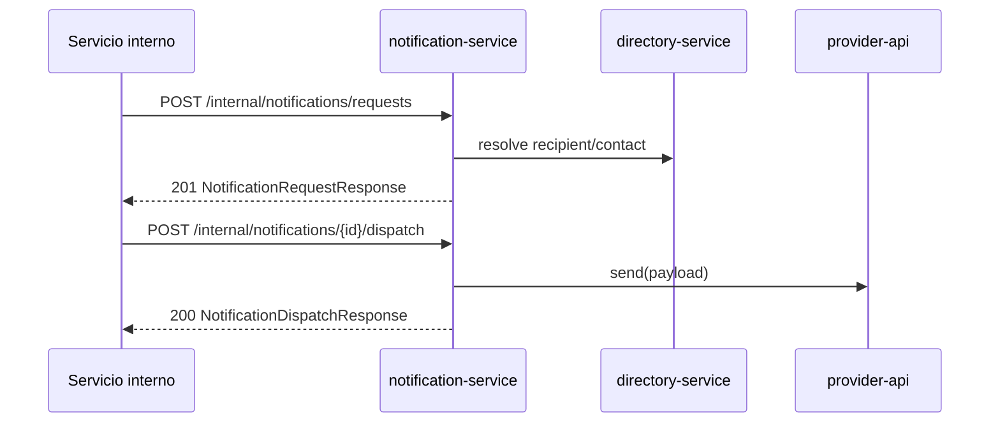

## Proposito
Definir contratos API internos de `notification-service` para solicitud, despacho, reintento, descarte y consulta de notificaciones con semantica estable e implementable.

## Alcance y fronteras
- Incluye endpoints HTTP internos de comandos/consultas y el endpoint tecnico de callback de proveedor para Notification.
- Incluye errores semanticos, idempotencia, authz tecnica y compatibilidad.
- Excluye especificacion OpenAPI final en YAML/JSON.

## Convenciones del contrato
- Base path: `/api/v1/internal/notifications`.
- Formato: JSON.
- Mutaciones internas por caller tecnico (`request/dispatch/retry/discard/reprocess-dlq`) requieren `Idempotency-Key`.
- Todas las respuestas incluyen `traceId`.
- Seguridad: `api-gateway-service` autentica m2m para endpoints internos; callbacks de proveedor se validan por firma/token tecnico de proveedor y control de origen.
- Multi-tenant: `tenantId` por claim m2m o `X-Tenant-Id` firmado.

## Mapa de endpoints
| Metodo y ruta | Objetivo | Auth/Authz | Idempotencia |
|---|---|---|---|
| `POST /api/v1/internal/notifications/requests` | registrar solicitud de notificacion | `service_scope:notification.write` | obligatoria |
| `POST /api/v1/internal/notifications/{notificationId}/dispatch` | ejecutar envio inmediato | `service_scope:notification.dispatch` | obligatoria |
| `POST /api/v1/internal/notifications/{notificationId}/retry` | programar o disparar retry tecnico | `service_scope:notification.dispatch` | obligatoria |
| `POST /api/v1/internal/notifications/{notificationId}/discard` | descartar solicitud no recuperable | `service_scope:notification.write` | obligatoria |
| `POST /api/v1/internal/notifications/provider-callbacks` | reconciliar callback de proveedor | firma/token tecnico de proveedor + validacion de origen | dedupe natural (`provider + providerRef + callbackEventId`) |
| `GET /api/v1/internal/notifications/requests` | listar solicitudes por estado/filtros | `service_scope:notification.read` | N/A |
| `GET /api/v1/internal/notifications/{notificationId}` | obtener detalle de solicitud | `service_scope:notification.read` | N/A |
| `GET /api/v1/internal/notifications/{notificationId}/attempts` | listar intentos de solicitud | `service_scope:notification.read` | N/A |
| `POST /api/v1/internal/notifications/reprocess-dlq` | reprocesar lote tecnico de DLQ | `service_scope:notification.ops` | obligatoria |

## Flujo API de solicitud y dispatch


## Request/response de referencia
### Registrar solicitud
```json
{
  "tenantId": "org-co-001",
  "eventType": "OrderConfirmed",
  "eventVersion": "1.0.0",
  "eventId": "evt_01JY_ORDER_0001",
  "recipientRef": "contact:org-co-001:primary-buyer",
  "channel": "EMAIL",
  "templateCode": "ORDER_CREATED_V1",
  "payload": {
    "orderId": "580f98fb-6f89-4c28-a1a5-d8d5805cf73a",
    "orderNumber": "ARKA-CO-2026-000184",
    "status": "CONFIRMED"
  },
  "metadata": {
    "traceId": "trc_01JY...",
    "correlationId": "chk_20260303_org-co-001_u-4438_001"
  }
}
```

```json
{
  "notificationId": "noti_01JY8Q9M8C7PA2Z5AF1D0JP3GH",
  "status": "PENDING",
  "channel": "EMAIL",
  "templateCode": "ORDER_CREATED_V1",
  "recipientRef": "contact:org-co-001:primary-buyer",
  "attemptCount": 0,
  "traceId": "trc_01JY..."
}
```

### Ejecutar dispatch
```json
{
  "provider": "mailgun-primary",
  "attemptNumber": 1,
  "idempotencyKey": "notif-dispatch-org-co-001-noti_01JY8Q9M8C7PA2Z5AF1D0JP3GH-1"
}
```

```json
{
  "notificationId": "noti_01JY8Q9M8C7PA2Z5AF1D0JP3GH",
  "status": "SENT",
  "providerRef": "mg-4291882231",
  "attemptNumber": 1,
  "sentAt": "2026-03-04T16:10:00Z",
  "traceId": "trc_01JY..."
}
```

### Reintentar
```json
{
  "reasonCode": "provider_timeout",
  "attemptNumber": 2,
  "idempotencyKey": "notif-retry-org-co-001-noti_01JY8Q9M8C7PA2Z5AF1D0JP3GH-2"
}
```

```json
{
  "notificationId": "noti_01JY8Q9M8C7PA2Z5AF1D0JP3GH",
  "status": "FAILED",
  "nextRetryAt": "2026-03-04T16:13:00Z",
  "attemptCount": 1,
  "traceId": "trc_01JY..."
}
```

### Descartar
```json
{
  "reasonCode": "maximo_reintentos_excedido",
  "idempotencyKey": "notif-discard-org-co-001-noti_01JY8Q9M8C7PA2Z5AF1D0JP3GH"
}
```

```json
{
  "notificationId": "noti_01JY8Q9M8C7PA2Z5AF1D0JP3GH",
  "status": "DISCARDED",
  "discardedAt": "2026-03-04T16:17:00Z",
  "traceId": "trc_01JY..."
}
```

### Callback de proveedor
```json
{
  "provider": "mailgun-primary",
  "providerRef": "mg-4291882231",
  "deliveryStatus": "DELIVERED",
  "occurredAt": "2026-03-04T16:11:00Z",
  "notificationId": "noti_01JY8Q9M8C7PA2Z5AF1D0JP3GH",
  "rawPayload": {
    "event": "delivered",
    "message-id": "mg-4291882231"
  },
  "signature": "sha256=..."
}
```

## Taxonomia de errores
| HTTP | Code | Escenario | Recuperable |
|---|---|---|---|
| 400 | `payload_invalido` | payload/template no valido | si |
| 401 | `unauthorized` | token m2m ausente o invalido | si |
| 403 | `forbidden_scope` | scope tecnico insuficiente | no |
| 404 | `notification_not_found` | solicitud no existe | si |
| 409 | `conflicto_idempotencia` | misma key con payload distinto | si |
| 409 | `destinatario_invalido` | destinatario no resoluble | si |
| 409 | `estado_invalido` | accion no valida para estado actual | no |
| 409 | `retry_not_allowed` | retry fuera de policy | si |
| 409 | `maximo_reintentos_excedido` | limite de intentos alcanzado | no |
| 503 | `canal_no_disponible` | provider no disponible | si |
| 504 | `provider_timeout` | timeout de provider | si |
| 500 | `internal_error` | error inesperado | no |

## Matriz de transiciones de estado
| Estado origen | Accion | Estado destino permitido | Error si no aplica |
|---|---|---|---|
| `PENDING` | dispatch exitoso | `SENT` | `estado_invalido` |
| `PENDING` | dispatch fallido | `FAILED` | `estado_invalido` |
| `FAILED` | retry permitido | `FAILED` o `SENT` | `retry_not_allowed` |
| `FAILED` | discard | `DISCARDED` | `estado_invalido` |
| `FAILED` | maxAttempts alcanzado | `DISCARDED` | `maximo_reintentos_excedido` |
| `SENT` | cualquier mutacion | N/A (terminal) | `estado_invalido` |
| `DISCARDED` | cualquier mutacion | N/A (terminal) | `estado_invalido` |

## Politica de idempotencia
- Header obligatorio: `Idempotency-Key` en mutaciones internas iniciadas por caller tecnico.
- Callbacks de proveedor usan dedupe natural (`provider + providerRef + callbackEventId`) y no requieren ese header.
- Ventana de deduplicacion recomendada: 24h para comandos internos, 72h para callbacks de provider.
- Claves sugeridas:
  - request: `tenant:eventId:recipientRef:channel`.
  - dispatch: `tenant:notificationId:attemptNumber`.
  - retry: `tenant:notificationId:attemptNumber:reasonCode`.
  - discard: `tenant:notificationId:reasonCode`.
  - callback: `provider:providerRef:deliveryStatus`.
- Misma clave + mismo payload: devolver mismo resultado funcional.
- Misma clave + payload distinto: `409 conflicto_idempotencia`.

## Contrato de paginacion y filtros (consultas)
| Endpoint | Parametros obligatorios | Parametros opcionales | Orden default |
|---|---|---|---|
| `GET /requests` | `page`, `size` | `status`, `channel`, `eventType`, `from`, `to`, `recipientRef` | `createdAt desc` |
| `GET /{notificationId}` | N/A | N/A | N/A |
| `GET /{notificationId}/attempts` | N/A | `page`, `size` | `attemptNumber asc` |

Reglas:
- `size` maximo recomendado: 100.
- filtros temporales aceptan `ISO-8601` UTC.
- toda consulta aplica scope por `tenantId` antes de filtros funcionales.

## Seguridad y autorizacion
| Operacion | Scope minimo | Validaciones |
|---|---|---|
| request/retry/discard | `notification.write` | tenant + firma m2m + allow-list caller |
| dispatch | `notification.dispatch` | tenant + politica de estado + idempotencia |
| callback provider | firma/token tecnico de proveedor | validacion firma/token provider + allow-list de origen |
| consultas internas | `notification.read` | tenant + auditoria de acceso |
| reproceso DLQ | `notification.ops` | control operacional reforzado |

## Matriz de controles transversales por endpoint
| Endpoint | Control de seguridad | Control de observabilidad | Control de resiliencia |
|---|---|---|---|
| `POST /requests` | m2m + tenant match | `traceId` + auditoria de alta | dedupe por `Idempotency-Key` |
| `POST /{id}/dispatch` | scope `notification.dispatch` | metricas de latencia/error por provider | circuit breaker + retry acotado |
| `POST /{id}/retry` | policy de reintentos | metrica `retry_queue_depth` | backoff exponencial con jitter |
| `POST /{id}/discard` | scope `notification.write` | auditoria de `reasonCode` | cierre terminal idempotente |
| `POST /provider-callbacks` | firma/token de provider | correlacion `providerRef` | dedupe callback y reconciliacion |
| `POST /reprocess-dlq` | scope `notification.ops` | metrica de backlog/reproceso | throttling por lote y cuarentena |

## Compatibilidad y versionado
- Version por path (`/api/v1`).
- Agregar campos opcionales en request/response: compatible.
- Cambio de significado o remocion de campos: nueva major (`/api/v2`).
- Error codes se consideran contrato estable.

## Matriz de contrato API -> FR/NFR
| Endpoint/flujo | FR | NFR |
|---|---|---|
| request de notificacion | FR-006, FR-008 | NFR-006, NFR-007 |
| dispatch/retry/discard | FR-006 | NFR-003, NFR-006, NFR-008 |
| callback provider | FR-006 | NFR-006, NFR-010 |
| consultas operativas | FR-006, FR-008 | NFR-007 |
| reproceso DLQ | FR-006, FR-008 | NFR-007, NFR-008 |

## Riesgos y mitigaciones
- Riesgo: callbacks falsos o alterados desde provider.
  - Mitigacion: firma/token obligatorio + allow-list de origen.
- Riesgo: alta saturacion de dispatch y retries.
  - Mitigacion: scheduler por lotes, circuit breaker y descarte controlado.
