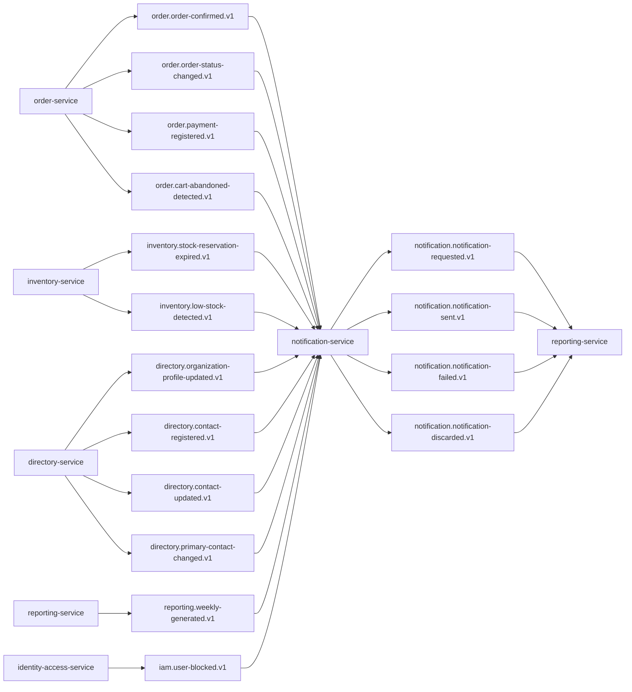

## Proposito
Definir contratos de eventos de `notification-service` para integracion EDA con Order, Inventory, Directory, Reporting e Identity-Access.

## Alcance y fronteras
- Incluye eventos emitidos por Notification y eventos consumidos por Notification.
- Incluye topicos, claves, versionado, idempotencia, retencion y DLQ.
- Excluye configuracion de infraestructura del cluster Kafka.

## Topologia de eventos Notification


## Catalogo de eventos emitidos
| Evento | Topic | Key | Productor | Consumidores | Semantica |
|---|---|---|---|---|---|
| `NotificationRequested` | `notification.notification-requested.v1` | `notificationId` | Notification | Reporting | solicitud valida registrada en `PENDING` |
| `NotificationSent` | `notification.notification-sent.v1` | `notificationId` | Notification | Reporting | envio exitoso confirmado |
| `NotificationFailed` | `notification.notification-failed.v1` | `notificationId` | Notification | Reporting | fallo de envio no bloqueante del core |
| `NotificationDiscarded` | `notification.notification-discarded.v1` | `notificationId` | Notification | Reporting | cierre definitivo por politica/retry |

## Eventos consumidos por Notification
| Evento consumido | Topic | Productor | Uso en Notification |
|---|---|---|---|
| `OrderConfirmed` | `order.order-confirmed.v1` | order-service | comunicacion de confirmacion comercial de pedido |
| `OrderStatusChanged` | `order.order-status-changed.v1` | order-service | comunicacion de avance operacional |
| `OrderPaymentRegistered` | `order.payment-registered.v1` | order-service | comunicacion de registro de pago manual |
| `CartAbandonedDetected` | `order.cart-abandoned-detected.v1` | order-service | comunicacion de recuperacion comercial |
| `StockReservationExpired` | `inventory.stock-reservation-expired.v1` | inventory-service | aviso preventivo de carrito afectado |
| `LowStockDetected` | `inventory.low-stock-detected.v1` | inventory-service | alerta de abastecimiento interno |
| `OrganizationProfileUpdated` | `directory.organization-profile-updated.v1` | directory-service | refrescar contexto institucional para resolver destinatarios |
| `ContactRegistered` | `directory.contact-registered.v1` | directory-service | alta de contacto institucional relevante para entrega |
| `ContactUpdated` | `directory.contact-updated.v1` | directory-service | actualizar destino/canal institucional vigente |
| `PrimaryContactChanged` | `directory.primary-contact-changed.v1` | directory-service | cambiar contacto institucional primario por tipo |
| `WeeklyReportGenerated` | `reporting.weekly-generated.v1` | reporting-service | distribucion de reporte semanal |
| `UserBlocked` | `iam.user-blocked.v1` | identity-access-service | comunicacion de seguridad, si aplica politica |

## Envelope estandar de eventos
```json
{
  "eventId": "evt_01JY_NOTI_0001",
  "eventType": "NotificationSent",
  "eventVersion": "1.0.0",
  "occurredAt": "2026-03-04T16:10:00Z",
  "producer": "notification-service",
  "tenantId": "org-co-001",
  "traceId": "trc_01JY...",
  "correlationId": "chk_20260303_org-co-001_u-4438_001",
  "idempotencyKey": "notif-dispatch-org-co-001-noti_01JY8Q9M8C7PA2Z5AF1D0JP3GH-1",
  "payload": {
    "notificationId": "noti_01JY8Q9M8C7PA2Z5AF1D0JP3GH",
    "sourceEventType": "OrderConfirmed",
    "channel": "EMAIL",
    "recipientRef": "contact:org-co-001:primary-buyer",
    "providerRef": "mg-4291882231",
    "attemptCount": 1
  }
}
```

## Payloads minimos por evento emitido
| Evento | Campos minimos |
|---|---|
| `NotificationRequested` | `notificationId`, `sourceEventType`, `channel`, `templateCode`, `recipientRef`, `attemptCount`, `occurredAt` |
| `NotificationSent` | `notificationId`, `sourceEventType`, `channel`, `providerRef`, `attemptCount`, `occurredAt` |
| `NotificationFailed` | `notificationId`, `sourceEventType`, `channel`, `errorCode`, `retryable`, `attemptCount`, `occurredAt` |
| `NotificationDiscarded` | `notificationId`, `sourceEventType`, `channel`, `reasonCode`, `attemptCount`, `occurredAt` |

## Mapa semantico evento -> intencion de dominio
| Evento tecnico | Semantica de dominio | Invariantes relacionadas |
|---|---|---|
| `NotificationRequested` | solicitud creada y trazable | inicio en estado `PENDING` |
| `NotificationSent` | notificacion efectivamente enviada | `SENT` terminal de exito |
| `NotificationFailed` | fallo de envio no bloqueante | no rollback de core (`RN-NOTI-01`) |
| `NotificationDiscarded` | cierre definitivo sin envio exitoso | `DISCARDED` terminal |

## Reglas de compatibilidad
- `MUST`: agregar campos nuevos solo como opcionales en `v1`.
- `MUST`: cambios de tipo semantico o remocion de campos crean topic `v2`.
- `SHOULD`: consumidores ignoran campos desconocidos.
- `MUST`: todos los eventos incluyen `tenantId`, `traceId`, `correlationId`.

## Entrega, reintentos y DLQ
| Tema | Politica |
|---|---|
| Semantica de entrega | `at-least-once` |
| Particionado | por key de agregado (`notificationId`) |
| Reintento productor | 3 intentos con backoff exponencial |
| Reintento consumidor | 5 intentos con backoff + jitter |
| DLQ | topic `<topic>.dlq` obligatorio |
| Retencion recomendada | 14 dias operativos, 30 dias para `notification.notification-failed.v1` y `notification.notification-discarded.v1` |

## Politica de replay y reproceso
| Escenario | Mecanismo | Garantia |
|---|---|---|
| perdida temporal de evento consumido | replay por rango `occurredAt` + `eventId` | no perder solicitud derivada |
| despliegue con reproceso parcial | dedupe por `processed_events` | idempotencia funcional |
| poison message | enviar a `<topic>.dlq` + cuarentena | aislamiento de fallo |
| recuperacion de reporting | reproceso desde checkpoint por tenant | consistencia eventual controlada |

## SLA de consumo esperado por tipo de evento
| Evento | Consumidor principal | Latencia objetivo de consumo |
|---|---|---|
| `OrderConfirmed` -> Notification | notification-service | < 30 s |
| `OrderStatusChanged` -> Notification | notification-service | < 30 s |
| `OrderPaymentRegistered` -> Notification | notification-service | < 30 s |
| `CartAbandonedDetected` -> Notification | notification-service | < 120 s |
| `PrimaryContactChanged` -> Notification | notification-service | < 60 s |
| `UserBlocked` -> Notification | notification-service | < 60 s |
| `NotificationSent` -> Reporting | reporting-service | < 60 s |
| `NotificationFailed` -> Reporting | reporting-service | < 60 s |
| `NotificationDiscarded` -> Reporting | reporting-service | < 60 s |

## Matriz de idempotencia en consumidores
| Consumidor | Evento | Clave de idempotencia |
|---|---|---|
| `notification-service` | `OrderConfirmed` | `eventId + recipientRef + channel` |
| `notification-service` | `OrderStatusChanged` | `eventId + recipientRef + channel` |
| `notification-service` | `OrderPaymentRegistered` | `eventId + recipientRef + channel` |
| `notification-service` | `StockReservationExpired` | `eventId + recipientRef + channel` |
| `notification-service` | `PrimaryContactChanged` | `eventId + organizationId:contactType` |
| `notification-service` | `UserBlocked` | `eventId + userId` |
| `reporting-service` | `NotificationSent` | `eventId + notificationId` |
| `reporting-service` | `NotificationDiscarded` | `eventId + notificationId` |

## Matriz de contract testing de eventos
| Contrato | Tipo de test | Productor/consumidor | Criterio de aceptacion |
|---|---|---|---|
| `notification.notification-requested.v1` envelope | schema contract test | productor `notification-service` | campos obligatorios de envelope presentes |
| `notification.notification-sent.v1` payload | consumer contract test | consumidor `reporting-service` | compatibilidad backward en payload |
| `notification.notification-failed.v1` payload | consumer contract test | consumidor `reporting-service` | `retryable` y `errorCode` consistentes |
| `order.order-confirmed.v1` consumo | listener integration contract | consumidor `notification-service` | crea solicitud idempotente |
| `directory.primary-contact-changed.v1` consumo | listener integration contract | consumidor `notification-service` | actualiza destino institucional sin duplicar side effects |
| `reporting.weekly-generated.v1` consumo | listener integration contract | consumidor `notification-service` | dispara solicitud de distribucion valida |

## Politica de evolucion por evento critico
| Evento | Cambio compatible (`v1`) | Cambio incompatible (`v2`) |
|---|---|---|
| `NotificationRequested` | agregar metadata opcional de template | remover `notificationId` o `sourceEventType` |
| `NotificationSent` | agregar `deliveryLatencyMs` opcional | cambiar semantica de `providerRef` |
| `NotificationFailed` | agregar `providerErrorCategory` opcional | remover `retryable` |
| `NotificationDiscarded` | agregar `discardPolicy` opcional | cambiar significado de `reasonCode` |

## Riesgos y mitigaciones
- Riesgo: explosion de eventos `NotificationFailed` por caida del provider.
  - Mitigacion: retry con backoff, circuit breaker y alertas de backlog.
- Riesgo: duplicidad de solicitudes por reprocesos de eventos upstream.
  - Mitigacion: dedupe por `processed_events` y `notificationKey`.
