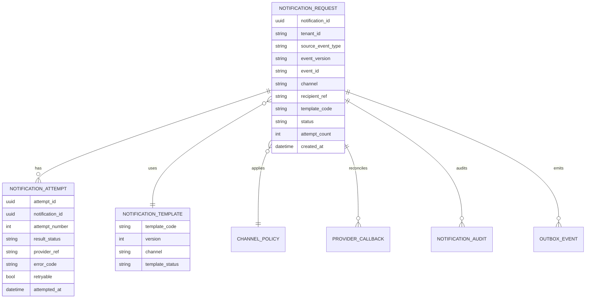

## Proposito
Definir el modelo logico de datos de `notification-service` para soportar solicitud, envio, reintentos y descarte de notificaciones sin violar invariantes del dominio.

## Alcance y fronteras
- Incluye entidades, relaciones, ownership y reglas de integridad logica de Notification.
- Incluye relacion semantica con `order`, `inventory`, `reporting`, `identity-access` y `directory` por referencias opacas.
- Excluye DDL definitivo y optimizaciones fisicas de motor.

## Entidades logicas
| Entidad | Tipo | Descripcion | Ownership |
|---|---|---|---|
| `notification_request` | agregado principal | solicitud de notificacion derivada de evento o comando interno | Notification |
| `notification_attempt` | entidad interna | intento de entrega asociado a solicitud | Notification |
| `notification_template` | entidad de referencia | plantilla versionada por canal/tenant | Notification |
| `channel_policy` | entidad de soporte | reglas de routing/fallback y max reintentos | Notification |
| `provider_callback` | entidad de soporte | evidencia de callback asincrono de proveedor externo | Notification |
| `notification_audit` | auditoria | bitacora de acciones tecnicas y errores | Notification |
| `outbox_event` | integracion | eventos pendientes/publicados de Notification | Notification |
| `processed_event` | idempotencia | control de eventos consumidos por listeners | Notification |

## Relaciones logicas
- `notification_request 1..n notification_attempt`
- `notification_request n..1 notification_template`
- `notification_request n..1 channel_policy`
- `notification_request 0..n provider_callback`
- `notification_request 0..n notification_audit`
- `notification_request 0..n outbox_event`
- `processed_event` referencia mensajes consumidos por listener, no por FK fisica.

## Reglas de integridad del modelo
| Regla | Expresion logica | Fuente |
|---|---|---|
| I-NOTI-01 | solicitud inicia en `PENDING` y solo transiciona a `SENT`, `FAILED` o `DISCARDED` | `02-aggregates.md` |
| I-NOTI-02 | `SENT` y `DISCARDED` son terminales | `02-aggregates.md` |
| I-NOTI-03 | `notification_attempt.attempt_number` incrementa secuencialmente por solicitud | `02-aggregates.md` |
| I-NOTI-04 | solicitud descartada no admite nuevos dispatch/retry | `03-commands.md` |
| RN-NOTI-01 | fallo de notificacion no revierte core (`order/inventory/reporting`) | `01-model.md` |
| RN-NOTI-02 | dedupe de solicitud por `eventId + recipientRef + channel` | `01-model.md`, `05-Integration-Contracts.md` |

## Mapeo de estados logicos por agregado
| Agregado | Estados permitidos | Fuente de verdad |
|---|---|---|
| `notification_request` | `PENDING`, `SENT`, `FAILED`, `DISCARDED` | `notification_requests.status` |
| `notification_attempt` | `CREATED`, `SENT`, `FAILED` | `notification_attempts.result_status` |
| `provider_callback` | `RECEIVED`, `VALIDATED`, `REJECTED` | `provider_callbacks.callback_status` |
| `outbox_event` | `PENDING`, `PUBLISHED`, `FAILED` | `outbox_events.status` |

## Diagrama logico (ER)

## Referencias cross-service (sin FK fisica)
| Referencia | Sistema propietario | Uso en Notification |
|---|---|---|
| `event_id`, `source_event_type` | order/inventory/reporting/iam | dedupe y trazabilidad de origen |
| `recipient_ref` | directory | resolucion de destinatario/contacto |
| `tenant_id` | identity-access/directory | aislamiento multi-tenant |
| `trace_id`, `correlation_id` | plataforma | trazabilidad distribuida |
| `provider_ref` | provider externo | reconciliacion de callback/entrega |

## Entidades de soporte de integracion y auditoria
| Entidad | Objetivo | Clave de integridad |
|---|---|---|
| `provider_callback` | reconciliar estado asincrono del proveedor | unico por `provider + provider_ref + callback_event_id` |
| `notification_audit` | evidenciar acciones y rechazos tecnicos | incluye `traceId`, `actorRef`, `resultCode` |
| `outbox_event` | publicacion confiable de eventos Notification | estado `PENDING/PUBLISHED/FAILED` |
| `processed_event` | dedupe de eventos consumidos | unico por `eventId + consumerName` |
| `channel_policy` | definir fallback y reintentos por tenant/canal | unico por `tenantId + sourceEventType` |

## Mapa comando -> entidades mutadas
| Comando/UC | Entidades mutadas | Limite transaccional |
|---|---|---|
| `RequestNotification` (UC-NOTI-01/02) | `notification_request`, `notification_audit`, `outbox_event`, `processed_event` | transaccion local unica |
| `DispatchNotification` (UC-NOTI-03) | `notification_request`, `notification_attempt`, `notification_audit`, `outbox_event` | transaccion local unica |
| `RetryNotification` (UC-NOTI-04) | `notification_request`, `notification_attempt`, `notification_audit`, `outbox_event` | transaccion local unica |
| `DiscardNotification` (UC-NOTI-05) | `notification_request`, `notification_audit`, `outbox_event` | transaccion local unica |
| `ProcessProviderCallback` (UC-NOTI-06) | `provider_callback`, `notification_request`, `notification_attempt`, `notification_audit`, `outbox_event` | transaccion local unica |
| `ReprocessNotificationDlq` (UC-NOTI-10) | `processed_event`, `notification_audit`, `outbox_event` | por mensaje, idempotente |

## Lecturas derivadas
- `pending_dispatch_count = count(notification_request where status in ('PENDING','FAILED') and retryAllowed=true)`
- `delivery_success_rate = sent_attempts / total_attempts`
- `discard_rate = discarded_requests / total_requests`
- `mean_attempts_to_success = avg(attempt_count where status='SENT')`
- `provider_timeout_rate = failed_attempts(errorCode='provider_timeout') / total_attempts`

## Riesgos y mitigaciones
- Riesgo: deriva entre estado interno e informacion de callback externo.
  - Mitigacion: conciliacion por `provider_ref` y callbacks idempotentes.
- Riesgo: duplicidad de solicitudes por replay de eventos de origen.
  - Mitigacion: `processed_event` + clave de dedupe por `eventId+recipient+channel`.
- Riesgo: crecimiento acelerado de intentos/auditoria en incidentes de provider.
  - Mitigacion: particion temporal y retencion operativa por tabla.
