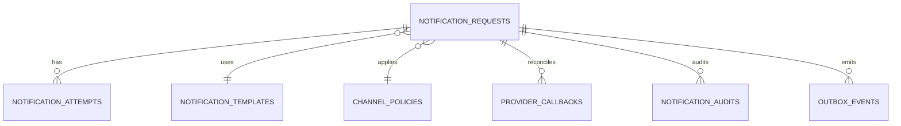

## Proposito
Definir el modelo fisico de `notification-service` en PostgreSQL, incluyendo tablas, constraints e indices para soportar procesamiento asincrono y trazabilidad de envios.

## Alcance y fronteras
- Incluye tablas fisicas de Notification y estrategias de indexacion.
- Incluye lineamientos de versionado, particionado y retencion para historicos/eventos.
- Excluye scripts de migracion finales ejecutables.

## Motor y convenciones
- Motor: PostgreSQL 15+
- PKs: UUID
- Timestamps: `timestamptz`
- Multi-tenant: `tenant_id` obligatorio en tablas operativas
- Soft delete: no aplicado en `notification_requests`; ciclo de vida por `status`

## Tablas fisicas principales
| Tabla | Proposito | Claves principales |
|---|---|---|
| `notification_requests` | solicitudes de notificacion | `notification_id`, UK `(tenant_id, notification_key)` |
| `notification_attempts` | intentos de entrega por solicitud | `attempt_id`, UK `(notification_id, attempt_number)` |
| `notification_templates` | plantillas versionadas por canal | PK compuesta `(tenant_id, template_code, version)` |
| `channel_policies` | reglas por evento/canal/tenant | `policy_id`, UK `(tenant_id, source_event_type)` |
| `provider_callbacks` | callbacks de proveedor | `callback_id`, UK `(provider_code, provider_ref, callback_event_id)` |
| `notification_audits` | auditoria tecnica y de seguridad | `audit_id`, idx por `tenant_id + created_at` |
| `outbox_events` | publicacion EDA garantizada | `event_id`, idx por `status + occurred_at` |
| `processed_events` | idempotencia de consumidores | `processed_event_id`, UK `(event_id, consumer_name)` |

## Diccionario de columnas criticas
### `notification_requests`
| Columna | Tipo | Nulo | Regla |
|---|---|---|---|
| `notification_id` | `uuid` | no | PK |
| `tenant_id` | `varchar(64)` | no | aislamiento tenant |
| `notification_key` | `varchar(220)` | no | dedupe (`eventId+recipient+channel`) |
| `source_event_type` | `varchar(120)` | no | ejemplo `OrderConfirmed` |
| `event_version` | `varchar(16)` | no | `1.0.0` |
| `source_event_id` | `varchar(120)` | no | referencia a evento origen |
| `channel` | `varchar(24)` | no | `EMAIL/SMS/WHATSAPP/INAPP` |
| `recipient_ref` | `varchar(180)` | no | referencia opaca de destinatario |
| `template_code` | `varchar(120)` | no | plantilla aplicable |
| `template_version` | `integer` | no | version de plantilla |
| `status` | `varchar(16)` | no | `PENDING/SENT/FAILED/DISCARDED` |
| `attempt_count` | `integer` | no | default 0 |
| `last_error_code` | `varchar(80)` | si | error reciente |
| `retryable` | `boolean` | no | default true |
| `next_retry_at` | `timestamptz` | si | scheduler retry |
| `payload_json` | `jsonb` | no | payload renderizable |
| `trace_id` | `varchar(120)` | no | trazabilidad |
| `correlation_id` | `varchar(120)` | si | correlacion funcional |
| `created_at` | `timestamptz` | no | default now() |
| `updated_at` | `timestamptz` | no | default now() |
| `version` | `bigint` | no | optimistic lock |

### `notification_attempts`
| Columna | Tipo | Nulo | Regla |
|---|---|---|---|
| `attempt_id` | `uuid` | no | PK |
| `notification_id` | `uuid` | no | referencia local a `notification_requests` |
| `tenant_id` | `varchar(64)` | no | aislamiento tenant |
| `attempt_number` | `integer` | no | `CHECK (attempt_number > 0)` |
| `result_status` | `varchar(16)` | no | `CREATED/SENT/FAILED` |
| `provider_code` | `varchar(80)` | no | proveedor objetivo |
| `provider_ref` | `varchar(120)` | si | id remoto de provider |
| `error_code` | `varchar(80)` | si | fallo tecnico/negocio |
| `retryable` | `boolean` | no | default false |
| `latency_ms` | `integer` | si | latencia medida |
| `request_snapshot_json` | `jsonb` | si | snapshot tecnico de envio |
| `response_snapshot_json` | `jsonb` | si | respuesta tecnica provider |
| `trace_id` | `varchar(120)` | no | trazabilidad |
| `occurred_at` | `timestamptz` | no | fecha del intento |

### `notification_templates`
| Columna | Tipo | Nulo | Regla |
|---|---|---|---|
| `tenant_id` | `varchar(64)` | no | parte de PK |
| `template_code` | `varchar(120)` | no | parte de PK |
| `version` | `integer` | no | parte de PK |
| `channel` | `varchar(24)` | no | canal asociado |
| `locale` | `varchar(12)` | no | `es-CO`, `en-US`, etc. |
| `subject` | `varchar(220)` | si | para email/inapp |
| `body_template` | `text` | no | cuerpo versionado |
| `template_status` | `varchar(16)` | no | `ACTIVE/INACTIVE` |
| `created_at` | `timestamptz` | no | default now() |
| `updated_at` | `timestamptz` | no | default now() |

### `channel_policies`
| Columna | Tipo | Nulo | Regla |
|---|---|---|---|
| `policy_id` | `uuid` | no | PK |
| `tenant_id` | `varchar(64)` | no | aislamiento tenant |
| `source_event_type` | `varchar(120)` | no | evento origen |
| `primary_channel` | `varchar(24)` | no | canal primario |
| `fallback_channel` | `varchar(24)` | si | canal alterno |
| `max_attempts` | `integer` | no | `CHECK (max_attempts between 1 and 10)` |
| `backoff_seconds` | `integer` | no | `CHECK (backoff_seconds > 0)` |
| `quiet_hours_json` | `jsonb` | si | ventana comercial |
| `active` | `boolean` | no | policy habilitada |
| `created_at` | `timestamptz` | no | default now() |
| `updated_at` | `timestamptz` | no | default now() |

### `provider_callbacks`
| Columna | Tipo | Nulo | Regla |
|---|---|---|---|
| `callback_id` | `uuid` | no | PK |
| `tenant_id` | `varchar(64)` | si | puede resolverse luego |
| `notification_id` | `uuid` | si | correlacion interna |
| `provider_code` | `varchar(80)` | no | provider emisor |
| `provider_ref` | `varchar(120)` | no | referencia externa |
| `callback_event_id` | `varchar(120)` | no | id de evento callback |
| `delivery_status` | `varchar(24)` | no | estado reportado por provider |
| `signature_valid` | `boolean` | no | resultado de validacion |
| `callback_status` | `varchar(16)` | no | `RECEIVED/VALIDATED/REJECTED` |
| `raw_payload_json` | `jsonb` | no | payload recibido |
| `received_at` | `timestamptz` | no | timestamp callback |
| `processed_at` | `timestamptz` | si | reconciliacion aplicada |

### `notification_audits`
| Columna | Tipo | Nulo | Regla |
|---|---|---|---|
| `audit_id` | `uuid` | no | PK |
| `tenant_id` | `varchar(64)` | no | aislamiento tenant |
| `notification_id` | `uuid` | si | null para errores previos al alta |
| `operation` | `varchar(64)` | no | codigo de operacion |
| `result_code` | `varchar(64)` | no | exito/error |
| `actor_ref` | `varchar(120)` | si | servicio/usuario tecnico |
| `trace_id` | `varchar(120)` | no | trazabilidad distribuida |
| `correlation_id` | `varchar(120)` | si | correlacion funcional |
| `metadata_json` | `jsonb` | si | contexto adicional |
| `created_at` | `timestamptz` | no | default now() |

### `outbox_events`
| Columna | Tipo | Nulo | Regla |
|---|---|---|---|
| `event_id` | `varchar(120)` | no | PK tecnica |
| `tenant_id` | `varchar(64)` | no | aislamiento tenant |
| `aggregate_type` | `varchar(64)` | no | `notification_request` |
| `aggregate_id` | `varchar(120)` | no | `notificationId` |
| `event_type` | `varchar(120)` | no | `NotificationSent`, etc. |
| `event_version` | `varchar(16)` | no | `1.0.0` |
| `topic_name` | `varchar(180)` | no | destino broker |
| `partition_key` | `varchar(120)` | no | clave de orden |
| `payload_json` | `jsonb` | no | payload serializado |
| `status` | `varchar(16)` | no | `PENDING/PUBLISHED/FAILED` |
| `retry_count` | `integer` | no | default 0 |
| `occurred_at` | `timestamptz` | no | fecha del hecho |
| `published_at` | `timestamptz` | si | fecha de publicacion |
| `last_error` | `text` | si | ultima falla publish |

### `processed_events`
| Columna | Tipo | Nulo | Regla |
|---|---|---|---|
| `processed_event_id` | `uuid` | no | PK |
| `tenant_id` | `varchar(64)` | no | aislamiento tenant |
| `event_id` | `varchar(120)` | no | id de evento consumido |
| `event_type` | `varchar(120)` | no | tipo consumido |
| `consumer_name` | `varchar(120)` | no | listener/use case |
| `aggregate_ref` | `varchar(120)` | si | `notificationId` o ref derivada |
| `processed_at` | `timestamptz` | no | marca de dedupe |
| `trace_id` | `varchar(120)` | si | trazabilidad |

## Diagrama fisico simplificado


## Indices recomendados
| Tabla | Indice | Tipo | Uso |
|---|---|---|---|
| `notification_requests` | `ux_requests_tenant_notification_key` | unique btree | dedupe de solicitud |
| `notification_requests` | `idx_requests_tenant_status_next_retry` | btree | scheduler dispatch/retry |
| `notification_requests` | `idx_requests_tenant_source_event` | btree | consulta por evento origen |
| `notification_attempts` | `ux_attempts_notification_number` | unique btree | intento incremental |
| `notification_attempts` | `idx_attempts_notification_occurred` | btree | timeline de intentos |
| `notification_templates` | `idx_templates_tenant_channel_status` | btree | resolucion de plantilla |
| `channel_policies` | `ux_policy_tenant_source_event` | unique btree | policy por evento |
| `provider_callbacks` | `ux_callbacks_provider_ref_event` | unique btree | dedupe de callback |
| `notification_audits` | `idx_audits_tenant_created` | btree | trazabilidad operativa |
| `outbox_events` | `idx_outbox_status_occurred` | btree | publish scheduler |
| `processed_events` | `ux_processed_event_consumer` | unique btree | idempotencia de consumo |

## Constraints de consistencia recomendadas
- `CHECK (attempt_number > 0)` en `notification_attempts`.
- `CHECK (attempt_count >= 0)` en `notification_requests`.
- `CHECK (max_attempts between 1 and 10)` en `channel_policies`.
- `CHECK (status in ('PENDING','SENT','FAILED','DISCARDED'))` en `notification_requests`.
- `CHECK (result_status in ('CREATED','SENT','FAILED'))` en `notification_attempts`.
- `CHECK (status in ('PENDING','PUBLISHED','FAILED'))` en `outbox_events`.
- `UNIQUE (tenant_id, notification_key)` en `notification_requests`.
- `UNIQUE (event_id, consumer_name)` en `processed_events`.

## DDL de referencia para restricciones criticas
```sql
ALTER TABLE notification_requests
  ADD CONSTRAINT ck_notification_requests_status
  CHECK (status IN ('PENDING','SENT','FAILED','DISCARDED'));

ALTER TABLE notification_attempts
  ADD CONSTRAINT ck_notification_attempts_attempt_number_positive
  CHECK (attempt_number > 0);

CREATE UNIQUE INDEX ux_notification_requests_tenant_key
  ON notification_requests (tenant_id, notification_key);

CREATE UNIQUE INDEX ux_notification_attempts_notification_number
  ON notification_attempts (notification_id, attempt_number);

CREATE UNIQUE INDEX ux_processed_events_event_consumer
  ON processed_events (event_id, consumer_name);
```

## Politica de archivado operativo
| Tabla | Criterio de archivado | Frecuencia | Conservacion activa |
|---|---|---|---|
| `notification_attempts` | `occurred_at` > 12 meses | mensual | 12 meses |
| `notification_audits` | `created_at` > 24 meses | mensual | 24 meses |
| `provider_callbacks` | `received_at` > 6 meses | mensual | 6 meses |
| `outbox_events` | `status='PUBLISHED'` y `published_at` > 30 dias | semanal | 30 dias |
| `processed_events` | `processed_at` > 60 dias | semanal | 60 dias |

## Estrategia de crecimiento y retencion
- `notification_attempts`: particion mensual por `occurred_at`.
- `notification_audits`: retencion 24 meses.
- `provider_callbacks`: retencion minima 6 meses con masking de payload sensible.
- `outbox_events`: retencion 30 dias tras `published`.
- `processed_events`: retencion 60 dias para deduplicacion segura.

## Riesgos y mitigaciones
- Riesgo: scans costosos al listar pendientes por tenant y retry.
  - Mitigacion: indice compuesto `tenant_id, status, next_retry_at`.
- Riesgo: contencion en update de solicitud durante callbacks concurrentes.
  - Mitigacion: optimistic lock + dedupe por `provider_ref`.
