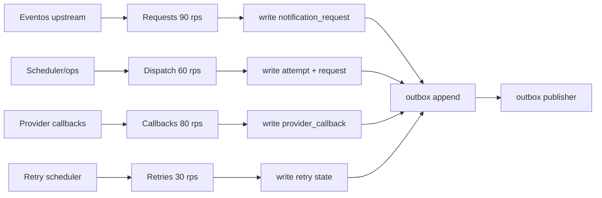

## Proposito
Definir objetivos de performance/capacidad para `notification-service`, con foco en alta de solicitudes, dispatch de notificaciones, reintentos y callbacks de proveedor.

## Alcance y fronteras
- Incluye presupuestos de latencia, throughput, concurrencia y degradacion.
- Incluye estimaciones iniciales de capacidad para entorno academico realista.
- Excluye resultados de pruebas de carga ejecutadas (fase 05-validacion).

## SLO tecnicos del servicio
| Operacion | p95 objetivo | p99 objetivo | Error budget mensual |
|---|---|---|---|
| crear solicitud (`request`) | <= 180 ms | <= 320 ms | 0.8% |
| dispatch interno (sin roundtrip externo) | <= 220 ms | <= 380 ms | 0.8% |
| dispatch total (incluyendo provider) | <= 1500 ms | <= 2500 ms | 1.5% |
| registrar callback proveedor | <= 140 ms | <= 260 ms | 0.8% |
| reintentar notificacion | <= 180 ms | <= 320 ms | 1.0% |
| listar pendientes | <= 120 ms | <= 220 ms | 1.0% |

## Capacidad estimada MVP
| Dimension | Valor objetivo inicial |
|---|---|
| solicitudes creadas por segundo pico | 90 rps |
| dispatch por segundo pico | 60 rps |
| callbacks por segundo pico | 80 rps |
| retries por segundo pico | 30 rps |
| reprocesos DLQ por lote | 200 mensajes/lote |
| crecimiento diario de intentos | 180k filas/dia |

## Modelo de carga simplificado

## Presupuestos de recursos (referencial)
| Recurso | Baseline | Escalado recomendado |
|---|---|---|
| CPU pod notification | 1 vCPU | HPA por `cpu>65%` o `dispatch_rps` |
| Memoria pod notification | 1.5 GiB | escalar a 2.5 GiB en picos |
| Conexiones DB | 30 | pool max 80 |
| Redis ops | 3k ops/s | cluster small + pipelining |
| Kafka consume/produce rate | 3k msg/s | compresion snappy |

## Perfil de carga por ventana operativa
| Ventana | Duracion | Mix dominante | Presupuesto operativo |
|---|---|---|---|
| Base semanal | 06:00-18:00 local | 55% request, 30% dispatch, 10% callbacks, 5% retry | p95 bajo objetivo y error rate < 1% |
| Pico comercial | 18:00-22:00 local | 45% request, 35% dispatch, 10% callbacks, 10% retry | tolera 3x baseline con degradacion p95 <= 30% |
| Incidente provider | ventana variable | 20% request, 20% dispatch, 50% retry, 10% callbacks | preservar no bloqueo core y trazabilidad completa |

## Presupuesto de dependencia por flujo critico (dispatch)
| Paso | Dependencia | Timeout objetivo | Reintento permitido | Presupuesto de error |
|---|---|---|---|---|
| resolver destinatario | `directory-service` | 300 ms | 1 retry transient | <= 0.3% |
| envio de mensaje | `provider-api` | 1500-2000 ms | retry segun `RetryPolicy` | <= 1.0% |
| persistir intento/estado | PostgreSQL | 150 ms | retry por transient (max 2) | <= 0.2% |
| publicar resultado | Kafka (via outbox) | async | scheduler hasta `PUBLISHED` | <= 0.1% sin perdida |

## Modelo de fallos y degradacion runtime
| Tipo de fallo | Tratamiento de performance | Impacto en budget |
|---|---|---|
| rechazo funcional (`403/404/409/422`) | se atiende con salida rapida y sin reintento indiscriminado | no consume `error budget` de `5xx`; si aumenta p95 por encima del objetivo si consume presupuesto de latencia |
| provider lento o intermitente | marcar `FAILED(retryable=true)`, encolar retry controlado y preservar no bloqueo del request | consume presupuesto de latencia y puede consumir `error budget` operativo de dispatch, pero no debe degradar el core upstream |
| fallo tecnico de DB/Kafka/Redis | priorizar request/dispatch, acumular outbox y limitar listados | consume presupuesto de latencia y, si produce `5xx`, tambien `error budget` |
| callback/evento duplicado | `noop idempotente` | no consume `error budget`; solo cuenta para metrica de dedupe |

## Puntos de contencion esperados
| Punto | Riesgo | Mitigacion |
|---|---|---|
| dispatch concurrente por `notificationId` | actualizacion de estado en carrera | lock funcional + optimistic locking |
| retries masivos por caida provider | crecimiento de cola y latencia | backoff con jitter + maxAttempts + throttling |
| backlog outbox | atraso en resultados a reporting | scheduler paralelo + tuning batch |
| callbacks duplicados | doble reconciliacion de estado | dedupe por `providerRef + callbackEventId` |

## Politica de degradacion
- Si Redis falla: consultas operativas van a DB con limite de throughput.
- Si Kafka falla: transaccion de negocio confirma y outbox acumula.
- Si provider presenta latencia alta: dispatch marca `FAILED(retryable=true)` sin bloquear request.
- Si DB presenta latencia alta: reducir tamaño maximo de listados y priorizar request/dispatch.

## Indicadores de capacidad a monitorear
- `notification.request.latency.p95`
- `notification.dispatch.latency.p95`
- `notification.dispatch.error_rate`
- `notification.retry.queue_depth`
- `notification.outbox.pending.count`
- `notification.provider.timeout.rate`
- `notification.dlq.backlog.count`

## SLI/SLO operativos y alertas derivadas
| SLI | SLO operativo | Trigger de alerta | Severidad |
|---|---|---|---|
| `notification.request.latency.p95` | <= 180 ms por 10 min | > 300 ms por 10 min | media-alta |
| `notification.dispatch.error_rate` | <= 3% por 10 min | > 5% por 10 min | alta |
| `notification.retry.queue_depth` | < 3000 sostenido | >= 3000 por 10 min | alta |
| `notification.outbox.pending.count` | < 5000 sostenido | >= 5000 por 5 min | alta |
| `notification.provider.timeout.rate` | <= 2% por 15 min | > 6% por 15 min | alta |
| `notification.dlq.backlog.count` | < 1000 | >= 1000 por 10 min | alta |

## Matriz de pruebas de carga y aceptacion
| Escenario | FR/NFR objetivo | Carga | Criterio de aceptacion |
|---|---|---|---|
| request intensivo | FR-006, FR-008, NFR-007 | 90 rps sostenido 30 min | p95 request <= 180 ms y errores < 0.8% |
| dispatch con provider estable | FR-006, NFR-003 | 60 rps por 20 min | p95 dispatch total <= 1500 ms, sin perdida de intentos |
| stress 3x baseline | NFR-008 | 3x trafico baseline por 15 min | degradacion p95 <= 30% y sin drop de solicitudes |
| degradacion provider | NFR-003, NFR-007 | timeout inyectado en provider por 10 min | servicio mantiene request y encola retries controlados |
| degradacion broker | NFR-007 | kafka down 10 min | outbox acumula y drena al recuperar sin perdida de eventos |

Runbooks de respuesta minima:
- `NOTI-RB-01`: error rate alto en dispatch por provider.
- `NOTI-RB-02`: crecimiento sostenido de retry queue.
- `NOTI-RB-03`: backlog de outbox y eventos atrasados.
- `NOTI-RB-04`: backlog elevado en DLQ.

## Riesgos y mitigaciones
- Riesgo: subestimar picos de notificaciones en campañas comerciales.
  - Mitigacion: autoscaling por dispatch rps y prewarming de conexiones.
- Riesgo: caida prolongada de provider dispara retries y descarte.
  - Mitigacion: fallback de canal y umbrales de descarte operativamente controlados.
- Riesgo: crecimiento rapido de `notification_attempts`.
  - Mitigacion: particion mensual y archivado operativo.
