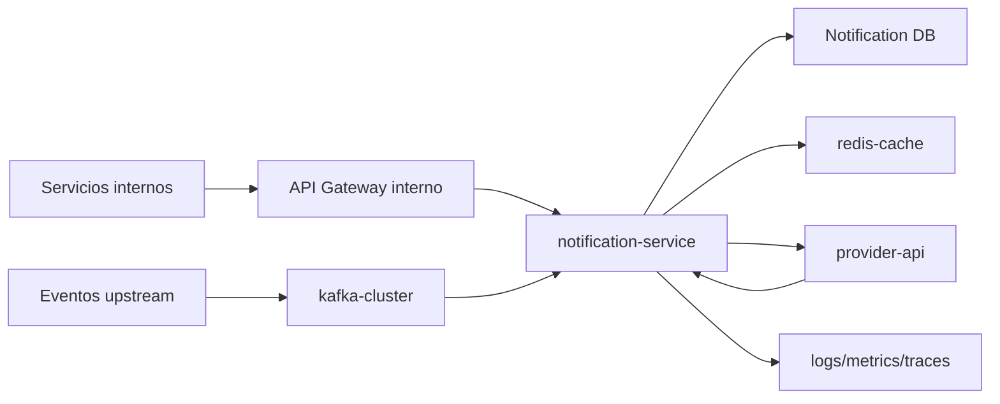
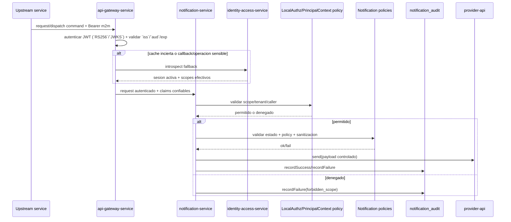

## Proposito
Definir controles de seguridad para `notification-service` sobre solicitud, envio, retry, descarte y callbacks, protegiendo integridad operacional, aislamiento tenant y privacidad de payloads.

## Alcance y fronteras
- Incluye amenazas principales (STRIDE), controles preventivos/detectivos y hardening de endpoints internos.
- Incluye tratamiento de datos sensibles en payloads, callbacks y auditoria.
- Excluye requisitos regulatorios legales finales por pais fuera del alcance tecnico de la fase.

## Threat model (resumen)
| Categoria | Amenaza | Impacto | Control principal |
|---|---|---|---|
| Spoofing | actor no autorizado invoca endpoints internos | envios fraudulentos o descarte indebido | autenticacion previa en `api-gateway-service` + `PrincipalContext`/RBAC local + scopes |
| Tampering | alteracion de payload/template en transito | mensaje incorrecto o fuga de datos | validacion schema + sanitizacion payload |
| Repudiation | operador tecnico niega discard/retry manual | perdida de trazabilidad | `notification_audit` + traceId/correlationId |
| Information disclosure | exposicion de PII en logs/callbacks | incidente de seguridad y compliance | masking + cifrado en transito + retencion controlada |
| DoS | tormenta de retries o callbacks maliciosos | degradacion de delivery pipeline | rate limit + backpressure + circuit breaker |
| Elevation of privilege | servicio interno sin scope ejecuta dispatch/discard | cambios de estado no autorizados | scopes granulares por endpoint |

## Superficie de ataque

## Controles de autenticacion/autorizacion
| Operacion | Control requerido |
|---|---|
| crear solicitud (`/requests`) | token m2m valido + scope `notification.write` + tenant match |
| dispatch/retry | token m2m + scope `notification.dispatch` |
| discard | token m2m + scope `notification.write` + justificacion operacional |
| callbacks provider | firma/token provider + validacion de origen |
| consultas internas | token m2m + scope `notification.read` |
| reproceso DLQ | token m2m + scope `notification.ops` + auditoria reforzada |

## Modelo local de Spring Security WebFlux
| Capa | Responsabilidad |
|---|---|
| `api-gateway-service` | autentica requests HTTP internos (`JWT` m2m), valida firma/`iss`/`aud`/expiracion y solo enruta trafico autenticado al servicio |
| `notification-service` (HTTP) | usa `Spring Security WebFlux` para materializar `PrincipalContext`, aplicar `PermissionEvaluator` por operacion y cerrar `tenant`/ownership de la solicitud |
| `notification-service` (eventos/callbacks/schedulers) | no depende de JWT de usuario; materializa `TriggerContext` con `TriggerContextResolver`, valida trigger, dedupe e integridad antes de mutar estado |
| `identity-access-service` | mantiene la verdad de credenciales/sesiones internas, publica `JWKS`, revocaciones y cambios de rol/scope; atiende introspeccion fallback de plataforma cuando aplica |

Aplicacion local: `notification-service` no valida firmas JWT en borde ni reimplementa IAM. La autenticacion ocurre en `api-gateway-service`; dentro del servicio se resuelve autorizacion contextual, aislamiento tenant y legitimidad de negocio.

## Modelo de errores de seguridad
| Momento | Familia/cierre canonico | Aplicacion en Notification |
|---|---|---|
| autenticacion de borde/m2m | `401/403` en frontera | `api-gateway-service` corta token m2m invalido, expirado o revocado antes de enrutar request, dispatch, retry o discard |
| autorizacion contextual | `AuthorizationDeniedException`, `TenantIsolationException` | `notification-service` rechaza scope insuficiente, `callerRef` no permitido o cruce de `tenant` antes de crear o mutar solicitudes |
| regla de dominio sensible | `DomainRuleViolationException`, `ConflictException`, `ResourceNotFoundException` | callback invalido, estado no reintentable, solicitud inexistente o descarte inconsistente se cierran como `404/409/422`, no como error tecnico |
| callback/evento malicioso o duplicado | `NonRetryableDependencyException` o `noop idempotente` | callback con firma invalida y evento irreparable van a DLQ/alerta; un duplicado se trata como noop idempotente |
| evidencia de seguridad | `notification_audit` + `traceId/correlationId` | acciones tecnicas sensibles como retry, discard y reproceso dejan trazabilidad reforzada |

## Matriz endpoint -> amenaza -> control
| Endpoint/flujo | Amenaza prioritaria | Control preventivo | Control detectivo |
|---|---|---|---|
| `POST /internal/notifications/requests` | spoofing de caller interno | m2m + allow-list + validacion schema | `notification_audit` + alerta por caller anomalo |
| `POST /internal/notifications/{id}/dispatch` | envio fraudulento o replay | scope `notification.dispatch` + idempotency key | metrica de duplicados por `notificationId` |
| `POST /internal/notifications/{id}/retry` | tormenta de reintentos manuales | policy maxAttempts + scope tecnico | alerta por `retry_queue_depth` |
| `POST /internal/notifications/{id}/discard` | descarte malicioso de solicitudes | scope `notification.write` + estado valido | auditoria obligatoria de reasonCode |
| `POST /internal/notifications/provider-callbacks` | callback falsificado | firma/token provider + validacion providerRef | metrica de `invalid_callback_signature_total` |
| listeners Kafka | inyeccion de evento malicioso | validacion de envelope/schema + dedupe | DLQ + alertas de mensajes invalidos |

## Datos sensibles y politicas
| Dato | Clasificacion | Tratamiento |
|---|---|---|
| `recipient_ref` | sensible de contacto | masking parcial en logs y respuestas operativas |
| `payload_json` | puede contener PII de negocio | sanitizacion previa a envio y minimizacion en auditoria |
| `provider_ref` | sensible operacional | visible solo para soporte autorizado |
| `trace_id`, `correlation_id` | tecnico | obligatorio para trazabilidad |
| `idempotency_key` | sensible operacional | hash en logs, no valor completo |
| `raw_payload_json` (callbacks) | potencialmente sensible | cifrado en reposo + retencion acotada |

## Controles de cifrado y secretos
| Superficie | Control minimo | Evidencia esperada |
|---|---|---|
| trafico interno m2m | TLS 1.2+ | pruebas de configuracion por entorno |
| trafico hacia provider | TLS 1.2+ y validacion de certificado | test de integracion seguro por canal |
| secretos de provider | secret manager/vault, no hardcode | SAST/SCA + rotacion programada |
| datos en reposo (`payload_json`, callbacks) | cifrado de volumen y backup cifrado | checklist de plataforma |
| logs de errores | masking de campos sensibles | prueba de no exposicion en logs |

## Seguridad de eventos
- `MUST`: todos los eventos incluyen `tenantId`, `traceId`, `correlationId`.
- `MUST`: consumidores validan schema y version antes de procesar.
- `SHOULD`: dedupe por `eventId + consumerName`.
- `MUST`: DLQ activa para mensajes irreparables.

## Seguridad operativa por flujo critico

## Compliance minimo esperado
- Retencion de auditoria operativa de notificaciones: 24 meses.
- Retencion de callbacks de proveedor: 6 meses (o politica regulatoria mayor por pais).
- No exponer payload completo en vistas operativas de soporte.
- Segregacion de funciones: quien descarta no debe aprobar cambios de policy de canal en el mismo flujo.

## Matriz de pruebas de seguridad (Gate de calidad)
| Tipo de prueba | Cobertura minima | FR/NFR objetivo | Criterio de aceptacion |
|---|---|---|---|
| authz m2m por endpoint interno | request/dispatch/retry/discard/reprocess-dlq | FR-006, FR-008, NFR-005 | 0 ejecuciones con scope invalido |
| validacion de firma callback | endpoint de callback provider | NFR-006 | callbacks sin firma valida son rechazados |
| contrato de eventos consumidos | listeners order/inventory/reporting/iam | NFR-006, NFR-007 | 100% valida envelope y schema |
| pruebas de masking de logs | errores de dispatch/callback | NFR-010 | sin exposicion completa de `recipient_ref`/payload |
| DAST basico interno | endpoints de mutacion tecnicos | NFR-005 | sin vulnerabilidades criticas explotables |

## Runbooks minimos de seguridad para Notification
1. `NOTI-SEC-01`: uso no autorizado de endpoint interno.
2. `NOTI-SEC-02`: callbacks invalidos o firmados incorrectamente.
3. `NOTI-SEC-03`: fuga potencial de payload sensible en logs.
4. `NOTI-SEC-04`: tormenta de retries por incidente de provider.

## Riesgos y mitigaciones
- Riesgo: provider comprometido o callback spoofed.
  - Mitigacion: verificaciones de firma/token y allow-list de origen.
- Riesgo: descarte masivo malicioso de solicitudes.
  - Mitigacion: permisos granulares + auditoria + alertas por umbral.
- Riesgo: exfiltracion de PII en payload.
  - Mitigacion: sanitizacion, masking y retencion acotada.
