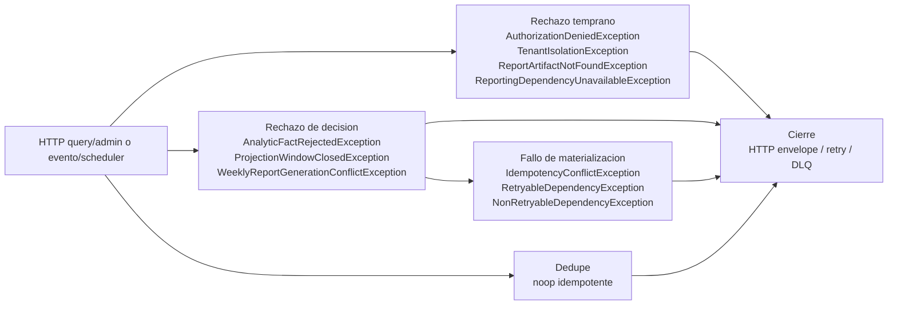

## Proposito
Definir los runtimes tecnicos de `reporting-service` para todos sus casos de uso, incluyendo happy path, rutas de rechazo funcional, fallos tecnicos, cache, checkpoints, recomputo, generacion semanal y publicacion asincrona.

## Alcance y fronteras
- Incluye listeners de eventos, jobs programados y APIs read/admin del servicio.
- Incluye interaccion con `api-gateway-service`, `order-service`, `inventory-service`, `catalog-service`, `directory-service`, `notification-service`, `kafka-cluster`, `redis-cache`, `object-storage` y `Reporting DB`.
- Incluye rutas de rechazo funcional, fallos tecnicos posteriores a la decision, dedupe de hechos, validacion de politica regional, invalidacion de cache y relay de outbox.
- Excluye decisiones de despliegue, cluster, topologia fisica y configuracion infra externa al limite del servicio.

## Casos de uso cubiertos por Reporting
| Caso | Tipo | Trigger principal | Resultado esperado |
|---|---|---|---|
| `RegisterAnalyticFact` | command evento | `CoreEventsListener`, `NotificationEventsListener` | hecho normalizado, persistido y publicado via outbox |
| `RefreshSalesProjection` | command interno | `RegisterAnalyticFactUseCase` | vista de ventas recalculada e invalidacion de cache |
| `RefreshReplenishmentProjection` | command interno | `RegisterAnalyticFactUseCase` | vista de abastecimiento recalculada e invalidacion de cache |
| `RefreshOperationKpi` | command interno | `RegisterAnalyticFactUseCase` | KPI operativos recalculados e invalidacion de cache |
| `GenerateWeeklyReport` | command scheduler/manual | `WeeklyReportSchedulerListener`, `ReportingAdminController` | artefacto semanal generado y evento semanal publicado |
| `RebuildProjection` | command scheduler/manual | `ProjectionRebuildSchedulerListener`, `ReportingAdminController` | proyecciones reconstruidas para el periodo solicitado |
| `ReprocessReportingDlq` | command scheduler | `ReportingDlqReprocessorListener` | reproceso idempotente o descarte tecnico del lote DLQ |
| `GetWeeklySalesReport` | query HTTP interno | `ReportingQueryController` | reporte semanal de ventas por tenant, semana y `countryCode` |
| `GetWeeklyReplenishmentReport` | query HTTP interno | `ReportingQueryController` | reporte semanal de abastecimiento por tenant, semana y `countryCode` |
| `GetOperationsKpi` | query HTTP interno | `ReportingQueryController` | KPI operativos del periodo consultado |
| `GetReportArtifact` | query HTTP interno | `ReportingQueryController` | metadata del artefacto semanal solicitado |

## Regla de lectura de los diagramas
- `Panorama global` puede incluir actores externos como broker, servicios vecinos, cache, storage y dependencia regional para ubicar el borde del flujo.
- Los diagramas por fases de cada caso representan **arquitectura interna del servicio** y usan solo clases definidas en `Vista de Codigo`.
- `Exito` describe el happy path principal del caso.
- `Rechazo` separa `Rechazo temprano`, `Rechazo de decision`, `Fallo de materializacion` y `Fallo de propagacion` cuando esas rutas aplican.

## Modelo runtime de autenticacion y autorizacion
| Tipo de flujo | Regla aplicada |
|---|---|
| HTTP query/admin interno | `api-gateway-service` autentica el request. El servicio materializa `PrincipalContext`, valida `tenant` y clasificacion del dato antes de exponer reportes o ejecutar comandos administrativos. |
| evento / scheduler | No se asume JWT de usuario. El servicio materializa `TriggerContext` mediante `TriggerContextResolver`, valida `tenant`, dedupe, ventana operativa y legitimidad del trigger antes de recalcular proyecciones o generar artefactos. |

## Modelo runtime de errores y excepciones
| Tipo de flujo | Regla aplicada |
|---|---|
| HTTP query/admin interno | `api-gateway-service` autentica el request. El servicio materializa `PrincipalContext` y convierte rechazo temprano, decision o fallo tecnico en una salida operativa coherente, gobernada por `TenantIsolationPolicy` y `DataClassificationPolicy`. |
| evento / scheduler | `TriggerContext`, dedupe y politicas de proyeccion emiten error semantico o `noop idempotente`; si el fallo es tecnico se clasifica como retryable/no-retryable para reintento o DLQ. |

### Diagrama runtime de excepciones concretas

## Patron de fases runtime
| Fase | Que explica | Elementos incluidos | Regla de lectura |
|---|---|---|---|
| `Ingreso` | Recibe el trigger del caso de uso y adapta la entrada al servicio. | `request` o mensaje de entrada, `controller` / `listener` / `scheduler`, mapper de entrada cuando aplica, `command` / `query` y `port in`. | Describe el borde interno del servicio y el punto exacto donde el flujo entra a `Application service`. |
| `Preparacion` | Transforma la entrada en contexto semantico interno antes de consultar dependencias externas. | `use case`, assembler implicito, `value objects` y contexto derivado del trigger. | No hace I/O externo; solo prepara el caso para poder contextualizar y decidir correctamente. |
| `Contextualizacion` | Obtiene datos y validaciones tecnicas necesarias antes de decidir. | `ports out`, `adapters out`, cache, repositorios, reloj, checkpoints, storage, dedupe y clientes externos. | Aqui no se decide todavia el resultado de negocio; solo se reune el contexto necesario para la decision. |
| `Decision` | Explica la decision real del caso dentro del dominio. | Agregados, hechos, proyecciones, `value objects` de decision, politicas y eventos nacidos de la decision. | Solo dominio; se divide por agregado o foco semantico cuando el caso toca mas de un submodelo. |
| `Materializacion` | Hace efectiva la decision ya tomada por el dominio. | `ports out` y `adapters out` de salida, persistencia, auditoria, cache, checkpoints, exportacion y outbox. | Aqui no se vuelve a decidir negocio; solo se ejecuta tecnicamente lo ya resuelto por dominio. |
| `Proyeccion` | Convierte el resultado interno en una salida consumible por el trigger. | `response mappers`, `responses` o cierre tecnico del trigger interno. | Se usa en flujos HTTP y tambien como cierre tecnico en listeners o schedulers. |
| `Propagacion` | Publica o distribuye efectos asincronos derivados del caso ya materializado. | Outbox, relay, publisher y entrega al broker. | Ocurre despues de materializar y normalmente no redefine el resultado funcional del caso principal. |

### Regla para rutas alternativas
- `Rechazo temprano`: corte funcional o tecnico antes de entrar a la decision de dominio.
- `Rechazo de decision`: corte funcional dentro del dominio.
- `Fallo de materializacion`: error tecnico despues de decidir pero antes de cerrar el caso.
- `Fallo de propagacion`: error asincrono al publicar efectos ya materializados.

## Diagramas runtime por caso de uso


{}
{}
> El bloque `Exito` describe el `happy path` de `RegisterAnalyticFact`. El bloque `Rechazo` agrupa `Rechazo temprano`, `Rechazo de decision`, `Fallo de materializacion`, `Fallo de propagacion`. Este flujo cubre eventos de `order-service`, `inventory-service`, `catalog-service`, `directory-service` y `notification-service` consumidos por los listeners de Reporting.

<table>
  <thead>
    <tr>
      <th>Etapa</th>
      <th>Clases para RegisterAnalyticFact</th>
      <th>Responsabilidad</th>
    </tr>
  </thead>
  <tbody>
    <tr>
      <td>Ingreso</td>
      <td><code>CoreEventsListener</code>, <code>NotificationEventsListener</code>, <code>ReportingCommandMapper</code>, <code>RegisterAnalyticFactCommand</code>, <code>RegisterAnalyticFactPort</code></td>
      <td>Recibe el trigger del caso ya dentro del servicio y lo traduce al contrato de aplicacion que inicia el flujo interno.</td>
    </tr>
    <tr>
      <td>Preparacion</td>
      <td><code>RegisterAnalyticFactUseCase</code>, <code>SourceEventId</code>, <code>FactPayload</code>, <code>FactType</code></td>
      <td>Normaliza la intencion del caso y construye el contexto semantico interno sin hacer I/O externo.</td>
    </tr>
    <tr>
      <td>Contextualizacion - Dedupe y checkpoint</td>
      <td><code>RegisterAnalyticFactUseCase</code>, <code>ProcessedEventPort</code>, <code>ProcessedEventR2dbcRepositoryAdapter</code>, <code>ProcessedEventEntity</code>, <code>CheckpointRepositoryPort</code>, <code>ConsumerCheckpointR2dbcRepositoryAdapter</code>, <code>ConsumerCheckpointEntity</code></td>
      <td>Obtiene datos, autorizaciones, cache, dedupe, checkpoints o validaciones tecnicas necesarias antes de decidir en dominio.</td>
    </tr>
    <tr>
      <td>Decision - Fact</td>
      <td><code>RegisterAnalyticFactUseCase</code>, <code>FactDedupPolicy</code>, <code>TenantIsolationPolicy</code>, <code>DataClassificationPolicy</code>, <code>AnalyticFact</code>, <code>ReportingViewAggregate</code>, <code>AnalyticFactUpdatedEvent</code></td>
      <td>Evalua invariantes, reglas y politicas del dominio para aceptar, rechazar o consolidar el resultado del caso.</td>
    </tr>
    <tr>
      <td>Materializacion</td>
      <td><code>RegisterAnalyticFactUseCase</code>, <code>AnalyticFactRepositoryPort</code>, <code>AnalyticFactR2dbcRepositoryAdapter</code>, <code>AnalyticFactPersistenceMapper</code>, <code>AnalyticFactEntity</code>, <code>CheckpointRepositoryPort</code>, <code>ConsumerCheckpointR2dbcRepositoryAdapter</code>, <code>ConsumerCheckpointPersistenceMapper</code>, <code>ConsumerCheckpointEntity</code>, <code>ProcessedEventPort</code>, <code>ProcessedEventR2dbcRepositoryAdapter</code>, <code>ProcessedEventPersistenceMapper</code>, <code>ProcessedEventEntity</code>, <code>ReportingAuditPort</code>, <code>ReportingAuditR2dbcRepositoryAdapter</code>, <code>ReportingAuditPersistenceMapper</code>, <code>ReportingAuditEntity</code>, <code>OutboxPort</code>, <code>OutboxPersistenceAdapter</code>, <code>OutboxEventEntity</code></td>
      <td>Hace efectiva la decision tomada: persistencia, auditoria, cache, checkpoints, outbox, exportacion y side effects tecnicos segun corresponda.</td>
    </tr>
    <tr>
      <td>Proyeccion</td>
      <td><code>RegisterAnalyticFactUseCase</code>, <code>CoreEventsListener</code>, <code>NotificationEventsListener</code></td>
      <td>Cierra el trigger interno con el resultado operativo del caso sin exponer una respuesta HTTP externa.</td>
    </tr>
    <tr>
      <td>Propagacion</td>
      <td><code>OutboxPublisherScheduler</code>, <code>OutboxEventEntity</code>, <code>DomainEventPublisherPort</code>, <code>KafkaDomainEventPublisherAdapter</code>, <code>AnalyticFactUpdatedEvent</code></td>
      <td>Publica los efectos asincronos ya materializados mediante outbox, relay y broker.</td>
    </tr>
    <tr>
      <td>Rechazo temprano</td>
      <td><code>RegisterAnalyticFactUseCase</code>, <code>ProcessedEventPort</code>, <code>CheckpointRepositoryPort</code>, <code>CoreEventsListener</code></td>
      <td>Corta el flujo antes de decidir en dominio por dedupe, ausencia de contexto externo, politica regional faltante o validacion tecnica.</td>
    </tr>
    <tr>
      <td>Rechazo de decision</td>
      <td><code>RegisterAnalyticFactUseCase</code>, <code>FactDedupPolicy</code>, <code>TenantIsolationPolicy</code>, <code>DataClassificationPolicy</code>, <code>ReportingViewAggregate</code>, <code>CoreEventsListener</code></td>
      <td>Corta el flujo despues de evaluar reglas, invariantes o politicas del dominio.</td>
    </tr>
    <tr>
      <td>Fallo de materializacion</td>
      <td><code>RegisterAnalyticFactUseCase</code>, <code>AnalyticFactRepositoryPort</code>, <code>CheckpointRepositoryPort</code>, <code>ProcessedEventPort</code>, <code>ReportingAuditPort</code>, <code>OutboxPort</code>, <code>CoreEventsListener</code></td>
      <td>Representa un error tecnico posterior a la decision al persistir, auditar, exportar, actualizar cache, registrar checkpoints o escribir outbox.</td>
    </tr>
    <tr>
      <td>Fallo de propagacion</td>
      <td><code>OutboxPublisherScheduler</code>, <code>OutboxEventEntity</code>, <code>DomainEventPublisherPort</code>, <code>KafkaDomainEventPublisherAdapter</code></td>
      <td>Representa un error asincrono al publicar efectos ya materializados hacia el broker o relay.</td>
    </tr>
  </tbody>
</table>
{}
{}
{}
{}

sequenceDiagram
  participant P1 as CoreEventsListener
  participant P2 as NotificationEventsListener
  participant P3 as ReportingCommandMapper
  participant P4 as RegisterAnalyticFactCommand
  participant P5 as RegisterAnalyticFactPort
  P1->>P2: activa variante
  P2->>P3: mapea event
  P3->>P4: crea command
  P4->>P5: entra por port in


**Descripcion de la fase.** Recibe el trigger del caso ya dentro del servicio y lo traduce al contrato de aplicacion que inicia el flujo interno.

**Capa predominante.** Se ubica principalmente en `Adapter-in`, con cruce controlado hacia el puerto de entrada de `Application service`.

<table>
  <thead>
    <tr>
      <th>Paso</th>
      <th>Clase</th>
      <th>Accion</th>
    </tr>
  </thead>
  <tbody>
    <tr>
      <td>1</td>
      <td><code>CoreEventsListener</code></td>
      <td>Recibe hechos de servicios core y activa el flujo de ingesta analitica interno.</td>
    </tr>
    <tr>
      <td>2</td>
      <td><code>NotificationEventsListener</code></td>
      <td>Recibe eventos de Notification que tambien deben convertirse en hechos analiticos.</td>
    </tr>
    <tr>
      <td>3</td>
      <td><code>ReportingCommandMapper</code></td>
      <td>Transforma el envelope del evento a un comando analitico homogéneo para el servicio.</td>
    </tr>
    <tr>
      <td>4</td>
      <td><code>RegisterAnalyticFactCommand</code></td>
      <td>Representa el hecho entrante con tenant, sourceEventId, tipo, payload y trazabilidad.</td>
    </tr>
    <tr>
      <td>5</td>
      <td><code>RegisterAnalyticFactPort</code></td>
      <td>Entrega el comando al puerto de entrada que inicia la ingesta del hecho.</td>
    </tr>
  </tbody>
</table>
{}
{}

sequenceDiagram
  participant P1 as RegisterAnalyticFactUseCase
  participant P2 as SourceEventId
  participant P3 as FactPayload
  participant P4 as FactType
  P1->>P2: normaliza fuente
  P2->>P3: normaliza payload
  P3->>P4: clasifica hecho


**Descripcion de la fase.** Normaliza la intencion del caso y construye el contexto semantico interno sin hacer I/O externo.

**Capa predominante.** Se ubica principalmente en `Application service`, preparando tipos y contexto antes de consultar dependencias externas.

<table>
  <thead>
    <tr>
      <th>Paso</th>
      <th>Clase</th>
      <th>Accion</th>
    </tr>
  </thead>
  <tbody>
    <tr>
      <td>1</td>
      <td><code>RegisterAnalyticFactUseCase</code></td>
      <td>Normaliza el evento y prepara el contexto semantico del hecho antes de consultar dependencias externas.</td>
    </tr>
    <tr>
      <td>2</td>
      <td><code>SourceEventId</code></td>
      <td>Representa el identificador canonico del evento upstream usado para dedupe.</td>
    </tr>
    <tr>
      <td>3</td>
      <td><code>FactPayload</code></td>
      <td>Expresa el contenido analitico del hecho en un value object controlado.</td>
    </tr>
    <tr>
      <td>4</td>
      <td><code>FactType</code></td>
      <td>Determina la categoria analitica del hecho que se va a registrar.</td>
    </tr>
  </tbody>
</table>
{}
{}

sequenceDiagram
  participant P1 as RegisterAnalyticFactUseCase
  participant P2 as ProcessedEventPort
  participant P3 as ProcessedEventR2dbcRepositoryAdapter
  participant P4 as ProcessedEventEntity
  participant P5 as CheckpointRepositoryPort
  participant P6 as ConsumerCheckpointR2dbcRepositoryAdapter
  participant P7 as ConsumerCheckpointEntity
  P1->>P2: consulta dedupe
  P2->>P3: lee procesados
  P3->>P4: representa procesado
  P4->>P5: carga checkpoint
  P5->>P6: lee checkpoint
  P6->>P7: representa checkpoint


**Descripcion de la fase.** Obtiene datos, autorizaciones, cache, dedupe, checkpoints o validaciones tecnicas necesarias antes de decidir en dominio.

**Capa predominante.** Se ubica en la frontera entre `Application service` y `Adapter-out`.

<table>
  <thead>
    <tr>
      <th>Paso</th>
      <th>Clase</th>
      <th>Accion</th>
    </tr>
  </thead>
  <tbody>
    <tr>
      <td>1</td>
      <td><code>RegisterAnalyticFactUseCase</code></td>
      <td>Consulta dedupe de eventos y checkpoint del consumer antes de pedir una decision de dominio.</td>
    </tr>
    <tr>
      <td>2</td>
      <td><code>ProcessedEventPort</code></td>
      <td>Expone la verificacion de hechos ya aplicados por `sourceEventId` y consumer.</td>
    </tr>
    <tr>
      <td>3</td>
      <td><code>ProcessedEventR2dbcRepositoryAdapter</code></td>
      <td>Recupera registros tecnicos de eventos ya consumidos por Reporting.</td>
    </tr>
    <tr>
      <td>4</td>
      <td><code>ProcessedEventEntity</code></td>
      <td>Materializa el registro persistido usado para evitar side effects duplicados.</td>
    </tr>
    <tr>
      <td>5</td>
      <td><code>CheckpointRepositoryPort</code></td>
      <td>Expone la lectura del ultimo checkpoint del consumer para trazabilidad operativa.</td>
    </tr>
    <tr>
      <td>6</td>
      <td><code>ConsumerCheckpointR2dbcRepositoryAdapter</code></td>
      <td>Recupera el checkpoint persistido del topic/partition consumido.</td>
    </tr>
    <tr>
      <td>7</td>
      <td><code>ConsumerCheckpointEntity</code></td>
      <td>Materializa el registro persistido de offset y posicion del consumer.</td>
    </tr>
  </tbody>
</table>
{}
{}

sequenceDiagram
  participant P1 as RegisterAnalyticFactUseCase
  participant P2 as FactDedupPolicy
  participant P3 as TenantIsolationPolicy
  participant P4 as DataClassificationPolicy
  participant P5 as AnalyticFact
  participant P6 as ReportingViewAggregate
  participant P7 as AnalyticFactUpdatedEvent
  P1->>P2: evalua duplicado
  P2->>P3: valida tenant
  P3->>P4: clasifica dato
  P4->>P5: construye hecho
  P5->>P6: registra hecho
  P6->>P7: emite evento


**Descripcion de la fase.** Evalua invariantes, reglas y politicas del dominio para aceptar, rechazar o consolidar el resultado del caso.

**Capa predominante.** Se ubica principalmente en `Domain`, orquestada por `Application service` sin delegar la decision de negocio a infraestructura.

<table>
  <thead>
    <tr>
      <th>Paso</th>
      <th>Clase</th>
      <th>Accion</th>
    </tr>
  </thead>
  <tbody>
    <tr>
      <td>1</td>
      <td><code>RegisterAnalyticFactUseCase</code></td>
      <td>Orquesta la evaluacion del dominio con dedupe, clasificacion y contexto de ingesta ya cargados.</td>
    </tr>
    <tr>
      <td>2</td>
      <td><code>FactDedupPolicy</code></td>
      <td>Determina si el hecho ya fue aplicado o si debe generar un nuevo side effect analitico.</td>
    </tr>
    <tr>
      <td>3</td>
      <td><code>TenantIsolationPolicy</code></td>
      <td>Garantiza que el hecho se procese solo dentro del tenant autorizado.</td>
    </tr>
    <tr>
      <td>4</td>
      <td><code>DataClassificationPolicy</code></td>
      <td>Valida la sensibilidad y uso permitido del payload analitico.</td>
    </tr>
    <tr>
      <td>5</td>
      <td><code>AnalyticFact</code></td>
      <td>Consolida el hecho analitico normalizado listo para persistir.</td>
    </tr>
    <tr>
      <td>6</td>
      <td><code>ReportingViewAggregate</code></td>
      <td>Acepta el hecho y emite la actualizacion analitica del agregado.</td>
    </tr>
    <tr>
      <td>7</td>
      <td><code>AnalyticFactUpdatedEvent</code></td>
      <td>Representa el hecho de dominio que informa actualizacion analitica a otros consumidores.</td>
    </tr>
  </tbody>
</table>
{}
{}

sequenceDiagram
  participant P1 as RegisterAnalyticFactUseCase
  participant P2 as AnalyticFactRepositoryPort
  participant P3 as AnalyticFactR2dbcRepositoryAdapter
  participant P4 as AnalyticFactPersistenceMapper
  participant P5 as AnalyticFactEntity
  participant P6 as CheckpointRepositoryPort
  participant P7 as ConsumerCheckpointR2dbcRepositoryAdapter
  participant P8 as ConsumerCheckpointPersistenceMapper
  participant P9 as ConsumerCheckpointEntity
  participant P10 as ProcessedEventPort
  participant P11 as ProcessedEventR2dbcRepositoryAdapter
  participant P12 as ProcessedEventPersistenceMapper
  participant P13 as ProcessedEventEntity
  participant P14 as ReportingAuditPort
  participant P15 as ReportingAuditR2dbcRepositoryAdapter
  participant P16 as ReportingAuditPersistenceMapper
  participant P17 as ReportingAuditEntity
  participant P18 as OutboxPort
  participant P19 as OutboxPersistenceAdapter
  participant P20 as OutboxEventEntity
  P1->>P2: guarda hecho
  P2->>P3: persiste hecho
  P3->>P4: mapea hecho
  P4->>P5: representa hecho
  P5->>P6: actualiza checkpoint
  P6->>P7: persiste checkpoint
  P7->>P8: mapea checkpoint
  P8->>P9: representa checkpoint
  P9->>P10: marca procesado
  P10->>P11: persiste dedupe
  P11->>P12: mapea dedupe
  P12->>P13: representa dedupe
  P13->>P14: registra auditoria
  P14->>P15: persiste auditoria
  P15->>P16: mapea auditoria
  P16->>P17: representa auditoria
  P17->>P18: escribe outbox
  P18->>P19: persiste outbox
  P19->>P20: representa outbox


**Descripcion de la fase.** Hace efectiva la decision tomada: persistencia, auditoria, cache, checkpoints, outbox, exportacion y side effects tecnicos segun corresponda.

**Capa predominante.** Se ubica en la frontera entre `Application service` y `Adapter-out`.

<table>
  <thead>
    <tr>
      <th>Paso</th>
      <th>Clase</th>
      <th>Accion</th>
    </tr>
  </thead>
  <tbody>
    <tr>
      <td>1</td>
      <td><code>RegisterAnalyticFactUseCase</code></td>
      <td>Materializa el hecho, la auditoria, el dedupe, el checkpoint y el outbox derivados de la decision.</td>
    </tr>
    <tr>
      <td>2</td>
      <td><code>AnalyticFactRepositoryPort</code></td>
      <td>Expone la persistencia reactiva del hecho analitico normalizado.</td>
    </tr>
    <tr>
      <td>3</td>
      <td><code>AnalyticFactR2dbcRepositoryAdapter</code></td>
      <td>Guarda el hecho analitico en la base del servicio.</td>
    </tr>
    <tr>
      <td>4</td>
      <td><code>AnalyticFactPersistenceMapper</code></td>
      <td>Convierte el hecho de dominio a la entidad persistible correspondiente.</td>
    </tr>
    <tr>
      <td>5</td>
      <td><code>AnalyticFactEntity</code></td>
      <td>Materializa la fila persistida del hecho analitico.</td>
    </tr>
    <tr>
      <td>6</td>
      <td><code>CheckpointRepositoryPort</code></td>
      <td>Expone la persistencia del nuevo checkpoint del consumer.</td>
    </tr>
    <tr>
      <td>7</td>
      <td><code>ConsumerCheckpointR2dbcRepositoryAdapter</code></td>
      <td>Guarda el avance del consumer para consumo consistente.</td>
    </tr>
    <tr>
      <td>8</td>
      <td><code>ConsumerCheckpointPersistenceMapper</code></td>
      <td>Convierte el checkpoint a la entidad persistible.</td>
    </tr>
    <tr>
      <td>9</td>
      <td><code>ConsumerCheckpointEntity</code></td>
      <td>Materializa la fila persistida del checkpoint actualizado.</td>
    </tr>
    <tr>
      <td>10</td>
      <td><code>ProcessedEventPort</code></td>
      <td>Expone el registro tecnico que evita reprocesar el mismo evento.</td>
    </tr>
    <tr>
      <td>11</td>
      <td><code>ProcessedEventR2dbcRepositoryAdapter</code></td>
      <td>Marca el `sourceEventId` como procesado por Reporting.</td>
    </tr>
    <tr>
      <td>12</td>
      <td><code>ProcessedEventPersistenceMapper</code></td>
      <td>Convierte el registro tecnico de dedupe a la entidad persistible.</td>
    </tr>
    <tr>
      <td>13</td>
      <td><code>ProcessedEventEntity</code></td>
      <td>Materializa la fila persistida del evento procesado.</td>
    </tr>
    <tr>
      <td>14</td>
      <td><code>ReportingAuditPort</code></td>
      <td>Expone la evidencia operacional de la ingesta del hecho.</td>
    </tr>
    <tr>
      <td>15</td>
      <td><code>ReportingAuditR2dbcRepositoryAdapter</code></td>
      <td>Guarda la auditoria del alta del hecho analitico.</td>
    </tr>
    <tr>
      <td>16</td>
      <td><code>ReportingAuditPersistenceMapper</code></td>
      <td>Convierte la traza de ingesta a su entidad persistible.</td>
    </tr>
    <tr>
      <td>17</td>
      <td><code>ReportingAuditEntity</code></td>
      <td>Materializa la fila de auditoria de la ingesta.</td>
    </tr>
    <tr>
      <td>18</td>
      <td><code>OutboxPort</code></td>
      <td>Expone la escritura del `AnalyticFactUpdatedEvent` en outbox transaccional.</td>
    </tr>
    <tr>
      <td>19</td>
      <td><code>OutboxPersistenceAdapter</code></td>
      <td>Guarda el evento pendiente de publicacion asincrona.</td>
    </tr>
    <tr>
      <td>20</td>
      <td><code>OutboxEventEntity</code></td>
      <td>Materializa el registro persistido del `AnalyticFactUpdatedEvent`.</td>
    </tr>
  </tbody>
</table>
{}
{}

sequenceDiagram
  participant P1 as RegisterAnalyticFactUseCase
  participant P2 as CoreEventsListener
  participant P3 as NotificationEventsListener
  P1->>P2: cierra evento
  P2->>P3: cierra variante


**Descripcion de la fase.** Cierra el trigger interno con el resultado operativo del caso sin exponer una respuesta HTTP externa.

**Capa predominante.** Se ubica entre `Application service` y `Adapter-in`, cerrando el trigger tecnico sin exponer una API externa.

<table>
  <thead>
    <tr>
      <th>Paso</th>
      <th>Clase</th>
      <th>Accion</th>
    </tr>
  </thead>
  <tbody>
    <tr>
      <td>1</td>
      <td><code>RegisterAnalyticFactUseCase</code></td>
      <td>Cierra el trigger interno una vez el hecho, checkpoint y outbox quedaron consistentes.</td>
    </tr>
    <tr>
      <td>2</td>
      <td><code>CoreEventsListener</code></td>
      <td>Finaliza el consumo de hechos core sin exponer una respuesta HTTP.</td>
    </tr>
    <tr>
      <td>3</td>
      <td><code>NotificationEventsListener</code></td>
      <td>Finaliza la variante de ingesta proveniente de Notification.</td>
    </tr>
  </tbody>
</table>
{}
{}

sequenceDiagram
  participant P1 as OutboxPublisherScheduler
  participant P2 as OutboxEventEntity
  participant P3 as DomainEventPublisherPort
  participant P4 as KafkaDomainEventPublisherAdapter
  participant P5 as AnalyticFactUpdatedEvent
  P1->>P2: lee outbox
  P2->>P3: solicita publish
  P3->>P4: publica broker
  P4->>P5: confirma entrega


**Descripcion de la fase.** Publica los efectos asincronos ya materializados mediante outbox, relay y broker.

**Capa predominante.** Se ubica principalmente en `Adapter-out`, desacoplando la publicacion del cierre transaccional del caso.

<table>
  <thead>
    <tr>
      <th>Paso</th>
      <th>Clase</th>
      <th>Accion</th>
    </tr>
  </thead>
  <tbody>
    <tr>
      <td>1</td>
      <td><code>OutboxPublisherScheduler</code></td>
      <td>Encuentra el evento persistido en outbox y lo prepara para publicacion desacoplada.</td>
    </tr>
    <tr>
      <td>2</td>
      <td><code>OutboxEventEntity</code></td>
      <td>Representa el `AnalyticFactUpdatedEvent` ya materializado en la base del servicio.</td>
    </tr>
    <tr>
      <td>3</td>
      <td><code>DomainEventPublisherPort</code></td>
      <td>Expone la publicacion asincrona del hecho de dominio actualizado.</td>
    </tr>
    <tr>
      <td>4</td>
      <td><code>KafkaDomainEventPublisherAdapter</code></td>
      <td>Entrega `AnalyticFactUpdatedEvent` al broker con el topic canonico de Reporting.</td>
    </tr>
    <tr>
      <td>5</td>
      <td><code>AnalyticFactUpdatedEvent</code></td>
      <td>Representa el hecho analitico difundido a consumidores operativos aguas abajo.</td>
    </tr>
  </tbody>
</table>
{}
{}
{}
{}
{}
{}

sequenceDiagram
  participant P1 as RegisterAnalyticFactUseCase
  participant P2 as ProcessedEventPort
  participant P3 as CheckpointRepositoryPort
  participant P4 as CoreEventsListener
  P1->>P2: detecta duplicado
  P2->>P3: falla checkpoint
  P3->>P4: cierra trigger


**Descripcion de la fase.** Corta el flujo antes de decidir en dominio por dedupe, ausencia de contexto externo, politica regional faltante o validacion tecnica.

**Capa predominante.** Se ubica entre `Adapter-in`, `Application service` y `Adapter-out`, cortando el trigger antes de entrar al dominio.

<table>
  <thead>
    <tr>
      <th>Paso</th>
      <th>Clase</th>
      <th>Accion</th>
    </tr>
  </thead>
  <tbody>
    <tr>
      <td>1</td>
      <td><code>RegisterAnalyticFactUseCase</code></td>
      <td>Detecta una condicion tecnica o de contexto que impide continuar antes de decidir en dominio.</td>
    </tr>
    <tr>
      <td>2</td>
      <td><code>ProcessedEventPort</code></td>
      <td>Evita reprocesar un `sourceEventId` ya aplicado por este consumer.</td>
    </tr>
    <tr>
      <td>3</td>
      <td><code>CheckpointRepositoryPort</code></td>
      <td>No logra recuperar el checkpoint tecnico necesario para continuar la ingesta.</td>
    </tr>
    <tr>
      <td>4</td>
      <td><code>CoreEventsListener</code></td>
      <td>Recibe la senal de rechazo temprano y corta el flujo interno dejando evidencia operativa del descarte.</td>
    </tr>
  </tbody>
</table>
{}
{}

sequenceDiagram
  participant P1 as RegisterAnalyticFactUseCase
  participant P2 as FactDedupPolicy
  participant P3 as TenantIsolationPolicy
  participant P4 as DataClassificationPolicy
  participant P5 as ReportingViewAggregate
  participant P6 as CoreEventsListener
  P1->>P2: rechaza duplicado
  P2->>P3: rechaza tenant
  P3->>P4: rechaza payload
  P4->>P5: rechaza hecho
  P5->>P6: cierra rechazo


**Descripcion de la fase.** Corta el flujo despues de evaluar reglas, invariantes o politicas del dominio.

**Capa predominante.** Se ubica principalmente en `Domain`, con cierre operativo hacia el trigger interno del servicio.

<table>
  <thead>
    <tr>
      <th>Paso</th>
      <th>Clase</th>
      <th>Accion</th>
    </tr>
  </thead>
  <tbody>
    <tr>
      <td>1</td>
      <td><code>RegisterAnalyticFactUseCase</code></td>
      <td>Llega al dominio con contexto valido, pero una politica o agregado rechaza la operacion.</td>
    </tr>
    <tr>
      <td>2</td>
      <td><code>FactDedupPolicy</code></td>
      <td>Evita aplicar nuevamente un hecho que ya representa el mismo side effect analitico.</td>
    </tr>
    <tr>
      <td>3</td>
      <td><code>TenantIsolationPolicy</code></td>
      <td>Bloquea la ingesta cuando el evento no pertenece al tenant autorizado.</td>
    </tr>
    <tr>
      <td>4</td>
      <td><code>DataClassificationPolicy</code></td>
      <td>Bloquea hechos cuyo payload no cumple la politica de clasificacion de datos.</td>
    </tr>
    <tr>
      <td>5</td>
      <td><code>ReportingViewAggregate</code></td>
      <td>No permite consolidar el hecho cuando las invariantes del agregado no se satisfacen.</td>
    </tr>
    <tr>
      <td>6</td>
      <td><code>CoreEventsListener</code></td>
      <td>Recibe la salida de rechazo de negocio y cierra el trigger interno sin materializar cambios adicionales.</td>
    </tr>
  </tbody>
</table>
{}
{}

sequenceDiagram
  participant P1 as RegisterAnalyticFactUseCase
  participant P2 as AnalyticFactRepositoryPort
  participant P3 as CheckpointRepositoryPort
  participant P4 as ProcessedEventPort
  participant P5 as ReportingAuditPort
  participant P6 as OutboxPort
  participant P7 as CoreEventsListener
  P1->>P2: falla persistencia
  P2->>P3: falla checkpoint
  P3->>P4: falla dedupe
  P4->>P5: falla auditoria
  P5->>P6: falla outbox
  P6->>P7: reporta fallo


**Descripcion de la fase.** Representa un error tecnico posterior a la decision al persistir, auditar, exportar, actualizar cache, registrar checkpoints o escribir outbox.

**Capa predominante.** Se ubica en la frontera entre `Application service` y `Adapter-out`.

<table>
  <thead>
    <tr>
      <th>Paso</th>
      <th>Clase</th>
      <th>Accion</th>
    </tr>
  </thead>
  <tbody>
    <tr>
      <td>1</td>
      <td><code>RegisterAnalyticFactUseCase</code></td>
      <td>Ya existe una decision valida, pero una dependencia de salida falla al hacerla efectiva.</td>
    </tr>
    <tr>
      <td>2</td>
      <td><code>AnalyticFactRepositoryPort</code></td>
      <td>No logra guardar el hecho analitico despues de que el dominio ya lo acepto.</td>
    </tr>
    <tr>
      <td>3</td>
      <td><code>CheckpointRepositoryPort</code></td>
      <td>No logra registrar el avance del consumer sobre el evento procesado.</td>
    </tr>
    <tr>
      <td>4</td>
      <td><code>ProcessedEventPort</code></td>
      <td>No logra marcar el evento como procesado dentro de Reporting.</td>
    </tr>
    <tr>
      <td>5</td>
      <td><code>ReportingAuditPort</code></td>
      <td>No logra registrar la evidencia operacional de la ingesta.</td>
    </tr>
    <tr>
      <td>6</td>
      <td><code>OutboxPort</code></td>
      <td>No logra guardar el evento de salida para publicacion asincrona.</td>
    </tr>
    <tr>
      <td>7</td>
      <td><code>CoreEventsListener</code></td>
      <td>Recibe o observa el error tecnico y corta el cierre operativo del caso, dejandolo visible para reintento o atencion operacional.</td>
    </tr>
  </tbody>
</table>
{}
{}

sequenceDiagram
  participant P1 as OutboxPublisherScheduler
  participant P2 as OutboxEventEntity
  participant P3 as DomainEventPublisherPort
  participant P4 as KafkaDomainEventPublisherAdapter
  P1->>P2: lee outbox
  P2->>P3: solicita publish
  P3->>P4: publica broker


**Descripcion de la fase.** Representa un error asincrono al publicar efectos ya materializados hacia el broker o relay.

**Capa predominante.** Se ubica principalmente en `Adapter-out`, despues de que la transaccion principal ya quedo definida.

<table>
  <thead>
    <tr>
      <th>Paso</th>
      <th>Clase</th>
      <th>Accion</th>
    </tr>
  </thead>
  <tbody>
    <tr>
      <td>1</td>
      <td><code>OutboxPublisherScheduler</code></td>
      <td>Encuentra eventos ya materializados pendientes de publicacion asincrona.</td>
    </tr>
    <tr>
      <td>2</td>
      <td><code>OutboxEventEntity</code></td>
      <td>Representa el evento persistido cuya publicacion debe completarse sin reabrir la transaccion principal.</td>
    </tr>
    <tr>
      <td>3</td>
      <td><code>DomainEventPublisherPort</code></td>
      <td>Expone la abstraccion de publicacion asincrona consumida por el relay.</td>
    </tr>
    <tr>
      <td>4</td>
      <td><code>KafkaDomainEventPublisherAdapter</code></td>
      <td>Entrega `AnalyticFactUpdatedEvent` al broker con la clave y payload pactados por Reporting.</td>
    </tr>
  </tbody>
</table>
{}
{}
{}
{}


{}
{}
> El bloque `Exito` describe el `happy path` de `RefreshSalesProjection`. El bloque `Rechazo` agrupa `Rechazo temprano`, `Rechazo de decision`, `Fallo de materializacion`. Es un caso interno disparado desde `RegisterAnalyticFactUseCase` cuando el hecho afecta ventas.

<table>
  <thead>
    <tr>
      <th>Etapa</th>
      <th>Clases para RefreshSalesProjection</th>
      <th>Responsabilidad</th>
    </tr>
  </thead>
  <tbody>
    <tr>
      <td>Ingreso</td>
      <td><code>RegisterAnalyticFactUseCase</code>, <code>RefreshSalesProjectionUseCase</code></td>
      <td>Recibe el trigger del caso ya dentro del servicio y lo traduce al contrato de aplicacion que inicia el flujo interno.</td>
    </tr>
    <tr>
      <td>Preparacion</td>
      <td><code>RefreshSalesProjectionUseCase</code>, <code>ProjectionKey</code>, <code>FactType</code></td>
      <td>Normaliza la intencion del caso y construye el contexto semantico interno sin hacer I/O externo.</td>
    </tr>
    <tr>
      <td>Contextualizacion - Facts</td>
      <td><code>RefreshSalesProjectionUseCase</code>, <code>AnalyticFactRepositoryPort</code>, <code>AnalyticFactR2dbcRepositoryAdapter</code>, <code>AnalyticFactPersistenceMapper</code>, <code>AnalyticFactEntity</code></td>
      <td>Obtiene datos, autorizaciones, cache, dedupe, checkpoints o validaciones tecnicas necesarias antes de decidir en dominio.</td>
    </tr>
    <tr>
      <td>Decision - SalesProjection</td>
      <td><code>RefreshSalesProjectionUseCase</code>, <code>TenantIsolationPolicy</code>, <code>ProjectionPolicy</code>, <code>ReportingViewAggregate</code>, <code>SalesProjection</code>, <code>TopProductMetric</code>, <code>TopCustomerMetric</code></td>
      <td>Evalua invariantes, reglas y politicas del dominio para aceptar, rechazar o consolidar el resultado del caso.</td>
    </tr>
    <tr>
      <td>Materializacion</td>
      <td><code>RefreshSalesProjectionUseCase</code>, <code>SalesProjectionRepositoryPort</code>, <code>SalesProjectionR2dbcRepositoryAdapter</code>, <code>SalesProjectionPersistenceMapper</code>, <code>SalesProjectionEntity</code>, <code>ReportingAuditPort</code>, <code>ReportingAuditR2dbcRepositoryAdapter</code>, <code>ReportingAuditPersistenceMapper</code>, <code>ReportingAuditEntity</code>, <code>ReportingCachePort</code>, <code>ReportingCacheRedisAdapter</code></td>
      <td>Hace efectiva la decision tomada: persistencia, auditoria, cache, checkpoints, outbox, exportacion y side effects tecnicos segun corresponda.</td>
    </tr>
    <tr>
      <td>Proyeccion</td>
      <td><code>RefreshSalesProjectionUseCase</code>, <code>RegisterAnalyticFactUseCase</code></td>
      <td>Cierra el trigger interno con el resultado operativo del caso sin exponer una respuesta HTTP externa.</td>
    </tr>
    <tr>
      <td>Rechazo temprano</td>
      <td><code>RefreshSalesProjectionUseCase</code>, <code>AnalyticFactRepositoryPort</code>, <code>RegisterAnalyticFactUseCase</code></td>
      <td>Corta el flujo antes de decidir en dominio por dedupe, ausencia de contexto externo, politica regional faltante o validacion tecnica.</td>
    </tr>
    <tr>
      <td>Rechazo de decision</td>
      <td><code>RefreshSalesProjectionUseCase</code>, <code>TenantIsolationPolicy</code>, <code>ProjectionPolicy</code>, <code>ReportingViewAggregate</code>, <code>RegisterAnalyticFactUseCase</code></td>
      <td>Corta el flujo despues de evaluar reglas, invariantes o politicas del dominio.</td>
    </tr>
    <tr>
      <td>Fallo de materializacion</td>
      <td><code>RefreshSalesProjectionUseCase</code>, <code>SalesProjectionRepositoryPort</code>, <code>ReportingAuditPort</code>, <code>ReportingCachePort</code>, <code>RegisterAnalyticFactUseCase</code></td>
      <td>Representa un error tecnico posterior a la decision al persistir, auditar, exportar, actualizar cache, registrar checkpoints o escribir outbox.</td>
    </tr>
  </tbody>
</table>
{}
{}
{}
{}

sequenceDiagram
  participant P1 as RegisterAnalyticFactUseCase
  participant P2 as RefreshSalesProjectionUseCase
  P1->>P2: activa subflujo


**Descripcion de la fase.** Recibe el trigger del caso ya dentro del servicio y lo traduce al contrato de aplicacion que inicia el flujo interno.

**Capa predominante.** Se ubica principalmente en `Adapter-in`, con cruce controlado hacia el puerto de entrada de `Application service`.

<table>
  <thead>
    <tr>
      <th>Paso</th>
      <th>Clase</th>
      <th>Accion</th>
    </tr>
  </thead>
  <tbody>
    <tr>
      <td>1</td>
      <td><code>RegisterAnalyticFactUseCase</code></td>
      <td>Despacha internamente el subflujo de refresco de ventas cuando el hecho recien registrado lo exige.</td>
    </tr>
    <tr>
      <td>2</td>
      <td><code>RefreshSalesProjectionUseCase</code></td>
      <td>Recibe el trigger interno del hecho ya normalizado para recalcular la proyeccion de ventas.</td>
    </tr>
  </tbody>
</table>
{}
{}

sequenceDiagram
  participant P1 as RefreshSalesProjectionUseCase
  participant P2 as ProjectionKey
  participant P3 as FactType
  P1->>P2: normaliza clave
  P2->>P3: clasifica hecho


**Descripcion de la fase.** Normaliza la intencion del caso y construye el contexto semantico interno sin hacer I/O externo.

**Capa predominante.** Se ubica principalmente en `Application service`, preparando tipos y contexto antes de consultar dependencias externas.

<table>
  <thead>
    <tr>
      <th>Paso</th>
      <th>Clase</th>
      <th>Accion</th>
    </tr>
  </thead>
  <tbody>
    <tr>
      <td>1</td>
      <td><code>RefreshSalesProjectionUseCase</code></td>
      <td>Construye el contexto semantico minimo de la proyeccion de ventas a recalcular.</td>
    </tr>
    <tr>
      <td>2</td>
      <td><code>ProjectionKey</code></td>
      <td>Representa la clave de agregacion de la proyeccion por tenant y periodo.</td>
    </tr>
    <tr>
      <td>3</td>
      <td><code>FactType</code></td>
      <td>Confirma que el hecho corresponde al dominio de ventas.</td>
    </tr>
  </tbody>
</table>
{}
{}

sequenceDiagram
  participant P1 as RefreshSalesProjectionUseCase
  participant P2 as AnalyticFactRepositoryPort
  participant P3 as AnalyticFactR2dbcRepositoryAdapter
  participant P4 as AnalyticFactPersistenceMapper
  participant P5 as AnalyticFactEntity
  P1->>P2: lee hechos
  P2->>P3: recupera hechos
  P3->>P4: mapea hechos
  P4->>P5: representa hecho


**Descripcion de la fase.** Obtiene datos, autorizaciones, cache, dedupe, checkpoints o validaciones tecnicas necesarias antes de decidir en dominio.

**Capa predominante.** Se ubica en la frontera entre `Application service` y `Adapter-out`.

<table>
  <thead>
    <tr>
      <th>Paso</th>
      <th>Clase</th>
      <th>Accion</th>
    </tr>
  </thead>
  <tbody>
    <tr>
      <td>1</td>
      <td><code>RefreshSalesProjectionUseCase</code></td>
      <td>Carga hechos de ventas ya persistidos antes de pedir una decision de dominio.</td>
    </tr>
    <tr>
      <td>2</td>
      <td><code>AnalyticFactRepositoryPort</code></td>
      <td>Expone la lectura de hechos analiticos que alimentan la proyeccion de ventas.</td>
    </tr>
    <tr>
      <td>3</td>
      <td><code>AnalyticFactR2dbcRepositoryAdapter</code></td>
      <td>Consulta en la base local los hechos del periodo a recalcular.</td>
    </tr>
    <tr>
      <td>4</td>
      <td><code>AnalyticFactPersistenceMapper</code></td>
      <td>Convierte entidades persistidas a hechos de dominio consumibles por la proyeccion.</td>
    </tr>
    <tr>
      <td>5</td>
      <td><code>AnalyticFactEntity</code></td>
      <td>Materializa los hechos de ventas usados por el recalculo.</td>
    </tr>
  </tbody>
</table>
{}
{}

sequenceDiagram
  participant P1 as RefreshSalesProjectionUseCase
  participant P2 as TenantIsolationPolicy
  participant P3 as ProjectionPolicy
  participant P4 as ReportingViewAggregate
  participant P5 as SalesProjection
  participant P6 as TopProductMetric
  participant P7 as TopCustomerMetric
  P1->>P2: valida tenant
  P2->>P3: define recomputo
  P3->>P4: refresca ventas
  P4->>P5: construye vista
  P5->>P6: resume top productos
  P6->>P7: resume top clientes


**Descripcion de la fase.** Evalua invariantes, reglas y politicas del dominio para aceptar, rechazar o consolidar el resultado del caso.

**Capa predominante.** Se ubica principalmente en `Domain`, orquestada por `Application service` sin delegar la decision de negocio a infraestructura.

<table>
  <thead>
    <tr>
      <th>Paso</th>
      <th>Clase</th>
      <th>Accion</th>
    </tr>
  </thead>
  <tbody>
    <tr>
      <td>1</td>
      <td><code>RefreshSalesProjectionUseCase</code></td>
      <td>Orquesta la evaluacion de dominio del recalculo de ventas con hechos ya cargados.</td>
    </tr>
    <tr>
      <td>2</td>
      <td><code>TenantIsolationPolicy</code></td>
      <td>Garantiza que la proyeccion se recalcule dentro del tenant correcto.</td>
    </tr>
    <tr>
      <td>3</td>
      <td><code>ProjectionPolicy</code></td>
      <td>Determina como agregar hechos comerciales para recalcular la vista de ventas.</td>
    </tr>
    <tr>
      <td>4</td>
      <td><code>ReportingViewAggregate</code></td>
      <td>Consolida la actualizacion de la vista materializada de ventas.</td>
    </tr>
    <tr>
      <td>5</td>
      <td><code>SalesProjection</code></td>
      <td>Representa la proyeccion calculada con metricas de ventas y ranking relevante.</td>
    </tr>
    <tr>
      <td>6</td>
      <td><code>TopProductMetric</code></td>
      <td>Expresa los productos lideres del periodo consolidado.</td>
    </tr>
    <tr>
      <td>7</td>
      <td><code>TopCustomerMetric</code></td>
      <td>Expresa los clientes con mayor participacion en el periodo.</td>
    </tr>
  </tbody>
</table>
{}
{}

sequenceDiagram
  participant P1 as RefreshSalesProjectionUseCase
  participant P2 as SalesProjectionRepositoryPort
  participant P3 as SalesProjectionR2dbcRepositoryAdapter
  participant P4 as SalesProjectionPersistenceMapper
  participant P5 as SalesProjectionEntity
  participant P6 as ReportingAuditPort
  participant P7 as ReportingAuditR2dbcRepositoryAdapter
  participant P8 as ReportingAuditPersistenceMapper
  participant P9 as ReportingAuditEntity
  participant P10 as ReportingCachePort
  participant P11 as ReportingCacheRedisAdapter
  P1->>P2: guarda proyeccion
  P2->>P3: persiste proyeccion
  P3->>P4: mapea proyeccion
  P4->>P5: representa proyeccion
  P5->>P6: registra auditoria
  P6->>P7: persiste auditoria
  P7->>P8: mapea auditoria
  P8->>P9: representa auditoria
  P9->>P10: invalida cache
  P10->>P11: evict redis


**Descripcion de la fase.** Hace efectiva la decision tomada: persistencia, auditoria, cache, checkpoints, outbox, exportacion y side effects tecnicos segun corresponda.

**Capa predominante.** Se ubica en la frontera entre `Application service` y `Adapter-out`.

<table>
  <thead>
    <tr>
      <th>Paso</th>
      <th>Clase</th>
      <th>Accion</th>
    </tr>
  </thead>
  <tbody>
    <tr>
      <td>1</td>
      <td><code>RefreshSalesProjectionUseCase</code></td>
      <td>Materializa la proyeccion recalculada, la auditoria y la invalidacion de cache correspondiente.</td>
    </tr>
    <tr>
      <td>2</td>
      <td><code>SalesProjectionRepositoryPort</code></td>
      <td>Expone la persistencia reactiva de la vista materializada de ventas.</td>
    </tr>
    <tr>
      <td>3</td>
      <td><code>SalesProjectionR2dbcRepositoryAdapter</code></td>
      <td>Guarda la proyeccion recalculada en la base del servicio.</td>
    </tr>
    <tr>
      <td>4</td>
      <td><code>SalesProjectionPersistenceMapper</code></td>
      <td>Convierte la proyeccion de dominio a la entidad persistible.</td>
    </tr>
    <tr>
      <td>5</td>
      <td><code>SalesProjectionEntity</code></td>
      <td>Materializa la fila persistida de la vista de ventas.</td>
    </tr>
    <tr>
      <td>6</td>
      <td><code>ReportingAuditPort</code></td>
      <td>Expone la evidencia operacional del recalculo de ventas.</td>
    </tr>
    <tr>
      <td>7</td>
      <td><code>ReportingAuditR2dbcRepositoryAdapter</code></td>
      <td>Guarda la auditoria del refresco de la vista de ventas.</td>
    </tr>
    <tr>
      <td>8</td>
      <td><code>ReportingAuditPersistenceMapper</code></td>
      <td>Convierte la traza del recalculo a su entidad persistible.</td>
    </tr>
    <tr>
      <td>9</td>
      <td><code>ReportingAuditEntity</code></td>
      <td>Materializa la fila de auditoria del refresh de ventas.</td>
    </tr>
    <tr>
      <td>10</td>
      <td><code>ReportingCachePort</code></td>
      <td>Expone la invalidacion tecnica de cache de consultas de ventas semanales.</td>
    </tr>
    <tr>
      <td>11</td>
      <td><code>ReportingCacheRedisAdapter</code></td>
      <td>Elimina entradas stale asociadas a la vista de ventas.</td>
    </tr>
  </tbody>
</table>
{}
{}

sequenceDiagram
  participant P1 as RefreshSalesProjectionUseCase
  participant P2 as RegisterAnalyticFactUseCase
  P1->>P2: continua flujo


**Descripcion de la fase.** Cierra el trigger interno con el resultado operativo del caso sin exponer una respuesta HTTP externa.

**Capa predominante.** Se ubica entre `Application service` y `Adapter-in`, cerrando el trigger tecnico sin exponer una API externa.

<table>
  <thead>
    <tr>
      <th>Paso</th>
      <th>Clase</th>
      <th>Accion</th>
    </tr>
  </thead>
  <tbody>
    <tr>
      <td>1</td>
      <td><code>RefreshSalesProjectionUseCase</code></td>
      <td>Cierra el subflujo interno y retorna el control al caso que lo disparo.</td>
    </tr>
    <tr>
      <td>2</td>
      <td><code>RegisterAnalyticFactUseCase</code></td>
      <td>Recibe la confirmacion interna de que la vista de ventas quedo actualizada.</td>
    </tr>
  </tbody>
</table>
{}
{}
{}
{}
{}
{}

sequenceDiagram
  participant P1 as RefreshSalesProjectionUseCase
  participant P2 as AnalyticFactRepositoryPort
  participant P3 as RegisterAnalyticFactUseCase
  P1->>P2: sin hechos
  P2->>P3: cierra trigger


**Descripcion de la fase.** Corta el flujo antes de decidir en dominio por dedupe, ausencia de contexto externo, politica regional faltante o validacion tecnica.

**Capa predominante.** Se ubica entre `Adapter-in`, `Application service` y `Adapter-out`, cortando el trigger antes de entrar al dominio.

<table>
  <thead>
    <tr>
      <th>Paso</th>
      <th>Clase</th>
      <th>Accion</th>
    </tr>
  </thead>
  <tbody>
    <tr>
      <td>1</td>
      <td><code>RefreshSalesProjectionUseCase</code></td>
      <td>Detecta una condicion tecnica o de contexto que impide continuar antes de decidir en dominio.</td>
    </tr>
    <tr>
      <td>2</td>
      <td><code>AnalyticFactRepositoryPort</code></td>
      <td>No logra recuperar hechos del periodo o el conjunto viene vacio para el recalculo requerido.</td>
    </tr>
    <tr>
      <td>3</td>
      <td><code>RegisterAnalyticFactUseCase</code></td>
      <td>Recibe la senal de rechazo temprano y corta el flujo interno dejando evidencia operativa del descarte.</td>
    </tr>
  </tbody>
</table>
{}
{}

sequenceDiagram
  participant P1 as RefreshSalesProjectionUseCase
  participant P2 as TenantIsolationPolicy
  participant P3 as ProjectionPolicy
  participant P4 as ReportingViewAggregate
  participant P5 as RegisterAnalyticFactUseCase
  P1->>P2: rechaza tenant
  P2->>P3: rechaza recomputo
  P3->>P4: rechaza refresh
  P4->>P5: cierra rechazo


**Descripcion de la fase.** Corta el flujo despues de evaluar reglas, invariantes o politicas del dominio.

**Capa predominante.** Se ubica principalmente en `Domain`, con cierre operativo hacia el trigger interno del servicio.

<table>
  <thead>
    <tr>
      <th>Paso</th>
      <th>Clase</th>
      <th>Accion</th>
    </tr>
  </thead>
  <tbody>
    <tr>
      <td>1</td>
      <td><code>RefreshSalesProjectionUseCase</code></td>
      <td>Llega al dominio con contexto valido, pero una politica o agregado rechaza la operacion.</td>
    </tr>
    <tr>
      <td>2</td>
      <td><code>TenantIsolationPolicy</code></td>
      <td>Bloquea el recalculo cuando el contexto no corresponde al tenant del hecho.</td>
    </tr>
    <tr>
      <td>3</td>
      <td><code>ProjectionPolicy</code></td>
      <td>Determina que el hecho no debe afectar la vista de ventas del periodo.</td>
    </tr>
    <tr>
      <td>4</td>
      <td><code>ReportingViewAggregate</code></td>
      <td>No permite consolidar la vista cuando las invariantes del agregado no se satisfacen.</td>
    </tr>
    <tr>
      <td>5</td>
      <td><code>RegisterAnalyticFactUseCase</code></td>
      <td>Recibe la salida de rechazo de negocio y cierra el trigger interno sin materializar cambios adicionales.</td>
    </tr>
  </tbody>
</table>
{}
{}

sequenceDiagram
  participant P1 as RefreshSalesProjectionUseCase
  participant P2 as SalesProjectionRepositoryPort
  participant P3 as ReportingAuditPort
  participant P4 as ReportingCachePort
  participant P5 as RegisterAnalyticFactUseCase
  P1->>P2: falla persistencia
  P2->>P3: falla auditoria
  P3->>P4: falla cache
  P4->>P5: reporta fallo


**Descripcion de la fase.** Representa un error tecnico posterior a la decision al persistir, auditar, exportar, actualizar cache, registrar checkpoints o escribir outbox.

**Capa predominante.** Se ubica en la frontera entre `Application service` y `Adapter-out`.

<table>
  <thead>
    <tr>
      <th>Paso</th>
      <th>Clase</th>
      <th>Accion</th>
    </tr>
  </thead>
  <tbody>
    <tr>
      <td>1</td>
      <td><code>RefreshSalesProjectionUseCase</code></td>
      <td>Ya existe una decision valida, pero una dependencia de salida falla al hacerla efectiva.</td>
    </tr>
    <tr>
      <td>2</td>
      <td><code>SalesProjectionRepositoryPort</code></td>
      <td>No logra guardar la nueva vista de ventas luego de la decision valida.</td>
    </tr>
    <tr>
      <td>3</td>
      <td><code>ReportingAuditPort</code></td>
      <td>No logra registrar la evidencia operacional del recalculo.</td>
    </tr>
    <tr>
      <td>4</td>
      <td><code>ReportingCachePort</code></td>
      <td>No logra invalidar la cache stale de la vista recalculada.</td>
    </tr>
    <tr>
      <td>5</td>
      <td><code>RegisterAnalyticFactUseCase</code></td>
      <td>Recibe o observa el error tecnico y corta el cierre operativo del caso, dejandolo visible para reintento o atencion operacional.</td>
    </tr>
  </tbody>
</table>
{}
{}
{}
{}


{}
{}
> El bloque `Exito` describe el `happy path` de `RefreshReplenishmentProjection`. El bloque `Rechazo` agrupa `Rechazo temprano`, `Rechazo de decision`, `Fallo de materializacion`. Es un caso interno disparado desde `RegisterAnalyticFactUseCase` cuando el hecho afecta abastecimiento.

<table>
  <thead>
    <tr>
      <th>Etapa</th>
      <th>Clases para RefreshReplenishmentProjection</th>
      <th>Responsabilidad</th>
    </tr>
  </thead>
  <tbody>
    <tr>
      <td>Ingreso</td>
      <td><code>RegisterAnalyticFactUseCase</code>, <code>RefreshReplenishmentProjectionUseCase</code></td>
      <td>Recibe el trigger del caso ya dentro del servicio y lo traduce al contrato de aplicacion que inicia el flujo interno.</td>
    </tr>
    <tr>
      <td>Preparacion</td>
      <td><code>RefreshReplenishmentProjectionUseCase</code>, <code>ProjectionKey</code>, <code>FactType</code></td>
      <td>Normaliza la intencion del caso y construye el contexto semantico interno sin hacer I/O externo.</td>
    </tr>
    <tr>
      <td>Contextualizacion - Facts</td>
      <td><code>RefreshReplenishmentProjectionUseCase</code>, <code>AnalyticFactRepositoryPort</code>, <code>AnalyticFactR2dbcRepositoryAdapter</code>, <code>AnalyticFactPersistenceMapper</code>, <code>AnalyticFactEntity</code></td>
      <td>Obtiene datos, autorizaciones, cache, dedupe, checkpoints o validaciones tecnicas necesarias antes de decidir en dominio.</td>
    </tr>
    <tr>
      <td>Decision - ReplenishmentProjection</td>
      <td><code>RefreshReplenishmentProjectionUseCase</code>, <code>TenantIsolationPolicy</code>, <code>ProjectionPolicy</code>, <code>ReportingViewAggregate</code>, <code>ReplenishmentProjection</code>, <code>CoverageSnapshot</code>, <code>RiskLevel</code></td>
      <td>Evalua invariantes, reglas y politicas del dominio para aceptar, rechazar o consolidar el resultado del caso.</td>
    </tr>
    <tr>
      <td>Materializacion</td>
      <td><code>RefreshReplenishmentProjectionUseCase</code>, <code>ReplenishmentProjectionRepositoryPort</code>, <code>ReplenishmentProjectionR2dbcRepositoryAdapter</code>, <code>ReplenishmentProjectionPersistenceMapper</code>, <code>ReplenishmentProjectionEntity</code>, <code>ReportingAuditPort</code>, <code>ReportingAuditR2dbcRepositoryAdapter</code>, <code>ReportingAuditPersistenceMapper</code>, <code>ReportingAuditEntity</code>, <code>ReportingCachePort</code>, <code>ReportingCacheRedisAdapter</code></td>
      <td>Hace efectiva la decision tomada: persistencia, auditoria, cache, checkpoints, outbox, exportacion y side effects tecnicos segun corresponda.</td>
    </tr>
    <tr>
      <td>Proyeccion</td>
      <td><code>RefreshReplenishmentProjectionUseCase</code>, <code>RegisterAnalyticFactUseCase</code></td>
      <td>Cierra el trigger interno con el resultado operativo del caso sin exponer una respuesta HTTP externa.</td>
    </tr>
    <tr>
      <td>Rechazo temprano</td>
      <td><code>RefreshReplenishmentProjectionUseCase</code>, <code>AnalyticFactRepositoryPort</code>, <code>RegisterAnalyticFactUseCase</code></td>
      <td>Corta el flujo antes de decidir en dominio por dedupe, ausencia de contexto externo, politica regional faltante o validacion tecnica.</td>
    </tr>
    <tr>
      <td>Rechazo de decision</td>
      <td><code>RefreshReplenishmentProjectionUseCase</code>, <code>TenantIsolationPolicy</code>, <code>ProjectionPolicy</code>, <code>ReportingViewAggregate</code>, <code>RegisterAnalyticFactUseCase</code></td>
      <td>Corta el flujo despues de evaluar reglas, invariantes o politicas del dominio.</td>
    </tr>
    <tr>
      <td>Fallo de materializacion</td>
      <td><code>RefreshReplenishmentProjectionUseCase</code>, <code>ReplenishmentProjectionRepositoryPort</code>, <code>ReportingAuditPort</code>, <code>ReportingCachePort</code>, <code>RegisterAnalyticFactUseCase</code></td>
      <td>Representa un error tecnico posterior a la decision al persistir, auditar, exportar, actualizar cache, registrar checkpoints o escribir outbox.</td>
    </tr>
  </tbody>
</table>
{}
{}
{}
{}

sequenceDiagram
  participant P1 as RegisterAnalyticFactUseCase
  participant P2 as RefreshReplenishmentProjectionUseCase
  P1->>P2: activa subflujo


**Descripcion de la fase.** Recibe el trigger del caso ya dentro del servicio y lo traduce al contrato de aplicacion que inicia el flujo interno.

**Capa predominante.** Se ubica principalmente en `Adapter-in`, con cruce controlado hacia el puerto de entrada de `Application service`.

<table>
  <thead>
    <tr>
      <th>Paso</th>
      <th>Clase</th>
      <th>Accion</th>
    </tr>
  </thead>
  <tbody>
    <tr>
      <td>1</td>
      <td><code>RegisterAnalyticFactUseCase</code></td>
      <td>Despacha internamente el subflujo de refresco de abastecimiento cuando el hecho lo exige.</td>
    </tr>
    <tr>
      <td>2</td>
      <td><code>RefreshReplenishmentProjectionUseCase</code></td>
      <td>Recibe el trigger interno del hecho analitico que impacta abastecimiento.</td>
    </tr>
  </tbody>
</table>
{}
{}

sequenceDiagram
  participant P1 as RefreshReplenishmentProjectionUseCase
  participant P2 as ProjectionKey
  participant P3 as FactType
  P1->>P2: normaliza clave
  P2->>P3: clasifica hecho


**Descripcion de la fase.** Normaliza la intencion del caso y construye el contexto semantico interno sin hacer I/O externo.

**Capa predominante.** Se ubica principalmente en `Application service`, preparando tipos y contexto antes de consultar dependencias externas.

<table>
  <thead>
    <tr>
      <th>Paso</th>
      <th>Clase</th>
      <th>Accion</th>
    </tr>
  </thead>
  <tbody>
    <tr>
      <td>1</td>
      <td><code>RefreshReplenishmentProjectionUseCase</code></td>
      <td>Construye el contexto semantico minimo de la proyeccion de abastecimiento a recalcular.</td>
    </tr>
    <tr>
      <td>2</td>
      <td><code>ProjectionKey</code></td>
      <td>Representa la clave de agregacion de la proyeccion por tenant y periodo.</td>
    </tr>
    <tr>
      <td>3</td>
      <td><code>FactType</code></td>
      <td>Confirma que el hecho corresponde al dominio de abastecimiento.</td>
    </tr>
  </tbody>
</table>
{}
{}

sequenceDiagram
  participant P1 as RefreshReplenishmentProjectionUseCase
  participant P2 as AnalyticFactRepositoryPort
  participant P3 as AnalyticFactR2dbcRepositoryAdapter
  participant P4 as AnalyticFactPersistenceMapper
  participant P5 as AnalyticFactEntity
  P1->>P2: lee hechos
  P2->>P3: recupera hechos
  P3->>P4: mapea hechos
  P4->>P5: representa hecho


**Descripcion de la fase.** Obtiene datos, autorizaciones, cache, dedupe, checkpoints o validaciones tecnicas necesarias antes de decidir en dominio.

**Capa predominante.** Se ubica en la frontera entre `Application service` y `Adapter-out`.

<table>
  <thead>
    <tr>
      <th>Paso</th>
      <th>Clase</th>
      <th>Accion</th>
    </tr>
  </thead>
  <tbody>
    <tr>
      <td>1</td>
      <td><code>RefreshReplenishmentProjectionUseCase</code></td>
      <td>Carga hechos de abastecimiento ya persistidos antes de decidir la nueva proyeccion.</td>
    </tr>
    <tr>
      <td>2</td>
      <td><code>AnalyticFactRepositoryPort</code></td>
      <td>Expone la lectura de hechos analiticos que alimentan la vista de abastecimiento.</td>
    </tr>
    <tr>
      <td>3</td>
      <td><code>AnalyticFactR2dbcRepositoryAdapter</code></td>
      <td>Consulta en la base local los hechos del periodo a recalcular.</td>
    </tr>
    <tr>
      <td>4</td>
      <td><code>AnalyticFactPersistenceMapper</code></td>
      <td>Convierte entidades persistidas a hechos de dominio.</td>
    </tr>
    <tr>
      <td>5</td>
      <td><code>AnalyticFactEntity</code></td>
      <td>Materializa los hechos de abastecimiento usados por el recalculo.</td>
    </tr>
  </tbody>
</table>
{}
{}

sequenceDiagram
  participant P1 as RefreshReplenishmentProjectionUseCase
  participant P2 as TenantIsolationPolicy
  participant P3 as ProjectionPolicy
  participant P4 as ReportingViewAggregate
  participant P5 as ReplenishmentProjection
  participant P6 as CoverageSnapshot
  participant P7 as RiskLevel
  P1->>P2: valida tenant
  P2->>P3: define recomputo
  P3->>P4: refresca abastecimiento
  P4->>P5: construye vista
  P5->>P6: resume cobertura
  P6->>P7: clasifica riesgo


**Descripcion de la fase.** Evalua invariantes, reglas y politicas del dominio para aceptar, rechazar o consolidar el resultado del caso.

**Capa predominante.** Se ubica principalmente en `Domain`, orquestada por `Application service` sin delegar la decision de negocio a infraestructura.

<table>
  <thead>
    <tr>
      <th>Paso</th>
      <th>Clase</th>
      <th>Accion</th>
    </tr>
  </thead>
  <tbody>
    <tr>
      <td>1</td>
      <td><code>RefreshReplenishmentProjectionUseCase</code></td>
      <td>Orquesta la evaluacion de dominio del recalculo de abastecimiento con hechos ya cargados.</td>
    </tr>
    <tr>
      <td>2</td>
      <td><code>TenantIsolationPolicy</code></td>
      <td>Garantiza que la proyeccion se recalcule dentro del tenant correcto.</td>
    </tr>
    <tr>
      <td>3</td>
      <td><code>ProjectionPolicy</code></td>
      <td>Determina como agregar hechos operativos para recalcular la vista de abastecimiento.</td>
    </tr>
    <tr>
      <td>4</td>
      <td><code>ReportingViewAggregate</code></td>
      <td>Consolida la actualizacion de la vista materializada de abastecimiento.</td>
    </tr>
    <tr>
      <td>5</td>
      <td><code>ReplenishmentProjection</code></td>
      <td>Representa la proyeccion calculada de cobertura, faltantes y riesgo operativo.</td>
    </tr>
    <tr>
      <td>6</td>
      <td><code>CoverageSnapshot</code></td>
      <td>Expresa el resumen de cobertura relevante del periodo.</td>
    </tr>
    <tr>
      <td>7</td>
      <td><code>RiskLevel</code></td>
      <td>Expresa el nivel de riesgo operativo derivado del recalculo.</td>
    </tr>
  </tbody>
</table>
{}
{}

sequenceDiagram
  participant P1 as RefreshReplenishmentProjectionUseCase
  participant P2 as ReplenishmentProjectionRepositoryPort
  participant P3 as ReplenishmentProjectionR2dbcRepositoryAdapter
  participant P4 as ReplenishmentProjectionPersistenceMapper
  participant P5 as ReplenishmentProjectionEntity
  participant P6 as ReportingAuditPort
  participant P7 as ReportingAuditR2dbcRepositoryAdapter
  participant P8 as ReportingAuditPersistenceMapper
  participant P9 as ReportingAuditEntity
  participant P10 as ReportingCachePort
  participant P11 as ReportingCacheRedisAdapter
  P1->>P2: guarda proyeccion
  P2->>P3: persiste proyeccion
  P3->>P4: mapea proyeccion
  P4->>P5: representa proyeccion
  P5->>P6: registra auditoria
  P6->>P7: persiste auditoria
  P7->>P8: mapea auditoria
  P8->>P9: representa auditoria
  P9->>P10: invalida cache
  P10->>P11: evict redis


**Descripcion de la fase.** Hace efectiva la decision tomada: persistencia, auditoria, cache, checkpoints, outbox, exportacion y side effects tecnicos segun corresponda.

**Capa predominante.** Se ubica en la frontera entre `Application service` y `Adapter-out`.

<table>
  <thead>
    <tr>
      <th>Paso</th>
      <th>Clase</th>
      <th>Accion</th>
    </tr>
  </thead>
  <tbody>
    <tr>
      <td>1</td>
      <td><code>RefreshReplenishmentProjectionUseCase</code></td>
      <td>Materializa la proyeccion recalculada, la auditoria y la invalidacion de cache correspondiente.</td>
    </tr>
    <tr>
      <td>2</td>
      <td><code>ReplenishmentProjectionRepositoryPort</code></td>
      <td>Expone la persistencia reactiva de la vista de abastecimiento.</td>
    </tr>
    <tr>
      <td>3</td>
      <td><code>ReplenishmentProjectionR2dbcRepositoryAdapter</code></td>
      <td>Guarda la proyeccion recalculada en la base del servicio.</td>
    </tr>
    <tr>
      <td>4</td>
      <td><code>ReplenishmentProjectionPersistenceMapper</code></td>
      <td>Convierte la proyeccion de dominio a su entidad persistible.</td>
    </tr>
    <tr>
      <td>5</td>
      <td><code>ReplenishmentProjectionEntity</code></td>
      <td>Materializa la fila persistida de la vista de abastecimiento.</td>
    </tr>
    <tr>
      <td>6</td>
      <td><code>ReportingAuditPort</code></td>
      <td>Expone la evidencia operacional del recalculo de abastecimiento.</td>
    </tr>
    <tr>
      <td>7</td>
      <td><code>ReportingAuditR2dbcRepositoryAdapter</code></td>
      <td>Guarda la auditoria del refresco de abastecimiento.</td>
    </tr>
    <tr>
      <td>8</td>
      <td><code>ReportingAuditPersistenceMapper</code></td>
      <td>Convierte la traza del recalculo a su entidad persistible.</td>
    </tr>
    <tr>
      <td>9</td>
      <td><code>ReportingAuditEntity</code></td>
      <td>Materializa la fila de auditoria del refresh de abastecimiento.</td>
    </tr>
    <tr>
      <td>10</td>
      <td><code>ReportingCachePort</code></td>
      <td>Expone la invalidacion tecnica de cache de consultas de abastecimiento.</td>
    </tr>
    <tr>
      <td>11</td>
      <td><code>ReportingCacheRedisAdapter</code></td>
      <td>Elimina entradas stale asociadas a la vista recalculada.</td>
    </tr>
  </tbody>
</table>
{}
{}

sequenceDiagram
  participant P1 as RefreshReplenishmentProjectionUseCase
  participant P2 as RegisterAnalyticFactUseCase
  P1->>P2: continua flujo


**Descripcion de la fase.** Cierra el trigger interno con el resultado operativo del caso sin exponer una respuesta HTTP externa.

**Capa predominante.** Se ubica entre `Application service` y `Adapter-in`, cerrando el trigger tecnico sin exponer una API externa.

<table>
  <thead>
    <tr>
      <th>Paso</th>
      <th>Clase</th>
      <th>Accion</th>
    </tr>
  </thead>
  <tbody>
    <tr>
      <td>1</td>
      <td><code>RefreshReplenishmentProjectionUseCase</code></td>
      <td>Cierra el subflujo interno y retorna el control al caso que lo disparo.</td>
    </tr>
    <tr>
      <td>2</td>
      <td><code>RegisterAnalyticFactUseCase</code></td>
      <td>Recibe la confirmacion interna de que la vista de abastecimiento quedo actualizada.</td>
    </tr>
  </tbody>
</table>
{}
{}
{}
{}
{}
{}

sequenceDiagram
  participant P1 as RefreshReplenishmentProjectionUseCase
  participant P2 as AnalyticFactRepositoryPort
  participant P3 as RegisterAnalyticFactUseCase
  P1->>P2: sin hechos
  P2->>P3: cierra trigger


**Descripcion de la fase.** Corta el flujo antes de decidir en dominio por dedupe, ausencia de contexto externo, politica regional faltante o validacion tecnica.

**Capa predominante.** Se ubica entre `Adapter-in`, `Application service` y `Adapter-out`, cortando el trigger antes de entrar al dominio.

<table>
  <thead>
    <tr>
      <th>Paso</th>
      <th>Clase</th>
      <th>Accion</th>
    </tr>
  </thead>
  <tbody>
    <tr>
      <td>1</td>
      <td><code>RefreshReplenishmentProjectionUseCase</code></td>
      <td>Detecta una condicion tecnica o de contexto que impide continuar antes de decidir en dominio.</td>
    </tr>
    <tr>
      <td>2</td>
      <td><code>AnalyticFactRepositoryPort</code></td>
      <td>No logra recuperar hechos del periodo o el conjunto viene vacio para el recalculo requerido.</td>
    </tr>
    <tr>
      <td>3</td>
      <td><code>RegisterAnalyticFactUseCase</code></td>
      <td>Recibe la senal de rechazo temprano y corta el flujo interno dejando evidencia operativa del descarte.</td>
    </tr>
  </tbody>
</table>
{}
{}

sequenceDiagram
  participant P1 as RefreshReplenishmentProjectionUseCase
  participant P2 as TenantIsolationPolicy
  participant P3 as ProjectionPolicy
  participant P4 as ReportingViewAggregate
  participant P5 as RegisterAnalyticFactUseCase
  P1->>P2: rechaza tenant
  P2->>P3: rechaza recomputo
  P3->>P4: rechaza refresh
  P4->>P5: cierra rechazo


**Descripcion de la fase.** Corta el flujo despues de evaluar reglas, invariantes o politicas del dominio.

**Capa predominante.** Se ubica principalmente en `Domain`, con cierre operativo hacia el trigger interno del servicio.

<table>
  <thead>
    <tr>
      <th>Paso</th>
      <th>Clase</th>
      <th>Accion</th>
    </tr>
  </thead>
  <tbody>
    <tr>
      <td>1</td>
      <td><code>RefreshReplenishmentProjectionUseCase</code></td>
      <td>Llega al dominio con contexto valido, pero una politica o agregado rechaza la operacion.</td>
    </tr>
    <tr>
      <td>2</td>
      <td><code>TenantIsolationPolicy</code></td>
      <td>Bloquea el recalculo cuando el contexto no corresponde al tenant del hecho.</td>
    </tr>
    <tr>
      <td>3</td>
      <td><code>ProjectionPolicy</code></td>
      <td>Determina que el hecho no debe afectar la vista de abastecimiento del periodo.</td>
    </tr>
    <tr>
      <td>4</td>
      <td><code>ReportingViewAggregate</code></td>
      <td>No permite consolidar la vista cuando las invariantes del agregado no se satisfacen.</td>
    </tr>
    <tr>
      <td>5</td>
      <td><code>RegisterAnalyticFactUseCase</code></td>
      <td>Recibe la salida de rechazo de negocio y cierra el trigger interno sin materializar cambios adicionales.</td>
    </tr>
  </tbody>
</table>
{}
{}

sequenceDiagram
  participant P1 as RefreshReplenishmentProjectionUseCase
  participant P2 as ReplenishmentProjectionRepositoryPort
  participant P3 as ReportingAuditPort
  participant P4 as ReportingCachePort
  participant P5 as RegisterAnalyticFactUseCase
  P1->>P2: falla persistencia
  P2->>P3: falla auditoria
  P3->>P4: falla cache
  P4->>P5: reporta fallo


**Descripcion de la fase.** Representa un error tecnico posterior a la decision al persistir, auditar, exportar, actualizar cache, registrar checkpoints o escribir outbox.

**Capa predominante.** Se ubica en la frontera entre `Application service` y `Adapter-out`.

<table>
  <thead>
    <tr>
      <th>Paso</th>
      <th>Clase</th>
      <th>Accion</th>
    </tr>
  </thead>
  <tbody>
    <tr>
      <td>1</td>
      <td><code>RefreshReplenishmentProjectionUseCase</code></td>
      <td>Ya existe una decision valida, pero una dependencia de salida falla al hacerla efectiva.</td>
    </tr>
    <tr>
      <td>2</td>
      <td><code>ReplenishmentProjectionRepositoryPort</code></td>
      <td>No logra guardar la nueva vista de abastecimiento luego de la decision valida.</td>
    </tr>
    <tr>
      <td>3</td>
      <td><code>ReportingAuditPort</code></td>
      <td>No logra registrar la evidencia operacional del recalculo.</td>
    </tr>
    <tr>
      <td>4</td>
      <td><code>ReportingCachePort</code></td>
      <td>No logra invalidar la cache stale de la vista recalculada.</td>
    </tr>
    <tr>
      <td>5</td>
      <td><code>RegisterAnalyticFactUseCase</code></td>
      <td>Recibe o observa el error tecnico y corta el cierre operativo del caso, dejandolo visible para reintento o atencion operacional.</td>
    </tr>
  </tbody>
</table>
{}
{}
{}
{}


{}
{}
> El bloque `Exito` describe el `happy path` de `RefreshOperationKpi`. El bloque `Rechazo` agrupa `Rechazo temprano`, `Rechazo de decision`, `Fallo de materializacion`. Es un caso interno disparado desde `RegisterAnalyticFactUseCase` cuando el hecho impacta KPI operativos.

<table>
  <thead>
    <tr>
      <th>Etapa</th>
      <th>Clases para RefreshOperationKpi</th>
      <th>Responsabilidad</th>
    </tr>
  </thead>
  <tbody>
    <tr>
      <td>Ingreso</td>
      <td><code>RegisterAnalyticFactUseCase</code>, <code>RefreshOperationKpiUseCase</code></td>
      <td>Recibe el trigger del caso ya dentro del servicio y lo traduce al contrato de aplicacion que inicia el flujo interno.</td>
    </tr>
    <tr>
      <td>Preparacion</td>
      <td><code>RefreshOperationKpiUseCase</code>, <code>ProjectionKey</code>, <code>FactType</code></td>
      <td>Normaliza la intencion del caso y construye el contexto semantico interno sin hacer I/O externo.</td>
    </tr>
    <tr>
      <td>Contextualizacion - Facts</td>
      <td><code>RefreshOperationKpiUseCase</code>, <code>AnalyticFactRepositoryPort</code>, <code>AnalyticFactR2dbcRepositoryAdapter</code>, <code>AnalyticFactPersistenceMapper</code>, <code>AnalyticFactEntity</code></td>
      <td>Obtiene datos, autorizaciones, cache, dedupe, checkpoints o validaciones tecnicas necesarias antes de decidir en dominio.</td>
    </tr>
    <tr>
      <td>Decision - OperationKpi</td>
      <td><code>RefreshOperationKpiUseCase</code>, <code>TenantIsolationPolicy</code>, <code>ProjectionPolicy</code>, <code>ReportingViewAggregate</code>, <code>OperationKpiProjection</code>, <code>KpiMetric</code></td>
      <td>Evalua invariantes, reglas y politicas del dominio para aceptar, rechazar o consolidar el resultado del caso.</td>
    </tr>
    <tr>
      <td>Materializacion</td>
      <td><code>RefreshOperationKpiUseCase</code>, <code>OperationKpiRepositoryPort</code>, <code>OperationKpiR2dbcRepositoryAdapter</code>, <code>OperationKpiProjectionPersistenceMapper</code>, <code>OperationKpiProjectionEntity</code>, <code>ReportingAuditPort</code>, <code>ReportingAuditR2dbcRepositoryAdapter</code>, <code>ReportingAuditPersistenceMapper</code>, <code>ReportingAuditEntity</code>, <code>ReportingCachePort</code>, <code>ReportingCacheRedisAdapter</code></td>
      <td>Hace efectiva la decision tomada: persistencia, auditoria, cache, checkpoints, outbox, exportacion y side effects tecnicos segun corresponda.</td>
    </tr>
    <tr>
      <td>Proyeccion</td>
      <td><code>RefreshOperationKpiUseCase</code>, <code>RegisterAnalyticFactUseCase</code></td>
      <td>Cierra el trigger interno con el resultado operativo del caso sin exponer una respuesta HTTP externa.</td>
    </tr>
    <tr>
      <td>Rechazo temprano</td>
      <td><code>RefreshOperationKpiUseCase</code>, <code>AnalyticFactRepositoryPort</code>, <code>RegisterAnalyticFactUseCase</code></td>
      <td>Corta el flujo antes de decidir en dominio por dedupe, ausencia de contexto externo, politica regional faltante o validacion tecnica.</td>
    </tr>
    <tr>
      <td>Rechazo de decision</td>
      <td><code>RefreshOperationKpiUseCase</code>, <code>TenantIsolationPolicy</code>, <code>ProjectionPolicy</code>, <code>ReportingViewAggregate</code>, <code>RegisterAnalyticFactUseCase</code></td>
      <td>Corta el flujo despues de evaluar reglas, invariantes o politicas del dominio.</td>
    </tr>
    <tr>
      <td>Fallo de materializacion</td>
      <td><code>RefreshOperationKpiUseCase</code>, <code>OperationKpiRepositoryPort</code>, <code>ReportingAuditPort</code>, <code>ReportingCachePort</code>, <code>RegisterAnalyticFactUseCase</code></td>
      <td>Representa un error tecnico posterior a la decision al persistir, auditar, exportar, actualizar cache, registrar checkpoints o escribir outbox.</td>
    </tr>
  </tbody>
</table>
{}
{}
{}
{}

sequenceDiagram
  participant P1 as RegisterAnalyticFactUseCase
  participant P2 as RefreshOperationKpiUseCase
  P1->>P2: activa subflujo


**Descripcion de la fase.** Recibe el trigger del caso ya dentro del servicio y lo traduce al contrato de aplicacion que inicia el flujo interno.

**Capa predominante.** Se ubica principalmente en `Adapter-in`, con cruce controlado hacia el puerto de entrada de `Application service`.

<table>
  <thead>
    <tr>
      <th>Paso</th>
      <th>Clase</th>
      <th>Accion</th>
    </tr>
  </thead>
  <tbody>
    <tr>
      <td>1</td>
      <td><code>RegisterAnalyticFactUseCase</code></td>
      <td>Despacha internamente el subflujo de refresco de KPI operativos cuando el hecho lo exige.</td>
    </tr>
    <tr>
      <td>2</td>
      <td><code>RefreshOperationKpiUseCase</code></td>
      <td>Recibe el trigger interno del hecho analitico que impacta los KPI operativos.</td>
    </tr>
  </tbody>
</table>
{}
{}

sequenceDiagram
  participant P1 as RefreshOperationKpiUseCase
  participant P2 as ProjectionKey
  participant P3 as FactType
  P1->>P2: normaliza clave
  P2->>P3: clasifica hecho


**Descripcion de la fase.** Normaliza la intencion del caso y construye el contexto semantico interno sin hacer I/O externo.

**Capa predominante.** Se ubica principalmente en `Application service`, preparando tipos y contexto antes de consultar dependencias externas.

<table>
  <thead>
    <tr>
      <th>Paso</th>
      <th>Clase</th>
      <th>Accion</th>
    </tr>
  </thead>
  <tbody>
    <tr>
      <td>1</td>
      <td><code>RefreshOperationKpiUseCase</code></td>
      <td>Construye el contexto semantico minimo de los KPI a recalcular.</td>
    </tr>
    <tr>
      <td>2</td>
      <td><code>ProjectionKey</code></td>
      <td>Representa la clave de agregacion de KPI por tenant y periodo.</td>
    </tr>
    <tr>
      <td>3</td>
      <td><code>FactType</code></td>
      <td>Confirma que el hecho corresponde al dominio de KPI operativos.</td>
    </tr>
  </tbody>
</table>
{}
{}

sequenceDiagram
  participant P1 as RefreshOperationKpiUseCase
  participant P2 as AnalyticFactRepositoryPort
  participant P3 as AnalyticFactR2dbcRepositoryAdapter
  participant P4 as AnalyticFactPersistenceMapper
  participant P5 as AnalyticFactEntity
  P1->>P2: lee hechos
  P2->>P3: recupera hechos
  P3->>P4: mapea hechos
  P4->>P5: representa hecho


**Descripcion de la fase.** Obtiene datos, autorizaciones, cache, dedupe, checkpoints o validaciones tecnicas necesarias antes de decidir en dominio.

**Capa predominante.** Se ubica en la frontera entre `Application service` y `Adapter-out`.

<table>
  <thead>
    <tr>
      <th>Paso</th>
      <th>Clase</th>
      <th>Accion</th>
    </tr>
  </thead>
  <tbody>
    <tr>
      <td>1</td>
      <td><code>RefreshOperationKpiUseCase</code></td>
      <td>Carga hechos operativos ya persistidos antes de decidir el nuevo KPI.</td>
    </tr>
    <tr>
      <td>2</td>
      <td><code>AnalyticFactRepositoryPort</code></td>
      <td>Expone la lectura de hechos analiticos que alimentan los KPI.</td>
    </tr>
    <tr>
      <td>3</td>
      <td><code>AnalyticFactR2dbcRepositoryAdapter</code></td>
      <td>Consulta en la base local los hechos del periodo a recalcular.</td>
    </tr>
    <tr>
      <td>4</td>
      <td><code>AnalyticFactPersistenceMapper</code></td>
      <td>Convierte entidades persistidas a hechos de dominio.</td>
    </tr>
    <tr>
      <td>5</td>
      <td><code>AnalyticFactEntity</code></td>
      <td>Materializa los hechos usados por el recalculo de KPI.</td>
    </tr>
  </tbody>
</table>
{}
{}

sequenceDiagram
  participant P1 as RefreshOperationKpiUseCase
  participant P2 as TenantIsolationPolicy
  participant P3 as ProjectionPolicy
  participant P4 as ReportingViewAggregate
  participant P5 as OperationKpiProjection
  participant P6 as KpiMetric
  P1->>P2: valida tenant
  P2->>P3: define recomputo
  P3->>P4: refresca KPI
  P4->>P5: construye vista
  P5->>P6: resume metricas


**Descripcion de la fase.** Evalua invariantes, reglas y politicas del dominio para aceptar, rechazar o consolidar el resultado del caso.

**Capa predominante.** Se ubica principalmente en `Domain`, orquestada por `Application service` sin delegar la decision de negocio a infraestructura.

<table>
  <thead>
    <tr>
      <th>Paso</th>
      <th>Clase</th>
      <th>Accion</th>
    </tr>
  </thead>
  <tbody>
    <tr>
      <td>1</td>
      <td><code>RefreshOperationKpiUseCase</code></td>
      <td>Orquesta la evaluacion de dominio del recalculo de KPI con hechos ya cargados.</td>
    </tr>
    <tr>
      <td>2</td>
      <td><code>TenantIsolationPolicy</code></td>
      <td>Garantiza que el KPI se recalcule dentro del tenant correcto.</td>
    </tr>
    <tr>
      <td>3</td>
      <td><code>ProjectionPolicy</code></td>
      <td>Determina como agregar hechos operativos para recalcular KPI.</td>
    </tr>
    <tr>
      <td>4</td>
      <td><code>ReportingViewAggregate</code></td>
      <td>Consolida la actualizacion de la vista materializada de KPI.</td>
    </tr>
    <tr>
      <td>5</td>
      <td><code>OperationKpiProjection</code></td>
      <td>Representa la proyeccion calculada de KPI operativos.</td>
    </tr>
    <tr>
      <td>6</td>
      <td><code>KpiMetric</code></td>
      <td>Expresa las metricas sinteticas relevantes del periodo.</td>
    </tr>
  </tbody>
</table>
{}
{}

sequenceDiagram
  participant P1 as RefreshOperationKpiUseCase
  participant P2 as OperationKpiRepositoryPort
  participant P3 as OperationKpiR2dbcRepositoryAdapter
  participant P4 as OperationKpiProjectionPersistenceMapper
  participant P5 as OperationKpiProjectionEntity
  participant P6 as ReportingAuditPort
  participant P7 as ReportingAuditR2dbcRepositoryAdapter
  participant P8 as ReportingAuditPersistenceMapper
  participant P9 as ReportingAuditEntity
  participant P10 as ReportingCachePort
  participant P11 as ReportingCacheRedisAdapter
  P1->>P2: guarda proyeccion
  P2->>P3: persiste proyeccion
  P3->>P4: mapea proyeccion
  P4->>P5: representa proyeccion
  P5->>P6: registra auditoria
  P6->>P7: persiste auditoria
  P7->>P8: mapea auditoria
  P8->>P9: representa auditoria
  P9->>P10: invalida cache
  P10->>P11: evict redis


**Descripcion de la fase.** Hace efectiva la decision tomada: persistencia, auditoria, cache, checkpoints, outbox, exportacion y side effects tecnicos segun corresponda.

**Capa predominante.** Se ubica en la frontera entre `Application service` y `Adapter-out`.

<table>
  <thead>
    <tr>
      <th>Paso</th>
      <th>Clase</th>
      <th>Accion</th>
    </tr>
  </thead>
  <tbody>
    <tr>
      <td>1</td>
      <td><code>RefreshOperationKpiUseCase</code></td>
      <td>Materializa la proyeccion recalculada, la auditoria y la invalidacion de cache correspondiente.</td>
    </tr>
    <tr>
      <td>2</td>
      <td><code>OperationKpiRepositoryPort</code></td>
      <td>Expone la persistencia reactiva de la vista de KPI.</td>
    </tr>
    <tr>
      <td>3</td>
      <td><code>OperationKpiR2dbcRepositoryAdapter</code></td>
      <td>Guarda la proyeccion recalculada de KPI en la base del servicio.</td>
    </tr>
    <tr>
      <td>4</td>
      <td><code>OperationKpiProjectionPersistenceMapper</code></td>
      <td>Convierte la proyeccion de KPI a su entidad persistible.</td>
    </tr>
    <tr>
      <td>5</td>
      <td><code>OperationKpiProjectionEntity</code></td>
      <td>Materializa la fila persistida de KPI.</td>
    </tr>
    <tr>
      <td>6</td>
      <td><code>ReportingAuditPort</code></td>
      <td>Expone la evidencia operacional del recalculo de KPI.</td>
    </tr>
    <tr>
      <td>7</td>
      <td><code>ReportingAuditR2dbcRepositoryAdapter</code></td>
      <td>Guarda la auditoria del refresco de KPI.</td>
    </tr>
    <tr>
      <td>8</td>
      <td><code>ReportingAuditPersistenceMapper</code></td>
      <td>Convierte la traza del recalculo a su entidad persistible.</td>
    </tr>
    <tr>
      <td>9</td>
      <td><code>ReportingAuditEntity</code></td>
      <td>Materializa la fila de auditoria del refresh de KPI.</td>
    </tr>
    <tr>
      <td>10</td>
      <td><code>ReportingCachePort</code></td>
      <td>Expone la invalidacion tecnica de cache de consultas de KPI.</td>
    </tr>
    <tr>
      <td>11</td>
      <td><code>ReportingCacheRedisAdapter</code></td>
      <td>Elimina entradas stale asociadas a la vista recalculada.</td>
    </tr>
  </tbody>
</table>
{}
{}

sequenceDiagram
  participant P1 as RefreshOperationKpiUseCase
  participant P2 as RegisterAnalyticFactUseCase
  P1->>P2: continua flujo


**Descripcion de la fase.** Cierra el trigger interno con el resultado operativo del caso sin exponer una respuesta HTTP externa.

**Capa predominante.** Se ubica entre `Application service` y `Adapter-in`, cerrando el trigger tecnico sin exponer una API externa.

<table>
  <thead>
    <tr>
      <th>Paso</th>
      <th>Clase</th>
      <th>Accion</th>
    </tr>
  </thead>
  <tbody>
    <tr>
      <td>1</td>
      <td><code>RefreshOperationKpiUseCase</code></td>
      <td>Cierra el subflujo interno y retorna el control al caso que lo disparo.</td>
    </tr>
    <tr>
      <td>2</td>
      <td><code>RegisterAnalyticFactUseCase</code></td>
      <td>Recibe la confirmacion interna de que la vista de KPI quedo actualizada.</td>
    </tr>
  </tbody>
</table>
{}
{}
{}
{}
{}
{}

sequenceDiagram
  participant P1 as RefreshOperationKpiUseCase
  participant P2 as AnalyticFactRepositoryPort
  participant P3 as RegisterAnalyticFactUseCase
  P1->>P2: sin hechos
  P2->>P3: cierra trigger


**Descripcion de la fase.** Corta el flujo antes de decidir en dominio por dedupe, ausencia de contexto externo, politica regional faltante o validacion tecnica.

**Capa predominante.** Se ubica entre `Adapter-in`, `Application service` y `Adapter-out`, cortando el trigger antes de entrar al dominio.

<table>
  <thead>
    <tr>
      <th>Paso</th>
      <th>Clase</th>
      <th>Accion</th>
    </tr>
  </thead>
  <tbody>
    <tr>
      <td>1</td>
      <td><code>RefreshOperationKpiUseCase</code></td>
      <td>Detecta una condicion tecnica o de contexto que impide continuar antes de decidir en dominio.</td>
    </tr>
    <tr>
      <td>2</td>
      <td><code>AnalyticFactRepositoryPort</code></td>
      <td>No logra recuperar hechos del periodo o el conjunto viene vacio para el recalculo requerido.</td>
    </tr>
    <tr>
      <td>3</td>
      <td><code>RegisterAnalyticFactUseCase</code></td>
      <td>Recibe la senal de rechazo temprano y corta el flujo interno dejando evidencia operativa del descarte.</td>
    </tr>
  </tbody>
</table>
{}
{}

sequenceDiagram
  participant P1 as RefreshOperationKpiUseCase
  participant P2 as TenantIsolationPolicy
  participant P3 as ProjectionPolicy
  participant P4 as ReportingViewAggregate
  participant P5 as RegisterAnalyticFactUseCase
  P1->>P2: rechaza tenant
  P2->>P3: rechaza recomputo
  P3->>P4: rechaza refresh
  P4->>P5: cierra rechazo


**Descripcion de la fase.** Corta el flujo despues de evaluar reglas, invariantes o politicas del dominio.

**Capa predominante.** Se ubica principalmente en `Domain`, con cierre operativo hacia el trigger interno del servicio.

<table>
  <thead>
    <tr>
      <th>Paso</th>
      <th>Clase</th>
      <th>Accion</th>
    </tr>
  </thead>
  <tbody>
    <tr>
      <td>1</td>
      <td><code>RefreshOperationKpiUseCase</code></td>
      <td>Llega al dominio con contexto valido, pero una politica o agregado rechaza la operacion.</td>
    </tr>
    <tr>
      <td>2</td>
      <td><code>TenantIsolationPolicy</code></td>
      <td>Bloquea el recalculo cuando el contexto no corresponde al tenant del hecho.</td>
    </tr>
    <tr>
      <td>3</td>
      <td><code>ProjectionPolicy</code></td>
      <td>Determina que el hecho no debe afectar la vista de KPI del periodo.</td>
    </tr>
    <tr>
      <td>4</td>
      <td><code>ReportingViewAggregate</code></td>
      <td>No permite consolidar la vista cuando las invariantes del agregado no se satisfacen.</td>
    </tr>
    <tr>
      <td>5</td>
      <td><code>RegisterAnalyticFactUseCase</code></td>
      <td>Recibe la salida de rechazo de negocio y cierra el trigger interno sin materializar cambios adicionales.</td>
    </tr>
  </tbody>
</table>
{}
{}

sequenceDiagram
  participant P1 as RefreshOperationKpiUseCase
  participant P2 as OperationKpiRepositoryPort
  participant P3 as ReportingAuditPort
  participant P4 as ReportingCachePort
  participant P5 as RegisterAnalyticFactUseCase
  P1->>P2: falla persistencia
  P2->>P3: falla auditoria
  P3->>P4: falla cache
  P4->>P5: reporta fallo


**Descripcion de la fase.** Representa un error tecnico posterior a la decision al persistir, auditar, exportar, actualizar cache, registrar checkpoints o escribir outbox.

**Capa predominante.** Se ubica en la frontera entre `Application service` y `Adapter-out`.

<table>
  <thead>
    <tr>
      <th>Paso</th>
      <th>Clase</th>
      <th>Accion</th>
    </tr>
  </thead>
  <tbody>
    <tr>
      <td>1</td>
      <td><code>RefreshOperationKpiUseCase</code></td>
      <td>Ya existe una decision valida, pero una dependencia de salida falla al hacerla efectiva.</td>
    </tr>
    <tr>
      <td>2</td>
      <td><code>OperationKpiRepositoryPort</code></td>
      <td>No logra guardar la nueva vista de KPI luego de la decision valida.</td>
    </tr>
    <tr>
      <td>3</td>
      <td><code>ReportingAuditPort</code></td>
      <td>No logra registrar la evidencia operacional del recalculo.</td>
    </tr>
    <tr>
      <td>4</td>
      <td><code>ReportingCachePort</code></td>
      <td>No logra invalidar la cache stale de la vista recalculada.</td>
    </tr>
    <tr>
      <td>5</td>
      <td><code>RegisterAnalyticFactUseCase</code></td>
      <td>Recibe o observa el error tecnico y corta el cierre operativo del caso, dejandolo visible para reintento o atencion operacional.</td>
    </tr>
  </tbody>
</table>
{}
{}
{}
{}


{}
{}
> El bloque `Exito` describe el `happy path` de `GenerateWeeklyReport`. El bloque `Rechazo` agrupa `Rechazo temprano`, `Rechazo de decision`, `Fallo de materializacion`, `Fallo de propagacion`. El mismo caso puede ser disparado por `ReportingAdminController` o por `WeeklyReportSchedulerListener`; el flujo interno se mantiene identico despues del contrato de entrada.

<table>
  <thead>
    <tr>
      <th>Etapa</th>
      <th>Clases para GenerateWeeklyReport</th>
      <th>Responsabilidad</th>
    </tr>
  </thead>
  <tbody>
    <tr>
      <td>Ingreso</td>
      <td><code>ReportingAdminController</code>, <code>WeeklyReportSchedulerListener</code>, <code>ReportingCommandMapper</code>, <code>GenerateWeeklyReportCommand</code>, <code>GenerateWeeklyReportPort</code></td>
      <td>Recibe el trigger del caso ya dentro del servicio y lo traduce al contrato de aplicacion que inicia el flujo interno.</td>
    </tr>
    <tr>
      <td>Preparacion</td>
      <td><code>GenerateWeeklyReportUseCase</code>, <code>WeekId</code>, <code>ReportType</code>, <code>ReportFormat</code>, <code>ReportGenerationWindow</code></td>
      <td>Normaliza la intencion del caso y construye el contexto semantico interno sin hacer I/O externo.</td>
    </tr>
    <tr>
      <td>Contextualizacion - Politica y control</td>
      <td><code>GenerateWeeklyReportUseCase</code>, <code>DirectoryOperationalCountryPolicyPort</code>, <code>DirectoryOperationalCountryPolicyHttpClientAdapter</code>, <code>ClockPort</code>, <code>SystemClockAdapter</code>, <code>WeeklyReportExecutionRepositoryPort</code>, <code>WeeklyReportExecutionR2dbcRepositoryAdapter</code>, <code>WeeklyReportExecutionEntity</code>, <code>ReportArtifactRepositoryPort</code>, <code>ReportArtifactR2dbcRepositoryAdapter</code>, <code>ReportArtifactEntity</code></td>
      <td>Obtiene datos, autorizaciones, cache, dedupe, checkpoints o validaciones tecnicas necesarias antes de decidir en dominio.</td>
    </tr>
    <tr>
      <td>Contextualizacion - Proyecciones</td>
      <td><code>GenerateWeeklyReportUseCase</code>, <code>SalesProjectionRepositoryPort</code>, <code>SalesProjectionR2dbcRepositoryAdapter</code>, <code>SalesProjectionEntity</code>, <code>ReplenishmentProjectionRepositoryPort</code>, <code>ReplenishmentProjectionR2dbcRepositoryAdapter</code>, <code>ReplenishmentProjectionEntity</code>, <code>OperationKpiRepositoryPort</code>, <code>OperationKpiR2dbcRepositoryAdapter</code>, <code>OperationKpiProjectionEntity</code></td>
      <td>Obtiene datos, autorizaciones, cache, dedupe, checkpoints o validaciones tecnicas necesarias antes de decidir en dominio.</td>
    </tr>
    <tr>
      <td>Decision - WeeklyReport</td>
      <td><code>GenerateWeeklyReportUseCase</code>, <code>TenantIsolationPolicy</code>, <code>DataClassificationPolicy</code>, <code>WeeklyCutoffPolicy</code>, <code>WeeklyReportAggregate</code>, <code>ReportArtifact</code>, <code>WeeklyReportStatus</code>, <code>WeeklyReportGeneratedEvent</code></td>
      <td>Evalua invariantes, reglas y politicas del dominio para aceptar, rechazar o consolidar el resultado del caso.</td>
    </tr>
    <tr>
      <td>Materializacion</td>
      <td><code>GenerateWeeklyReportUseCase</code>, <code>ReportExporterPort</code>, <code>ReportExporterStorageAdapter</code>, <code>ReportArtifactRepositoryPort</code>, <code>ReportArtifactR2dbcRepositoryAdapter</code>, <code>ReportArtifactPersistenceMapper</code>, <code>ReportArtifactEntity</code>, <code>WeeklyReportExecutionRepositoryPort</code>, <code>WeeklyReportExecutionR2dbcRepositoryAdapter</code>, <code>WeeklyReportExecutionPersistenceMapper</code>, <code>WeeklyReportExecutionEntity</code>, <code>ReportingAuditPort</code>, <code>ReportingAuditR2dbcRepositoryAdapter</code>, <code>ReportingAuditPersistenceMapper</code>, <code>ReportingAuditEntity</code>, <code>ReportingCachePort</code>, <code>ReportingCacheRedisAdapter</code>, <code>OutboxPort</code>, <code>OutboxPersistenceAdapter</code>, <code>OutboxEventEntity</code></td>
      <td>Hace efectiva la decision tomada: persistencia, auditoria, cache, checkpoints, outbox, exportacion y side effects tecnicos segun corresponda.</td>
    </tr>
    <tr>
      <td>Proyeccion</td>
      <td><code>GenerateWeeklyReportUseCase</code>, <code>ReportingResponseMapper</code>, <code>GenerateWeeklyReportResponse</code>, <code>ReportingAdminController</code>, <code>WeeklyReportSchedulerListener</code></td>
      <td>Convierte el estado final del caso en la respuesta expuesta por el servicio.</td>
    </tr>
    <tr>
      <td>Propagacion</td>
      <td><code>OutboxPublisherScheduler</code>, <code>OutboxEventEntity</code>, <code>DomainEventPublisherPort</code>, <code>KafkaDomainEventPublisherAdapter</code>, <code>WeeklyReportGeneratedEvent</code></td>
      <td>Publica los efectos asincronos ya materializados mediante outbox, relay y broker.</td>
    </tr>
    <tr>
      <td>Rechazo temprano</td>
      <td><code>GenerateWeeklyReportUseCase</code>, <code>DirectoryOperationalCountryPolicyPort</code>, <code>WeeklyReportExecutionRepositoryPort</code>, <code>ReportArtifactRepositoryPort</code>, <code>ReportingAdminController</code></td>
      <td>Corta el flujo antes de decidir en dominio por dedupe, ausencia de contexto externo, politica regional faltante o validacion tecnica.</td>
    </tr>
    <tr>
      <td>Rechazo de decision</td>
      <td><code>GenerateWeeklyReportUseCase</code>, <code>TenantIsolationPolicy</code>, <code>DataClassificationPolicy</code>, <code>WeeklyCutoffPolicy</code>, <code>WeeklyReportAggregate</code>, <code>ReportingAdminController</code></td>
      <td>Corta el flujo despues de evaluar reglas, invariantes o politicas del dominio.</td>
    </tr>
    <tr>
      <td>Fallo de materializacion</td>
      <td><code>GenerateWeeklyReportUseCase</code>, <code>ReportExporterPort</code>, <code>ReportArtifactRepositoryPort</code>, <code>WeeklyReportExecutionRepositoryPort</code>, <code>ReportingAuditPort</code>, <code>OutboxPort</code>, <code>ReportingAdminController</code></td>
      <td>Representa un error tecnico posterior a la decision al persistir, auditar, exportar, actualizar cache, registrar checkpoints o escribir outbox.</td>
    </tr>
    <tr>
      <td>Fallo de propagacion</td>
      <td><code>OutboxPublisherScheduler</code>, <code>OutboxEventEntity</code>, <code>DomainEventPublisherPort</code>, <code>KafkaDomainEventPublisherAdapter</code></td>
      <td>Representa un error asincrono al publicar efectos ya materializados hacia el broker o relay.</td>
    </tr>
  </tbody>
</table>
{}
{}
{}
{}

sequenceDiagram
  participant P1 as ReportingAdminController
  participant P2 as WeeklyReportSchedulerListener
  participant P3 as ReportingCommandMapper
  participant P4 as GenerateWeeklyReportCommand
  participant P5 as GenerateWeeklyReportPort
  P1->>P2: activa variante
  P2->>P3: mapea comando
  P3->>P4: crea command
  P4->>P5: entra por port in


**Descripcion de la fase.** Recibe el trigger del caso ya dentro del servicio y lo traduce al contrato de aplicacion que inicia el flujo interno.

**Capa predominante.** Se ubica principalmente en `Adapter-in`, con cruce controlado hacia el puerto de entrada de `Application service`.

<table>
  <thead>
    <tr>
      <th>Paso</th>
      <th>Clase</th>
      <th>Accion</th>
    </tr>
  </thead>
  <tbody>
    <tr>
      <td>1</td>
      <td><code>ReportingAdminController</code></td>
      <td>Recibe la solicitud manual de generacion semanal desde el borde HTTP interno.</td>
    </tr>
    <tr>
      <td>2</td>
      <td><code>WeeklyReportSchedulerListener</code></td>
      <td>Dispara la variante scheduler del mismo caso de generacion semanal.</td>
    </tr>
    <tr>
      <td>3</td>
      <td><code>ReportingCommandMapper</code></td>
      <td>Transforma el request o trigger tecnico al comando interno de generacion semanal.</td>
    </tr>
    <tr>
      <td>4</td>
      <td><code>GenerateWeeklyReportCommand</code></td>
      <td>Representa tenant, organizacion, countryCode, weekId, formato y tipo de reporte a generar.</td>
    </tr>
    <tr>
      <td>5</td>
      <td><code>GenerateWeeklyReportPort</code></td>
      <td>Entrega el comando al puerto de entrada del caso semanal.</td>
    </tr>
  </tbody>
</table>
{}
{}

sequenceDiagram
  participant P1 as GenerateWeeklyReportUseCase
  participant P2 as WeekId
  participant P3 as ReportType
  participant P4 as ReportFormat
  participant P5 as ReportGenerationWindow
  P1->>P2: normaliza semana
  P2->>P3: normaliza tipo
  P3->>P4: normaliza formato
  P4->>P5: normaliza ventana


**Descripcion de la fase.** Normaliza la intencion del caso y construye el contexto semantico interno sin hacer I/O externo.

**Capa predominante.** Se ubica principalmente en `Application service`, preparando tipos y contexto antes de consultar dependencias externas.

<table>
  <thead>
    <tr>
      <th>Paso</th>
      <th>Clase</th>
      <th>Accion</th>
    </tr>
  </thead>
  <tbody>
    <tr>
      <td>1</td>
      <td><code>GenerateWeeklyReportUseCase</code></td>
      <td>Normaliza el pedido de generacion semanal y prepara el contexto semantico del reporte.</td>
    </tr>
    <tr>
      <td>2</td>
      <td><code>WeekId</code></td>
      <td>Representa la semana objetivo de la generacion del reporte.</td>
    </tr>
    <tr>
      <td>3</td>
      <td><code>ReportType</code></td>
      <td>Expresa el tipo funcional del reporte semanal a generar.</td>
    </tr>
    <tr>
      <td>4</td>
      <td><code>ReportFormat</code></td>
      <td>Expresa el formato solicitado para el artefacto exportable.</td>
    </tr>
    <tr>
      <td>5</td>
      <td><code>ReportGenerationWindow</code></td>
      <td>Representa la ventana temporal efectiva usada por el caso semanal.</td>
    </tr>
  </tbody>
</table>
{}
{}

sequenceDiagram
  participant P1 as GenerateWeeklyReportUseCase
  participant P2 as DirectoryOperationalCountryPolicyPort
  participant P3 as DirectoryOperationalCountryPolicyHttpClientAdapter
  participant P4 as ClockPort
  participant P5 as SystemClockAdapter
  participant P6 as WeeklyReportExecutionRepositoryPort
  participant P7 as WeeklyReportExecutionR2dbcRepositoryAdapter
  participant P8 as WeeklyReportExecutionEntity
  participant P9 as ReportArtifactRepositoryPort
  participant P10 as ReportArtifactR2dbcRepositoryAdapter
  participant P11 as ReportArtifactEntity
  P1->>P2: resuelve politica
  P2->>P3: consulta directory
  P3->>P4: obtiene tiempo
  P4->>P5: devuelve ahora
  P5->>P6: consulta ejecucion
  P6->>P7: lee ejecucion
  P7->>P8: representa ejecucion
  P8->>P9: consulta artefacto
  P9->>P10: lee artefacto
  P10->>P11: representa artefacto


**Descripcion de la fase.** Obtiene datos, autorizaciones, cache, dedupe, checkpoints o validaciones tecnicas necesarias antes de decidir en dominio.

**Capa predominante.** Se ubica en la frontera entre `Application service` y `Adapter-out`.

<table>
  <thead>
    <tr>
      <th>Paso</th>
      <th>Clase</th>
      <th>Accion</th>
    </tr>
  </thead>
  <tbody>
    <tr>
      <td>1</td>
      <td><code>GenerateWeeklyReportUseCase</code></td>
      <td>Carga politica regional, tiempo y artefactos previos antes de decidir la generacion.</td>
    </tr>
    <tr>
      <td>2</td>
      <td><code>DirectoryOperationalCountryPolicyPort</code></td>
      <td>Expone la consulta de politica regional activa por `countryCode`.</td>
    </tr>
    <tr>
      <td>3</td>
      <td><code>DirectoryOperationalCountryPolicyHttpClientAdapter</code></td>
      <td>Recupera la politica regional vigente desde `directory-service`.</td>
    </tr>
    <tr>
      <td>4</td>
      <td><code>ClockPort</code></td>
      <td>Expone el tiempo tecnico usado para sellar la generacion.</td>
    </tr>
    <tr>
      <td>5</td>
      <td><code>SystemClockAdapter</code></td>
      <td>Entrega el instante actual consistente para el caso semanal.</td>
    </tr>
    <tr>
      <td>6</td>
      <td><code>WeeklyReportExecutionRepositoryPort</code></td>
      <td>Expone la verificacion de ejecuciones previas de la semana.</td>
    </tr>
    <tr>
      <td>7</td>
      <td><code>WeeklyReportExecutionR2dbcRepositoryAdapter</code></td>
      <td>Recupera una corrida previa del mismo tenant, weekId y reportType.</td>
    </tr>
    <tr>
      <td>8</td>
      <td><code>WeeklyReportExecutionEntity</code></td>
      <td>Materializa el registro persistido de la corrida semanal previa.</td>
    </tr>
    <tr>
      <td>9</td>
      <td><code>ReportArtifactRepositoryPort</code></td>
      <td>Expone la verificacion de artefactos ya generados para la misma semana.</td>
    </tr>
    <tr>
      <td>10</td>
      <td><code>ReportArtifactR2dbcRepositoryAdapter</code></td>
      <td>Recupera el artefacto previo si ya existe para la semana y tipo solicitados.</td>
    </tr>
    <tr>
      <td>11</td>
      <td><code>ReportArtifactEntity</code></td>
      <td>Materializa la fila persistida del artefacto semanal.</td>
    </tr>
  </tbody>
</table>
{}
{}

sequenceDiagram
  participant P1 as GenerateWeeklyReportUseCase
  participant P2 as SalesProjectionRepositoryPort
  participant P3 as SalesProjectionR2dbcRepositoryAdapter
  participant P4 as SalesProjectionEntity
  participant P5 as ReplenishmentProjectionRepositoryPort
  participant P6 as ReplenishmentProjectionR2dbcRepositoryAdapter
  participant P7 as ReplenishmentProjectionEntity
  participant P8 as OperationKpiRepositoryPort
  participant P9 as OperationKpiR2dbcRepositoryAdapter
  participant P10 as OperationKpiProjectionEntity
  P1->>P2: lee ventas
  P2->>P3: recupera ventas
  P3->>P4: representa ventas
  P4->>P5: lee abastecimiento
  P5->>P6: recupera abastecimiento
  P6->>P7: representa abastecimiento
  P7->>P8: lee KPI
  P8->>P9: recupera KPI
  P9->>P10: representa KPI


**Descripcion de la fase.** Obtiene datos, autorizaciones, cache, dedupe, checkpoints o validaciones tecnicas necesarias antes de decidir en dominio.

**Capa predominante.** Se ubica en la frontera entre `Application service` y `Adapter-out`.

<table>
  <thead>
    <tr>
      <th>Paso</th>
      <th>Clase</th>
      <th>Accion</th>
    </tr>
  </thead>
  <tbody>
    <tr>
      <td>1</td>
      <td><code>GenerateWeeklyReportUseCase</code></td>
      <td>Carga las proyecciones necesarias para construir el dataset del reporte semanal.</td>
    </tr>
    <tr>
      <td>2</td>
      <td><code>SalesProjectionRepositoryPort</code></td>
      <td>Expone la consulta de la proyeccion semanal de ventas.</td>
    </tr>
    <tr>
      <td>3</td>
      <td><code>SalesProjectionR2dbcRepositoryAdapter</code></td>
      <td>Obtiene la vista materializada de ventas para la semana objetivo.</td>
    </tr>
    <tr>
      <td>4</td>
      <td><code>SalesProjectionEntity</code></td>
      <td>Materializa la proyeccion persistida de ventas usada por el reporte.</td>
    </tr>
    <tr>
      <td>5</td>
      <td><code>ReplenishmentProjectionRepositoryPort</code></td>
      <td>Expone la consulta de la proyeccion semanal de abastecimiento.</td>
    </tr>
    <tr>
      <td>6</td>
      <td><code>ReplenishmentProjectionR2dbcRepositoryAdapter</code></td>
      <td>Obtiene la vista materializada de abastecimiento para la semana objetivo.</td>
    </tr>
    <tr>
      <td>7</td>
      <td><code>ReplenishmentProjectionEntity</code></td>
      <td>Materializa la proyeccion persistida de abastecimiento.</td>
    </tr>
    <tr>
      <td>8</td>
      <td><code>OperationKpiRepositoryPort</code></td>
      <td>Expone la consulta de KPI operativos del mismo periodo.</td>
    </tr>
    <tr>
      <td>9</td>
      <td><code>OperationKpiR2dbcRepositoryAdapter</code></td>
      <td>Obtiene la vista materializada de KPI del periodo.</td>
    </tr>
    <tr>
      <td>10</td>
      <td><code>OperationKpiProjectionEntity</code></td>
      <td>Materializa la proyeccion persistida de KPI usada por el reporte.</td>
    </tr>
  </tbody>
</table>
{}
{}

sequenceDiagram
  participant P1 as GenerateWeeklyReportUseCase
  participant P2 as TenantIsolationPolicy
  participant P3 as DataClassificationPolicy
  participant P4 as WeeklyCutoffPolicy
  participant P5 as WeeklyReportAggregate
  participant P6 as ReportArtifact
  participant P7 as WeeklyReportStatus
  participant P8 as WeeklyReportGeneratedEvent
  P1->>P2: valida tenant
  P2->>P3: clasifica datos
  P3->>P4: valida corte
  P4->>P5: genera reporte
  P5->>P6: prepara artefacto
  P6->>P7: define estado
  P7->>P8: emite evento


**Descripcion de la fase.** Evalua invariantes, reglas y politicas del dominio para aceptar, rechazar o consolidar el resultado del caso.

**Capa predominante.** Se ubica principalmente en `Domain`, orquestada por `Application service` sin delegar la decision de negocio a infraestructura.

<table>
  <thead>
    <tr>
      <th>Paso</th>
      <th>Clase</th>
      <th>Accion</th>
    </tr>
  </thead>
  <tbody>
    <tr>
      <td>1</td>
      <td><code>GenerateWeeklyReportUseCase</code></td>
      <td>Orquesta la evaluacion del dominio del reporte semanal con politica, ejecucion y dataset ya cargados.</td>
    </tr>
    <tr>
      <td>2</td>
      <td><code>TenantIsolationPolicy</code></td>
      <td>Garantiza que la generacion semanal opere dentro del tenant correcto.</td>
    </tr>
    <tr>
      <td>3</td>
      <td><code>DataClassificationPolicy</code></td>
      <td>Valida el uso permitido del dataset semanal segun su sensibilidad.</td>
    </tr>
    <tr>
      <td>4</td>
      <td><code>WeeklyCutoffPolicy</code></td>
      <td>Determina si la semana y su cierre son validos para generar el reporte.</td>
    </tr>
    <tr>
      <td>5</td>
      <td><code>WeeklyReportAggregate</code></td>
      <td>Consolida la generacion semanal y emite el hecho de negocio correspondiente.</td>
    </tr>
    <tr>
      <td>6</td>
      <td><code>ReportArtifact</code></td>
      <td>Representa el artefacto resultante que debe quedar persistido y exportado.</td>
    </tr>
    <tr>
      <td>7</td>
      <td><code>WeeklyReportStatus</code></td>
      <td>Expresa el estado funcional de la corrida semanal tras la decision.</td>
    </tr>
    <tr>
      <td>8</td>
      <td><code>WeeklyReportGeneratedEvent</code></td>
      <td>Representa el hecho de dominio listo para salir por outbox al completar la corrida.</td>
    </tr>
  </tbody>
</table>
{}
{}

sequenceDiagram
  participant P1 as GenerateWeeklyReportUseCase
  participant P2 as ReportExporterPort
  participant P3 as ReportExporterStorageAdapter
  participant P4 as ReportArtifactRepositoryPort
  participant P5 as ReportArtifactR2dbcRepositoryAdapter
  participant P6 as ReportArtifactPersistenceMapper
  participant P7 as ReportArtifactEntity
  participant P8 as WeeklyReportExecutionRepositoryPort
  participant P9 as WeeklyReportExecutionR2dbcRepositoryAdapter
  participant P10 as WeeklyReportExecutionPersistenceMapper
  participant P11 as WeeklyReportExecutionEntity
  participant P12 as ReportingAuditPort
  participant P13 as ReportingAuditR2dbcRepositoryAdapter
  participant P14 as ReportingAuditPersistenceMapper
  participant P15 as ReportingAuditEntity
  participant P16 as ReportingCachePort
  participant P17 as ReportingCacheRedisAdapter
  participant P18 as OutboxPort
  participant P19 as OutboxPersistenceAdapter
  participant P20 as OutboxEventEntity
  P1->>P2: exporta artefacto
  P2->>P3: sube a storage
  P3->>P4: guarda artefacto
  P4->>P5: persiste artefacto
  P5->>P6: mapea artefacto
  P6->>P7: representa artefacto
  P7->>P8: guarda ejecucion
  P8->>P9: persiste ejecucion
  P9->>P10: mapea ejecucion
  P10->>P11: representa ejecucion
  P11->>P12: registra auditoria
  P12->>P13: persiste auditoria
  P13->>P14: mapea auditoria
  P14->>P15: representa auditoria
  P15->>P16: invalida cache
  P16->>P17: evict redis
  P17->>P18: escribe outbox
  P18->>P19: persiste outbox
  P19->>P20: representa outbox


**Descripcion de la fase.** Hace efectiva la decision tomada: persistencia, auditoria, cache, checkpoints, outbox, exportacion y side effects tecnicos segun corresponda.

**Capa predominante.** Se ubica en la frontera entre `Application service` y `Adapter-out`.

<table>
  <thead>
    <tr>
      <th>Paso</th>
      <th>Clase</th>
      <th>Accion</th>
    </tr>
  </thead>
  <tbody>
    <tr>
      <td>1</td>
      <td><code>GenerateWeeklyReportUseCase</code></td>
      <td>Materializa la exportacion, el artefacto, la ejecucion, la auditoria y el outbox de la corrida semanal.</td>
    </tr>
    <tr>
      <td>2</td>
      <td><code>ReportExporterPort</code></td>
      <td>Expone la exportacion del dataset semanal a storage externo.</td>
    </tr>
    <tr>
      <td>3</td>
      <td><code>ReportExporterStorageAdapter</code></td>
      <td>Genera y almacena el artefacto exportable en `object-storage`.</td>
    </tr>
    <tr>
      <td>4</td>
      <td><code>ReportArtifactRepositoryPort</code></td>
      <td>Expone la persistencia del artefacto generado y su referencia.</td>
    </tr>
    <tr>
      <td>5</td>
      <td><code>ReportArtifactR2dbcRepositoryAdapter</code></td>
      <td>Guarda el artefacto semanal en la base del servicio.</td>
    </tr>
    <tr>
      <td>6</td>
      <td><code>ReportArtifactPersistenceMapper</code></td>
      <td>Convierte el artefacto de dominio a su entidad persistible.</td>
    </tr>
    <tr>
      <td>7</td>
      <td><code>ReportArtifactEntity</code></td>
      <td>Materializa la fila persistida del artefacto semanal.</td>
    </tr>
    <tr>
      <td>8</td>
      <td><code>WeeklyReportExecutionRepositoryPort</code></td>
      <td>Expone la persistencia de la corrida semanal ejecutada.</td>
    </tr>
    <tr>
      <td>9</td>
      <td><code>WeeklyReportExecutionR2dbcRepositoryAdapter</code></td>
      <td>Guarda el registro tecnico de la corrida semanal.</td>
    </tr>
    <tr>
      <td>10</td>
      <td><code>WeeklyReportExecutionPersistenceMapper</code></td>
      <td>Convierte la corrida semanal a su entidad persistible.</td>
    </tr>
    <tr>
      <td>11</td>
      <td><code>WeeklyReportExecutionEntity</code></td>
      <td>Materializa la fila persistida de la corrida semanal.</td>
    </tr>
    <tr>
      <td>12</td>
      <td><code>ReportingAuditPort</code></td>
      <td>Expone la evidencia operacional de la generacion semanal.</td>
    </tr>
    <tr>
      <td>13</td>
      <td><code>ReportingAuditR2dbcRepositoryAdapter</code></td>
      <td>Guarda la auditoria de la corrida semanal.</td>
    </tr>
    <tr>
      <td>14</td>
      <td><code>ReportingAuditPersistenceMapper</code></td>
      <td>Convierte la traza del job a su entidad persistible.</td>
    </tr>
    <tr>
      <td>15</td>
      <td><code>ReportingAuditEntity</code></td>
      <td>Materializa la fila de auditoria de la corrida semanal.</td>
    </tr>
    <tr>
      <td>16</td>
      <td><code>ReportingCachePort</code></td>
      <td>Expone la invalidacion tecnica de cache de consultas semanales relacionadas.</td>
    </tr>
    <tr>
      <td>17</td>
      <td><code>ReportingCacheRedisAdapter</code></td>
      <td>Elimina entradas stale de reportes y vistas asociadas al periodo generado.</td>
    </tr>
    <tr>
      <td>18</td>
      <td><code>OutboxPort</code></td>
      <td>Expone la escritura del `WeeklyReportGeneratedEvent` en outbox transaccional.</td>
    </tr>
    <tr>
      <td>19</td>
      <td><code>OutboxPersistenceAdapter</code></td>
      <td>Guarda el evento semanal pendiente de publicacion asincrona.</td>
    </tr>
    <tr>
      <td>20</td>
      <td><code>OutboxEventEntity</code></td>
      <td>Materializa el registro persistido del `WeeklyReportGeneratedEvent`.</td>
    </tr>
  </tbody>
</table>
{}
{}

sequenceDiagram
  participant P1 as GenerateWeeklyReportUseCase
  participant P2 as ReportingResponseMapper
  participant P3 as GenerateWeeklyReportResponse
  participant P4 as ReportingAdminController
  participant P5 as WeeklyReportSchedulerListener
  P1->>P2: mapea response
  P2->>P3: representa salida
  P3->>P4: retorna response
  P4->>P5: cierra variante


**Descripcion de la fase.** Convierte el estado final del caso en la respuesta expuesta por el servicio.

**Capa predominante.** Se ubica entre `Application service` y `Adapter-in`, proyectando el resultado al contrato de salida.

<table>
  <thead>
    <tr>
      <th>Paso</th>
      <th>Clase</th>
      <th>Accion</th>
    </tr>
  </thead>
  <tbody>
    <tr>
      <td>1</td>
      <td><code>GenerateWeeklyReportUseCase</code></td>
      <td>Entrega el resultado semanal para construir la salida del trigger manual o scheduler.</td>
    </tr>
    <tr>
      <td>2</td>
      <td><code>ReportingResponseMapper</code></td>
      <td>Convierte la corrida semanal al contrato de salida expuesto por el servicio.</td>
    </tr>
    <tr>
      <td>3</td>
      <td><code>GenerateWeeklyReportResponse</code></td>
      <td>Expone identificador de artefacto, estado, semana, tipo y trazabilidad de la corrida.</td>
    </tr>
    <tr>
      <td>4</td>
      <td><code>ReportingAdminController</code></td>
      <td>Devuelve la respuesta HTTP cuando el caso fue disparado manualmente.</td>
    </tr>
    <tr>
      <td>5</td>
      <td><code>WeeklyReportSchedulerListener</code></td>
      <td>Cierra la variante scheduler del mismo flujo sin exponer respuesta HTTP.</td>
    </tr>
  </tbody>
</table>
{}
{}

sequenceDiagram
  participant P1 as OutboxPublisherScheduler
  participant P2 as OutboxEventEntity
  participant P3 as DomainEventPublisherPort
  participant P4 as KafkaDomainEventPublisherAdapter
  participant P5 as WeeklyReportGeneratedEvent
  P1->>P2: lee outbox
  P2->>P3: solicita publish
  P3->>P4: publica broker
  P4->>P5: confirma entrega


**Descripcion de la fase.** Publica los efectos asincronos ya materializados mediante outbox, relay y broker.

**Capa predominante.** Se ubica principalmente en `Adapter-out`, desacoplando la publicacion del cierre transaccional del caso.

<table>
  <thead>
    <tr>
      <th>Paso</th>
      <th>Clase</th>
      <th>Accion</th>
    </tr>
  </thead>
  <tbody>
    <tr>
      <td>1</td>
      <td><code>OutboxPublisherScheduler</code></td>
      <td>Encuentra el evento semanal persistido y lo prepara para publicacion desacoplada.</td>
    </tr>
    <tr>
      <td>2</td>
      <td><code>OutboxEventEntity</code></td>
      <td>Representa el `WeeklyReportGeneratedEvent` ya materializado en la base del servicio.</td>
    </tr>
    <tr>
      <td>3</td>
      <td><code>DomainEventPublisherPort</code></td>
      <td>Expone la publicacion asincrona del hecho semanal.</td>
    </tr>
    <tr>
      <td>4</td>
      <td><code>KafkaDomainEventPublisherAdapter</code></td>
      <td>Entrega `WeeklyReportGeneratedEvent` al broker con el topic canonico de Reporting.</td>
    </tr>
    <tr>
      <td>5</td>
      <td><code>WeeklyReportGeneratedEvent</code></td>
      <td>Representa el reporte semanal ya difundido a consumidores operativos.</td>
    </tr>
  </tbody>
</table>
{}
{}
{}
{}
{}
{}

sequenceDiagram
  participant P1 as GenerateWeeklyReportUseCase
  participant P2 as DirectoryOperationalCountryPolicyPort
  participant P3 as WeeklyReportExecutionRepositoryPort
  participant P4 as ReportArtifactRepositoryPort
  participant P5 as ReportingAdminController
  P1->>P2: sin politica
  P2->>P3: detecta corrida
  P3->>P4: detecta artefacto
  P4->>P5: cierra rechazo


**Descripcion de la fase.** Corta el flujo antes de decidir en dominio por dedupe, ausencia de contexto externo, politica regional faltante o validacion tecnica.

**Capa predominante.** Se ubica en la frontera `Adapter-in` / `Application service` con apoyo de `Adapter-out`.

<table>
  <thead>
    <tr>
      <th>Paso</th>
      <th>Clase</th>
      <th>Accion</th>
    </tr>
  </thead>
  <tbody>
    <tr>
      <td>1</td>
      <td><code>GenerateWeeklyReportUseCase</code></td>
      <td>Detecta una condicion tecnica, de contexto o de politica regional que impide continuar antes de decidir en dominio.</td>
    </tr>
    <tr>
      <td>2</td>
      <td><code>DirectoryOperationalCountryPolicyPort</code></td>
      <td>No encuentra una politica regional vigente para el `countryCode` solicitado.</td>
    </tr>
    <tr>
      <td>3</td>
      <td><code>WeeklyReportExecutionRepositoryPort</code></td>
      <td>Detecta una corrida semanal previa incompatible con la nueva generacion.</td>
    </tr>
    <tr>
      <td>4</td>
      <td><code>ReportArtifactRepositoryPort</code></td>
      <td>Detecta un artefacto ya generado para la misma semana y tipo de reporte.</td>
    </tr>
    <tr>
      <td>5</td>
      <td><code>ReportingAdminController</code></td>
      <td>Recibe la senal de rechazo temprano y responde sin permitir que el caso avance hacia dominio o salida exitosa.</td>
    </tr>
  </tbody>
</table>
{}
{}

sequenceDiagram
  participant P1 as GenerateWeeklyReportUseCase
  participant P2 as TenantIsolationPolicy
  participant P3 as DataClassificationPolicy
  participant P4 as WeeklyCutoffPolicy
  participant P5 as WeeklyReportAggregate
  participant P6 as ReportingAdminController
  P1->>P2: rechaza tenant
  P2->>P3: rechaza dataset
  P3->>P4: rechaza corte
  P4->>P5: rechaza generacion
  P5->>P6: retorna rechazo


**Descripcion de la fase.** Corta el flujo despues de evaluar reglas, invariantes o politicas del dominio.

**Capa predominante.** Se ubica principalmente en `Domain`, con cierre de error hacia `Adapter-in`.

<table>
  <thead>
    <tr>
      <th>Paso</th>
      <th>Clase</th>
      <th>Accion</th>
    </tr>
  </thead>
  <tbody>
    <tr>
      <td>1</td>
      <td><code>GenerateWeeklyReportUseCase</code></td>
      <td>Llega al dominio con contexto valido, pero una politica o agregado rechaza la operacion.</td>
    </tr>
    <tr>
      <td>2</td>
      <td><code>TenantIsolationPolicy</code></td>
      <td>Bloquea la corrida cuando el tenant de contexto no corresponde al solicitado.</td>
    </tr>
    <tr>
      <td>3</td>
      <td><code>DataClassificationPolicy</code></td>
      <td>Bloquea el uso del dataset semanal cuando viola politicas de clasificacion.</td>
    </tr>
    <tr>
      <td>4</td>
      <td><code>WeeklyCutoffPolicy</code></td>
      <td>Bloquea la corrida cuando la ventana o semana no son validas para generar.</td>
    </tr>
    <tr>
      <td>5</td>
      <td><code>WeeklyReportAggregate</code></td>
      <td>No permite consolidar una nueva corrida semanal cuando las invariantes del agregado fallan.</td>
    </tr>
    <tr>
      <td>6</td>
      <td><code>ReportingAdminController</code></td>
      <td>Recibe el rechazo de negocio y cierra el caso sin materializar cambios adicionales.</td>
    </tr>
  </tbody>
</table>
{}
{}

sequenceDiagram
  participant P1 as GenerateWeeklyReportUseCase
  participant P2 as ReportExporterPort
  participant P3 as ReportArtifactRepositoryPort
  participant P4 as WeeklyReportExecutionRepositoryPort
  participant P5 as ReportingAuditPort
  participant P6 as OutboxPort
  participant P7 as ReportingAdminController
  P1->>P2: falla exportacion
  P2->>P3: falla artefacto
  P3->>P4: falla ejecucion
  P4->>P5: falla auditoria
  P5->>P6: falla outbox
  P6->>P7: propaga fallo


**Descripcion de la fase.** Representa un error tecnico posterior a la decision al persistir, auditar, exportar, actualizar cache, registrar checkpoints o escribir outbox.

**Capa predominante.** Se ubica en la frontera entre `Application service` y `Adapter-out`.

<table>
  <thead>
    <tr>
      <th>Paso</th>
      <th>Clase</th>
      <th>Accion</th>
    </tr>
  </thead>
  <tbody>
    <tr>
      <td>1</td>
      <td><code>GenerateWeeklyReportUseCase</code></td>
      <td>Ya existe una decision valida, pero una dependencia de salida falla al hacerla efectiva.</td>
    </tr>
    <tr>
      <td>2</td>
      <td><code>ReportExporterPort</code></td>
      <td>No logra generar o subir el artefacto exportable despues de una decision valida.</td>
    </tr>
    <tr>
      <td>3</td>
      <td><code>ReportArtifactRepositoryPort</code></td>
      <td>No logra persistir el artefacto generado en la base del servicio.</td>
    </tr>
    <tr>
      <td>4</td>
      <td><code>WeeklyReportExecutionRepositoryPort</code></td>
      <td>No logra registrar la corrida semanal ejecutada.</td>
    </tr>
    <tr>
      <td>5</td>
      <td><code>ReportingAuditPort</code></td>
      <td>No logra registrar la evidencia operacional del job semanal.</td>
    </tr>
    <tr>
      <td>6</td>
      <td><code>OutboxPort</code></td>
      <td>No logra guardar el evento semanal para publicacion asincrona.</td>
    </tr>
    <tr>
      <td>7</td>
      <td><code>ReportingAdminController</code></td>
      <td>Recibe la falla tecnica y corta la respuesta exitosa del caso dejando la trazabilidad correspondiente.</td>
    </tr>
  </tbody>
</table>
{}
{}

sequenceDiagram
  participant P1 as OutboxPublisherScheduler
  participant P2 as OutboxEventEntity
  participant P3 as DomainEventPublisherPort
  participant P4 as KafkaDomainEventPublisherAdapter
  P1->>P2: lee outbox
  P2->>P3: solicita publish
  P3->>P4: publica broker


**Descripcion de la fase.** Representa un error asincrono al publicar efectos ya materializados hacia el broker o relay.

**Capa predominante.** Se ubica principalmente en `Adapter-out`, despues de que la transaccion principal ya quedo definida.

<table>
  <thead>
    <tr>
      <th>Paso</th>
      <th>Clase</th>
      <th>Accion</th>
    </tr>
  </thead>
  <tbody>
    <tr>
      <td>1</td>
      <td><code>OutboxPublisherScheduler</code></td>
      <td>Encuentra eventos ya materializados pendientes de publicacion asincrona.</td>
    </tr>
    <tr>
      <td>2</td>
      <td><code>OutboxEventEntity</code></td>
      <td>Representa el evento persistido cuya publicacion debe completarse sin reabrir la transaccion principal.</td>
    </tr>
    <tr>
      <td>3</td>
      <td><code>DomainEventPublisherPort</code></td>
      <td>Expone la abstraccion de publicacion asincrona consumida por el relay.</td>
    </tr>
    <tr>
      <td>4</td>
      <td><code>KafkaDomainEventPublisherAdapter</code></td>
      <td>Entrega `WeeklyReportGeneratedEvent` al broker con la clave y payload pactados por Reporting.</td>
    </tr>
  </tbody>
</table>
{}
{}
{}
{}


{}
{}
> El bloque `Exito` describe el `happy path` de `RebuildProjection`. El bloque `Rechazo` agrupa `Rechazo temprano`, `Rechazo de decision`, `Fallo de materializacion`. El mismo caso puede ser disparado manualmente por `ReportingAdminController` o automaticamente por `ProjectionRebuildSchedulerListener`.

<table>
  <thead>
    <tr>
      <th>Etapa</th>
      <th>Clases para RebuildProjection</th>
      <th>Responsabilidad</th>
    </tr>
  </thead>
  <tbody>
    <tr>
      <td>Ingreso</td>
      <td><code>ReportingAdminController</code>, <code>ProjectionRebuildSchedulerListener</code>, <code>ReportingCommandMapper</code>, <code>RebuildProjectionCommand</code>, <code>RebuildProjectionPort</code></td>
      <td>Recibe el trigger del caso ya dentro del servicio y lo traduce al contrato de aplicacion que inicia el flujo interno.</td>
    </tr>
    <tr>
      <td>Preparacion</td>
      <td><code>RebuildProjectionUseCase</code>, <code>ProjectionKey</code>, <code>ProjectionType</code></td>
      <td>Normaliza la intencion del caso y construye el contexto semantico interno sin hacer I/O externo.</td>
    </tr>
    <tr>
      <td>Contextualizacion - Politica y hechos</td>
      <td><code>RebuildProjectionUseCase</code>, <code>DirectoryOperationalCountryPolicyPort</code>, <code>DirectoryOperationalCountryPolicyHttpClientAdapter</code>, <code>AnalyticFactRepositoryPort</code>, <code>AnalyticFactR2dbcRepositoryAdapter</code>, <code>AnalyticFactPersistenceMapper</code>, <code>AnalyticFactEntity</code></td>
      <td>Obtiene datos, autorizaciones, cache, dedupe, checkpoints o validaciones tecnicas necesarias antes de decidir en dominio.</td>
    </tr>
    <tr>
      <td>Decision - Rebuild</td>
      <td><code>RebuildProjectionUseCase</code>, <code>TenantIsolationPolicy</code>, <code>ProjectionPolicy</code>, <code>ReportingViewAggregate</code>, <code>SalesProjection</code>, <code>ReplenishmentProjection</code>, <code>OperationKpiProjection</code></td>
      <td>Evalua invariantes, reglas y politicas del dominio para aceptar, rechazar o consolidar el resultado del caso.</td>
    </tr>
    <tr>
      <td>Materializacion</td>
      <td><code>RebuildProjectionUseCase</code>, <code>SalesProjectionRepositoryPort</code>, <code>SalesProjectionR2dbcRepositoryAdapter</code>, <code>SalesProjectionPersistenceMapper</code>, <code>SalesProjectionEntity</code>, <code>ReplenishmentProjectionRepositoryPort</code>, <code>ReplenishmentProjectionR2dbcRepositoryAdapter</code>, <code>ReplenishmentProjectionPersistenceMapper</code>, <code>ReplenishmentProjectionEntity</code>, <code>OperationKpiRepositoryPort</code>, <code>OperationKpiR2dbcRepositoryAdapter</code>, <code>OperationKpiProjectionPersistenceMapper</code>, <code>OperationKpiProjectionEntity</code>, <code>ReportingAuditPort</code>, <code>ReportingAuditR2dbcRepositoryAdapter</code>, <code>ReportingAuditPersistenceMapper</code>, <code>ReportingAuditEntity</code>, <code>ReportingCachePort</code>, <code>ReportingCacheRedisAdapter</code></td>
      <td>Hace efectiva la decision tomada: persistencia, auditoria, cache, checkpoints, outbox, exportacion y side effects tecnicos segun corresponda.</td>
    </tr>
    <tr>
      <td>Proyeccion</td>
      <td><code>RebuildProjectionUseCase</code>, <code>ReportingResponseMapper</code>, <code>RebuildProjectionResponse</code>, <code>ReportingAdminController</code>, <code>ProjectionRebuildSchedulerListener</code></td>
      <td>Convierte el estado final del caso en la respuesta expuesta por el servicio.</td>
    </tr>
    <tr>
      <td>Rechazo temprano</td>
      <td><code>RebuildProjectionUseCase</code>, <code>DirectoryOperationalCountryPolicyPort</code>, <code>AnalyticFactRepositoryPort</code>, <code>ReportingAdminController</code></td>
      <td>Corta el flujo antes de decidir en dominio por dedupe, ausencia de contexto externo, politica regional faltante o validacion tecnica.</td>
    </tr>
    <tr>
      <td>Rechazo de decision</td>
      <td><code>RebuildProjectionUseCase</code>, <code>TenantIsolationPolicy</code>, <code>ProjectionPolicy</code>, <code>ReportingViewAggregate</code>, <code>ReportingAdminController</code></td>
      <td>Corta el flujo despues de evaluar reglas, invariantes o politicas del dominio.</td>
    </tr>
    <tr>
      <td>Fallo de materializacion</td>
      <td><code>RebuildProjectionUseCase</code>, <code>SalesProjectionRepositoryPort</code>, <code>ReplenishmentProjectionRepositoryPort</code>, <code>OperationKpiRepositoryPort</code>, <code>ReportingAuditPort</code>, <code>ReportingCachePort</code>, <code>ReportingAdminController</code></td>
      <td>Representa un error tecnico posterior a la decision al persistir, auditar, exportar, actualizar cache, registrar checkpoints o escribir outbox.</td>
    </tr>
  </tbody>
</table>
{}
{}
{}
{}

sequenceDiagram
  participant P1 as ReportingAdminController
  participant P2 as ProjectionRebuildSchedulerListener
  participant P3 as ReportingCommandMapper
  participant P4 as RebuildProjectionCommand
  participant P5 as RebuildProjectionPort
  P1->>P2: activa variante
  P2->>P3: mapea comando
  P3->>P4: crea command
  P4->>P5: entra por port in


**Descripcion de la fase.** Recibe el trigger del caso ya dentro del servicio y lo traduce al contrato de aplicacion que inicia el flujo interno.

**Capa predominante.** Se ubica principalmente en `Adapter-in`, con cruce controlado hacia el puerto de entrada de `Application service`.

<table>
  <thead>
    <tr>
      <th>Paso</th>
      <th>Clase</th>
      <th>Accion</th>
    </tr>
  </thead>
  <tbody>
    <tr>
      <td>1</td>
      <td><code>ReportingAdminController</code></td>
      <td>Recibe la orden manual de rebuild y la encamina al contrato interno del caso.</td>
    </tr>
    <tr>
      <td>2</td>
      <td><code>ProjectionRebuildSchedulerListener</code></td>
      <td>Dispara la variante scheduler del mismo caso de recomputo.</td>
    </tr>
    <tr>
      <td>3</td>
      <td><code>ReportingCommandMapper</code></td>
      <td>Transforma el request o trigger al comando interno de rebuild.</td>
    </tr>
    <tr>
      <td>4</td>
      <td><code>RebuildProjectionCommand</code></td>
      <td>Representa tenant, organizacion, countryCode, periodo y alcance del recomputo.</td>
    </tr>
    <tr>
      <td>5</td>
      <td><code>RebuildProjectionPort</code></td>
      <td>Entrega el comando al puerto de entrada del rebuild.</td>
    </tr>
  </tbody>
</table>
{}
{}

sequenceDiagram
  participant P1 as RebuildProjectionUseCase
  participant P2 as ProjectionKey
  participant P3 as ProjectionType
  P1->>P2: normaliza clave
  P2->>P3: normaliza alcance


**Descripcion de la fase.** Normaliza la intencion del caso y construye el contexto semantico interno sin hacer I/O externo.

**Capa predominante.** Se ubica principalmente en `Application service`, preparando tipos y contexto antes de consultar dependencias externas.

<table>
  <thead>
    <tr>
      <th>Paso</th>
      <th>Clase</th>
      <th>Accion</th>
    </tr>
  </thead>
  <tbody>
    <tr>
      <td>1</td>
      <td><code>RebuildProjectionUseCase</code></td>
      <td>Normaliza el pedido de recomputo y prepara el contexto semantico del rebuild.</td>
    </tr>
    <tr>
      <td>2</td>
      <td><code>ProjectionKey</code></td>
      <td>Representa la clave del bloque de proyeccion que se recalculara.</td>
    </tr>
    <tr>
      <td>3</td>
      <td><code>ProjectionType</code></td>
      <td>Expresa el alcance de las proyecciones a recomputar.</td>
    </tr>
  </tbody>
</table>
{}
{}

sequenceDiagram
  participant P1 as RebuildProjectionUseCase
  participant P2 as DirectoryOperationalCountryPolicyPort
  participant P3 as DirectoryOperationalCountryPolicyHttpClientAdapter
  participant P4 as AnalyticFactRepositoryPort
  participant P5 as AnalyticFactR2dbcRepositoryAdapter
  participant P6 as AnalyticFactPersistenceMapper
  participant P7 as AnalyticFactEntity
  P1->>P2: resuelve politica
  P2->>P3: consulta directory
  P3->>P4: lee hechos
  P4->>P5: recupera hechos
  P5->>P6: mapea hechos
  P6->>P7: representa hecho


**Descripcion de la fase.** Obtiene datos, autorizaciones, cache, dedupe, checkpoints o validaciones tecnicas necesarias antes de decidir en dominio.

**Capa predominante.** Se ubica en la frontera entre `Application service` y `Adapter-out`.

<table>
  <thead>
    <tr>
      <th>Paso</th>
      <th>Clase</th>
      <th>Accion</th>
    </tr>
  </thead>
  <tbody>
    <tr>
      <td>1</td>
      <td><code>RebuildProjectionUseCase</code></td>
      <td>Carga politica regional y hechos historicos antes de decidir el recomputo completo.</td>
    </tr>
    <tr>
      <td>2</td>
      <td><code>DirectoryOperationalCountryPolicyPort</code></td>
      <td>Expone la consulta de politica regional activa para el rebuild.</td>
    </tr>
    <tr>
      <td>3</td>
      <td><code>DirectoryOperationalCountryPolicyHttpClientAdapter</code></td>
      <td>Recupera la politica regional vigente desde `directory-service`.</td>
    </tr>
    <tr>
      <td>4</td>
      <td><code>AnalyticFactRepositoryPort</code></td>
      <td>Expone la lectura masiva de hechos requeridos para recomputar proyecciones.</td>
    </tr>
    <tr>
      <td>5</td>
      <td><code>AnalyticFactR2dbcRepositoryAdapter</code></td>
      <td>Obtiene los hechos del periodo a recomputar desde la base local.</td>
    </tr>
    <tr>
      <td>6</td>
      <td><code>AnalyticFactPersistenceMapper</code></td>
      <td>Convierte entidades persistidas a hechos de dominio para el rebuild.</td>
    </tr>
    <tr>
      <td>7</td>
      <td><code>AnalyticFactEntity</code></td>
      <td>Materializa los hechos usados como input del recomputo.</td>
    </tr>
  </tbody>
</table>
{}
{}

sequenceDiagram
  participant P1 as RebuildProjectionUseCase
  participant P2 as TenantIsolationPolicy
  participant P3 as ProjectionPolicy
  participant P4 as ReportingViewAggregate
  participant P5 as SalesProjection
  participant P6 as ReplenishmentProjection
  participant P7 as OperationKpiProjection
  P1->>P2: valida tenant
  P2->>P3: define recomputo
  P3->>P4: rebuild proyecciones
  P4->>P5: recalcula ventas
  P5->>P6: recalcula abastecimiento
  P6->>P7: recalcula KPI


**Descripcion de la fase.** Evalua invariantes, reglas y politicas del dominio para aceptar, rechazar o consolidar el resultado del caso.

**Capa predominante.** Se ubica principalmente en `Domain`, orquestada por `Application service` sin delegar la decision de negocio a infraestructura.

<table>
  <thead>
    <tr>
      <th>Paso</th>
      <th>Clase</th>
      <th>Accion</th>
    </tr>
  </thead>
  <tbody>
    <tr>
      <td>1</td>
      <td><code>RebuildProjectionUseCase</code></td>
      <td>Orquesta la evaluacion de dominio del recomputo completo con politica y hechos ya cargados.</td>
    </tr>
    <tr>
      <td>2</td>
      <td><code>TenantIsolationPolicy</code></td>
      <td>Garantiza que el rebuild opere dentro del tenant correcto.</td>
    </tr>
    <tr>
      <td>3</td>
      <td><code>ProjectionPolicy</code></td>
      <td>Determina como recalcular las vistas completas del periodo.</td>
    </tr>
    <tr>
      <td>4</td>
      <td><code>ReportingViewAggregate</code></td>
      <td>Consolida el nuevo estado de ventas, abastecimiento y KPI para el periodo.</td>
    </tr>
    <tr>
      <td>5</td>
      <td><code>SalesProjection</code></td>
      <td>Representa la proyeccion de ventas resultante del rebuild.</td>
    </tr>
    <tr>
      <td>6</td>
      <td><code>ReplenishmentProjection</code></td>
      <td>Representa la proyeccion de abastecimiento resultante del rebuild.</td>
    </tr>
    <tr>
      <td>7</td>
      <td><code>OperationKpiProjection</code></td>
      <td>Representa la proyeccion de KPI resultante del rebuild.</td>
    </tr>
  </tbody>
</table>
{}
{}

sequenceDiagram
  participant P1 as RebuildProjectionUseCase
  participant P2 as SalesProjectionRepositoryPort
  participant P3 as SalesProjectionR2dbcRepositoryAdapter
  participant P4 as SalesProjectionPersistenceMapper
  participant P5 as SalesProjectionEntity
  participant P6 as ReplenishmentProjectionRepositoryPort
  participant P7 as ReplenishmentProjectionR2dbcRepositoryAdapter
  participant P8 as ReplenishmentProjectionPersistenceMapper
  participant P9 as ReplenishmentProjectionEntity
  participant P10 as OperationKpiRepositoryPort
  participant P11 as OperationKpiR2dbcRepositoryAdapter
  participant P12 as OperationKpiProjectionPersistenceMapper
  participant P13 as OperationKpiProjectionEntity
  participant P14 as ReportingAuditPort
  participant P15 as ReportingAuditR2dbcRepositoryAdapter
  participant P16 as ReportingAuditPersistenceMapper
  participant P17 as ReportingAuditEntity
  participant P18 as ReportingCachePort
  participant P19 as ReportingCacheRedisAdapter
  P1->>P2: guarda ventas
  P2->>P3: persiste ventas
  P3->>P4: mapea ventas
  P4->>P5: representa ventas
  P5->>P6: guarda abastecimiento
  P6->>P7: persiste abastecimiento
  P7->>P8: mapea abastecimiento
  P8->>P9: representa abastecimiento
  P9->>P10: guarda KPI
  P10->>P11: persiste KPI
  P11->>P12: mapea KPI
  P12->>P13: representa KPI
  P13->>P14: registra auditoria
  P14->>P15: persiste auditoria
  P15->>P16: mapea auditoria
  P16->>P17: representa auditoria
  P17->>P18: invalida cache
  P18->>P19: evict redis


**Descripcion de la fase.** Hace efectiva la decision tomada: persistencia, auditoria, cache, checkpoints, outbox, exportacion y side effects tecnicos segun corresponda.

**Capa predominante.** Se ubica en la frontera entre `Application service` y `Adapter-out`.

<table>
  <thead>
    <tr>
      <th>Paso</th>
      <th>Clase</th>
      <th>Accion</th>
    </tr>
  </thead>
  <tbody>
    <tr>
      <td>1</td>
      <td><code>RebuildProjectionUseCase</code></td>
      <td>Materializa las proyecciones recalculadas, la auditoria y la invalidacion de cache del rebuild.</td>
    </tr>
    <tr>
      <td>2</td>
      <td><code>SalesProjectionRepositoryPort</code></td>
      <td>Expone la persistencia de la vista recalculada de ventas.</td>
    </tr>
    <tr>
      <td>3</td>
      <td><code>SalesProjectionR2dbcRepositoryAdapter</code></td>
      <td>Guarda la vista recalculada de ventas.</td>
    </tr>
    <tr>
      <td>4</td>
      <td><code>SalesProjectionPersistenceMapper</code></td>
      <td>Convierte la vista de ventas a su entidad persistible.</td>
    </tr>
    <tr>
      <td>5</td>
      <td><code>SalesProjectionEntity</code></td>
      <td>Materializa la fila persistida de la proyeccion de ventas.</td>
    </tr>
    <tr>
      <td>6</td>
      <td><code>ReplenishmentProjectionRepositoryPort</code></td>
      <td>Expone la persistencia de la vista recalculada de abastecimiento.</td>
    </tr>
    <tr>
      <td>7</td>
      <td><code>ReplenishmentProjectionR2dbcRepositoryAdapter</code></td>
      <td>Guarda la vista recalculada de abastecimiento.</td>
    </tr>
    <tr>
      <td>8</td>
      <td><code>ReplenishmentProjectionPersistenceMapper</code></td>
      <td>Convierte la vista de abastecimiento a su entidad persistible.</td>
    </tr>
    <tr>
      <td>9</td>
      <td><code>ReplenishmentProjectionEntity</code></td>
      <td>Materializa la fila persistida de abastecimiento.</td>
    </tr>
    <tr>
      <td>10</td>
      <td><code>OperationKpiRepositoryPort</code></td>
      <td>Expone la persistencia de la vista recalculada de KPI.</td>
    </tr>
    <tr>
      <td>11</td>
      <td><code>OperationKpiR2dbcRepositoryAdapter</code></td>
      <td>Guarda la vista recalculada de KPI.</td>
    </tr>
    <tr>
      <td>12</td>
      <td><code>OperationKpiProjectionPersistenceMapper</code></td>
      <td>Convierte la vista de KPI a su entidad persistible.</td>
    </tr>
    <tr>
      <td>13</td>
      <td><code>OperationKpiProjectionEntity</code></td>
      <td>Materializa la fila persistida de KPI.</td>
    </tr>
    <tr>
      <td>14</td>
      <td><code>ReportingAuditPort</code></td>
      <td>Expone la evidencia operacional del rebuild ejecutado.</td>
    </tr>
    <tr>
      <td>15</td>
      <td><code>ReportingAuditR2dbcRepositoryAdapter</code></td>
      <td>Guarda la auditoria del recomputo completo.</td>
    </tr>
    <tr>
      <td>16</td>
      <td><code>ReportingAuditPersistenceMapper</code></td>
      <td>Convierte la traza del rebuild a su entidad persistible.</td>
    </tr>
    <tr>
      <td>17</td>
      <td><code>ReportingAuditEntity</code></td>
      <td>Materializa la fila de auditoria del rebuild.</td>
    </tr>
    <tr>
      <td>18</td>
      <td><code>ReportingCachePort</code></td>
      <td>Expone la invalidacion tecnica de cache de consultas afectadas por el rebuild.</td>
    </tr>
    <tr>
      <td>19</td>
      <td><code>ReportingCacheRedisAdapter</code></td>
      <td>Elimina entradas stale asociadas al periodo recomputado.</td>
    </tr>
  </tbody>
</table>
{}
{}

sequenceDiagram
  participant P1 as RebuildProjectionUseCase
  participant P2 as ReportingResponseMapper
  participant P3 as RebuildProjectionResponse
  participant P4 as ReportingAdminController
  participant P5 as ProjectionRebuildSchedulerListener
  P1->>P2: mapea response
  P2->>P3: representa salida
  P3->>P4: retorna response
  P4->>P5: cierra variante


**Descripcion de la fase.** Convierte el estado final del caso en la respuesta expuesta por el servicio.

**Capa predominante.** Se ubica entre `Application service` y `Adapter-in`, proyectando el resultado al contrato de salida.

<table>
  <thead>
    <tr>
      <th>Paso</th>
      <th>Clase</th>
      <th>Accion</th>
    </tr>
  </thead>
  <tbody>
    <tr>
      <td>1</td>
      <td><code>RebuildProjectionUseCase</code></td>
      <td>Entrega el resultado del rebuild para construir la salida manual o cerrar la variante scheduler.</td>
    </tr>
    <tr>
      <td>2</td>
      <td><code>ReportingResponseMapper</code></td>
      <td>Convierte el resultado del rebuild al contrato de salida del servicio.</td>
    </tr>
    <tr>
      <td>3</td>
      <td><code>RebuildProjectionResponse</code></td>
      <td>Expone alcance, periodo, estado y trazabilidad del rebuild.</td>
    </tr>
    <tr>
      <td>4</td>
      <td><code>ReportingAdminController</code></td>
      <td>Devuelve la respuesta HTTP cuando el caso fue disparado manualmente.</td>
    </tr>
    <tr>
      <td>5</td>
      <td><code>ProjectionRebuildSchedulerListener</code></td>
      <td>Cierra la variante scheduler del recomputo sin exponer respuesta HTTP.</td>
    </tr>
  </tbody>
</table>
{}
{}
{}
{}
{}
{}

sequenceDiagram
  participant P1 as RebuildProjectionUseCase
  participant P2 as DirectoryOperationalCountryPolicyPort
  participant P3 as AnalyticFactRepositoryPort
  participant P4 as ReportingAdminController
  P1->>P2: sin politica
  P2->>P3: sin hechos
  P3->>P4: cierra rechazo


**Descripcion de la fase.** Corta el flujo antes de decidir en dominio por dedupe, ausencia de contexto externo, politica regional faltante o validacion tecnica.

**Capa predominante.** Se ubica en la frontera `Adapter-in` / `Application service` con apoyo de `Adapter-out`.

<table>
  <thead>
    <tr>
      <th>Paso</th>
      <th>Clase</th>
      <th>Accion</th>
    </tr>
  </thead>
  <tbody>
    <tr>
      <td>1</td>
      <td><code>RebuildProjectionUseCase</code></td>
      <td>Detecta una condicion tecnica, de contexto o de politica regional que impide continuar antes de decidir en dominio.</td>
    </tr>
    <tr>
      <td>2</td>
      <td><code>DirectoryOperationalCountryPolicyPort</code></td>
      <td>No encuentra una politica regional vigente para el `countryCode` solicitado.</td>
    </tr>
    <tr>
      <td>3</td>
      <td><code>AnalyticFactRepositoryPort</code></td>
      <td>No logra recuperar hechos suficientes para ejecutar el rebuild solicitado.</td>
    </tr>
    <tr>
      <td>4</td>
      <td><code>ReportingAdminController</code></td>
      <td>Recibe la senal de rechazo temprano y responde sin permitir que el caso avance hacia dominio o salida exitosa.</td>
    </tr>
  </tbody>
</table>
{}
{}

sequenceDiagram
  participant P1 as RebuildProjectionUseCase
  participant P2 as TenantIsolationPolicy
  participant P3 as ProjectionPolicy
  participant P4 as ReportingViewAggregate
  participant P5 as ReportingAdminController
  P1->>P2: rechaza tenant
  P2->>P3: rechaza recomputo
  P3->>P4: rechaza rebuild
  P4->>P5: retorna rechazo


**Descripcion de la fase.** Corta el flujo despues de evaluar reglas, invariantes o politicas del dominio.

**Capa predominante.** Se ubica principalmente en `Domain`, con cierre de error hacia `Adapter-in`.

<table>
  <thead>
    <tr>
      <th>Paso</th>
      <th>Clase</th>
      <th>Accion</th>
    </tr>
  </thead>
  <tbody>
    <tr>
      <td>1</td>
      <td><code>RebuildProjectionUseCase</code></td>
      <td>Llega al dominio con contexto valido, pero una politica o agregado rechaza la operacion.</td>
    </tr>
    <tr>
      <td>2</td>
      <td><code>TenantIsolationPolicy</code></td>
      <td>Bloquea el rebuild cuando el tenant de contexto no corresponde al solicitado.</td>
    </tr>
    <tr>
      <td>3</td>
      <td><code>ProjectionPolicy</code></td>
      <td>Determina que el periodo o alcance solicitado no debe recomputarse.</td>
    </tr>
    <tr>
      <td>4</td>
      <td><code>ReportingViewAggregate</code></td>
      <td>No permite consolidar un nuevo estado de proyeccion cuando las invariantes fallan.</td>
    </tr>
    <tr>
      <td>5</td>
      <td><code>ReportingAdminController</code></td>
      <td>Recibe el rechazo de negocio y cierra el caso sin materializar cambios adicionales.</td>
    </tr>
  </tbody>
</table>
{}
{}

sequenceDiagram
  participant P1 as RebuildProjectionUseCase
  participant P2 as SalesProjectionRepositoryPort
  participant P3 as ReplenishmentProjectionRepositoryPort
  participant P4 as OperationKpiRepositoryPort
  participant P5 as ReportingAuditPort
  participant P6 as ReportingCachePort
  participant P7 as ReportingAdminController
  P1->>P2: falla ventas
  P2->>P3: falla abastecimiento
  P3->>P4: falla KPI
  P4->>P5: falla auditoria
  P5->>P6: falla cache
  P6->>P7: propaga fallo


**Descripcion de la fase.** Representa un error tecnico posterior a la decision al persistir, auditar, exportar, actualizar cache, registrar checkpoints o escribir outbox.

**Capa predominante.** Se ubica en la frontera entre `Application service` y `Adapter-out`.

<table>
  <thead>
    <tr>
      <th>Paso</th>
      <th>Clase</th>
      <th>Accion</th>
    </tr>
  </thead>
  <tbody>
    <tr>
      <td>1</td>
      <td><code>RebuildProjectionUseCase</code></td>
      <td>Ya existe una decision valida, pero una dependencia de salida falla al hacerla efectiva.</td>
    </tr>
    <tr>
      <td>2</td>
      <td><code>SalesProjectionRepositoryPort</code></td>
      <td>No logra guardar la nueva proyeccion de ventas del rebuild.</td>
    </tr>
    <tr>
      <td>3</td>
      <td><code>ReplenishmentProjectionRepositoryPort</code></td>
      <td>No logra guardar la nueva proyeccion de abastecimiento.</td>
    </tr>
    <tr>
      <td>4</td>
      <td><code>OperationKpiRepositoryPort</code></td>
      <td>No logra guardar la nueva proyeccion de KPI.</td>
    </tr>
    <tr>
      <td>5</td>
      <td><code>ReportingAuditPort</code></td>
      <td>No logra registrar la evidencia operacional del rebuild.</td>
    </tr>
    <tr>
      <td>6</td>
      <td><code>ReportingCachePort</code></td>
      <td>No logra invalidar la cache asociada al periodo recomputado.</td>
    </tr>
    <tr>
      <td>7</td>
      <td><code>ReportingAdminController</code></td>
      <td>Recibe la falla tecnica y corta la respuesta exitosa del caso dejando la trazabilidad correspondiente.</td>
    </tr>
  </tbody>
</table>
{}
{}
{}
{}


{}
{}
> El bloque `Exito` describe el `happy path` de `ReprocessReportingDlq`. El bloque `Rechazo` agrupa `Rechazo temprano`, `Rechazo de decision`, `Fallo de materializacion`. Este caso delega en `RegisterAnalyticFactUseCase` cuando el mensaje es recuperable; la publicacion final se hereda del flujo de ingesta delegado.

<table>
  <thead>
    <tr>
      <th>Etapa</th>
      <th>Clases para ReprocessReportingDlq</th>
      <th>Responsabilidad</th>
    </tr>
  </thead>
  <tbody>
    <tr>
      <td>Ingreso</td>
      <td><code>ReportingDlqReprocessorListener</code>, <code>ReportingCommandMapper</code>, <code>ReprocessReportingDlqCommand</code>, <code>ReprocessReportingDlqPort</code></td>
      <td>Recibe el trigger del caso ya dentro del servicio y lo traduce al contrato de aplicacion que inicia el flujo interno.</td>
    </tr>
    <tr>
      <td>Preparacion</td>
      <td><code>ReprocessReportingDlqUseCase</code></td>
      <td>Normaliza la intencion del caso y construye el contexto semantico interno sin hacer I/O externo.</td>
    </tr>
    <tr>
      <td>Contextualizacion - Dedupe y checkpoint</td>
      <td><code>ReprocessReportingDlqUseCase</code>, <code>ProcessedEventPort</code>, <code>ProcessedEventR2dbcRepositoryAdapter</code>, <code>ProcessedEventEntity</code>, <code>CheckpointRepositoryPort</code>, <code>ConsumerCheckpointR2dbcRepositoryAdapter</code>, <code>ConsumerCheckpointEntity</code></td>
      <td>Obtiene datos, autorizaciones, cache, dedupe, checkpoints o validaciones tecnicas necesarias antes de decidir en dominio.</td>
    </tr>
    <tr>
      <td>Decision - Dlq</td>
      <td><code>ReprocessReportingDlqUseCase</code>, <code>FactDedupPolicy</code>, <code>ProjectionPolicy</code></td>
      <td>Evalua invariantes, reglas y politicas del dominio para aceptar, rechazar o consolidar el resultado del caso.</td>
    </tr>
    <tr>
      <td>Materializacion</td>
      <td><code>ReprocessReportingDlqUseCase</code>, <code>RegisterAnalyticFactPort</code>, <code>RegisterAnalyticFactUseCase</code>, <code>ReportingAuditPort</code>, <code>ReportingAuditR2dbcRepositoryAdapter</code>, <code>ReportingAuditPersistenceMapper</code>, <code>ReportingAuditEntity</code></td>
      <td>Hace efectiva la decision tomada: persistencia, auditoria, cache, checkpoints, outbox, exportacion y side effects tecnicos segun corresponda.</td>
    </tr>
    <tr>
      <td>Proyeccion</td>
      <td><code>ReprocessReportingDlqUseCase</code>, <code>ReportingDlqReprocessResponse</code>, <code>ReportingDlqReprocessorListener</code></td>
      <td>Cierra el trigger interno con el resultado operativo del caso sin exponer una respuesta HTTP externa.</td>
    </tr>
    <tr>
      <td>Rechazo temprano</td>
      <td><code>ReprocessReportingDlqUseCase</code>, <code>ProcessedEventPort</code>, <code>CheckpointRepositoryPort</code>, <code>ReportingDlqReprocessorListener</code></td>
      <td>Corta el flujo antes de decidir en dominio por dedupe, ausencia de contexto externo, politica regional faltante o validacion tecnica.</td>
    </tr>
    <tr>
      <td>Rechazo de decision</td>
      <td><code>ReprocessReportingDlqUseCase</code>, <code>FactDedupPolicy</code>, <code>ProjectionPolicy</code>, <code>ReportingDlqReprocessorListener</code></td>
      <td>Corta el flujo despues de evaluar reglas, invariantes o politicas del dominio.</td>
    </tr>
    <tr>
      <td>Fallo de materializacion</td>
      <td><code>ReprocessReportingDlqUseCase</code>, <code>RegisterAnalyticFactPort</code>, <code>ReportingAuditPort</code>, <code>ReportingDlqReprocessorListener</code></td>
      <td>Representa un error tecnico posterior a la decision al persistir, auditar, exportar, actualizar cache, registrar checkpoints o escribir outbox.</td>
    </tr>
  </tbody>
</table>
{}
{}
{}
{}

sequenceDiagram
  participant P1 as ReportingDlqReprocessorListener
  participant P2 as ReportingCommandMapper
  participant P3 as ReprocessReportingDlqCommand
  participant P4 as ReprocessReportingDlqPort
  P1->>P2: mapea comando
  P2->>P3: crea command
  P3->>P4: entra por port in


**Descripcion de la fase.** Recibe el trigger del caso ya dentro del servicio y lo traduce al contrato de aplicacion que inicia el flujo interno.

**Capa predominante.** Se ubica principalmente en `Adapter-in`, con cruce controlado hacia el puerto de entrada de `Application service`.

<table>
  <thead>
    <tr>
      <th>Paso</th>
      <th>Clase</th>
      <th>Accion</th>
    </tr>
  </thead>
  <tbody>
    <tr>
      <td>1</td>
      <td><code>ReportingDlqReprocessorListener</code></td>
      <td>Dispara el reproceso periodico de mensajes derivados a la DLQ del servicio.</td>
    </tr>
    <tr>
      <td>2</td>
      <td><code>ReportingCommandMapper</code></td>
      <td>Construye el comando interno de reproceso del lote DLQ.</td>
    </tr>
    <tr>
      <td>3</td>
      <td><code>ReprocessReportingDlqCommand</code></td>
      <td>Representa el batch de reproceso con su trazabilidad tecnica.</td>
    </tr>
    <tr>
      <td>4</td>
      <td><code>ReprocessReportingDlqPort</code></td>
      <td>Entrega el comando al puerto de entrada del reproceso.</td>
    </tr>
  </tbody>
</table>
{}
{}

sequenceDiagram
  participant P1 as ReprocessReportingDlqUseCase
  P1->>P1: ejecuta fase


**Descripcion de la fase.** Normaliza la intencion del caso y construye el contexto semantico interno sin hacer I/O externo.

**Capa predominante.** Se ubica principalmente en `Application service`, preparando tipos y contexto antes de consultar dependencias externas.

<table>
  <thead>
    <tr>
      <th>Paso</th>
      <th>Clase</th>
      <th>Accion</th>
    </tr>
  </thead>
  <tbody>
    <tr>
      <td>1</td>
      <td><code>ReprocessReportingDlqUseCase</code></td>
      <td>Normaliza el lote de DLQ y prepara el contexto tecnico del reproceso.</td>
    </tr>
  </tbody>
</table>
{}
{}

sequenceDiagram
  participant P1 as ReprocessReportingDlqUseCase
  participant P2 as ProcessedEventPort
  participant P3 as ProcessedEventR2dbcRepositoryAdapter
  participant P4 as ProcessedEventEntity
  participant P5 as CheckpointRepositoryPort
  participant P6 as ConsumerCheckpointR2dbcRepositoryAdapter
  participant P7 as ConsumerCheckpointEntity
  P1->>P2: consulta dedupe
  P2->>P3: lee procesados
  P3->>P4: representa procesado
  P4->>P5: carga checkpoint
  P5->>P6: lee checkpoint
  P6->>P7: representa checkpoint


**Descripcion de la fase.** Obtiene datos, autorizaciones, cache, dedupe, checkpoints o validaciones tecnicas necesarias antes de decidir en dominio.

**Capa predominante.** Se ubica en la frontera entre `Application service` y `Adapter-out`.

<table>
  <thead>
    <tr>
      <th>Paso</th>
      <th>Clase</th>
      <th>Accion</th>
    </tr>
  </thead>
  <tbody>
    <tr>
      <td>1</td>
      <td><code>ReprocessReportingDlqUseCase</code></td>
      <td>Consulta dedupe y checkpoint del consumidor antes de decidir si cada mensaje se reprocesa o descarta.</td>
    </tr>
    <tr>
      <td>2</td>
      <td><code>ProcessedEventPort</code></td>
      <td>Expone la verificacion de mensajes ya reingestados por Reporting.</td>
    </tr>
    <tr>
      <td>3</td>
      <td><code>ProcessedEventR2dbcRepositoryAdapter</code></td>
      <td>Recupera registros tecnicos de mensajes DLQ ya tratados.</td>
    </tr>
    <tr>
      <td>4</td>
      <td><code>ProcessedEventEntity</code></td>
      <td>Materializa el registro persistido usado para evitar side effects duplicados.</td>
    </tr>
    <tr>
      <td>5</td>
      <td><code>CheckpointRepositoryPort</code></td>
      <td>Expone la lectura del checkpoint tecnico asociado al stream reprocesado.</td>
    </tr>
    <tr>
      <td>6</td>
      <td><code>ConsumerCheckpointR2dbcRepositoryAdapter</code></td>
      <td>Recupera el offset tecnico del consumer a reprocesar.</td>
    </tr>
    <tr>
      <td>7</td>
      <td><code>ConsumerCheckpointEntity</code></td>
      <td>Materializa el registro persistido del checkpoint usado por el reproceso.</td>
    </tr>
  </tbody>
</table>
{}
{}

sequenceDiagram
  participant P1 as ReprocessReportingDlqUseCase
  participant P2 as FactDedupPolicy
  participant P3 as ProjectionPolicy
  P1->>P2: evalua duplicado
  P2->>P3: evalua recuperabilidad


**Descripcion de la fase.** Evalua invariantes, reglas y politicas del dominio para aceptar, rechazar o consolidar el resultado del caso.

**Capa predominante.** Se ubica principalmente en `Domain`, orquestada por `Application service` sin delegar la decision de negocio a infraestructura.

<table>
  <thead>
    <tr>
      <th>Paso</th>
      <th>Clase</th>
      <th>Accion</th>
    </tr>
  </thead>
  <tbody>
    <tr>
      <td>1</td>
      <td><code>ReprocessReportingDlqUseCase</code></td>
      <td>Orquesta la decision de reprocesar o descartar cada mensaje de DLQ.</td>
    </tr>
    <tr>
      <td>2</td>
      <td><code>FactDedupPolicy</code></td>
      <td>Determina si el mensaje puede volver a generar side effects o debe ignorarse.</td>
    </tr>
    <tr>
      <td>3</td>
      <td><code>ProjectionPolicy</code></td>
      <td>Determina si el mensaje permite recomputar el estado analitico sin inconsistencias.</td>
    </tr>
  </tbody>
</table>
{}
{}

sequenceDiagram
  participant P1 as ReprocessReportingDlqUseCase
  participant P2 as RegisterAnalyticFactPort
  participant P3 as RegisterAnalyticFactUseCase
  participant P4 as ReportingAuditPort
  participant P5 as ReportingAuditR2dbcRepositoryAdapter
  participant P6 as ReportingAuditPersistenceMapper
  participant P7 as ReportingAuditEntity
  P1->>P2: reinyecta ingesta
  P2->>P3: procesa reproceso
  P3->>P4: registra auditoria
  P4->>P5: persiste auditoria
  P5->>P6: mapea auditoria
  P6->>P7: representa auditoria


**Descripcion de la fase.** Hace efectiva la decision tomada: persistencia, auditoria, cache, checkpoints, outbox, exportacion y side effects tecnicos segun corresponda.

**Capa predominante.** Se ubica en la frontera entre `Application service` y `Adapter-out`.

<table>
  <thead>
    <tr>
      <th>Paso</th>
      <th>Clase</th>
      <th>Accion</th>
    </tr>
  </thead>
  <tbody>
    <tr>
      <td>1</td>
      <td><code>ReprocessReportingDlqUseCase</code></td>
      <td>Delegaa el mensaje recuperable a ingesta o registra el descarte tecnico segun la decision tomada.</td>
    </tr>
    <tr>
      <td>2</td>
      <td><code>RegisterAnalyticFactPort</code></td>
      <td>Permite volver a ingresar el hecho recuperable al flujo de ingesta formal.</td>
    </tr>
    <tr>
      <td>3</td>
      <td><code>RegisterAnalyticFactUseCase</code></td>
      <td>Reutiliza el flujo principal de ingesta cuando el mensaje de DLQ es recuperable.</td>
    </tr>
    <tr>
      <td>4</td>
      <td><code>ReportingAuditPort</code></td>
      <td>Expone la evidencia operacional del reproceso o descarte tecnico.</td>
    </tr>
    <tr>
      <td>5</td>
      <td><code>ReportingAuditR2dbcRepositoryAdapter</code></td>
      <td>Guarda la auditoria del lote reprocesado.</td>
    </tr>
    <tr>
      <td>6</td>
      <td><code>ReportingAuditPersistenceMapper</code></td>
      <td>Convierte la traza del reproceso a su entidad persistible.</td>
    </tr>
    <tr>
      <td>7</td>
      <td><code>ReportingAuditEntity</code></td>
      <td>Materializa la fila de auditoria del reproceso.</td>
    </tr>
  </tbody>
</table>
{}
{}

sequenceDiagram
  participant P1 as ReprocessReportingDlqUseCase
  participant P2 as ReportingDlqReprocessResponse
  participant P3 as ReportingDlqReprocessorListener
  P1->>P2: representa salida
  P2->>P3: cierra reproceso


**Descripcion de la fase.** Cierra el trigger interno con el resultado operativo del caso sin exponer una respuesta HTTP externa.

**Capa predominante.** Se ubica entre `Application service` y `Adapter-in`, cerrando el trigger tecnico sin exponer una API externa.

<table>
  <thead>
    <tr>
      <th>Paso</th>
      <th>Clase</th>
      <th>Accion</th>
    </tr>
  </thead>
  <tbody>
    <tr>
      <td>1</td>
      <td><code>ReprocessReportingDlqUseCase</code></td>
      <td>Consolida el resultado tecnico del lote reprocesado.</td>
    </tr>
    <tr>
      <td>2</td>
      <td><code>ReportingDlqReprocessResponse</code></td>
      <td>Expone procesados, reingestados, descartados y trazabilidad del batch DLQ.</td>
    </tr>
    <tr>
      <td>3</td>
      <td><code>ReportingDlqReprocessorListener</code></td>
      <td>Finaliza el scheduler con el resultado operativo del reproceso.</td>
    </tr>
  </tbody>
</table>
{}
{}
{}
{}
{}
{}

sequenceDiagram
  participant P1 as ReprocessReportingDlqUseCase
  participant P2 as ProcessedEventPort
  participant P3 as CheckpointRepositoryPort
  participant P4 as ReportingDlqReprocessorListener
  P1->>P2: falla dedupe
  P2->>P3: falla checkpoint
  P3->>P4: cierra trigger


**Descripcion de la fase.** Corta el flujo antes de decidir en dominio por dedupe, ausencia de contexto externo, politica regional faltante o validacion tecnica.

**Capa predominante.** Se ubica entre `Adapter-in`, `Application service` y `Adapter-out`, cortando el trigger antes de entrar al dominio.

<table>
  <thead>
    <tr>
      <th>Paso</th>
      <th>Clase</th>
      <th>Accion</th>
    </tr>
  </thead>
  <tbody>
    <tr>
      <td>1</td>
      <td><code>ReprocessReportingDlqUseCase</code></td>
      <td>Detecta una condicion tecnica o de contexto que impide continuar antes de decidir en dominio.</td>
    </tr>
    <tr>
      <td>2</td>
      <td><code>ProcessedEventPort</code></td>
      <td>No logra verificar si el mensaje ya fue reprocesado por Reporting.</td>
    </tr>
    <tr>
      <td>3</td>
      <td><code>CheckpointRepositoryPort</code></td>
      <td>No logra recuperar el checkpoint tecnico asociado al reproceso.</td>
    </tr>
    <tr>
      <td>4</td>
      <td><code>ReportingDlqReprocessorListener</code></td>
      <td>Recibe la senal de rechazo temprano y corta el flujo interno dejando evidencia operativa del descarte.</td>
    </tr>
  </tbody>
</table>
{}
{}

sequenceDiagram
  participant P1 as ReprocessReportingDlqUseCase
  participant P2 as FactDedupPolicy
  participant P3 as ProjectionPolicy
  participant P4 as ReportingDlqReprocessorListener
  P1->>P2: rechaza mensaje
  P2->>P3: rechaza recuperabilidad
  P3->>P4: cierra rechazo


**Descripcion de la fase.** Corta el flujo despues de evaluar reglas, invariantes o politicas del dominio.

**Capa predominante.** Se ubica principalmente en `Domain`, con cierre operativo hacia el trigger interno del servicio.

<table>
  <thead>
    <tr>
      <th>Paso</th>
      <th>Clase</th>
      <th>Accion</th>
    </tr>
  </thead>
  <tbody>
    <tr>
      <td>1</td>
      <td><code>ReprocessReportingDlqUseCase</code></td>
      <td>Llega al dominio con contexto valido, pero una politica o agregado rechaza la operacion.</td>
    </tr>
    <tr>
      <td>2</td>
      <td><code>FactDedupPolicy</code></td>
      <td>Determina que el mensaje no debe volver a generar side effects.</td>
    </tr>
    <tr>
      <td>3</td>
      <td><code>ProjectionPolicy</code></td>
      <td>Determina que el payload o contexto ya no admiten reproceso seguro.</td>
    </tr>
    <tr>
      <td>4</td>
      <td><code>ReportingDlqReprocessorListener</code></td>
      <td>Recibe la salida de rechazo de negocio y cierra el trigger interno sin materializar cambios adicionales.</td>
    </tr>
  </tbody>
</table>
{}
{}

sequenceDiagram
  participant P1 as ReprocessReportingDlqUseCase
  participant P2 as RegisterAnalyticFactPort
  participant P3 as ReportingAuditPort
  participant P4 as ReportingDlqReprocessorListener
  P1->>P2: falla reingesta
  P2->>P3: falla auditoria
  P3->>P4: reporta fallo


**Descripcion de la fase.** Representa un error tecnico posterior a la decision al persistir, auditar, exportar, actualizar cache, registrar checkpoints o escribir outbox.

**Capa predominante.** Se ubica en la frontera entre `Application service` y `Adapter-out`.

<table>
  <thead>
    <tr>
      <th>Paso</th>
      <th>Clase</th>
      <th>Accion</th>
    </tr>
  </thead>
  <tbody>
    <tr>
      <td>1</td>
      <td><code>ReprocessReportingDlqUseCase</code></td>
      <td>Ya existe una decision valida, pero una dependencia de salida falla al hacerla efectiva.</td>
    </tr>
    <tr>
      <td>2</td>
      <td><code>RegisterAnalyticFactPort</code></td>
      <td>No logra reinyectar el mensaje recuperable al flujo formal de ingesta.</td>
    </tr>
    <tr>
      <td>3</td>
      <td><code>ReportingAuditPort</code></td>
      <td>No logra registrar la evidencia operacional del reproceso.</td>
    </tr>
    <tr>
      <td>4</td>
      <td><code>ReportingDlqReprocessorListener</code></td>
      <td>Recibe o observa el error tecnico y corta el cierre operativo del caso, dejandolo visible para reintento o atencion operacional.</td>
    </tr>
  </tbody>
</table>
{}
{}
{}
{}


{}
{}
> El bloque `Exito` describe el `happy path` de `GetWeeklySalesReport`. El bloque `Rechazo` agrupa `Rechazo temprano`, `Rechazo de decision`.

<table>
  <thead>
    <tr>
      <th>Etapa</th>
      <th>Clases para GetWeeklySalesReport</th>
      <th>Responsabilidad</th>
    </tr>
  </thead>
  <tbody>
    <tr>
      <td>Ingreso</td>
      <td><code>ReportingQueryController</code>, <code>ReportingQueryMapper</code>, <code>WeeklySalesReportQuery</code>, <code>ReportingQueryPort</code></td>
      <td>Recibe el trigger del caso ya dentro del servicio y lo traduce al contrato de aplicacion que inicia el flujo interno.</td>
    </tr>
    <tr>
      <td>Preparacion</td>
      <td><code>GetWeeklySalesReportUseCase</code>, <code>WeekId</code>, <code>ProjectionKey</code></td>
      <td>Normaliza la intencion del caso y construye el contexto semantico interno sin hacer I/O externo.</td>
    </tr>
    <tr>
      <td>Contextualizacion - Politica y cache</td>
      <td><code>GetWeeklySalesReportUseCase</code>, <code>DirectoryOperationalCountryPolicyPort</code>, <code>DirectoryOperationalCountryPolicyHttpClientAdapter</code>, <code>ReportingCachePort</code>, <code>ReportingCacheRedisAdapter</code></td>
      <td>Obtiene datos, autorizaciones, cache, dedupe, checkpoints o validaciones tecnicas necesarias antes de decidir en dominio.</td>
    </tr>
    <tr>
      <td>Contextualizacion - Proyeccion</td>
      <td><code>GetWeeklySalesReportUseCase</code>, <code>SalesProjectionRepositoryPort</code>, <code>SalesProjectionR2dbcRepositoryAdapter</code>, <code>SalesProjectionPersistenceMapper</code>, <code>SalesProjectionEntity</code></td>
      <td>Obtiene datos, autorizaciones, cache, dedupe, checkpoints o validaciones tecnicas necesarias antes de decidir en dominio.</td>
    </tr>
    <tr>
      <td>Decision - SalesReport</td>
      <td><code>GetWeeklySalesReportUseCase</code>, <code>TenantIsolationPolicy</code>, <code>DataClassificationPolicy</code>, <code>ReportingViewAggregate</code>, <code>SalesProjection</code>, <code>TopProductMetric</code>, <code>TopCustomerMetric</code></td>
      <td>Evalua invariantes, reglas y politicas del dominio para aceptar, rechazar o consolidar el resultado del caso.</td>
    </tr>
    <tr>
      <td>Proyeccion</td>
      <td><code>GetWeeklySalesReportUseCase</code>, <code>ReportingResponseMapper</code>, <code>SalesReportResponse</code>, <code>ReportingQueryController</code></td>
      <td>Convierte el estado final del caso en la respuesta expuesta por el servicio.</td>
    </tr>
    <tr>
      <td>Rechazo temprano</td>
      <td><code>GetWeeklySalesReportUseCase</code>, <code>DirectoryOperationalCountryPolicyPort</code>, <code>SalesProjectionRepositoryPort</code>, <code>ReportingQueryController</code></td>
      <td>Corta el flujo antes de decidir en dominio por dedupe, ausencia de contexto externo, politica regional faltante o validacion tecnica.</td>
    </tr>
    <tr>
      <td>Rechazo de decision</td>
      <td><code>GetWeeklySalesReportUseCase</code>, <code>TenantIsolationPolicy</code>, <code>DataClassificationPolicy</code>, <code>ReportingViewAggregate</code>, <code>ReportingQueryController</code></td>
      <td>Corta el flujo despues de evaluar reglas, invariantes o politicas del dominio.</td>
    </tr>
  </tbody>
</table>
{}
{}
{}
{}

sequenceDiagram
  participant P1 as ReportingQueryController
  participant P2 as ReportingQueryMapper
  participant P3 as WeeklySalesReportQuery
  participant P4 as ReportingQueryPort
  P1->>P2: mapea query
  P2->>P3: crea query
  P3->>P4: entra por port in


**Descripcion de la fase.** Recibe el trigger del caso ya dentro del servicio y lo traduce al contrato de aplicacion que inicia el flujo interno.

**Capa predominante.** Se ubica principalmente en `Adapter-in`, con cruce controlado hacia el puerto de entrada de `Application service`.

<table>
  <thead>
    <tr>
      <th>Paso</th>
      <th>Clase</th>
      <th>Accion</th>
    </tr>
  </thead>
  <tbody>
    <tr>
      <td>1</td>
      <td><code>ReportingQueryController</code></td>
      <td>Recibe la consulta HTTP del reporte semanal de ventas y la encamina al contrato interno de lectura.</td>
    </tr>
    <tr>
      <td>2</td>
      <td><code>ReportingQueryMapper</code></td>
      <td>Transforma filtros HTTP al contrato interno de consulta semanal de ventas.</td>
    </tr>
    <tr>
      <td>3</td>
      <td><code>WeeklySalesReportQuery</code></td>
      <td>Representa tenant, countryCode, weekId y formato requeridos por la consulta.</td>
    </tr>
    <tr>
      <td>4</td>
      <td><code>ReportingQueryPort</code></td>
      <td>Entrega la query al puerto de lectura del servicio.</td>
    </tr>
  </tbody>
</table>
{}
{}

sequenceDiagram
  participant P1 as GetWeeklySalesReportUseCase
  participant P2 as WeekId
  participant P3 as ProjectionKey
  P1->>P2: normaliza semana
  P2->>P3: normaliza clave


**Descripcion de la fase.** Normaliza la intencion del caso y construye el contexto semantico interno sin hacer I/O externo.

**Capa predominante.** Se ubica principalmente en `Application service`, preparando tipos y contexto antes de consultar dependencias externas.

<table>
  <thead>
    <tr>
      <th>Paso</th>
      <th>Clase</th>
      <th>Accion</th>
    </tr>
  </thead>
  <tbody>
    <tr>
      <td>1</td>
      <td><code>GetWeeklySalesReportUseCase</code></td>
      <td>Normaliza filtros y contexto semantico antes de consultar cache o dependencias externas.</td>
    </tr>
    <tr>
      <td>2</td>
      <td><code>WeekId</code></td>
      <td>Representa la semana objetivo de la consulta de ventas.</td>
    </tr>
    <tr>
      <td>3</td>
      <td><code>ProjectionKey</code></td>
      <td>Representa la clave de agregacion de la proyeccion semanal consultada.</td>
    </tr>
  </tbody>
</table>
{}
{}

sequenceDiagram
  participant P1 as GetWeeklySalesReportUseCase
  participant P2 as DirectoryOperationalCountryPolicyPort
  participant P3 as DirectoryOperationalCountryPolicyHttpClientAdapter
  participant P4 as ReportingCachePort
  participant P5 as ReportingCacheRedisAdapter
  P1->>P2: resuelve politica
  P2->>P3: consulta directory
  P3->>P4: consulta cache
  P4->>P5: lee redis


**Descripcion de la fase.** Obtiene datos, autorizaciones, cache, dedupe, checkpoints o validaciones tecnicas necesarias antes de decidir en dominio.

**Capa predominante.** Se ubica en la frontera entre `Application service` y `Adapter-out`.

<table>
  <thead>
    <tr>
      <th>Paso</th>
      <th>Clase</th>
      <th>Accion</th>
    </tr>
  </thead>
  <tbody>
    <tr>
      <td>1</td>
      <td><code>GetWeeklySalesReportUseCase</code></td>
      <td>Resuelve politica regional y consulta cache antes de ir a persistencia.</td>
    </tr>
    <tr>
      <td>2</td>
      <td><code>DirectoryOperationalCountryPolicyPort</code></td>
      <td>Expone la consulta de politica regional activa por `countryCode`.</td>
    </tr>
    <tr>
      <td>3</td>
      <td><code>DirectoryOperationalCountryPolicyHttpClientAdapter</code></td>
      <td>Recupera la politica regional vigente desde `directory-service`.</td>
    </tr>
    <tr>
      <td>4</td>
      <td><code>ReportingCachePort</code></td>
      <td>Expone la lectura cacheada del reporte semanal de ventas.</td>
    </tr>
    <tr>
      <td>5</td>
      <td><code>ReportingCacheRedisAdapter</code></td>
      <td>Recupera la respuesta cacheada cuando existe una entrada vigente.</td>
    </tr>
  </tbody>
</table>
{}
{}

sequenceDiagram
  participant P1 as GetWeeklySalesReportUseCase
  participant P2 as SalesProjectionRepositoryPort
  participant P3 as SalesProjectionR2dbcRepositoryAdapter
  participant P4 as SalesProjectionPersistenceMapper
  participant P5 as SalesProjectionEntity
  P1->>P2: carga ventas
  P2->>P3: lee ventas
  P3->>P4: mapea ventas
  P4->>P5: representa ventas


**Descripcion de la fase.** Obtiene datos, autorizaciones, cache, dedupe, checkpoints o validaciones tecnicas necesarias antes de decidir en dominio.

**Capa predominante.** Se ubica en la frontera entre `Application service` y `Adapter-out`.

<table>
  <thead>
    <tr>
      <th>Paso</th>
      <th>Clase</th>
      <th>Accion</th>
    </tr>
  </thead>
  <tbody>
    <tr>
      <td>1</td>
      <td><code>GetWeeklySalesReportUseCase</code></td>
      <td>Carga la proyeccion de ventas cuando la cache no resuelve la consulta.</td>
    </tr>
    <tr>
      <td>2</td>
      <td><code>SalesProjectionRepositoryPort</code></td>
      <td>Expone la lectura de la vista materializada semanal de ventas.</td>
    </tr>
    <tr>
      <td>3</td>
      <td><code>SalesProjectionR2dbcRepositoryAdapter</code></td>
      <td>Recupera la proyeccion de ventas desde la base del servicio.</td>
    </tr>
    <tr>
      <td>4</td>
      <td><code>SalesProjectionPersistenceMapper</code></td>
      <td>Convierte la entidad persistida a la vista de dominio correspondiente.</td>
    </tr>
    <tr>
      <td>5</td>
      <td><code>SalesProjectionEntity</code></td>
      <td>Materializa la fila persistida de la proyeccion semanal consultada.</td>
    </tr>
  </tbody>
</table>
{}
{}

sequenceDiagram
  participant P1 as GetWeeklySalesReportUseCase
  participant P2 as TenantIsolationPolicy
  participant P3 as DataClassificationPolicy
  participant P4 as ReportingViewAggregate
  participant P5 as SalesProjection
  participant P6 as TopProductMetric
  participant P7 as TopCustomerMetric
  P1->>P2: valida tenant
  P2->>P3: clasifica datos
  P3->>P4: valida reporte
  P4->>P5: aporta vista
  P5->>P6: resume top productos
  P6->>P7: resume top clientes


**Descripcion de la fase.** Evalua invariantes, reglas y politicas del dominio para aceptar, rechazar o consolidar el resultado del caso.

**Capa predominante.** Se ubica principalmente en `Domain`, orquestada por `Application service` sin delegar la decision de negocio a infraestructura.

<table>
  <thead>
    <tr>
      <th>Paso</th>
      <th>Clase</th>
      <th>Accion</th>
    </tr>
  </thead>
  <tbody>
    <tr>
      <td>1</td>
      <td><code>GetWeeklySalesReportUseCase</code></td>
      <td>Orquesta la validacion de dominio de la consulta semanal antes de proyectar la respuesta.</td>
    </tr>
    <tr>
      <td>2</td>
      <td><code>TenantIsolationPolicy</code></td>
      <td>Garantiza que la consulta semanal opere dentro del tenant correcto.</td>
    </tr>
    <tr>
      <td>3</td>
      <td><code>DataClassificationPolicy</code></td>
      <td>Valida el uso permitido del dataset semanal segun su sensibilidad.</td>
    </tr>
    <tr>
      <td>4</td>
      <td><code>ReportingViewAggregate</code></td>
      <td>Consolida la lectura del reporte semanal de ventas desde el agregado analitico.</td>
    </tr>
    <tr>
      <td>5</td>
      <td><code>SalesProjection</code></td>
      <td>Representa la vista materializada usada por la consulta semanal.</td>
    </tr>
    <tr>
      <td>6</td>
      <td><code>TopProductMetric</code></td>
      <td>Aporta el ranking de productos del reporte semanal.</td>
    </tr>
    <tr>
      <td>7</td>
      <td><code>TopCustomerMetric</code></td>
      <td>Aporta el ranking de clientes del reporte semanal.</td>
    </tr>
  </tbody>
</table>
{}
{}

sequenceDiagram
  participant P1 as GetWeeklySalesReportUseCase
  participant P2 as ReportingResponseMapper
  participant P3 as SalesReportResponse
  participant P4 as ReportingQueryController
  P1->>P2: mapea response
  P2->>P3: representa salida
  P3->>P4: retorna response


**Descripcion de la fase.** Convierte el estado final del caso en la respuesta expuesta por el servicio.

**Capa predominante.** Se ubica entre `Application service` y `Adapter-in`, proyectando el resultado al contrato de salida.

<table>
  <thead>
    <tr>
      <th>Paso</th>
      <th>Clase</th>
      <th>Accion</th>
    </tr>
  </thead>
  <tbody>
    <tr>
      <td>1</td>
      <td><code>GetWeeklySalesReportUseCase</code></td>
      <td>Entrega la vista validada para construir la salida del reporte semanal.</td>
    </tr>
    <tr>
      <td>2</td>
      <td><code>ReportingResponseMapper</code></td>
      <td>Convierte la vista semanal de ventas al contrato de salida del servicio.</td>
    </tr>
    <tr>
      <td>3</td>
      <td><code>SalesReportResponse</code></td>
      <td>Expone resumen semanal, rankings y metadatos de la consulta de ventas.</td>
    </tr>
    <tr>
      <td>4</td>
      <td><code>ReportingQueryController</code></td>
      <td>Devuelve la respuesta HTTP del reporte semanal de ventas.</td>
    </tr>
  </tbody>
</table>
{}
{}
{}
{}
{}
{}

sequenceDiagram
  participant P1 as GetWeeklySalesReportUseCase
  participant P2 as DirectoryOperationalCountryPolicyPort
  participant P3 as SalesProjectionRepositoryPort
  participant P4 as ReportingQueryController
  P1->>P2: sin politica
  P2->>P3: sin proyeccion
  P3->>P4: cierra rechazo


**Descripcion de la fase.** Corta el flujo antes de decidir en dominio por dedupe, ausencia de contexto externo, politica regional faltante o validacion tecnica.

**Capa predominante.** Se ubica en la frontera `Adapter-in` / `Application service` con apoyo de `Adapter-out`.

<table>
  <thead>
    <tr>
      <th>Paso</th>
      <th>Clase</th>
      <th>Accion</th>
    </tr>
  </thead>
  <tbody>
    <tr>
      <td>1</td>
      <td><code>GetWeeklySalesReportUseCase</code></td>
      <td>Detecta una condicion tecnica, de contexto o de politica regional que impide continuar antes de decidir en dominio.</td>
    </tr>
    <tr>
      <td>2</td>
      <td><code>DirectoryOperationalCountryPolicyPort</code></td>
      <td>No encuentra una politica regional vigente para el `countryCode` solicitado.</td>
    </tr>
    <tr>
      <td>3</td>
      <td><code>SalesProjectionRepositoryPort</code></td>
      <td>No logra recuperar la proyeccion semanal de ventas para la semana solicitada.</td>
    </tr>
    <tr>
      <td>4</td>
      <td><code>ReportingQueryController</code></td>
      <td>Recibe la senal de rechazo temprano y responde sin permitir que el caso avance hacia dominio o salida exitosa.</td>
    </tr>
  </tbody>
</table>
{}
{}

sequenceDiagram
  participant P1 as GetWeeklySalesReportUseCase
  participant P2 as TenantIsolationPolicy
  participant P3 as DataClassificationPolicy
  participant P4 as ReportingViewAggregate
  participant P5 as ReportingQueryController
  P1->>P2: rechaza tenant
  P2->>P3: rechaza datos
  P3->>P4: rechaza lectura
  P4->>P5: retorna rechazo


**Descripcion de la fase.** Corta el flujo despues de evaluar reglas, invariantes o politicas del dominio.

**Capa predominante.** Se ubica principalmente en `Domain`, con cierre de error hacia `Adapter-in`.

<table>
  <thead>
    <tr>
      <th>Paso</th>
      <th>Clase</th>
      <th>Accion</th>
    </tr>
  </thead>
  <tbody>
    <tr>
      <td>1</td>
      <td><code>GetWeeklySalesReportUseCase</code></td>
      <td>Llega al dominio con contexto valido, pero una politica o agregado rechaza la operacion.</td>
    </tr>
    <tr>
      <td>2</td>
      <td><code>TenantIsolationPolicy</code></td>
      <td>Bloquea la consulta cuando el tenant de contexto no corresponde al solicitado.</td>
    </tr>
    <tr>
      <td>3</td>
      <td><code>DataClassificationPolicy</code></td>
      <td>Bloquea el uso del dataset semanal cuando viola politicas de clasificacion.</td>
    </tr>
    <tr>
      <td>4</td>
      <td><code>ReportingViewAggregate</code></td>
      <td>No permite consolidar el reporte cuando las invariantes de lectura fallan.</td>
    </tr>
    <tr>
      <td>5</td>
      <td><code>ReportingQueryController</code></td>
      <td>Recibe el rechazo de negocio y cierra el caso sin materializar cambios adicionales.</td>
    </tr>
  </tbody>
</table>
{}
{}
{}
{}


{}
{}
> El bloque `Exito` describe el `happy path` de `GetWeeklyReplenishmentReport`. El bloque `Rechazo` agrupa `Rechazo temprano`, `Rechazo de decision`.

<table>
  <thead>
    <tr>
      <th>Etapa</th>
      <th>Clases para GetWeeklyReplenishmentReport</th>
      <th>Responsabilidad</th>
    </tr>
  </thead>
  <tbody>
    <tr>
      <td>Ingreso</td>
      <td><code>ReportingQueryController</code>, <code>ReportingQueryMapper</code>, <code>WeeklyReplenishmentReportQuery</code>, <code>ReportingQueryPort</code></td>
      <td>Recibe el trigger del caso ya dentro del servicio y lo traduce al contrato de aplicacion que inicia el flujo interno.</td>
    </tr>
    <tr>
      <td>Preparacion</td>
      <td><code>GetWeeklyReplenishmentReportUseCase</code>, <code>WeekId</code>, <code>ProjectionKey</code></td>
      <td>Normaliza la intencion del caso y construye el contexto semantico interno sin hacer I/O externo.</td>
    </tr>
    <tr>
      <td>Contextualizacion - Politica y cache</td>
      <td><code>GetWeeklyReplenishmentReportUseCase</code>, <code>DirectoryOperationalCountryPolicyPort</code>, <code>DirectoryOperationalCountryPolicyHttpClientAdapter</code>, <code>ReportingCachePort</code>, <code>ReportingCacheRedisAdapter</code></td>
      <td>Obtiene datos, autorizaciones, cache, dedupe, checkpoints o validaciones tecnicas necesarias antes de decidir en dominio.</td>
    </tr>
    <tr>
      <td>Contextualizacion - Proyeccion</td>
      <td><code>GetWeeklyReplenishmentReportUseCase</code>, <code>ReplenishmentProjectionRepositoryPort</code>, <code>ReplenishmentProjectionR2dbcRepositoryAdapter</code>, <code>ReplenishmentProjectionPersistenceMapper</code>, <code>ReplenishmentProjectionEntity</code></td>
      <td>Obtiene datos, autorizaciones, cache, dedupe, checkpoints o validaciones tecnicas necesarias antes de decidir en dominio.</td>
    </tr>
    <tr>
      <td>Decision - ReplenishmentReport</td>
      <td><code>GetWeeklyReplenishmentReportUseCase</code>, <code>TenantIsolationPolicy</code>, <code>DataClassificationPolicy</code>, <code>ReportingViewAggregate</code>, <code>ReplenishmentProjection</code>, <code>CoverageSnapshot</code>, <code>RiskLevel</code></td>
      <td>Evalua invariantes, reglas y politicas del dominio para aceptar, rechazar o consolidar el resultado del caso.</td>
    </tr>
    <tr>
      <td>Proyeccion</td>
      <td><code>GetWeeklyReplenishmentReportUseCase</code>, <code>ReportingResponseMapper</code>, <code>ReplenishmentReportResponse</code>, <code>ReportingQueryController</code></td>
      <td>Convierte el estado final del caso en la respuesta expuesta por el servicio.</td>
    </tr>
    <tr>
      <td>Rechazo temprano</td>
      <td><code>GetWeeklyReplenishmentReportUseCase</code>, <code>DirectoryOperationalCountryPolicyPort</code>, <code>ReplenishmentProjectionRepositoryPort</code>, <code>ReportingQueryController</code></td>
      <td>Corta el flujo antes de decidir en dominio por dedupe, ausencia de contexto externo, politica regional faltante o validacion tecnica.</td>
    </tr>
    <tr>
      <td>Rechazo de decision</td>
      <td><code>GetWeeklyReplenishmentReportUseCase</code>, <code>TenantIsolationPolicy</code>, <code>DataClassificationPolicy</code>, <code>ReportingViewAggregate</code>, <code>ReportingQueryController</code></td>
      <td>Corta el flujo despues de evaluar reglas, invariantes o politicas del dominio.</td>
    </tr>
  </tbody>
</table>
{}
{}
{}
{}

sequenceDiagram
  participant P1 as ReportingQueryController
  participant P2 as ReportingQueryMapper
  participant P3 as WeeklyReplenishmentReportQuery
  participant P4 as ReportingQueryPort
  P1->>P2: mapea query
  P2->>P3: crea query
  P3->>P4: entra por port in


**Descripcion de la fase.** Recibe el trigger del caso ya dentro del servicio y lo traduce al contrato de aplicacion que inicia el flujo interno.

**Capa predominante.** Se ubica principalmente en `Adapter-in`, con cruce controlado hacia el puerto de entrada de `Application service`.

<table>
  <thead>
    <tr>
      <th>Paso</th>
      <th>Clase</th>
      <th>Accion</th>
    </tr>
  </thead>
  <tbody>
    <tr>
      <td>1</td>
      <td><code>ReportingQueryController</code></td>
      <td>Recibe la consulta HTTP del reporte semanal de abastecimiento y la encamina al contrato interno.</td>
    </tr>
    <tr>
      <td>2</td>
      <td><code>ReportingQueryMapper</code></td>
      <td>Transforma filtros HTTP al contrato interno de consulta semanal de abastecimiento.</td>
    </tr>
    <tr>
      <td>3</td>
      <td><code>WeeklyReplenishmentReportQuery</code></td>
      <td>Representa tenant, countryCode, weekId y formato requeridos por la consulta.</td>
    </tr>
    <tr>
      <td>4</td>
      <td><code>ReportingQueryPort</code></td>
      <td>Entrega la query al puerto de lectura del servicio.</td>
    </tr>
  </tbody>
</table>
{}
{}

sequenceDiagram
  participant P1 as GetWeeklyReplenishmentReportUseCase
  participant P2 as WeekId
  participant P3 as ProjectionKey
  P1->>P2: normaliza semana
  P2->>P3: normaliza clave


**Descripcion de la fase.** Normaliza la intencion del caso y construye el contexto semantico interno sin hacer I/O externo.

**Capa predominante.** Se ubica principalmente en `Application service`, preparando tipos y contexto antes de consultar dependencias externas.

<table>
  <thead>
    <tr>
      <th>Paso</th>
      <th>Clase</th>
      <th>Accion</th>
    </tr>
  </thead>
  <tbody>
    <tr>
      <td>1</td>
      <td><code>GetWeeklyReplenishmentReportUseCase</code></td>
      <td>Normaliza filtros y contexto semantico antes de consultar cache o dependencias externas.</td>
    </tr>
    <tr>
      <td>2</td>
      <td><code>WeekId</code></td>
      <td>Representa la semana objetivo de la consulta de abastecimiento.</td>
    </tr>
    <tr>
      <td>3</td>
      <td><code>ProjectionKey</code></td>
      <td>Representa la clave de agregacion de la proyeccion semanal consultada.</td>
    </tr>
  </tbody>
</table>
{}
{}

sequenceDiagram
  participant P1 as GetWeeklyReplenishmentReportUseCase
  participant P2 as DirectoryOperationalCountryPolicyPort
  participant P3 as DirectoryOperationalCountryPolicyHttpClientAdapter
  participant P4 as ReportingCachePort
  participant P5 as ReportingCacheRedisAdapter
  P1->>P2: resuelve politica
  P2->>P3: consulta directory
  P3->>P4: consulta cache
  P4->>P5: lee redis


**Descripcion de la fase.** Obtiene datos, autorizaciones, cache, dedupe, checkpoints o validaciones tecnicas necesarias antes de decidir en dominio.

**Capa predominante.** Se ubica en la frontera entre `Application service` y `Adapter-out`.

<table>
  <thead>
    <tr>
      <th>Paso</th>
      <th>Clase</th>
      <th>Accion</th>
    </tr>
  </thead>
  <tbody>
    <tr>
      <td>1</td>
      <td><code>GetWeeklyReplenishmentReportUseCase</code></td>
      <td>Resuelve politica regional y consulta cache antes de ir a persistencia.</td>
    </tr>
    <tr>
      <td>2</td>
      <td><code>DirectoryOperationalCountryPolicyPort</code></td>
      <td>Expone la consulta de politica regional activa por `countryCode`.</td>
    </tr>
    <tr>
      <td>3</td>
      <td><code>DirectoryOperationalCountryPolicyHttpClientAdapter</code></td>
      <td>Recupera la politica regional vigente desde `directory-service`.</td>
    </tr>
    <tr>
      <td>4</td>
      <td><code>ReportingCachePort</code></td>
      <td>Expone la lectura cacheada del reporte semanal de abastecimiento.</td>
    </tr>
    <tr>
      <td>5</td>
      <td><code>ReportingCacheRedisAdapter</code></td>
      <td>Recupera la respuesta cacheada cuando existe una entrada vigente.</td>
    </tr>
  </tbody>
</table>
{}
{}

sequenceDiagram
  participant P1 as GetWeeklyReplenishmentReportUseCase
  participant P2 as ReplenishmentProjectionRepositoryPort
  participant P3 as ReplenishmentProjectionR2dbcRepositoryAdapter
  participant P4 as ReplenishmentProjectionPersistenceMapper
  participant P5 as ReplenishmentProjectionEntity
  P1->>P2: carga abastecimiento
  P2->>P3: lee abastecimiento
  P3->>P4: mapea abastecimiento
  P4->>P5: representa abastecimiento


**Descripcion de la fase.** Obtiene datos, autorizaciones, cache, dedupe, checkpoints o validaciones tecnicas necesarias antes de decidir en dominio.

**Capa predominante.** Se ubica en la frontera entre `Application service` y `Adapter-out`.

<table>
  <thead>
    <tr>
      <th>Paso</th>
      <th>Clase</th>
      <th>Accion</th>
    </tr>
  </thead>
  <tbody>
    <tr>
      <td>1</td>
      <td><code>GetWeeklyReplenishmentReportUseCase</code></td>
      <td>Carga la proyeccion de abastecimiento cuando la cache no resuelve la consulta.</td>
    </tr>
    <tr>
      <td>2</td>
      <td><code>ReplenishmentProjectionRepositoryPort</code></td>
      <td>Expone la lectura de la vista materializada semanal de abastecimiento.</td>
    </tr>
    <tr>
      <td>3</td>
      <td><code>ReplenishmentProjectionR2dbcRepositoryAdapter</code></td>
      <td>Recupera la proyeccion de abastecimiento desde la base del servicio.</td>
    </tr>
    <tr>
      <td>4</td>
      <td><code>ReplenishmentProjectionPersistenceMapper</code></td>
      <td>Convierte la entidad persistida a la vista de dominio correspondiente.</td>
    </tr>
    <tr>
      <td>5</td>
      <td><code>ReplenishmentProjectionEntity</code></td>
      <td>Materializa la fila persistida de la proyeccion semanal consultada.</td>
    </tr>
  </tbody>
</table>
{}
{}

sequenceDiagram
  participant P1 as GetWeeklyReplenishmentReportUseCase
  participant P2 as TenantIsolationPolicy
  participant P3 as DataClassificationPolicy
  participant P4 as ReportingViewAggregate
  participant P5 as ReplenishmentProjection
  participant P6 as CoverageSnapshot
  participant P7 as RiskLevel
  P1->>P2: valida tenant
  P2->>P3: clasifica datos
  P3->>P4: valida reporte
  P4->>P5: aporta vista
  P5->>P6: resume cobertura
  P6->>P7: clasifica riesgo


**Descripcion de la fase.** Evalua invariantes, reglas y politicas del dominio para aceptar, rechazar o consolidar el resultado del caso.

**Capa predominante.** Se ubica principalmente en `Domain`, orquestada por `Application service` sin delegar la decision de negocio a infraestructura.

<table>
  <thead>
    <tr>
      <th>Paso</th>
      <th>Clase</th>
      <th>Accion</th>
    </tr>
  </thead>
  <tbody>
    <tr>
      <td>1</td>
      <td><code>GetWeeklyReplenishmentReportUseCase</code></td>
      <td>Orquesta la validacion de dominio de la consulta semanal antes de proyectar la respuesta.</td>
    </tr>
    <tr>
      <td>2</td>
      <td><code>TenantIsolationPolicy</code></td>
      <td>Garantiza que la consulta semanal opere dentro del tenant correcto.</td>
    </tr>
    <tr>
      <td>3</td>
      <td><code>DataClassificationPolicy</code></td>
      <td>Valida el uso permitido del dataset semanal segun su sensibilidad.</td>
    </tr>
    <tr>
      <td>4</td>
      <td><code>ReportingViewAggregate</code></td>
      <td>Consolida la lectura del reporte semanal de abastecimiento desde el agregado.</td>
    </tr>
    <tr>
      <td>5</td>
      <td><code>ReplenishmentProjection</code></td>
      <td>Representa la vista materializada usada por la consulta semanal.</td>
    </tr>
    <tr>
      <td>6</td>
      <td><code>CoverageSnapshot</code></td>
      <td>Aporta el resumen de cobertura del periodo consultado.</td>
    </tr>
    <tr>
      <td>7</td>
      <td><code>RiskLevel</code></td>
      <td>Aporta la clasificacion de riesgo operativo del reporte semanal.</td>
    </tr>
  </tbody>
</table>
{}
{}

sequenceDiagram
  participant P1 as GetWeeklyReplenishmentReportUseCase
  participant P2 as ReportingResponseMapper
  participant P3 as ReplenishmentReportResponse
  participant P4 as ReportingQueryController
  P1->>P2: mapea response
  P2->>P3: representa salida
  P3->>P4: retorna response


**Descripcion de la fase.** Convierte el estado final del caso en la respuesta expuesta por el servicio.

**Capa predominante.** Se ubica entre `Application service` y `Adapter-in`, proyectando el resultado al contrato de salida.

<table>
  <thead>
    <tr>
      <th>Paso</th>
      <th>Clase</th>
      <th>Accion</th>
    </tr>
  </thead>
  <tbody>
    <tr>
      <td>1</td>
      <td><code>GetWeeklyReplenishmentReportUseCase</code></td>
      <td>Entrega la vista validada para construir la salida del reporte semanal.</td>
    </tr>
    <tr>
      <td>2</td>
      <td><code>ReportingResponseMapper</code></td>
      <td>Convierte la vista semanal de abastecimiento al contrato de salida del servicio.</td>
    </tr>
    <tr>
      <td>3</td>
      <td><code>ReplenishmentReportResponse</code></td>
      <td>Expone cobertura, faltantes, riesgo y metadatos del reporte semanal.</td>
    </tr>
    <tr>
      <td>4</td>
      <td><code>ReportingQueryController</code></td>
      <td>Devuelve la respuesta HTTP del reporte semanal de abastecimiento.</td>
    </tr>
  </tbody>
</table>
{}
{}
{}
{}
{}
{}

sequenceDiagram
  participant P1 as GetWeeklyReplenishmentReportUseCase
  participant P2 as DirectoryOperationalCountryPolicyPort
  participant P3 as ReplenishmentProjectionRepositoryPort
  participant P4 as ReportingQueryController
  P1->>P2: sin politica
  P2->>P3: sin proyeccion
  P3->>P4: cierra rechazo


**Descripcion de la fase.** Corta el flujo antes de decidir en dominio por dedupe, ausencia de contexto externo, politica regional faltante o validacion tecnica.

**Capa predominante.** Se ubica en la frontera `Adapter-in` / `Application service` con apoyo de `Adapter-out`.

<table>
  <thead>
    <tr>
      <th>Paso</th>
      <th>Clase</th>
      <th>Accion</th>
    </tr>
  </thead>
  <tbody>
    <tr>
      <td>1</td>
      <td><code>GetWeeklyReplenishmentReportUseCase</code></td>
      <td>Detecta una condicion tecnica, de contexto o de politica regional que impide continuar antes de decidir en dominio.</td>
    </tr>
    <tr>
      <td>2</td>
      <td><code>DirectoryOperationalCountryPolicyPort</code></td>
      <td>No encuentra una politica regional vigente para el `countryCode` solicitado.</td>
    </tr>
    <tr>
      <td>3</td>
      <td><code>ReplenishmentProjectionRepositoryPort</code></td>
      <td>No logra recuperar la proyeccion semanal de abastecimiento para la semana solicitada.</td>
    </tr>
    <tr>
      <td>4</td>
      <td><code>ReportingQueryController</code></td>
      <td>Recibe la senal de rechazo temprano y responde sin permitir que el caso avance hacia dominio o salida exitosa.</td>
    </tr>
  </tbody>
</table>
{}
{}

sequenceDiagram
  participant P1 as GetWeeklyReplenishmentReportUseCase
  participant P2 as TenantIsolationPolicy
  participant P3 as DataClassificationPolicy
  participant P4 as ReportingViewAggregate
  participant P5 as ReportingQueryController
  P1->>P2: rechaza tenant
  P2->>P3: rechaza datos
  P3->>P4: rechaza lectura
  P4->>P5: retorna rechazo


**Descripcion de la fase.** Corta el flujo despues de evaluar reglas, invariantes o politicas del dominio.

**Capa predominante.** Se ubica principalmente en `Domain`, con cierre de error hacia `Adapter-in`.

<table>
  <thead>
    <tr>
      <th>Paso</th>
      <th>Clase</th>
      <th>Accion</th>
    </tr>
  </thead>
  <tbody>
    <tr>
      <td>1</td>
      <td><code>GetWeeklyReplenishmentReportUseCase</code></td>
      <td>Llega al dominio con contexto valido, pero una politica o agregado rechaza la operacion.</td>
    </tr>
    <tr>
      <td>2</td>
      <td><code>TenantIsolationPolicy</code></td>
      <td>Bloquea la consulta cuando el tenant de contexto no corresponde al solicitado.</td>
    </tr>
    <tr>
      <td>3</td>
      <td><code>DataClassificationPolicy</code></td>
      <td>Bloquea el uso del dataset semanal cuando viola politicas de clasificacion.</td>
    </tr>
    <tr>
      <td>4</td>
      <td><code>ReportingViewAggregate</code></td>
      <td>No permite consolidar el reporte cuando las invariantes de lectura fallan.</td>
    </tr>
    <tr>
      <td>5</td>
      <td><code>ReportingQueryController</code></td>
      <td>Recibe el rechazo de negocio y cierra el caso sin materializar cambios adicionales.</td>
    </tr>
  </tbody>
</table>
{}
{}
{}
{}


{}
{}
> El bloque `Exito` describe el `happy path` de `GetOperationsKpi`. El bloque `Rechazo` agrupa `Rechazo temprano`, `Rechazo de decision`.

<table>
  <thead>
    <tr>
      <th>Etapa</th>
      <th>Clases para GetOperationsKpi</th>
      <th>Responsabilidad</th>
    </tr>
  </thead>
  <tbody>
    <tr>
      <td>Ingreso</td>
      <td><code>ReportingQueryController</code>, <code>ReportingQueryMapper</code>, <code>OperationsKpiQuery</code>, <code>ReportingQueryPort</code></td>
      <td>Recibe el trigger del caso ya dentro del servicio y lo traduce al contrato de aplicacion que inicia el flujo interno.</td>
    </tr>
    <tr>
      <td>Preparacion</td>
      <td><code>GetOperationsKpiUseCase</code>, <code>ProjectionKey</code></td>
      <td>Normaliza la intencion del caso y construye el contexto semantico interno sin hacer I/O externo.</td>
    </tr>
    <tr>
      <td>Contextualizacion - Cache y KPI</td>
      <td><code>GetOperationsKpiUseCase</code>, <code>ReportingCachePort</code>, <code>ReportingCacheRedisAdapter</code>, <code>OperationKpiRepositoryPort</code>, <code>OperationKpiR2dbcRepositoryAdapter</code>, <code>OperationKpiProjectionPersistenceMapper</code>, <code>OperationKpiProjectionEntity</code></td>
      <td>Obtiene datos, autorizaciones, cache, dedupe, checkpoints o validaciones tecnicas necesarias antes de decidir en dominio.</td>
    </tr>
    <tr>
      <td>Decision - OperationsKpi</td>
      <td><code>GetOperationsKpiUseCase</code>, <code>TenantIsolationPolicy</code>, <code>DataClassificationPolicy</code>, <code>ReportingViewAggregate</code>, <code>OperationKpiProjection</code>, <code>KpiMetric</code></td>
      <td>Evalua invariantes, reglas y politicas del dominio para aceptar, rechazar o consolidar el resultado del caso.</td>
    </tr>
    <tr>
      <td>Proyeccion</td>
      <td><code>GetOperationsKpiUseCase</code>, <code>ReportingResponseMapper</code>, <code>OperationsKpiResponse</code>, <code>ReportingQueryController</code></td>
      <td>Convierte el estado final del caso en la respuesta expuesta por el servicio.</td>
    </tr>
    <tr>
      <td>Rechazo temprano</td>
      <td><code>GetOperationsKpiUseCase</code>, <code>OperationKpiRepositoryPort</code>, <code>ReportingQueryController</code></td>
      <td>Corta el flujo antes de decidir en dominio por dedupe, ausencia de contexto externo, politica regional faltante o validacion tecnica.</td>
    </tr>
    <tr>
      <td>Rechazo de decision</td>
      <td><code>GetOperationsKpiUseCase</code>, <code>TenantIsolationPolicy</code>, <code>DataClassificationPolicy</code>, <code>ReportingViewAggregate</code>, <code>ReportingQueryController</code></td>
      <td>Corta el flujo despues de evaluar reglas, invariantes o politicas del dominio.</td>
    </tr>
  </tbody>
</table>
{}
{}
{}
{}

sequenceDiagram
  participant P1 as ReportingQueryController
  participant P2 as ReportingQueryMapper
  participant P3 as OperationsKpiQuery
  participant P4 as ReportingQueryPort
  P1->>P2: mapea query
  P2->>P3: crea query
  P3->>P4: entra por port in


**Descripcion de la fase.** Recibe el trigger del caso ya dentro del servicio y lo traduce al contrato de aplicacion que inicia el flujo interno.

**Capa predominante.** Se ubica principalmente en `Adapter-in`, con cruce controlado hacia el puerto de entrada de `Application service`.

<table>
  <thead>
    <tr>
      <th>Paso</th>
      <th>Clase</th>
      <th>Accion</th>
    </tr>
  </thead>
  <tbody>
    <tr>
      <td>1</td>
      <td><code>ReportingQueryController</code></td>
      <td>Recibe la consulta HTTP de KPI operativos y la encamina al contrato interno del servicio.</td>
    </tr>
    <tr>
      <td>2</td>
      <td><code>ReportingQueryMapper</code></td>
      <td>Transforma filtros HTTP al contrato interno de consulta de KPI.</td>
    </tr>
    <tr>
      <td>3</td>
      <td><code>OperationsKpiQuery</code></td>
      <td>Representa tenant, periodo y filtros requeridos por la consulta de KPI.</td>
    </tr>
    <tr>
      <td>4</td>
      <td><code>ReportingQueryPort</code></td>
      <td>Entrega la query al puerto de lectura del servicio.</td>
    </tr>
  </tbody>
</table>
{}
{}

sequenceDiagram
  participant P1 as GetOperationsKpiUseCase
  participant P2 as ProjectionKey
  P1->>P2: normaliza clave


**Descripcion de la fase.** Normaliza la intencion del caso y construye el contexto semantico interno sin hacer I/O externo.

**Capa predominante.** Se ubica principalmente en `Application service`, preparando tipos y contexto antes de consultar dependencias externas.

<table>
  <thead>
    <tr>
      <th>Paso</th>
      <th>Clase</th>
      <th>Accion</th>
    </tr>
  </thead>
  <tbody>
    <tr>
      <td>1</td>
      <td><code>GetOperationsKpiUseCase</code></td>
      <td>Normaliza filtros y contexto semantico antes de consultar cache o persistencia.</td>
    </tr>
    <tr>
      <td>2</td>
      <td><code>ProjectionKey</code></td>
      <td>Representa la clave de agregacion del KPI consultado.</td>
    </tr>
  </tbody>
</table>
{}
{}

sequenceDiagram
  participant P1 as GetOperationsKpiUseCase
  participant P2 as ReportingCachePort
  participant P3 as ReportingCacheRedisAdapter
  participant P4 as OperationKpiRepositoryPort
  participant P5 as OperationKpiR2dbcRepositoryAdapter
  participant P6 as OperationKpiProjectionPersistenceMapper
  participant P7 as OperationKpiProjectionEntity
  P1->>P2: consulta cache
  P2->>P3: lee redis
  P3->>P4: carga KPI
  P4->>P5: lee KPI
  P5->>P6: mapea KPI
  P6->>P7: representa KPI


**Descripcion de la fase.** Obtiene datos, autorizaciones, cache, dedupe, checkpoints o validaciones tecnicas necesarias antes de decidir en dominio.

**Capa predominante.** Se ubica en la frontera entre `Application service` y `Adapter-out`.

<table>
  <thead>
    <tr>
      <th>Paso</th>
      <th>Clase</th>
      <th>Accion</th>
    </tr>
  </thead>
  <tbody>
    <tr>
      <td>1</td>
      <td><code>GetOperationsKpiUseCase</code></td>
      <td>Consulta cache y luego la proyeccion persistida cuando la cache no resuelve el KPI.</td>
    </tr>
    <tr>
      <td>2</td>
      <td><code>ReportingCachePort</code></td>
      <td>Expone la lectura cacheada de KPI operativos.</td>
    </tr>
    <tr>
      <td>3</td>
      <td><code>ReportingCacheRedisAdapter</code></td>
      <td>Recupera la respuesta cacheada cuando existe una entrada vigente.</td>
    </tr>
    <tr>
      <td>4</td>
      <td><code>OperationKpiRepositoryPort</code></td>
      <td>Expone la lectura de la vista materializada de KPI del periodo.</td>
    </tr>
    <tr>
      <td>5</td>
      <td><code>OperationKpiR2dbcRepositoryAdapter</code></td>
      <td>Recupera la proyeccion de KPI desde la base del servicio.</td>
    </tr>
    <tr>
      <td>6</td>
      <td><code>OperationKpiProjectionPersistenceMapper</code></td>
      <td>Convierte la entidad persistida a la vista de dominio de KPI.</td>
    </tr>
    <tr>
      <td>7</td>
      <td><code>OperationKpiProjectionEntity</code></td>
      <td>Materializa la fila persistida de KPI usada por la consulta.</td>
    </tr>
  </tbody>
</table>
{}
{}

sequenceDiagram
  participant P1 as GetOperationsKpiUseCase
  participant P2 as TenantIsolationPolicy
  participant P3 as DataClassificationPolicy
  participant P4 as ReportingViewAggregate
  participant P5 as OperationKpiProjection
  participant P6 as KpiMetric
  P1->>P2: valida tenant
  P2->>P3: clasifica datos
  P3->>P4: valida KPI
  P4->>P5: aporta vista
  P5->>P6: resume metricas


**Descripcion de la fase.** Evalua invariantes, reglas y politicas del dominio para aceptar, rechazar o consolidar el resultado del caso.

**Capa predominante.** Se ubica principalmente en `Domain`, orquestada por `Application service` sin delegar la decision de negocio a infraestructura.

<table>
  <thead>
    <tr>
      <th>Paso</th>
      <th>Clase</th>
      <th>Accion</th>
    </tr>
  </thead>
  <tbody>
    <tr>
      <td>1</td>
      <td><code>GetOperationsKpiUseCase</code></td>
      <td>Orquesta la validacion de dominio de la consulta de KPI antes de proyectar la respuesta.</td>
    </tr>
    <tr>
      <td>2</td>
      <td><code>TenantIsolationPolicy</code></td>
      <td>Garantiza que la consulta de KPI opere dentro del tenant correcto.</td>
    </tr>
    <tr>
      <td>3</td>
      <td><code>DataClassificationPolicy</code></td>
      <td>Valida el uso permitido del dataset de KPI segun su sensibilidad.</td>
    </tr>
    <tr>
      <td>4</td>
      <td><code>ReportingViewAggregate</code></td>
      <td>Consolida la lectura de KPI desde el agregado analitico.</td>
    </tr>
    <tr>
      <td>5</td>
      <td><code>OperationKpiProjection</code></td>
      <td>Representa la vista materializada de KPI usada por la consulta.</td>
    </tr>
    <tr>
      <td>6</td>
      <td><code>KpiMetric</code></td>
      <td>Aporta el conjunto de metricas sinteticas del periodo.</td>
    </tr>
  </tbody>
</table>
{}
{}

sequenceDiagram
  participant P1 as GetOperationsKpiUseCase
  participant P2 as ReportingResponseMapper
  participant P3 as OperationsKpiResponse
  participant P4 as ReportingQueryController
  P1->>P2: mapea response
  P2->>P3: representa salida
  P3->>P4: retorna response


**Descripcion de la fase.** Convierte el estado final del caso en la respuesta expuesta por el servicio.

**Capa predominante.** Se ubica entre `Application service` y `Adapter-in`, proyectando el resultado al contrato de salida.

<table>
  <thead>
    <tr>
      <th>Paso</th>
      <th>Clase</th>
      <th>Accion</th>
    </tr>
  </thead>
  <tbody>
    <tr>
      <td>1</td>
      <td><code>GetOperationsKpiUseCase</code></td>
      <td>Entrega la vista validada para construir la salida del caso.</td>
    </tr>
    <tr>
      <td>2</td>
      <td><code>ReportingResponseMapper</code></td>
      <td>Convierte la vista de KPI al contrato de salida del servicio.</td>
    </tr>
    <tr>
      <td>3</td>
      <td><code>OperationsKpiResponse</code></td>
      <td>Expone KPI agregados y metadatos del periodo consultado.</td>
    </tr>
    <tr>
      <td>4</td>
      <td><code>ReportingQueryController</code></td>
      <td>Devuelve la respuesta HTTP con los KPI operativos solicitados.</td>
    </tr>
  </tbody>
</table>
{}
{}
{}
{}
{}
{}

sequenceDiagram
  participant P1 as GetOperationsKpiUseCase
  participant P2 as OperationKpiRepositoryPort
  participant P3 as ReportingQueryController
  P1->>P2: sin KPI
  P2->>P3: cierra rechazo


**Descripcion de la fase.** Corta el flujo antes de decidir en dominio por dedupe, ausencia de contexto externo, politica regional faltante o validacion tecnica.

**Capa predominante.** Se ubica en la frontera `Adapter-in` / `Application service` con apoyo de `Adapter-out`.

<table>
  <thead>
    <tr>
      <th>Paso</th>
      <th>Clase</th>
      <th>Accion</th>
    </tr>
  </thead>
  <tbody>
    <tr>
      <td>1</td>
      <td><code>GetOperationsKpiUseCase</code></td>
      <td>Detecta una condicion tecnica, de contexto o de politica regional que impide continuar antes de decidir en dominio.</td>
    </tr>
    <tr>
      <td>2</td>
      <td><code>OperationKpiRepositoryPort</code></td>
      <td>No logra recuperar la proyeccion de KPI para el periodo solicitado.</td>
    </tr>
    <tr>
      <td>3</td>
      <td><code>ReportingQueryController</code></td>
      <td>Recibe la senal de rechazo temprano y responde sin permitir que el caso avance hacia dominio o salida exitosa.</td>
    </tr>
  </tbody>
</table>
{}
{}

sequenceDiagram
  participant P1 as GetOperationsKpiUseCase
  participant P2 as TenantIsolationPolicy
  participant P3 as DataClassificationPolicy
  participant P4 as ReportingViewAggregate
  participant P5 as ReportingQueryController
  P1->>P2: rechaza tenant
  P2->>P3: rechaza datos
  P3->>P4: rechaza lectura
  P4->>P5: retorna rechazo


**Descripcion de la fase.** Corta el flujo despues de evaluar reglas, invariantes o politicas del dominio.

**Capa predominante.** Se ubica principalmente en `Domain`, con cierre de error hacia `Adapter-in`.

<table>
  <thead>
    <tr>
      <th>Paso</th>
      <th>Clase</th>
      <th>Accion</th>
    </tr>
  </thead>
  <tbody>
    <tr>
      <td>1</td>
      <td><code>GetOperationsKpiUseCase</code></td>
      <td>Llega al dominio con contexto valido, pero una politica o agregado rechaza la operacion.</td>
    </tr>
    <tr>
      <td>2</td>
      <td><code>TenantIsolationPolicy</code></td>
      <td>Bloquea la consulta cuando el tenant de contexto no corresponde al solicitado.</td>
    </tr>
    <tr>
      <td>3</td>
      <td><code>DataClassificationPolicy</code></td>
      <td>Bloquea el uso del dataset de KPI cuando viola politicas de clasificacion.</td>
    </tr>
    <tr>
      <td>4</td>
      <td><code>ReportingViewAggregate</code></td>
      <td>No permite consolidar la lectura cuando las invariantes del agregado fallan.</td>
    </tr>
    <tr>
      <td>5</td>
      <td><code>ReportingQueryController</code></td>
      <td>Recibe el rechazo de negocio y cierra el caso sin materializar cambios adicionales.</td>
    </tr>
  </tbody>
</table>
{}
{}
{}
{}


{}
{}
> El bloque `Exito` describe el `happy path` de `GetReportArtifact`. El bloque `Rechazo` agrupa `Rechazo temprano`, `Rechazo de decision`.

<table>
  <thead>
    <tr>
      <th>Etapa</th>
      <th>Clases para GetReportArtifact</th>
      <th>Responsabilidad</th>
    </tr>
  </thead>
  <tbody>
    <tr>
      <td>Ingreso</td>
      <td><code>ReportingQueryController</code>, <code>ReportingQueryMapper</code>, <code>ReportArtifactQuery</code>, <code>ReportingQueryPort</code></td>
      <td>Recibe el trigger del caso ya dentro del servicio y lo traduce al contrato de aplicacion que inicia el flujo interno.</td>
    </tr>
    <tr>
      <td>Preparacion</td>
      <td><code>GetReportArtifactUseCase</code>, <code>WeekId</code>, <code>ReportArtifactRef</code>, <code>ReportType</code></td>
      <td>Normaliza la intencion del caso y construye el contexto semantico interno sin hacer I/O externo.</td>
    </tr>
    <tr>
      <td>Contextualizacion - Cache y artefacto</td>
      <td><code>GetReportArtifactUseCase</code>, <code>ReportingCachePort</code>, <code>ReportingCacheRedisAdapter</code>, <code>ReportArtifactRepositoryPort</code>, <code>ReportArtifactR2dbcRepositoryAdapter</code>, <code>ReportArtifactPersistenceMapper</code>, <code>ReportArtifactEntity</code></td>
      <td>Obtiene datos, autorizaciones, cache, dedupe, checkpoints o validaciones tecnicas necesarias antes de decidir en dominio.</td>
    </tr>
    <tr>
      <td>Decision - ReportArtifact</td>
      <td><code>GetReportArtifactUseCase</code>, <code>TenantIsolationPolicy</code>, <code>DataClassificationPolicy</code>, <code>WeeklyReportAggregate</code>, <code>ReportArtifact</code></td>
      <td>Evalua invariantes, reglas y politicas del dominio para aceptar, rechazar o consolidar el resultado del caso.</td>
    </tr>
    <tr>
      <td>Proyeccion</td>
      <td><code>GetReportArtifactUseCase</code>, <code>ReportingResponseMapper</code>, <code>ReportArtifactResponse</code>, <code>ReportingQueryController</code></td>
      <td>Convierte el estado final del caso en la respuesta expuesta por el servicio.</td>
    </tr>
    <tr>
      <td>Rechazo temprano</td>
      <td><code>GetReportArtifactUseCase</code>, <code>ReportArtifactRepositoryPort</code>, <code>ReportingQueryController</code></td>
      <td>Corta el flujo antes de decidir en dominio por dedupe, ausencia de contexto externo, politica regional faltante o validacion tecnica.</td>
    </tr>
    <tr>
      <td>Rechazo de decision</td>
      <td><code>GetReportArtifactUseCase</code>, <code>TenantIsolationPolicy</code>, <code>DataClassificationPolicy</code>, <code>WeeklyReportAggregate</code>, <code>ReportingQueryController</code></td>
      <td>Corta el flujo despues de evaluar reglas, invariantes o politicas del dominio.</td>
    </tr>
  </tbody>
</table>
{}
{}
{}
{}

sequenceDiagram
  participant P1 as ReportingQueryController
  participant P2 as ReportingQueryMapper
  participant P3 as ReportArtifactQuery
  participant P4 as ReportingQueryPort
  P1->>P2: mapea query
  P2->>P3: crea query
  P3->>P4: entra por port in


**Descripcion de la fase.** Recibe el trigger del caso ya dentro del servicio y lo traduce al contrato de aplicacion que inicia el flujo interno.

**Capa predominante.** Se ubica principalmente en `Adapter-in`, con cruce controlado hacia el puerto de entrada de `Application service`.

<table>
  <thead>
    <tr>
      <th>Paso</th>
      <th>Clase</th>
      <th>Accion</th>
    </tr>
  </thead>
  <tbody>
    <tr>
      <td>1</td>
      <td><code>ReportingQueryController</code></td>
      <td>Recibe la consulta HTTP del artefacto de reporte y la encamina al contrato interno.</td>
    </tr>
    <tr>
      <td>2</td>
      <td><code>ReportingQueryMapper</code></td>
      <td>Transforma filtros HTTP al contrato interno de busqueda de artefacto.</td>
    </tr>
    <tr>
      <td>3</td>
      <td><code>ReportArtifactQuery</code></td>
      <td>Representa tenant, weekId, reportType y referencia del artefacto requerido.</td>
    </tr>
    <tr>
      <td>4</td>
      <td><code>ReportingQueryPort</code></td>
      <td>Entrega la query al puerto de lectura del servicio.</td>
    </tr>
  </tbody>
</table>
{}
{}

sequenceDiagram
  participant P1 as GetReportArtifactUseCase
  participant P2 as WeekId
  participant P3 as ReportArtifactRef
  participant P4 as ReportType
  P1->>P2: normaliza semana
  P2->>P3: normaliza referencia
  P3->>P4: normaliza tipo


**Descripcion de la fase.** Normaliza la intencion del caso y construye el contexto semantico interno sin hacer I/O externo.

**Capa predominante.** Se ubica principalmente en `Application service`, preparando tipos y contexto antes de consultar dependencias externas.

<table>
  <thead>
    <tr>
      <th>Paso</th>
      <th>Clase</th>
      <th>Accion</th>
    </tr>
  </thead>
  <tbody>
    <tr>
      <td>1</td>
      <td><code>GetReportArtifactUseCase</code></td>
      <td>Normaliza la consulta y prepara el contexto semantico del artefacto solicitado.</td>
    </tr>
    <tr>
      <td>2</td>
      <td><code>WeekId</code></td>
      <td>Representa la semana asociada al artefacto requerido.</td>
    </tr>
    <tr>
      <td>3</td>
      <td><code>ReportArtifactRef</code></td>
      <td>Representa la referencia funcional del artefacto a recuperar.</td>
    </tr>
    <tr>
      <td>4</td>
      <td><code>ReportType</code></td>
      <td>Expresa el tipo de reporte asociado al artefacto.</td>
    </tr>
  </tbody>
</table>
{}
{}

sequenceDiagram
  participant P1 as GetReportArtifactUseCase
  participant P2 as ReportingCachePort
  participant P3 as ReportingCacheRedisAdapter
  participant P4 as ReportArtifactRepositoryPort
  participant P5 as ReportArtifactR2dbcRepositoryAdapter
  participant P6 as ReportArtifactPersistenceMapper
  participant P7 as ReportArtifactEntity
  P1->>P2: consulta cache
  P2->>P3: lee redis
  P3->>P4: carga artefacto
  P4->>P5: lee artefacto
  P5->>P6: mapea artefacto
  P6->>P7: representa artefacto


**Descripcion de la fase.** Obtiene datos, autorizaciones, cache, dedupe, checkpoints o validaciones tecnicas necesarias antes de decidir en dominio.

**Capa predominante.** Se ubica en la frontera entre `Application service` y `Adapter-out`.

<table>
  <thead>
    <tr>
      <th>Paso</th>
      <th>Clase</th>
      <th>Accion</th>
    </tr>
  </thead>
  <tbody>
    <tr>
      <td>1</td>
      <td><code>GetReportArtifactUseCase</code></td>
      <td>Consulta cache y luego la persistencia del artefacto cuando la cache no resuelve el caso.</td>
    </tr>
    <tr>
      <td>2</td>
      <td><code>ReportingCachePort</code></td>
      <td>Expone la lectura cacheada del artefacto o su metadata de acceso.</td>
    </tr>
    <tr>
      <td>3</td>
      <td><code>ReportingCacheRedisAdapter</code></td>
      <td>Recupera la metadata cacheada cuando existe una entrada vigente.</td>
    </tr>
    <tr>
      <td>4</td>
      <td><code>ReportArtifactRepositoryPort</code></td>
      <td>Expone la lectura del artefacto persistido en Reporting.</td>
    </tr>
    <tr>
      <td>5</td>
      <td><code>ReportArtifactR2dbcRepositoryAdapter</code></td>
      <td>Recupera el artefacto desde la base del servicio.</td>
    </tr>
    <tr>
      <td>6</td>
      <td><code>ReportArtifactPersistenceMapper</code></td>
      <td>Convierte la entidad persistida al modelo de dominio correspondiente.</td>
    </tr>
    <tr>
      <td>7</td>
      <td><code>ReportArtifactEntity</code></td>
      <td>Materializa la fila persistida del artefacto solicitado.</td>
    </tr>
  </tbody>
</table>
{}
{}

sequenceDiagram
  participant P1 as GetReportArtifactUseCase
  participant P2 as TenantIsolationPolicy
  participant P3 as DataClassificationPolicy
  participant P4 as WeeklyReportAggregate
  participant P5 as ReportArtifact
  P1->>P2: valida tenant
  P2->>P3: clasifica artefacto
  P3->>P4: valida artefacto
  P4->>P5: aporta artefacto


**Descripcion de la fase.** Evalua invariantes, reglas y politicas del dominio para aceptar, rechazar o consolidar el resultado del caso.

**Capa predominante.** Se ubica principalmente en `Domain`, orquestada por `Application service` sin delegar la decision de negocio a infraestructura.

<table>
  <thead>
    <tr>
      <th>Paso</th>
      <th>Clase</th>
      <th>Accion</th>
    </tr>
  </thead>
  <tbody>
    <tr>
      <td>1</td>
      <td><code>GetReportArtifactUseCase</code></td>
      <td>Orquesta la validacion de dominio del artefacto antes de proyectar la respuesta.</td>
    </tr>
    <tr>
      <td>2</td>
      <td><code>TenantIsolationPolicy</code></td>
      <td>Garantiza que el artefacto solo se consulte dentro del tenant correcto.</td>
    </tr>
    <tr>
      <td>3</td>
      <td><code>DataClassificationPolicy</code></td>
      <td>Valida el uso permitido del artefacto o su metadata de acceso.</td>
    </tr>
    <tr>
      <td>4</td>
      <td><code>WeeklyReportAggregate</code></td>
      <td>Consolida la lectura del artefacto dentro del contexto del reporte semanal.</td>
    </tr>
    <tr>
      <td>5</td>
      <td><code>ReportArtifact</code></td>
      <td>Representa el artefacto que sera expuesto al consumidor autorizado.</td>
    </tr>
  </tbody>
</table>
{}
{}

sequenceDiagram
  participant P1 as GetReportArtifactUseCase
  participant P2 as ReportingResponseMapper
  participant P3 as ReportArtifactResponse
  participant P4 as ReportingQueryController
  P1->>P2: mapea response
  P2->>P3: representa salida
  P3->>P4: retorna response


**Descripcion de la fase.** Convierte el estado final del caso en la respuesta expuesta por el servicio.

**Capa predominante.** Se ubica entre `Application service` y `Adapter-in`, proyectando el resultado al contrato de salida.

<table>
  <thead>
    <tr>
      <th>Paso</th>
      <th>Clase</th>
      <th>Accion</th>
    </tr>
  </thead>
  <tbody>
    <tr>
      <td>1</td>
      <td><code>GetReportArtifactUseCase</code></td>
      <td>Entrega el artefacto validado para construir la salida del caso.</td>
    </tr>
    <tr>
      <td>2</td>
      <td><code>ReportingResponseMapper</code></td>
      <td>Convierte el artefacto al contrato de salida del servicio.</td>
    </tr>
    <tr>
      <td>3</td>
      <td><code>ReportArtifactResponse</code></td>
      <td>Expone referencia, tipo, ubicacion y metadatos del artefacto solicitado.</td>
    </tr>
    <tr>
      <td>4</td>
      <td><code>ReportingQueryController</code></td>
      <td>Devuelve la respuesta HTTP con la metadata del artefacto solicitado.</td>
    </tr>
  </tbody>
</table>
{}
{}
{}
{}
{}
{}

sequenceDiagram
  participant P1 as GetReportArtifactUseCase
  participant P2 as ReportArtifactRepositoryPort
  participant P3 as ReportingQueryController
  P1->>P2: sin artefacto
  P2->>P3: cierra rechazo


**Descripcion de la fase.** Corta el flujo antes de decidir en dominio por dedupe, ausencia de contexto externo, politica regional faltante o validacion tecnica.

**Capa predominante.** Se ubica en la frontera `Adapter-in` / `Application service` con apoyo de `Adapter-out`.

<table>
  <thead>
    <tr>
      <th>Paso</th>
      <th>Clase</th>
      <th>Accion</th>
    </tr>
  </thead>
  <tbody>
    <tr>
      <td>1</td>
      <td><code>GetReportArtifactUseCase</code></td>
      <td>Detecta una condicion tecnica, de contexto o de politica regional que impide continuar antes de decidir en dominio.</td>
    </tr>
    <tr>
      <td>2</td>
      <td><code>ReportArtifactRepositoryPort</code></td>
      <td>No logra recuperar el artefacto solicitado para la semana y tipo indicados.</td>
    </tr>
    <tr>
      <td>3</td>
      <td><code>ReportingQueryController</code></td>
      <td>Recibe la senal de rechazo temprano y responde sin permitir que el caso avance hacia dominio o salida exitosa.</td>
    </tr>
  </tbody>
</table>
{}
{}

sequenceDiagram
  participant P1 as GetReportArtifactUseCase
  participant P2 as TenantIsolationPolicy
  participant P3 as DataClassificationPolicy
  participant P4 as WeeklyReportAggregate
  participant P5 as ReportingQueryController
  P1->>P2: rechaza tenant
  P2->>P3: rechaza artefacto
  P3->>P4: rechaza lectura
  P4->>P5: retorna rechazo


**Descripcion de la fase.** Corta el flujo despues de evaluar reglas, invariantes o politicas del dominio.

**Capa predominante.** Se ubica principalmente en `Domain`, con cierre de error hacia `Adapter-in`.

<table>
  <thead>
    <tr>
      <th>Paso</th>
      <th>Clase</th>
      <th>Accion</th>
    </tr>
  </thead>
  <tbody>
    <tr>
      <td>1</td>
      <td><code>GetReportArtifactUseCase</code></td>
      <td>Llega al dominio con contexto valido, pero una politica o agregado rechaza la operacion.</td>
    </tr>
    <tr>
      <td>2</td>
      <td><code>TenantIsolationPolicy</code></td>
      <td>Bloquea la consulta cuando el tenant de contexto no corresponde al solicitado.</td>
    </tr>
    <tr>
      <td>3</td>
      <td><code>DataClassificationPolicy</code></td>
      <td>Bloquea el acceso al artefacto cuando viola politicas de clasificacion.</td>
    </tr>
    <tr>
      <td>4</td>
      <td><code>WeeklyReportAggregate</code></td>
      <td>No permite consolidar la lectura del artefacto cuando las invariantes del agregado fallan.</td>
    </tr>
    <tr>
      <td>5</td>
      <td><code>ReportingQueryController</code></td>
      <td>Recibe el rechazo de negocio y cierra el caso sin materializar cambios adicionales.</td>
    </tr>
  </tbody>
</table>
{}
{}
{}
{}



## Panorama global
- En los tabs HTTP, `api-gateway-service` representa autenticacion del request antes de entrar a consultas o comandos administrativos.
- Desde los controllers hacia adentro, el servicio materializa `PrincipalContext` y aplica `PermissionEvaluator` para validar `tenant`, clasificacion del dato y legitimidad de la operacion.
- Los tabs de integracion/listeners y schedulers no pasan por gateway y validan el trigger dentro del servicio con `TriggerContextResolver`.




flowchart LR
  CORE["order/inventory/catalog/directory"] --> COREL["CoreEventsListener"]
  NOTI["notification-service"] --> NOTIL["NotificationEventsListener"]
  COREL --> REG["RegisterAnalyticFactUseCase"]
  NOTIL --> REG
  REG --> FACT["AnalyticFact + ReportingViewAggregate"]
  FACT --> OUTBOX["OutboxPersistenceAdapter"]
  OUTBOX --> RELAY["OutboxPublisherScheduler"]
  RELAY --> K["kafka-cluster"]




flowchart LR
  GW["api-gateway-service"] --> WEB["ReportingQueryController / ReportingAdminController"]
  WEB --> AUTH["PrincipalContextAdapter / RbacPermissionEvaluatorAdapter"]
  WEB --> PIN["Ports in query/command"]
  AUTH --> UC
  PIN --> UC["UseCases de Reporting"]
  UC --> DOM["Aggregates / Policies"]
  UC --> POUT["Ports out"]
  POUT --> DB["R2DBC, cache, storage, Directory"]




flowchart LR
  SCH["Schedulers internos"] --> WEEKLY["GenerateWeeklyReportUseCase"]
  SCH --> REBUILD["RebuildProjectionUseCase"]
  SCH --> DLQ["ReprocessReportingDlqUseCase"]
  DLQ --> REG["RegisterAnalyticFactUseCase"]
  WEEKLY --> STORAGE["ReportExporterStorageAdapter"]
  WEEKLY --> OUTBOX["OutboxPersistenceAdapter"]
  OUTBOX --> RELAY["OutboxPublisherScheduler"]
  RELAY --> K["kafka-cluster"]




## Cobertura completa contra Vista de Codigo

### Domain.Fact
- `Cobertura`: Cobertura del agregado de ingesta analitica, hechos, value objects, enums y eventos de actualizacion.
- `Clases`: `ReportingViewAggregate`, `AnalyticFact`, `AnalyticFactId`, `SourceEventId`, `FactPayload`, `AnalyticFactStatus`, `FactType`, `AnalyticFactUpdatedEvent`

### Domain.Projection
- `Cobertura`: Cobertura de proyecciones materializadas de ventas, abastecimiento y KPI con sus metricas asociadas.
- `Clases`: `SalesProjection`, `ReplenishmentProjection`, `OperationKpiProjection`, `ProjectionKey`, `TopProductMetric`, `TopCustomerMetric`, `CoverageSnapshot`, `KpiMetric`, `RiskLevel`, `ProjectionType`

### Domain.Report
- `Cobertura`: Cobertura del agregado y artefactos de reporte semanal, su ventana de generacion y eventos emitidos.
- `Clases`: `WeeklyReportAggregate`, `ReportArtifact`, `ReportArtifactRef`, `WeekId`, `ReportGenerationWindow`, `WeeklyReportStatus`, `ReportFormat`, `ReportType`, `WeeklyReportGeneratedEvent`

### Domain.Checkpoint
- `Cobertura`: Cobertura de checkpoints y offsets usados para consumo consistente y reprocesos controlados.
- `Clases`: `ConsumerCheckpoint`, `ConsumerRef`, `KafkaTopicPartition`, `OffsetPosition`

### Domain.Servicios
- `Cobertura`: Cobertura de politicas de proyeccion, dedupe, corte semanal, clasificacion y aislamiento de tenant.
- `Clases`: `ProjectionPolicy`, `FactDedupPolicy`, `WeeklyCutoffPolicy`, `TenantIsolationPolicy`, `DataClassificationPolicy`

### Application.PortIn
- `Cobertura`: Cobertura de contratos de entrada para comandos, queries, triggers internos y reprocesos del servicio.
- `Clases`: `RegisterAnalyticFactPort`, `GenerateWeeklyReportPort`, `RebuildProjectionPort`, `ReprocessReportingDlqPort`, `ReportingQueryPort`

### Application.PortOut
- `Cobertura`: Cobertura de puertos de persistencia, exportacion, dependencias regionales, eventos, auditoria y cache.
- `Clases`: `AnalyticFactRepositoryPort`, `SalesProjectionRepositoryPort`, `ReplenishmentProjectionRepositoryPort`, `OperationKpiRepositoryPort`, `CheckpointRepositoryPort`, `WeeklyReportExecutionRepositoryPort`, `ReportArtifactRepositoryPort`, `ReportExporterPort`, `DirectoryOperationalCountryPolicyPort`, `ClockPort`, `OutboxPort`, `ProcessedEventPort`, `DomainEventPublisherPort`, `ReportingAuditPort`, `ReportingCachePort`, `PrincipalContextPort`, `PermissionEvaluatorPort`

### Application.UseCases
- `Cobertura`: Cobertura de todos los casos de uso de aplicacion, tanto mutantes como de consulta.
- `Clases`: `RegisterAnalyticFactUseCase`, `RefreshSalesProjectionUseCase`, `RefreshReplenishmentProjectionUseCase`, `RefreshOperationKpiUseCase`, `GenerateWeeklyReportUseCase`, `RebuildProjectionUseCase`, `ReprocessReportingDlqUseCase`, `GetWeeklySalesReportUseCase`, `GetWeeklyReplenishmentReportUseCase`, `GetOperationsKpiUseCase`, `GetReportArtifactUseCase`

### Application.ContratosMappers
- `Cobertura`: Cobertura de contratos internos (`command/query/result`), contratos de borde web (`request/response`) y mapeadores/assemblers.
- `Clases`: `RegisterAnalyticFactCommand`, `GenerateWeeklyReportCommand`, `RebuildProjectionCommand`, `ReprocessReportingDlqCommand`, `WeeklySalesReportQuery`, `WeeklyReplenishmentReportQuery`, `OperationsKpiQuery`, `ReportArtifactQuery`, `SalesReportResult`, `ReplenishmentReportResult`, `OperationsKpiResult`, `ReportArtifactResult`, `GenerateWeeklyReportResult`, `RebuildProjectionResult`, `ReportingDlqReprocessResult`, `WeeklySalesReportRequest`, `WeeklyReplenishmentReportRequest`, `OperationsKpiRequest`, `ReportArtifactRequest`, `GenerateWeeklyReportRequest`, `RebuildProjectionRequest`, `ReprocessReportingDlqRequest`, `SalesReportResponse`, `ReplenishmentReportResponse`, `OperationsKpiResponse`, `ReportArtifactResponse`, `GenerateWeeklyReportResponse`, `RebuildProjectionResponse`, `ReportingDlqReprocessResponse`, `ReportingCommandAssembler`, `ReportingQueryAssembler`, `ReportingResultAssembler`, `ReportingCommandMapper`, `ReportingQueryMapper`, `ReportingResponseMapper`

### Infrastructure.AdapterIn
- `Cobertura`: Cobertura de controllers, listeners y scheduler listeners que disparan el runtime del servicio.
- `Clases`: `ReportingQueryController`, `ReportingAdminController`, `CoreEventsListener`, `NotificationEventsListener`, `WeeklyReportSchedulerListener`, `ProjectionRebuildSchedulerListener`, `ReportingDlqReprocessorListener`, `TriggerContextResolver`, `TriggerContext`

### Infrastructure.Persistence
- `Cobertura`: Cobertura de entidades, mappers y adapters R2DBC de hechos, proyecciones, reportes, auditoria, outbox y dedupe.
- `Clases`: `AnalyticFactEntity`, `SalesProjectionEntity`, `ReplenishmentProjectionEntity`, `OperationKpiProjectionEntity`, `WeeklyReportExecutionEntity`, `ReportArtifactEntity`, `ConsumerCheckpointEntity`, `ReportingAuditEntity`, `OutboxEventEntity`, `ProcessedEventEntity`, `AnalyticFactPersistenceMapper`, `SalesProjectionPersistenceMapper`, `ReplenishmentProjectionPersistenceMapper`, `OperationKpiProjectionPersistenceMapper`, `WeeklyReportExecutionPersistenceMapper`, `ReportArtifactPersistenceMapper`, `ConsumerCheckpointPersistenceMapper`, `ReportingAuditPersistenceMapper`, `OutboxEventPersistenceMapper`, `ProcessedEventPersistenceMapper`, `AnalyticFactR2dbcRepositoryAdapter`, `SalesProjectionR2dbcRepositoryAdapter`, `ReplenishmentProjectionR2dbcRepositoryAdapter`, `OperationKpiR2dbcRepositoryAdapter`, `WeeklyReportExecutionR2dbcRepositoryAdapter`, `ConsumerCheckpointR2dbcRepositoryAdapter`, `ReportArtifactR2dbcRepositoryAdapter`, `ReportingAuditR2dbcRepositoryAdapter`, `ProcessedEventR2dbcRepositoryAdapter`

### Infrastructure.ExternosEventosCache
- `Cobertura`: Cobertura de exportacion a storage, dependencia regional con Directory, outbox, broker, cache y reloj.
- `Clases`: `ReportExporterStorageAdapter`, `DirectoryOperationalCountryPolicyHttpClientAdapter`, `OutboxPersistenceAdapter`, `KafkaDomainEventPublisherAdapter`, `OutboxPublisherScheduler`, `ReportingCacheRedisAdapter`, `SystemClockAdapter`, `PrincipalContextAdapter`, `RbacPermissionEvaluatorAdapter`

### Infrastructure.Configuracion
- `Cobertura`: Cobertura de configuracion estructural para seguridad, Kafka, R2DBC, storage, scheduler y observabilidad.
- `Clases`: `ReportingSecurityConfiguration`, `ReportingKafkaConfiguration`, `ReportingR2dbcConfiguration`, `ReportingStorageConfiguration`, `ReportingSchedulerConfiguration`, `ReportingObservabilityConfiguration`

### Domain.Exceptions
- `DomainException.java`
- `DomainRuleViolationException.java`
- `ConflictException.java`
- `AnalyticFactRejectedException.java`
- `ProjectionWindowClosedException.java`
- `WeeklyReportGenerationConflictException.java`

### Application.Exceptions
- `ApplicationException.java`
- `AuthorizationDeniedException.java`
- `TenantIsolationException.java`
- `ResourceNotFoundException.java`
- `IdempotencyConflictException.java`
- `ReportArtifactNotFoundException.java`

### Infrastructure.Exceptions
- `InfrastructureException.java`
- `ExternalDependencyUnavailableException.java`
- `RetryableDependencyException.java`
- `NonRetryableDependencyException.java`
- `ReportingDependencyUnavailableException.java`

## Politicas de resiliencia Reporting
- `Dedupe de hechos`: `RegisterAnalyticFact` y `ReprocessReportingDlq` usan `ProcessedEventPort` para evitar side effects duplicados por `sourceEventId`.
- `Outbox`: toda publicacion de `AnalyticFactUpdated` y `WeeklyReportGenerated` sale desde `OutboxEventEntity` y `OutboxPublisherScheduler`, nunca inline con el trigger principal.
- `Politica regional`: `GenerateWeeklyReport`, `RebuildProjection`, `GetWeeklySalesReport` y `GetWeeklyReplenishmentReport` resuelven `DirectoryOperationalCountryPolicyPort` antes de continuar; si no existe politica vigente, el caso corta en `Rechazo temprano`.
- `Cache`: las consultas read-heavy usan `ReportingCachePort`; un miss puede degradar a persistencia sin comprometer la fuente de verdad de Reporting.
- `Storage`: `GenerateWeeklyReport` trata `ReportExporterPort` como dependencia de materializacion; si falla, no se publica `WeeklyReportGenerated`.
- `Schedulers`: `WeeklyReportSchedulerListener`, `ProjectionRebuildSchedulerListener` y `ReportingDlqReprocessorListener` cierran operacionalmente sus flujos sin depender de mapeo HTTP.
- `Checkpoints`: `RegisterAnalyticFact` y `ReprocessReportingDlq` preservan trazabilidad operacional via `CheckpointRepositoryPort` para consumo consistente y reprocesos controlados.

## Manejo de errores por caso

Regla de lectura de la tabla:
- `Rechazo temprano`: ocurre antes de la decision del agregado o la politica; normalmente nace en validaciones de entrada, `PrincipalContext` o `TriggerContext`, guard funcional base, `TenantIsolationPolicy`, ausencia de recurso ya detectada o gates de idempotencia y se expresa como `AuthorizationDeniedException`, `TenantIsolationException`, `ResourceNotFoundException` o `IdempotencyConflictException`.
- `Rechazo de decision`: ocurre dentro del dominio y se expresa con familias semanticas como `DomainRuleViolationException` o `ConflictException`.
- `Fallo de materializacion`: ocurre despues de decidir al persistir, auditar, cachear o publicar; se expresa como `ExternalDependencyUnavailableException`, `RetryableDependencyException` o `NonRetryableDependencyException` segun la dependencia.
- `Fallo de propagacion`: solo aplica cuando ya existe side effect materializado y falla la publicacion o el relay asincrono; su cierre esperado es retry, DLQ o auditoria operativa.
- `Evento duplicado`: cuando el caso usa `ProcessedEvent*`, el resultado esperado es `noop idempotente`, no error funcional.

| Caso | Rechazo temprano | Rechazo de decision | Fallo de materializacion | Fallo de propagacion |
|---|---|---|---|---|
| `RegisterAnalyticFact` | Si | Si | Si | Si |
| `RefreshSalesProjection` | Si | Si | Si | No aplica |
| `RefreshReplenishmentProjection` | Si | Si | Si | No aplica |
| `RefreshOperationKpi` | Si | Si | Si | No aplica |
| `GenerateWeeklyReport` | Si | Si | Si | Si |
| `RebuildProjection` | Si | Si | Si | No aplica |
| `ReprocessReportingDlq` | Si | Si | Si | No aplica |
| `GetWeeklySalesReport` | Si | Si | No aplica | No aplica |
| `GetWeeklyReplenishmentReport` | Si | Si | No aplica | No aplica |
| `GetOperationsKpi` | Si | Si | No aplica | No aplica |
| `GetReportArtifact` | Si | Si | No aplica | No aplica |

### Excepciones predominantes por caso
| Caso | Excepciones predominantes |
|---|---|
| `RegisterAnalyticFact` | `TenantIsolationException`, `AnalyticFactRejectedException`, `ReportingDependencyUnavailableException` |
| `RefreshSalesProjection` | `TenantIsolationException`, `AnalyticFactRejectedException`, `ReportingDependencyUnavailableException` |
| `RefreshReplenishmentProjection` | `TenantIsolationException`, `AnalyticFactRejectedException`, `ReportingDependencyUnavailableException` |
| `RefreshOperationKpi` | `TenantIsolationException`, `AnalyticFactRejectedException`, `ReportingDependencyUnavailableException` |
| `GenerateWeeklyReport` | `AuthorizationDeniedException`, `TenantIsolationException`, `ProjectionWindowClosedException`, `WeeklyReportGenerationConflictException`, `ReportingDependencyUnavailableException` |
| `RebuildProjection` | `AuthorizationDeniedException`, `TenantIsolationException`, `ProjectionWindowClosedException`, `WeeklyReportGenerationConflictException`, `ReportingDependencyUnavailableException` |
| `ReprocessReportingDlq` | `AuthorizationDeniedException`, `TenantIsolationException`, `ReportingDependencyUnavailableException` |
| `GetWeeklySalesReport` | `AuthorizationDeniedException`, `TenantIsolationException`, `ProjectionWindowClosedException`, `ReportingDependencyUnavailableException` |
| `GetWeeklyReplenishmentReport` | `AuthorizationDeniedException`, `TenantIsolationException`, `ProjectionWindowClosedException`, `ReportingDependencyUnavailableException` |
| `GetOperationsKpi` | `AuthorizationDeniedException`, `TenantIsolationException`, `ProjectionWindowClosedException`, `ReportingDependencyUnavailableException` |
| `GetReportArtifact` | `AuthorizationDeniedException`, `TenantIsolationException`, `ReportArtifactNotFoundException`, `ReportingDependencyUnavailableException` |
