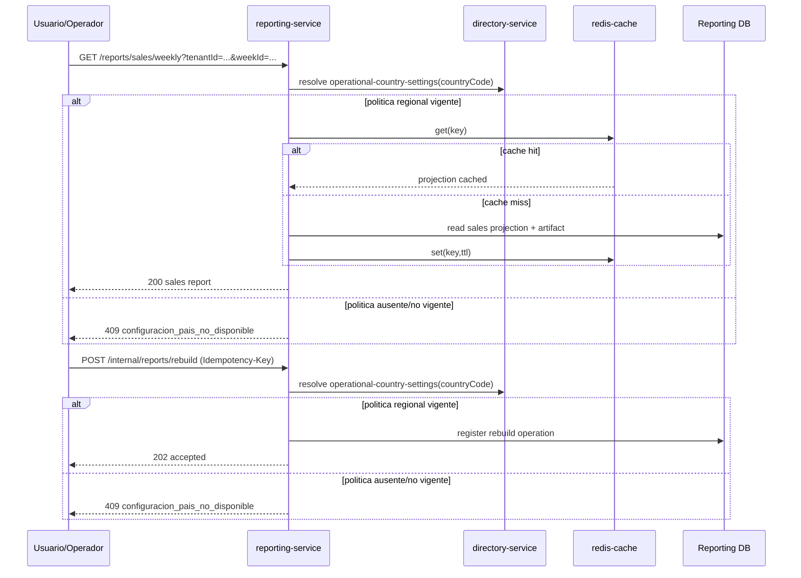

## Proposito
Definir contratos API de `reporting-service` para consultas de reportes/KPI y operaciones tecnicas internas de rebuild/regeneracion.

## Alcance y fronteras
- Incluye endpoints HTTP de consultas (`read-only`) y endpoints internos operativos.
- Incluye errores semanticos, paginacion, idempotencia y autorizacion.
- Excluye especificacion OpenAPI final en YAML/JSON.

## Convenciones del contrato
- Base path de consulta: `/api/v1/reports`.
- Base path interno: `/api/v1/internal/reports`.
- Formato: JSON, con export opcional CSV/PDF.
- Consultas son `read-only`.
- Mutaciones internas requieren `Idempotency-Key`.
- Todas las respuestas incluyen `traceId`.
- Multi-tenant: `tenantId` por claim o param validado.

## Modelo de autenticacion y autorizacion del contrato
| Flujo | Regla aplicada |
|---|---|
| HTTP query/admin interno | `api-gateway-service` autentica el request (`JWT` o token m2m) antes de enrutar al servicio. |
| Autorizacion contextual en Reporting | `reporting-service` materializa `PrincipalContext`, evalua permisos efectivos, valida `tenant`, ownership de artefacto y clasificacion del dato antes de responder o aceptar operaciones internas. |

## Mapa de endpoints
| Metodo y ruta | Objetivo | Auth/Authz | Idempotencia |
|---|---|---|---|
| `GET /api/v1/reports/sales/weekly` | obtener reporte semanal de ventas | `tenant_user`/`arka_operator` | N/A |
| `GET /api/v1/reports/replenishment/weekly` | obtener reporte semanal de abastecimiento | `tenant_user`/`arka_operator` | N/A |
| `GET /api/v1/reports/operations/kpis` | consultar KPIs operativos por periodo | `tenant_user`/`arka_operator` | N/A |
| `GET /api/v1/reports/artifacts/{reportId}` | obtener metadata/descarga de artefacto | `tenant_user`/`arka_operator` | N/A |
| `POST /api/v1/internal/reports/rebuild` | reconstruir proyeccion por tenant/periodo | `service_scope:reporting.ops` | obligatoria |
| `POST /api/v1/internal/reports/weekly/generate` | disparar generacion semanal manual | `service_scope:reporting.ops` | obligatoria |
| `POST /api/v1/internal/reports/reprocess-dlq` | reprocesar DLQ de reporting | `service_scope:reporting.ops` | obligatoria |

## Flujo API de consulta y rebuild


## Dependencia regional con Directory (FR-011/NFR-011)
| Llamado sync | Objetivo | Error semantico de salida |
|---|---|---|
| `GET /api/v1/directory/organizations/{organizationId}/operational-country-settings/{countryCode}` | resolver moneda, corte semanal, zona horaria y retencion vigentes para consultas, generacion semanal y rebuild | `configuracion_pais_no_disponible` |

Regla de mapeo aplicada:
- si `directory` devuelve `404 configuracion_pais_no_disponible` en la consulta
  tecnica de politica regional, `reporting` bloquea la operacion de negocio y
  responde `409 configuracion_pais_no_disponible`.

## Request/response de referencia
### Consulta semanal de ventas
`GET /api/v1/reports/sales/weekly?tenantId=org-co-001&weekId=2026-W10&format=json`

```json
{
  "tenantId": "org-co-001",
  "weekId": "2026-W10",
  "reportType": "SALES_WEEKLY",
  "metrics": {
    "totalSales": 154320.55,
    "paidAmount": 121004.20,
    "pendingAmount": 33316.35,
    "confirmedOrders": 122,
    "averageTicket": 1264.10
  },
  "topProducts": [
    {"sku": "SSD-1TB-NVME-980PRO", "units": 430},
    {"sku": "RAM-32GB-DDR5-6000", "units": 290}
  ],
  "topCustomers": [
    {"organizationId": "org-co-001", "orders": 35},
    {"organizationId": "org-co-014", "orders": 27}
  ],
  "artifactRef": "s3://arka-reports/org-co-001/2026-W10/sales-weekly.pdf",
  "traceId": "trc_01JY..."
}
```

### Consulta semanal de abastecimiento
`GET /api/v1/reports/replenishment/weekly?tenantId=org-co-001&weekId=2026-W10&format=json`

```json
{
  "tenantId": "org-co-001",
  "weekId": "2026-W10",
  "reportType": "REPLENISHMENT_WEEKLY",
  "items": [
    {
      "sku": "SSD-1TB-NVME-980PRO",
      "availableQty": 22,
      "reorderPoint": 40,
      "coverageDays": 3.5,
      "riskLevel": "HIGH"
    }
  ],
  "summary": {
    "highRiskSkus": 8,
    "mediumRiskSkus": 13,
    "lowRiskSkus": 49
  },
  "traceId": "trc_01JY..."
}
```

### Rebuild interno
```json
{
  "tenantId": "org-co-001",
  "period": "2026-W10",
  "projectionType": "ALL",
  "reasonCode": "consumer_lag_recovery",
  "idempotencyKey": "reporting-rebuild-org-co-001-2026-W10-all-01"
}
```

```json
{
  "operationRef": "rep_rebuild_01JY8QW6MD8E5E3Q7R4X7YJ3P8",
  "status": "ACCEPTED",
  "scheduledAt": "2026-03-04T18:05:00Z",
  "traceId": "trc_01JY..."
}
```

### Generacion manual de reporte semanal
```json
{
  "tenantId": "org-co-001",
  "weekId": "2026-W10",
  "reportType": "SALES_WEEKLY",
  "formats": ["CSV", "PDF"],
  "idempotencyKey": "reporting-weekly-generate-org-co-001-2026-W10-sales-01"
}
```

## Taxonomia de errores
| HTTP | Code | Escenario | Recuperable |
|---|---|---|---|
| 400 | `validation_error` | parametros/query/request invalidos | si |
| 401 | `unauthorized` | token ausente o invalido | si |
| 403 | `forbidden_scope` | scope/rol insuficiente | no |
| 404 | `report_not_found` | no existe reporte para week/tenant | si |
| 404 | `artifact_not_found` | artefacto no disponible | si |
| 409 | `reporte_duplicado` | ya existe reporte para week+type | no |
| 409 | `rebuild_in_progress` | reconstruccion activa para tenant/periodo | si |
| 409 | `configuracion_pais_no_disponible` | no existe politica operativa vigente para `countryCode` del tenant | no |
| 409 | `conflicto_idempotencia` | misma key con payload distinto | si |
| 422 | `projection_type_invalid` | tipo de proyeccion no soportado | si |
| 503 | `reporte_generacion_fallida` | falla export/storage temporal | si |
| 500 | `internal_error` | error inesperado | no |

## Matriz de estados de ejecucion operacional
| Flujo | Estados permitidos | Estado inicial | Terminales |
|---|---|---|---|
| rebuild | `PENDING`, `RUNNING`, `COMPLETED`, `FAILED` | `PENDING` | `COMPLETED`, `FAILED` |
| weekly generation | `PENDING`, `RUNNING`, `COMPLETED`, `FAILED` | `PENDING` | `COMPLETED`, `FAILED` |
| reprocess DLQ | `PENDING`, `RUNNING`, `COMPLETED`, `FAILED` | `PENDING` | `COMPLETED`, `FAILED` |

## Politica de idempotencia
- Header obligatorio: `Idempotency-Key` en endpoints internos mutantes.
- Ventana de deduplicacion recomendada: 24h.
- Claves sugeridas:
  - rebuild: `tenant:period:projectionType:reasonCode`.
  - weekly generate: `tenant:weekId:reportType`.
  - reprocess DLQ: `tenant:fromOffset:toOffset`.
- Misma clave + mismo payload: devolver mismo resultado operacional.
- Misma clave + payload distinto: `409 conflicto_idempotencia`.

## Contrato de filtros y paginacion (consultas)
| Endpoint | Parametros obligatorios | Parametros opcionales | Orden default |
|---|---|---|---|
| `GET /reports/sales/weekly` | `tenantId`, `weekId` | `format`, `currency` | N/A |
| `GET /reports/replenishment/weekly` | `tenantId`, `weekId` | `format`, `riskLevel` | `riskLevel desc` |
| `GET /reports/operations/kpis` | `tenantId`, `period` | `kpiGroup` | `kpiName asc` |
| `GET /reports/artifacts/{reportId}` | `reportId` | `download=true|false` | N/A |

Reglas:
- todos los filtros temporales usan `ISO-8601`/`weekId` normalizado.
- consultas filtran por `tenantId` antes de resolver formato.
- `GET /reports/*/weekly`, `POST /internal/reports/weekly/generate` y `POST /internal/reports/rebuild` validan politica regional activa por `countryCode`; sin politica retornan `409 configuracion_pais_no_disponible`.
- respuesta CSV/PDF puede usar URL firmada con expiracion.

## Seguridad y autorizacion
| Operacion | Rol/scope minimo | Validaciones |
|---|---|---|
| consultas externas | `tenant_user` o `arka_operator` | tenant isolation + data classification |
| descarga artefacto | `tenant_user` o `arka_operator` | tenant + expiracion de enlace |
| rebuild/generate/reprocess | `service_scope:reporting.ops` | autenticacion m2m + auditoria reforzada |

## Matriz de controles transversales por endpoint
| Endpoint | Control de seguridad | Control de observabilidad | Control de resiliencia |
|---|---|---|---|
| `GET /reports/sales/weekly` | tenant scope | `traceId` + metricas p95 | validacion de politica regional por `countryCode` + cache fallback a DB |
| `GET /reports/replenishment/weekly` | tenant scope | metricas por riskLevel/tenant | validacion de politica regional por `countryCode` + lectura por lotes de SKU |
| `GET /reports/operations/kpis` | tenant scope | metricas de cardinalidad | limite de payload/periodo |
| `POST /internal/reports/rebuild` | scope `reporting.ops` | auditoria de operationRef | procesamiento asincrono por lote + bloqueo por `configuracion_pais_no_disponible` |
| `POST /internal/reports/weekly/generate` | scope `reporting.ops` | traza de job semanal | idempotencia por `tenant+week+type` + bloqueo por `configuracion_pais_no_disponible` |
| `POST /internal/reports/reprocess-dlq` | scope `reporting.ops` | metricas de backlog/reproceso | throttling y dedupe fuerte |

## Compatibilidad y versionado
- Version por path (`/api/v1`).
- Agregar campos opcionales en response/request: compatible.
- Cambio de significado o remocion de campos: nueva major (`/api/v2`).
- Error codes se consideran contrato estable.

## Matriz de contrato API -> FR/NFR
| Endpoint/flujo | FR | NFR |
|---|---|---|
| consulta ventas semanal | FR-007, FR-011 | NFR-002, NFR-007, NFR-011 |
| consulta abastecimiento semanal | FR-003, FR-011 | NFR-002, NFR-007, NFR-011 |
| consulta KPIs operativos | FR-007 | NFR-007 |
| rebuild interno | FR-003, FR-007, FR-011 | NFR-008, NFR-009, NFR-011 |
| generacion semanal manual | FR-003, FR-007, FR-011 | NFR-002, NFR-008, NFR-011 |
| reproceso DLQ | FR-003, FR-007 | NFR-007, NFR-008 |

## Riesgos y mitigaciones
- Riesgo: consultas no filtradas por tenant exponen datos cruzados.
  - Mitigacion: tenant isolation obligatorio y pruebas de authz.
- Riesgo: rebuild manual concurrente degrada rendimiento.
  - Mitigacion: control de estado `rebuild_in_progress` y cola de operaciones.
