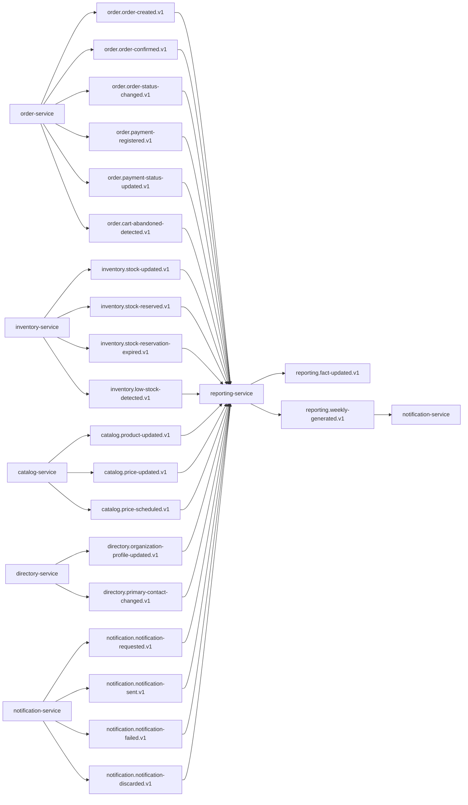

## Proposito
Definir contratos de eventos de `reporting-service` para integracion EDA con servicios core/supporting, incluyendo hechos consumidos y eventos emitidos por Reporting.

## Alcance y fronteras
- Incluye eventos emitidos por Reporting y eventos consumidos por Reporting.
- Incluye topicos, claves, versionado, idempotencia, retencion y DLQ.
- Excluye configuracion de infraestructura del cluster Kafka.

## Topologia de eventos Reporting


## Catalogo de eventos emitidos
| Evento | Topic | Key | Productor | Consumidores | Semantica |
|---|---|---|---|---|---|
| `AnalyticFactUpdated` | `reporting.fact-updated.v1` | `factId` | Reporting | no obligatorio en MVP (observabilidad y extensiones futuras) | hecho analitico aplicado a proyeccion |
| `WeeklyReportGenerated` | `reporting.weekly-generated.v1` | `tenantId:weekId:reportType` | Reporting | Notification, auditoria | reporte semanal generado con `locationRef` |

## Eventos consumidos por Reporting
| Evento consumido | Topic | Productor | Uso en Reporting |
|---|---|---|---|
| `OrderCreated` | `order.order-created.v1` | order-service | registrar pedido creado pendiente de aprobacion |
| `OrderConfirmed` | `order.order-confirmed.v1` | order-service | consolidar ventas confirmadas |
| `OrderStatusChanged` | `order.order-status-changed.v1` | order-service | metrica de ciclo de pedido |
| `OrderPaymentRegistered` | `order.payment-registered.v1` | order-service | consolidar avance de cobro |
| `OrderPaymentStatusUpdated` | `order.payment-status-updated.v1` | order-service | recalcular indicadores financieros |
| `CartAbandonedDetected` | `order.cart-abandoned-detected.v1` | order-service | conversion/recuperacion comercial |
| `StockUpdated` | `inventory.stock-updated.v1` | inventory-service | cobertura y disponibilidad |
| `StockReserved` | `inventory.stock-reserved.v1` | inventory-service | demanda comprometida |
| `StockReservationExpired` | `inventory.stock-reservation-expired.v1` | inventory-service | ajuste de cobertura |
| `LowStockDetected` | `inventory.low-stock-detected.v1` | inventory-service | alerta de abastecimiento |
| `ProductUpdated` | `catalog.product-updated.v1` | catalog-service | contexto comercial de proyecciones |
| `PriceUpdated` | `catalog.price-updated.v1` | catalog-service | contexto de revenue |
| `PriceScheduled` | `catalog.price-scheduled.v1` | catalog-service | contexto comercial futuro para timeline de revenue |
| `OrganizationProfileUpdated` | `directory.organization-profile-updated.v1` | directory-service | segmentacion de clientes |
| `PrimaryContactChanged` | `directory.primary-contact-changed.v1` | directory-service | contexto relacional de reporte |
| `NotificationRequested` | `notification.notification-requested.v1` | notification-service | volumen de intencion de comunicacion por canal/pais |
| `NotificationSent` | `notification.notification-sent.v1` | notification-service | efectividad de comunicacion |
| `NotificationFailed` | `notification.notification-failed.v1` | notification-service | incidencia de canal |
| `NotificationDiscarded` | `notification.notification-discarded.v1` | notification-service | agotamiento de reintentos |

## Envelope estandar de eventos
```json
{
  "eventId": "evt_01JY_REP_0001",
  "eventType": "WeeklyReportGenerated",
  "eventVersion": "1.0.0",
  "occurredAt": "2026-03-04T06:15:00Z",
  "producer": "reporting-service",
  "tenantId": "org-co-001",
  "traceId": "trc_01JY...",
  "correlationId": "rep_weekly_2026-W10_org-co-001",
  "idempotencyKey": "reporting-weekly-org-co-001-2026-W10-sales",
  "payload": {
    "weekId": "2026-W10",
    "reportType": "SALES_WEEKLY",
    "locationRef": "s3://arka-reports/org-co-001/2026-W10/sales-weekly.pdf",
    "generatedAt": "2026-03-04T06:15:00Z"
  }
}
```

## Payloads minimos por evento emitido
| Evento | Campos minimos |
|---|---|
| `AnalyticFactUpdated` | `factId`, `sourceEventId`, `factType`, `tenantId`, `period`, `occurredAt` |
| `WeeklyReportGenerated` | `tenantId`, `weekId`, `reportType`, `locationRef`, `generatedAt`, `occurredAt` |

## Mapa semantico evento -> intencion de dominio
| Evento tecnico | Semantica de dominio | Invariantes relacionadas |
|---|---|---|
| `AnalyticFactUpdated` | hecho derivado aplicado en proyeccion | dedupe por `sourceEventId` |
| `WeeklyReportGenerated` | reporte semanal finalizado y disponible | unicidad por `tenant+week+type` |

## Reglas de compatibilidad
- `MUST`: agregar campos nuevos solo como opcionales en `v1`.
- `MUST`: cambios de tipo semantico o remocion de campos crean topic `v2`.
- `SHOULD`: consumidores ignoran campos desconocidos.
- `MUST`: todos los eventos incluyen `tenantId`, `traceId`, `correlationId`.

## Entrega, reintentos y DLQ
| Tema | Politica |
|---|---|
| Semantica de entrega | `at-least-once` |
| Particionado | por key (`factId` o `tenantId:weekId:reportType`) |
| Reintento productor | 3 intentos con backoff exponencial |
| Reintento consumidor | 5 intentos con backoff + jitter |
| DLQ | topic `<topic>.dlq` obligatorio |
| Retencion recomendada | 14 dias operativos, 30 dias para `reporting.weekly-generated.v1` |

## Politica de replay y reproceso
| Escenario | Mecanismo | Garantia |
|---|---|---|
| perdida temporal en consumidor | replay por `occurredAt` + `eventId` | no perder hecho analitico |
| reproceso tras despliegue | dedupe por `processed_events` | idempotencia funcional |
| poison message | envio a DLQ + cuarentena | aislamiento de fallo |
| recalculo por lag alto | rebuild desde hechos historicos | consistencia eventual controlada |

## SLA de consumo esperado por tipo de evento
| Evento | Consumidor principal | Latencia objetivo de consumo |
|---|---|---|
| `OrderCreated` -> Reporting | reporting-service | < 30 s |
| `OrderConfirmed` -> Reporting | reporting-service | < 30 s |
| `StockUpdated` -> Reporting | reporting-service | < 30 s |
| `NotificationRequested` -> Reporting | reporting-service | < 60 s |
| `NotificationFailed` -> Reporting | reporting-service | < 60 s |
| `WeeklyReportGenerated` -> Notification | notification-service | < 60 s |

## Matriz de idempotencia en consumidores
| Consumidor | Evento | Clave de idempotencia |
|---|---|---|
| `reporting-service` | `OrderCreated` | `sourceEventId` |
| `reporting-service` | `OrderConfirmed` | `sourceEventId` |
| `reporting-service` | `StockUpdated` | `sourceEventId` |
| `reporting-service` | `PriceScheduled` | `sourceEventId` |
| `reporting-service` | `NotificationRequested` | `sourceEventId` |
| `reporting-service` | `NotificationSent` | `sourceEventId` |
| `notification-service` | `WeeklyReportGenerated` | `eventId + tenantId + weekId + reportType` |

## Matriz de contract testing de eventos
| Contrato | Tipo de test | Productor/consumidor | Criterio de aceptacion |
|---|---|---|---|
| `reporting.fact-updated.v1` envelope | schema contract test | productor `reporting-service` | campos obligatorios presentes |
| `reporting.weekly-generated.v1` payload | consumer contract test | consumidor `notification-service` | `weekId/reportType/locationRef` consistentes |
| `order.order-created.v1` consumo | listener integration contract | consumidor `reporting-service` | ingesta idempotente y registro de pedido pendiente |
| `order.order-confirmed.v1` consumo | listener integration contract | consumidor `reporting-service` | ingesta idempotente y update de ventas |
| `inventory.low-stock-detected.v1` consumo | listener integration contract | consumidor `reporting-service` | update de abastecimiento sin duplicidad |
| `notification.notification-requested.v1` consumo | listener integration contract | consumidor `reporting-service` | KPI de intencion de comunicacion actualizado |
| `notification.notification-failed.v1` consumo | listener integration contract | consumidor `reporting-service` | KPI de comunicacion actualizado |

## Politica de evolucion por evento critico
| Evento | Cambio compatible (`v1`) | Cambio incompatible (`v2`) |
|---|---|---|
| `AnalyticFactUpdated` | agregar metadata opcional de enriquecimiento | remover `sourceEventId` |
| `WeeklyReportGenerated` | agregar checksum/hash opcional | cambiar semantica de `locationRef` |

## Riesgos y mitigaciones
- Riesgo: volumen alto de eventos deriva en lag de proyeccion.
  - Mitigacion: particionado por tenant, scaling de consumers y rebuild incremental.
- Riesgo: versionado divergente de eventos upstream.
  - Mitigacion: validacion estricta de schema y ACL por version.
