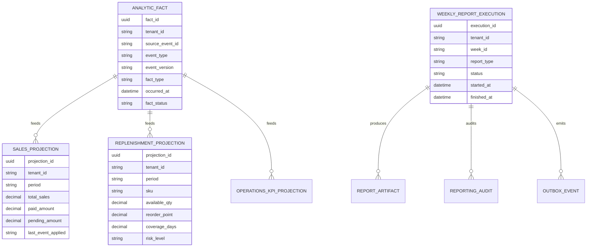

## Proposito
Definir el modelo logico de datos de `reporting-service` para soportar ingesta idempotente, proyecciones materializadas y reportes semanales sin mutar estado transaccional de core.

## Alcance y fronteras
- Incluye entidades, relaciones, ownership y reglas de integridad logica de Reporting.
- Incluye relacion semantica con `order`, `inventory`, `catalog`, `directory` y `notification` por referencias opacas.
- Excluye DDL definitivo y optimizaciones fisicas de motor.

## Entidades logicas
| Entidad | Tipo | Descripcion | Ownership |
|---|---|---|---|
| `analytic_fact` | agregado de ingesta | hecho normalizado derivado de evento upstream | Reporting |
| `sales_projection` | proyeccion materializada | vista semanal de ventas/cobros | Reporting |
| `replenishment_projection` | proyeccion materializada | vista semanal de cobertura/riesgo por SKU | Reporting |
| `operations_kpi_projection` | proyeccion materializada | KPI operativos agregados por periodo | Reporting |
| `weekly_report_execution` | agregado de reporte | estado de ejecucion de reporte semanal | Reporting |
| `report_artifact` | entidad de soporte | metadata de artefactos exportados (CSV/PDF) | Reporting |
| `consumer_checkpoint` | soporte de integracion | offsets/lag por consumer-topic-partition | Reporting |
| `reporting_audit` | auditoria | bitacora de operaciones y fallos | Reporting |
| `outbox_event` | integracion | eventos pendientes/publicados de Reporting | Reporting |
| `processed_event` | idempotencia | control de eventos consumidos | Reporting |

## Relaciones logicas
- `analytic_fact 0..n sales_projection` (por periodo/tenant/factType).
- `analytic_fact 0..n replenishment_projection` (por periodo/tenant/sku).
- `analytic_fact 0..n operations_kpi_projection` (por periodo/tenant/kpi).
- `weekly_report_execution 1..n report_artifact` (cuando estado `COMPLETED`, por formato exportado).
- `weekly_report_execution 0..n reporting_audit`.
- `consumer_checkpoint` evoluciona por flujo de ingesta; no depende por FK de hechos.
- `sales_projection/replenishment_projection/operations_kpi_projection` pueden emitir `outbox_event`.

## Reglas de integridad del modelo
| Regla | Expresion logica | Fuente |
|---|---|---|
| I-REP-01 | `analytic_fact` se aplica maximo una vez por `sourceEventId+tenantId` | `02-aggregates.md` |
| I-REP-02 | proyecciones son derivadas y no aceptan mutacion externa | `00-overview.md` |
| I-REP-03 | ejecucion semanal unica por `tenantId+weekId+reportType` | `02-aggregates.md` |
| I-REP-04 | `weekly_report_execution=COMPLETED` requiere al menos un `report_artifact.locationRef` | `03-commands.md` |
| RN-REP-01 | reporting no escribe en BC core | `00-overview.md`, `05-Integration-Contracts.md` |
| RN-REP-02 | lag alto de consumo habilita `recalcular_vista_completa` | `05-policies.md` |

## Mapeo de estados logicos por agregado
| Agregado | Estados permitidos | Fuente de verdad |
|---|---|---|
| `analytic_fact` | `CAPTURED`, `NORMALIZED`, `APPLIED`, `REJECTED` | `analytic_facts.fact_status` |
| `weekly_report_execution` | `PENDING`, `RUNNING`, `COMPLETED`, `FAILED` | `weekly_report_executions.status` |
| `outbox_event` | `PENDING`, `PUBLISHED`, `FAILED` | `outbox_events.status` |

## Diagrama logico (ER)

## Referencias cross-service (sin FK fisica)
| Referencia | Sistema propietario | Uso en Reporting |
|---|---|---|
| `source_event_id`, `event_type` | order/inventory/catalog/directory/notification | dedupe y trazabilidad de hechos |
| `orderId`, `paymentId` | order | enriquecimiento de ventas/cobros |
| `sku`, `reservationId` | inventory/catalog | abastecimiento y conversion |
| `organizationId`, `tenantId` | directory/identity-access | aislamiento y segmentacion |
| `notificationId` | notification | KPI de efectividad de canal |
| `locationRef` | storage | descarga de artefactos exportados |

## Entidades de soporte de integracion y auditoria
| Entidad | Objetivo | Clave de integridad |
|---|---|---|
| `consumer_checkpoint` | controlar progreso de consumo por particion | unico por `consumerRef+topic+partition` |
| `reporting_audit` | auditoria de ingesta/rebuild/generacion semanal | incluye `traceId`, `operationRef`, `resultCode` |
| `outbox_event` | publicacion confiable de eventos de salida | estado `PENDING/PUBLISHED/FAILED` |
| `processed_event` | dedupe de eventos consumidos | unico por `eventId + consumerName` |
| `report_artifact` | metadata de archivos exportados | unico por `tenantId+weekId+reportType+format` |

## Mapa comando -> entidades mutadas
| Comando/UC | Entidades mutadas | Limite transaccional |
|---|---|---|
| `RegisterAnalyticFact` (UC-REP-01) | `analytic_fact`, `consumer_checkpoint`, `processed_event`, `sales_projection/replenishment_projection/operations_kpi_projection`, `reporting_audit`, `outbox_event` | transaccion local unica |
| `GenerateWeeklyReport` (UC-REP-05) | `weekly_report_execution`, `report_artifact`, `reporting_audit`, `outbox_event` | transaccion local unica |
| `RebuildProjection` (UC-REP-06) | `sales_projection`, `replenishment_projection`, `operations_kpi_projection`, `reporting_audit` | por lote de hechos |
| `ReprocessReportingDlq` (UC-REP-10) | `processed_event`, `reporting_audit`, `outbox_event` | por mensaje, idempotente |

## Lecturas derivadas
- `weekly_sales_total = sum(sales_projection.total_sales by tenant+weekId)`
- `weekly_collection_rate = paid_amount / nullif(total_sales,0)`
- `replenishment_high_risk_count = count(replenishment_projection where riskLevel='HIGH')`
- `notification_effectiveness = sent / (sent + failed + discarded)`
- `consumer_lag = brokerOffset - checkpoint.offset`

## Riesgos y mitigaciones
- Riesgo: deriva de proyecciones por ingestion out-of-order.
  - Mitigacion: dedupe + checkpoint + rebuild incremental.
- Riesgo: sobreescritura incorrecta en proyecciones de abastecimiento por alta cardinalidad SKU.
  - Mitigacion: claves compuestas por `tenant+period+sku` e upsert idempotente.
- Riesgo: reporte semanal completado sin artefacto valido.
  - Mitigacion: regla de integridad `COMPLETED -> locationRef obligatorio`.
