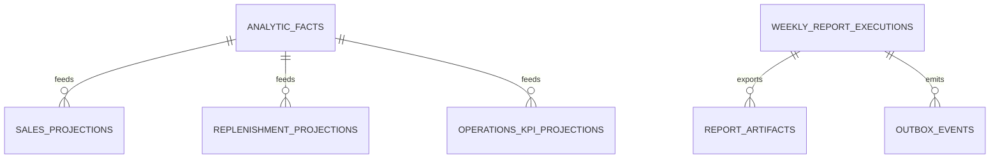

## Proposito
Definir el modelo fisico de `reporting-service` en PostgreSQL, incluyendo tablas, constraints e indices para ingesta analitica, proyecciones y reportes semanales.

## Alcance y fronteras
- Incluye tablas fisicas de Reporting y estrategias de indexacion.
- Incluye lineamientos de versionado, particionado y retencion para historicos.
- Excluye scripts de migracion finales ejecutables.

## Motor y convenciones
- Motor: PostgreSQL 15+
- PKs: UUID
- Timestamps: `timestamptz`
- Multi-tenant: `tenant_id` obligatorio en tablas operativas
- Soft delete: no aplicado; estados y retencion controlan ciclo de vida

## Tablas fisicas principales
| Tabla | Proposito | Claves principales |
|---|---|---|
| `analytic_facts` | hechos normalizados de eventos upstream | `fact_id`, UK `(tenant_id, source_event_id)` |
| `sales_projections` | proyeccion semanal de ventas | `projection_id`, UK `(tenant_id, period)` |
| `replenishment_projections` | proyeccion semanal por SKU | `projection_id`, UK `(tenant_id, period, sku)` |
| `operations_kpi_projections` | proyeccion de KPI operativos | `projection_id`, UK `(tenant_id, period, kpi_name)` |
| `weekly_report_executions` | ejecucion de reportes semanales | `execution_id`, UK `(tenant_id, week_id, report_type)` |
| `report_artifacts` | metadata de exportables (csv/pdf) | `artifact_id`, UK `(tenant_id, week_id, report_type, format)` |
| `consumer_checkpoints` | control de offset por particion | PK compuesta `(consumer_ref, topic_name, partition_id)` |
| `reporting_audits` | auditoria de operaciones | `audit_id`, idx por `tenant_id + created_at` |
| `outbox_events` | publicacion EDA garantizada | `event_id`, idx por `status + occurred_at` |
| `processed_events` | idempotencia de consumidores | `processed_event_id`, UK `(event_id, consumer_name)` |

## Diccionario de columnas criticas
### `analytic_facts`
| Columna | Tipo | Nulo | Regla |
|---|---|---|---|
| `fact_id` | `uuid` | no | PK |
| `tenant_id` | `varchar(64)` | no | aislamiento tenant |
| `source_event_id` | `varchar(120)` | no | dedupe de ingesta |
| `event_type` | `varchar(120)` | no | tipo fuente (`OrderCreated`, `OrderConfirmed`, etc.) |
| `event_version` | `varchar(16)` | no | `1.0.0` |
| `fact_type` | `varchar(80)` | no | categoria de hecho |
| `fact_payload_json` | `jsonb` | no | payload normalizado |
| `fact_status` | `varchar(16)` | no | `CAPTURED/NORMALIZED/APPLIED/REJECTED` |
| `occurred_at` | `timestamptz` | no | fecha del hecho |
| `processed_at` | `timestamptz` | si | fecha de aplicacion |
| `trace_id` | `varchar(120)` | no | trazabilidad |
| `correlation_id` | `varchar(120)` | si | correlacion |
| `created_at` | `timestamptz` | no | default now() |

### `sales_projections`
| Columna | Tipo | Nulo | Regla |
|---|---|---|---|
| `projection_id` | `uuid` | no | PK |
| `tenant_id` | `varchar(64)` | no | aislamiento tenant |
| `period` | `varchar(32)` | no | semana/periodo agregado |
| `currency` | `varchar(3)` | no | ISO 4217 |
| `total_sales` | `numeric(18,4)` | no | `CHECK (total_sales >= 0)` |
| `paid_amount` | `numeric(18,4)` | no | `CHECK (paid_amount >= 0)` |
| `pending_amount` | `numeric(18,4)` | no | `CHECK (pending_amount >= 0)` |
| `confirmed_orders` | `integer` | no | `CHECK (confirmed_orders >= 0)` |
| `average_ticket` | `numeric(18,4)` | no | `CHECK (average_ticket >= 0)` |
| `top_products_json` | `jsonb` | si | top SKU agregado |
| `top_customers_json` | `jsonb` | si | top organizaciones |
| `last_event_applied` | `varchar(120)` | si | control de progreso |
| `updated_at` | `timestamptz` | no | default now() |
| `version` | `bigint` | no | optimistic lock |

### `replenishment_projections`
| Columna | Tipo | Nulo | Regla |
|---|---|---|---|
| `projection_id` | `uuid` | no | PK |
| `tenant_id` | `varchar(64)` | no | aislamiento tenant |
| `period` | `varchar(32)` | no | semana/periodo |
| `sku` | `varchar(120)` | no | clave de SKU |
| `available_qty` | `numeric(18,4)` | no | `CHECK (available_qty >= 0)` |
| `reorder_point` | `numeric(18,4)` | no | `CHECK (reorder_point >= 0)` |
| `coverage_days` | `numeric(18,4)` | no | `CHECK (coverage_days >= 0)` |
| `risk_level` | `varchar(16)` | no | `LOW/MEDIUM/HIGH` |
| `last_event_applied` | `varchar(120)` | si | progreso |
| `updated_at` | `timestamptz` | no | default now() |
| `version` | `bigint` | no | optimistic lock |

### `operations_kpi_projections`
| Columna | Tipo | Nulo | Regla |
|---|---|---|---|
| `projection_id` | `uuid` | no | PK |
| `tenant_id` | `varchar(64)` | no | aislamiento tenant |
| `period` | `varchar(32)` | no | periodo agregado |
| `kpi_name` | `varchar(120)` | no | nombre canonico KPI |
| `kpi_group` | `varchar(80)` | si | categoria KPI |
| `kpi_value` | `numeric(18,6)` | no | valor agregado |
| `kpi_unit` | `varchar(24)` | si | `%`, `count`, `currency` |
| `last_event_applied` | `varchar(120)` | si | progreso |
| `updated_at` | `timestamptz` | no | default now() |

### `weekly_report_executions`
| Columna | Tipo | Nulo | Regla |
|---|---|---|---|
| `execution_id` | `uuid` | no | PK |
| `tenant_id` | `varchar(64)` | no | aislamiento tenant |
| `week_id` | `varchar(16)` | no | semana ISO |
| `report_type` | `varchar(40)` | no | `SALES_WEEKLY/REPLENISHMENT_WEEKLY` |
| `status` | `varchar(16)` | no | `PENDING/RUNNING/COMPLETED/FAILED` |
| `operation_ref` | `varchar(120)` | si | referencia operacional |
| `error_code` | `varchar(80)` | si | fallo si aplica |
| `started_at` | `timestamptz` | no | inicio |
| `finished_at` | `timestamptz` | si | fin |
| `trace_id` | `varchar(120)` | no | trazabilidad |
| `created_at` | `timestamptz` | no | default now() |
| `updated_at` | `timestamptz` | no | default now() |

### `report_artifacts`
| Columna | Tipo | Nulo | Regla |
|---|---|---|---|
| `artifact_id` | `uuid` | no | PK |
| `tenant_id` | `varchar(64)` | no | aislamiento tenant |
| `week_id` | `varchar(16)` | no | semana ISO |
| `report_type` | `varchar(40)` | no | tipo de reporte |
| `format` | `varchar(8)` | no | `JSON/CSV/PDF` |
| `location_ref` | `varchar(400)` | no | ubicacion storage |
| `checksum` | `varchar(128)` | si | control de integridad |
| `size_bytes` | `bigint` | si | tamano del archivo |
| `generated_at` | `timestamptz` | no | fecha de generacion |
| `expires_at` | `timestamptz` | si | expiracion de enlace |

### `consumer_checkpoints`
| Columna | Tipo | Nulo | Regla |
|---|---|---|---|
| `consumer_ref` | `varchar(120)` | no | parte de PK |
| `topic_name` | `varchar(180)` | no | parte de PK |
| `partition_id` | `integer` | no | parte de PK |
| `offset_value` | `bigint` | no | `CHECK (offset_value >= 0)` |
| `lag_value` | `bigint` | si | calculado |
| `updated_at` | `timestamptz` | no | default now() |

### `reporting_audits`
| Columna | Tipo | Nulo | Regla |
|---|---|---|---|
| `audit_id` | `uuid` | no | PK |
| `tenant_id` | `varchar(64)` | no | aislamiento tenant |
| `operation` | `varchar(64)` | no | codigo de operacion |
| `operation_ref` | `varchar(120)` | si | referencia de job |
| `result_code` | `varchar(64)` | no | exito/error |
| `actor_ref` | `varchar(120)` | si | usuario/servicio actor |
| `trace_id` | `varchar(120)` | no | trazabilidad |
| `correlation_id` | `varchar(120)` | si | correlacion funcional |
| `metadata_json` | `jsonb` | si | contexto adicional |
| `created_at` | `timestamptz` | no | default now() |

### `outbox_events`
| Columna | Tipo | Nulo | Regla |
|---|---|---|---|
| `event_id` | `varchar(120)` | no | PK tecnica |
| `tenant_id` | `varchar(64)` | no | aislamiento tenant |
| `aggregate_type` | `varchar(64)` | no | fact/report |
| `aggregate_id` | `varchar(120)` | no | id del agregado |
| `event_type` | `varchar(120)` | no | `AnalyticFactUpdated`, etc. |
| `event_version` | `varchar(16)` | no | `1.0.0` |
| `topic_name` | `varchar(180)` | no | destino broker |
| `partition_key` | `varchar(120)` | no | clave de orden |
| `payload_json` | `jsonb` | no | payload serializado |
| `status` | `varchar(16)` | no | `PENDING/PUBLISHED/FAILED` |
| `retry_count` | `integer` | no | default 0 |
| `occurred_at` | `timestamptz` | no | fecha del hecho |
| `published_at` | `timestamptz` | si | fecha de publicacion |
| `last_error` | `text` | si | ultima falla |

### `processed_events`
| Columna | Tipo | Nulo | Regla |
|---|---|---|---|
| `processed_event_id` | `uuid` | no | PK |
| `tenant_id` | `varchar(64)` | no | aislamiento tenant |
| `event_id` | `varchar(120)` | no | id consumido |
| `event_type` | `varchar(120)` | no | tipo consumido |
| `consumer_name` | `varchar(120)` | no | listener/use case |
| `source_event_id` | `varchar(120)` | si | id fuente para dedupe |
| `processed_at` | `timestamptz` | no | marca de dedupe |
| `trace_id` | `varchar(120)` | si | trazabilidad |

## Diagrama fisico simplificado


## Indices recomendados
| Tabla | Indice | Tipo | Uso |
|---|---|---|---|
| `analytic_facts` | `ux_facts_tenant_source_event` | unique btree | dedupe de ingesta |
| `analytic_facts` | `idx_facts_tenant_occurred` | btree | agregaciones por periodo |
| `sales_projections` | `ux_sales_tenant_period` | unique btree | lectura semanal ventas |
| `replenishment_projections` | `ux_supply_tenant_period_sku` | unique btree | lectura por SKU |
| `replenishment_projections` | `idx_supply_risk_level` | btree | priorizacion de abastecimiento |
| `operations_kpi_projections` | `ux_kpi_tenant_period_name` | unique btree | consulta KPI |
| `weekly_report_executions` | `ux_weekly_exec_tenant_week_type` | unique btree | unicidad de ejecucion |
| `report_artifacts` | `ux_artifacts_tenant_week_type_format` | unique btree | evitar duplicado de artefacto |
| `consumer_checkpoints` | `idx_checkpoints_updated` | btree | monitoreo de lag |
| `reporting_audits` | `idx_reporting_audits_tenant_created` | btree | trazabilidad operativa |
| `outbox_events` | `idx_outbox_status_occurred` | btree | publish scheduler |
| `processed_events` | `ux_processed_event_consumer` | unique btree | idempotencia |

## Constraints de consistencia recomendadas
- `CHECK (fact_status in ('CAPTURED','NORMALIZED','APPLIED','REJECTED'))` en `analytic_facts`.
- `CHECK (status in ('PENDING','RUNNING','COMPLETED','FAILED'))` en `weekly_report_executions`.
- `CHECK (risk_level in ('LOW','MEDIUM','HIGH'))` en `replenishment_projections`.
- `CHECK (offset_value >= 0)` en `consumer_checkpoints`.
- `CHECK (status in ('PENDING','PUBLISHED','FAILED'))` en `outbox_events`.
- `UNIQUE (tenant_id, source_event_id)` en `analytic_facts`.
- `UNIQUE (event_id, consumer_name)` en `processed_events`.

## DDL de referencia para restricciones criticas
```sql
ALTER TABLE analytic_facts
  ADD CONSTRAINT ck_analytic_facts_status
  CHECK (fact_status IN ('CAPTURED','NORMALIZED','APPLIED','REJECTED'));

ALTER TABLE weekly_report_executions
  ADD CONSTRAINT ck_weekly_report_executions_status
  CHECK (status IN ('PENDING','RUNNING','COMPLETED','FAILED'));

CREATE UNIQUE INDEX ux_analytic_facts_tenant_source_event
  ON analytic_facts (tenant_id, source_event_id);

CREATE UNIQUE INDEX ux_weekly_report_executions_tenant_week_type
  ON weekly_report_executions (tenant_id, week_id, report_type);

CREATE UNIQUE INDEX ux_processed_events_event_consumer
  ON processed_events (event_id, consumer_name);
```

## Politica de archivado operativo
| Tabla | Criterio de archivado | Frecuencia | Conservacion activa |
|---|---|---|---|
| `analytic_facts` | `occurred_at` > 18 meses | mensual | 18 meses |
| `reporting_audits` | `created_at` > 24 meses | mensual | 24 meses |
| `report_artifacts` | `generated_at` > 12 meses | mensual | 12 meses |
| `outbox_events` | `status='PUBLISHED'` y `published_at` > 30 dias | semanal | 30 dias |
| `processed_events` | `processed_at` > 60 dias | semanal | 60 dias |

## Estrategia de crecimiento y retencion
- `analytic_facts`: particion mensual por `occurred_at`.
- `replenishment_projections`: particion opcional por `period` cuando cardinalidad SKU crezca.
- `report_artifacts`: retencion 12 meses y metadata de expiracion por formato.
- `outbox_events`: retencion 30 dias tras `published`.
- `processed_events`: retencion 60 dias para deduplicacion segura.

## Riesgos y mitigaciones
- Riesgo: scans costosos en `analytic_facts` por periodos amplios.
  - Mitigacion: indice por `tenant_id, occurred_at` y particion temporal.
- Riesgo: contencion en proyecciones por ingesta paralela de eventos.
  - Mitigacion: upsert idempotente con versionado optimista.
- Riesgo: acumulacion de artifacts no descargados.
  - Mitigacion: expiracion de enlaces y limpieza periodica.
