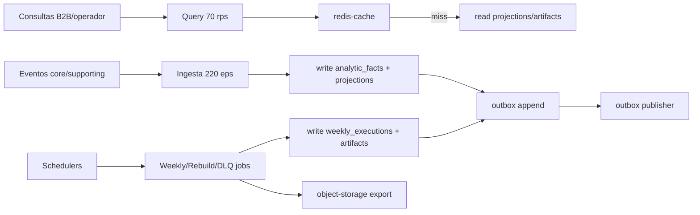

## Proposito
Definir objetivos de performance/capacidad para `reporting-service`, con foco en ingesta de hechos, refresco de proyecciones, generacion semanal de reportes y consultas analiticas por tenant.

## Alcance y fronteras
- Incluye presupuestos de latencia, throughput, concurrencia y degradacion controlada.
- Incluye estimaciones iniciales de capacidad para entorno academico realista.
- Incluye escenarios de carga operacional y criterios de aceptacion de pruebas.
- Excluye resultados de pruebas ejecutadas en fase 05-validacion.

## SLO tecnicos del servicio
| Operacion | p95 objetivo | p99 objetivo | Error budget mensual |
|---|---|---|---|
| ingesta de hecho (`RegisterAnalyticFact`) | <= 220 ms | <= 380 ms | 1.0% |
| refresco de proyeccion por hecho | <= 280 ms | <= 480 ms | 1.0% |
| consulta `sales/weekly` | <= 550 ms | <= 800 ms | 1.0% |
| consulta `replenishment/weekly` | <= 600 ms | <= 850 ms | 1.0% |
| consulta `operations/kpis` | <= 450 ms | <= 700 ms | 1.0% |
| generacion de reporte semanal | <= 15 min | <= 18 min | 1.5% |
| rebuild por periodo (10k hechos) | <= 8 min | <= 12 min | 2.0% |
| reproceso de DLQ por lote (200) | <= 90 s | <= 150 s | 1.5% |

## Capacidad estimada MVP
| Dimension | Valor objetivo inicial |
|---|---|
| eventos consumidos por segundo pico | 220 eps |
| upserts de proyeccion por segundo pico | 180 ops/s |
| consultas semanales por segundo pico | 70 rps |
| consultas KPI por segundo pico | 45 rps |
| jobs semanales concurrentes | 4 tenants en paralelo |
| reprocesos DLQ por ciclo | 200 mensajes/ciclo |
| crecimiento diario de `analytic_facts` | 1.2M filas/dia |

## Modelo de carga simplificado

## Presupuestos de recursos (referencial)
| Recurso | Baseline | Escalado recomendado |
|---|---|---|
| CPU pod reporting | 1 vCPU | HPA por `cpu>65%` o `ingest_eps` |
| Memoria pod reporting | 2 GiB | escalar a 3 GiB en corte semanal |
| Conexiones DB | 35 | pool max 100 |
| Redis ops | 5k ops/s | cluster small + TTL segmentado |
| Kafka consume rate | 5k msg/s | escalar consumidores por particion |
| Storage write throughput | 40 MB/s | multipart upload para exportacion |

## Perfil de carga por ventana operativa
| Ventana | Duracion | Mix dominante | Presupuesto operativo |
|---|---|---|---|
| Base semanal | 06:00-18:00 local | 65% ingesta, 30% consultas, 5% jobs | p95 de consultas bajo 800 ms + lag estable |
| Pico comercial | 18:00-22:00 local | 75% ingesta, 20% consultas, 5% jobs | tolera 3x baseline con degradacion p95 <= 30% |
| Cierre semanal | lunes 06:00-08:00 local | 45% ingesta, 15% consultas, 40% weekly jobs | reportes listos <= 15 min por tenant |
| Incidente de backlog | ventana variable | 50% ingesta, 10% consultas, 40% rebuild/dlq | recuperar consistencia sin perdida de hechos |

## Presupuesto de dependencias por flujo critico (reporte semanal)
| Paso | Dependencia | Timeout objetivo | Reintento permitido | Presupuesto de error |
|---|---|---|---|---|
| resolver politica operacional por `countryCode` | directory-service | 300 ms | 1 retry transient corto | <= 0.3% |
| leer proyecciones semanales | PostgreSQL | 400 ms por consulta | 1 retry transient | <= 0.4% |
| exportar artefacto CSV/PDF | object-storage | 2 s por upload | 2 retries con backoff | <= 0.7% |
| persistir metadata/estado | PostgreSQL | 200 ms | retry transient (max 2) | <= 0.2% |
| publicar `WeeklyReportGenerated` | Kafka via outbox | async | scheduler hasta `PUBLISHED` | <= 0.2% sin perdida |

## Modelo de fallos y degradacion runtime
| Tipo de fallo | Tratamiento de performance | Impacto en budget |
|---|---|---|
| rechazo funcional (`403/404/409/422`) | se atiende con salida rapida; no habilita degradacion global | no consume `error budget` de `5xx`; si eleva p95 de query o job por encima del objetivo si consume presupuesto de latencia |
| backlog de ingesta o lag alto | autoscaling por lag, rebuild por tenant/periodo y priorizacion de queries semanales | consume presupuesto operativo mientras dure el atraso |
| fallo tecnico de DB/Kafka/Redis/object-storage/directory-service | consultas degradadas, outbox acumulado, jobs marcados `FAILED` con retry idempotente o bloqueo semantico por politica regional ausente | consume latencia y, si termina en `5xx` o job fallido visible, consume `error budget` operativo |
| evento duplicado | `noop idempotente` | no consume `error budget`; evita sesgo de proyecciones |

## Bottlenecks previstos y mitigacion
| Punto | Riesgo | Mitigacion |
|---|---|---|
| contencion de upserts en proyecciones | alta concurrencia por tenant/periodo | claves compuestas + optimistic lock + batch upsert |
| scans amplios en `analytic_facts` | degradacion en rebuild largo | particion temporal + indices `tenant+occurred_at` |
| burst de consultas durante cierre semanal | latencia por cache miss | prewarm de cache por tenant y weekId |
| latencia/indisponibilidad en `directory-service` | bloqueo de consultas semanales o jobs por politica regional no resuelta | timeout estricto, retry corto y alertas por `configuracion_pais_no_disponible` |
| exportaciones pesadas simultaneas | saturacion de storage I/O | cola de jobs con paralelismo maximo controlado |
| lag de consumidores Kafka | reportes desactualizados | autoscaling por lag + reproceso incremental |

## Politica de degradacion
- Si Redis falla: consultas continuan a DB con rate-limit y pagina maxima reducida.
- Si Kafka falla: ingesta local confirma hechos y outbox acumula hasta recuperar broker.
- Si DB presenta latencia alta: priorizar UC-REP-01 y UC-REP-05; diferir rebuild masivo.
- Si `directory-service` no resuelve politica vigente por `countryCode`: bloquear consultas semanales y jobs afectados con error semantico estable (`configuracion_pais_no_disponible`).
- Si object-storage falla: marcar weekly job `FAILED` y reintentar idempotente sin emitir evento.
- Si lag supera umbral: activar `RebuildProjectionUseCase` por tenant/periodo.

## Indicadores de capacidad a monitorear
- `reporting_ingestion_latency_ms`
- `reporting_sales_refresh_duration_ms`
- `reporting_supply_refresh_duration_ms`
- `reporting_weekly_job_duration_ms`
- `reporting_query_latency_ms`
- `reporting_consumer_lag`
- `reporting_outbox_pending_count`
- `reporting_rebuild_duration_ms`
- `reporting_dlq_backlog_count`

## SLI/SLO operativos y alertas derivadas
| SLI | SLO operativo | Trigger de alerta | Severidad |
|---|---|---|---|
| `reporting_query_latency_ms{p95}` | <= 800 ms por 10 min | > 1000 ms por 10 min | media-alta |
| `reporting_weekly_job_duration_ms` | <= 15 min por ejecucion | > 15 min en 2 ejecuciones seguidas | alta |
| `reporting_consumer_lag` | <= 20000 eventos por 10 min | > 20000 por 10 min | alta |
| `reporting_outbox_pending_count` | < 5000 sostenido | >= 5000 por 5 min | alta |
| `reporting_rebuild_failure_total` | <= 3/hora | > 3/hora | alta |
| `reporting_query_error_rate` | <= 2% por 10 min | > 2% por 10 min | alta |

## Matriz de pruebas de carga y aceptacion
| Escenario | FR/NFR objetivo | Carga | Criterio de aceptacion |
|---|---|---|---|
| ingesta sostenida | FR-003, FR-007, NFR-007 | 220 eps por 30 min | p95 ingesta <= 220 ms, sin perdida de hechos |
| consultas concurrentes | FR-003, FR-007, NFR-001 | 70 rps reportes + 45 rps KPI por 20 min | p95 consultas <= 800 ms, error < 1% |
| cierre semanal | FR-003, FR-007, NFR-002 | job semanal para 200 tenants | cada tenant completa <= 15 min |
| stress 3x baseline | NFR-008 | 3x trafico por 15 min | degradacion p95 <= 30% y servicio estable |
| broker degradado | NFR-003, NFR-007 | kafka down 10 min | no perdida de hechos, outbox drena al recuperar |
| storage degradado | NFR-002, NFR-003 | fallos intermitentes upload 10 min | retries exitosos o estado `FAILED` auditable |

Runbooks de respuesta minima:
- `REP-RB-01`: lag de consumidores alto y reportes desactualizados.
- `REP-RB-02`: weekly job supera 15 min o falla en lote.
- `REP-RB-03`: backlog de outbox elevado.
- `REP-RB-04`: degradacion de consultas por cache miss masivo.
- `REP-RB-05`: rebuild fallido repetido por contencion DB.

## Riesgos y mitigaciones
- Riesgo: crecimiento acelerado de hechos analiticos incrementa costo de rebuild.
  - Mitigacion: particion temporal, ventanas de rebuild y archivado mensual.
- Riesgo: concurrencia de jobs semanales compite con trafico de consultas.
  - Mitigacion: cuotas de recursos por tipo de job y ejecucion serializada por tenant.
- Riesgo: dependencia de storage retrasa publicacion de reportes.
  - Mitigacion: politicas de retry + fallback a regeneracion manual.
