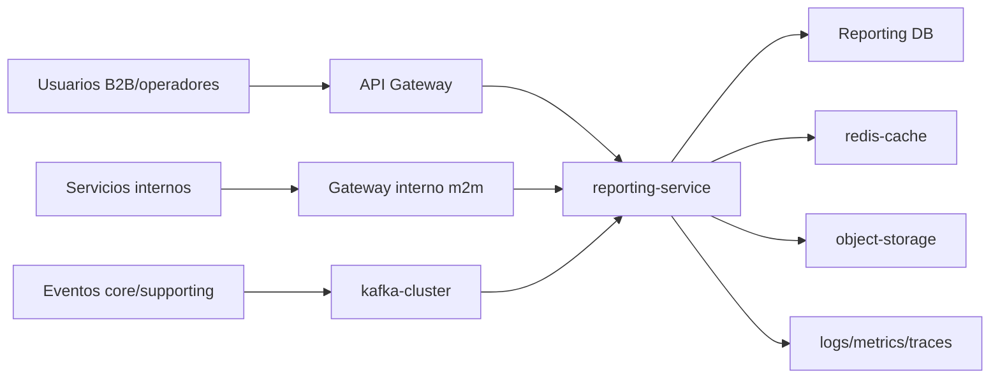
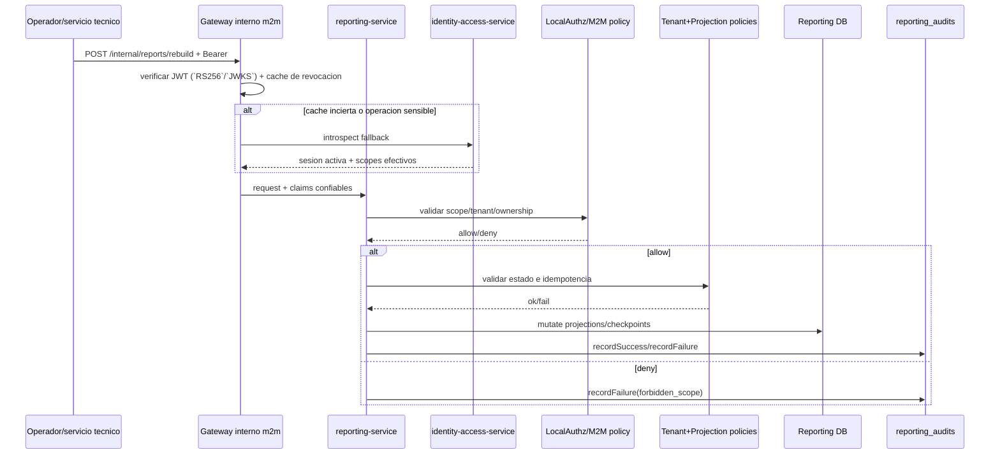

## Proposito
Definir controles de seguridad para `reporting-service` sobre ingesta de hechos, consultas analiticas, generacion de reportes y operaciones internas de rebuild/reproceso, protegiendo aislamiento por organizacion, integridad de datos derivados y trazabilidad.

## Alcance y fronteras
- Incluye amenazas principales (STRIDE), controles preventivos/detectivos y hardening de endpoints/event listeners.
- Incluye proteccion de artefactos exportables (CSV/PDF) y metadatos de reportes.
- Incluye baseline de cumplimiento tecnico y controles supply-chain aplicables al servicio.
- Excluye definicion legal final por pais/jurisdiccion.

## Threat model (resumen)
| Categoria | Amenaza | Impacto | Control principal |
|---|---|---|---|
| Spoofing | actor no autorizado invoca endpoints admin (`rebuild`, `generate`, `reprocess`) | alteracion operacional no autorizada | autenticacion previa en `api-gateway-service` + `PrincipalContext`/RBAC local + scope `reporting.ops` |
| Tampering | modificacion de eventos consumidos o payload de hecho | proyecciones incorrectas y reportes sesgados | validacion de schema/version + dedupe + DLQ |
| Repudiation | operador niega ejecucion de rebuild/generacion | perdida de trazabilidad de cambios analiticos | `reporting_audits` + `traceId/correlationId` |
| Information disclosure | exposicion cross-tenant en consultas o artifacts | incidente critico de privacidad B2B | tenant isolation en query + autorizacion por rol |
| DoS | tormenta de eventos o consultas masivas | degradacion de pipeline analitico | rate limit + backpressure + escalado por lag |
| Elevation of privilege | caller interno sin alcance adecuado ejecuta admin ops | mutaciones de proyeccion fuera de control | scopes granulares + policy de servicio |

## Superficie de ataque

## Controles de autenticacion/autorizacion
| Operacion | Control requerido |
|---|---|
| consultas (`/api/v1/reports/*`) | request autenticado en `api-gateway-service` + rol `tenant_user` o `arka_operator` + `tenantId` autorizado |
| descarga de artifacts (`/artifacts/{reportId}`) | auth del tenant propietario + expiracion de enlace |
| rebuild / weekly generate / reprocess-dlq | token m2m autenticado en `api-gateway-service` + scope `service_scope:reporting.ops` |
| consumo de eventos kafka | identidad tecnica del consumer + ACL por topic |
| jobs scheduler internos | identidad tecnica `system_scheduler` + auditoria obligatoria |

## Modelo local de Spring Security WebFlux
| Capa | Responsabilidad |
|---|---|
| `api-gateway-service` y `gateway interno m2m` | autentican en el borde validando JWT (`RS256`/`JWKS`), `iss`, `aud`, expiracion y cache de revocacion antes de enrutar |
| `reporting-service` | usa `Spring Security WebFlux` para materializar `PrincipalContext`, aplicar `PermissionEvaluator` y revalidar `tenant`, alcance de consulta, ownership de artifacts y scopes tecnicos |
| `identity-access-service` | mantiene la verdad de sesion/rol/scope, publica `JWKS`, revocaciones y cambios de rol; atiende introspeccion fallback |
| eventos/caches | reducen dependencia sincrona del servicio IAM y cierran la brecha temporal de revocacion |

Aplicacion local: `reporting-service` no autentica usuarios ni emite credenciales. Consume identidad confiable desde el borde y la endurece con filtros de tenant, politicas de artifacts y autorizacion de operaciones tecnicas como `rebuild` o `reprocess`.

## Modelo de errores de seguridad
| Momento | Familia/cierre canonico | Aplicacion en Reporting |
|---|---|---|
| autenticacion de borde/m2m | `401/403` en frontera | gateway publico o interno corta JWT invalido, expirado o revocado antes de enrutar queries, rebuild o reprocesos |
| autorizacion contextual | `AuthorizationDeniedException`, `TenantIsolationException` | `reporting-service` rechaza cruce de `tenant`, scope insuficiente o ownership invalido sobre reportes y artifacts |
| regla de dominio sensible | `DomainRuleViolationException`, `ConflictException`, `ResourceNotFoundException` | ventana de corte invalida, artifact inexistente, rebuild inconsistente o consulta fuera de policy se cierran como `404/409/422`, no como error tecnico |
| evento malicioso o duplicado | `NonRetryableDependencyException` o `noop idempotente` | hechos invalidos van a DLQ; un replay o duplicado se trata como noop idempotente para no sesgar proyecciones |
| evidencia de seguridad | `reporting_audits` + `traceId/correlationId` | consultas sensibles, descargas de artifacts y operaciones tecnicas dejan trazabilidad reforzada |

## Matriz endpoint/flujo -> amenaza -> control
| Endpoint/flujo | Amenaza prioritaria | Control preventivo | Control detectivo |
|---|---|---|---|
| `GET /api/v1/reports/sales/weekly` | acceso cruzado entre organizaciones | tenant filter obligatorio + authz por claim | alerta por `acceso_cruzado_detectado` |
| `GET /api/v1/reports/replenishment/weekly` | exfiltracion de datos comerciales | restriccion por tenant + control de campos sensibles | auditoria de consultas por actor |
| `GET /api/v1/reports/artifacts/{reportId}` | descarga no autorizada de artifact | validacion ownership + URL firmada con expiracion | trazabilidad de descargas por `traceId` |
| `POST /api/v1/internal/reports/rebuild` | elevation de privilegio | m2m + scope `reporting.ops` + idempotency key | `reporting_audits` con operationRef |
| listeners de eventos upstream | evento malicioso/invalido | schema validation + `eventType/eventVersion` + dedupe | DLQ + alerta de mensajes invalidos |
| exportador `ReportExporterStorageAdapter` | manipulacion de artifact en transito | TLS + checksum de archivo | alerta por mismatch de checksum |

## Datos sensibles y politicas
| Dato | Clasificacion | Tratamiento |
|---|---|---|
| `tenant_id`, `organizationId` | operacional sensible | obligatorio para aislamiento y masking en logs externos |
| `top_customers_json` | sensible comercial | acceso por rol, no exponer fuera del tenant |
| `location_ref` de artifacts | sensible operacional | no publico; acceso via URL firmada de vida corta |
| `trace_id`, `correlation_id` | tecnico | obligatorio para trazabilidad de seguridad |
| `idempotency_key` admin ops | sensible operacional | hash/masking en logs |
| `fact_payload_json` | potencialmente sensible derivado | minimizacion de campos y retencion controlada |

## Controles de cifrado y secretos
| Superficie | Control minimo | Evidencia esperada |
|---|---|---|
| cliente/gateway/reporting | TLS 1.2+ | verificacion de configuracion por entorno |
| reporting -> kafka/db/redis/storage | TLS interno + credenciales de servicio rotadas | pruebas de conectividad segura |
| datos en reposo (`analytic_facts`, `report_artifacts`) | cifrado de volumen y backup cifrado | checklist de plataforma |
| secretos de exporters/storage | secret manager/vault, no hardcode | SAST/SCA + control de rotacion |
| logs de error | masking de `location_ref`, `idempotency_key`, payload sensible | prueba de no exposicion en logs |

## Seguridad de eventos
- `MUST`: eventos consumidos/emitidos con `eventType`, `eventVersion`, `eventId`, `tenantId`, `traceId`, `correlationId`.
- `MUST`: validacion estricta de schema y version antes de aplicar hecho.
- `MUST`: dedupe por `eventId + consumerName` y/o `sourceEventId`.
- `MUST`: mensajes irreparables se envian a DLQ y no bloquean el stream principal.
- `SHOULD`: ACL de topics por consumer group para limitar blast radius.

## Seguridad operativa por flujo critico

## Baseline de compliance tecnico
- Privacidad: minimizacion de datos en proyecciones y exports.
- Trazabilidad: auditoria de operaciones admin y accesos a reportes.
- Retencion: politicas por entidad (`analytic_facts`, `report_artifacts`, `reporting_audits`).
- Seguridad: cifrado transito/reposo y gestion de secretos centralizada.
- Acceso: RBAC + aislamiento por tenant en consultas read-only y endpoints internos.

## Supply-chain security aplicable a Reporting
| Control | Aplicacion en servicio |
|---|---|
| SCA de dependencias | analisis de librerias del servicio y bloqueo de CVE criticos |
| SBOM por build | generar SBOM de artifact de `reporting-service` |
| firma de imagen | desplegar solo imagenes firmadas |
| hardening de base image | base minima y oficial para runtime |
| politica de admision | bloquear despliegue de imagen sin firma o CVE critico |

## Matriz de pruebas de seguridad (Gate de calidad)
| Tipo de prueba | Cobertura minima | FR/NFR objetivo | Criterio de aceptacion |
|---|---|---|---|
| authz multi-tenant en consultas | sales/replenishment/kpis/artifacts | FR-003, FR-007, NFR-005 | 0 accesos cruzados permitidos |
| authz m2m en endpoints admin | rebuild/generate/reprocess-dlq | NFR-005, NFR-006 | 0 ejecuciones con scope invalido |
| contract test de eventos | consume/emit de reporting | NFR-006, NFR-007 | 100% valida envelope y schema |
| pruebas de logging seguro | errores de query/job/listener | NFR-006, NFR-010 | sin exposicion de campos sensibles |
| DAST basico APIs reporting | endpoints read/admin | NFR-005 | sin vulnerabilidades criticas explotables |
| supply-chain checks CI | dependencia/imagen/SBOM | NFR-009 | build bloquea CVE criticos y artefacto sin firma |

## Runbooks minimos de seguridad para Reporting
1. `REP-SEC-01`: deteccion de acceso cruzado en endpoints de consulta.
2. `REP-SEC-02`: ejecucion no autorizada de `rebuild` o `weekly/generate`.
3. `REP-SEC-03`: incremento de eventos invalidos y backlog DLQ.
4. `REP-SEC-04`: exposicion potencial de artifacts o URLs fuera de tenant.
5. `REP-SEC-05`: deteccion de dependencia/imagen con vulnerabilidad critica.

## Riesgos y mitigaciones
- Riesgo: `fact_payload_json` ingresa informacion sensible no esperada.
  - Mitigacion: sanitizacion por `DataClassificationPolicy` + lista de campos permitidos.
- Riesgo: URL de artifact compartida fuera de contexto.
  - Mitigacion: URLs firmadas de corta duracion y validacion de tenant al resolver descarga.
- Riesgo: operaciones admin ejecutadas por credencial comprometida.
  - Mitigacion: scopes minimos, rotacion de secretos y auditoria reforzada por operationRef.
