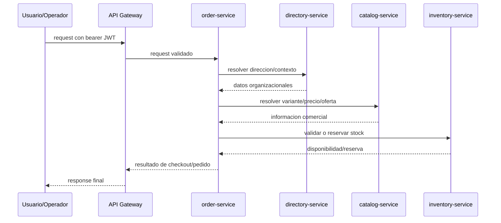
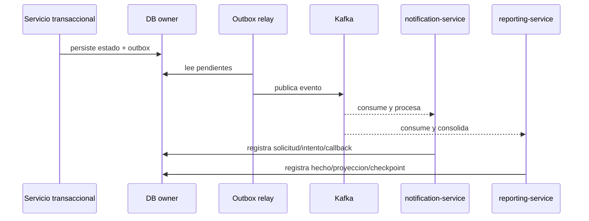

## Proposito de la seccion
Explicar como coopera el sistema en runtime cuando una operacion requiere
respuesta inmediata y cuando la consistencia puede cerrarse por eventos.

## Interaccion sincronica critica del baseline

## Reglas del plano sync
- `api-gateway` es la unica entrada publica.
- `order-service` es el principal orquestador sync del flujo comercial.
- Los owners sync responden con semantica explicita; no se infieren defaults.
- El bearer JWT validado en borde se propaga hacia los servicios internos que lo requieren.
- Los timeouts y errores se tratan como fallos de integracion observables, no como ausencias silenciosas.

## Interaccion asincrona critica del baseline

## Reglas del plano async
| Regla | Motivo |
|---|---|
| publicacion via outbox | evita perder hechos entre commit y publicacion |
| dedupe en consumer | hace gobernable replay y reintentos |
| checkpoints y offsets visibles | permiten diagnostico y recuperacion |
| `traceId` y `correlationId` obligatorios | trazabilidad cross-service |
| `organizationId` en hechos relevantes | continuidad del contexto organizacional |

## Cuadro de uso sync vs async
| Necesidad | Mecanismo oficial |
|---|---|
| validar antes de confirmar pedido | sync |
| emitir notificacion por cambio de estado | async |
| actualizar proyeccion de ventas o reposicion | async |
| consultar salud, metadata o recursos operativos | sync |
| recordar carrito abandonado desde flujo manual | sync hacia `notification-service` |

## Decisiones vigentes relevantes
- La operacion interactiva prioriza sync para garantizar respuesta util inmediata.
- La propagacion de efectos derivados usa async para desacoplar notificacion y analitica.
- No se usa autenticacion tecnica separada en HTTP interno; el modelo oficial es JWT propagado.
- Para schedulers y consumers que no parten de un usuario humano se usa contexto interno controlado.
