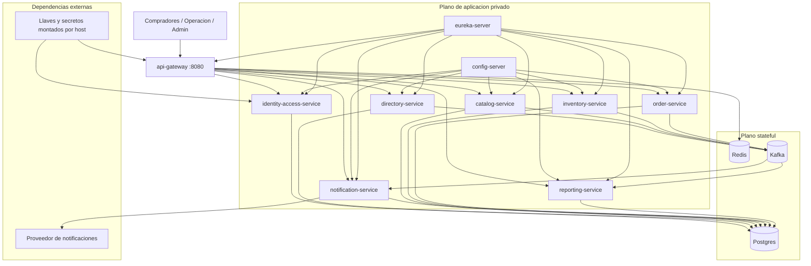

## Proposito de la seccion
Definir la topologia minima de despliegue y los entornos realmente soportados
por el baseline actual del sistema.

## Entornos reales del baseline
| Entorno | Objetivo |
|---|---|
| `local-integrated` | desarrollo, smoke y validacion integrada en una sola maquina |
| `cloud-compose` | despliegue razonable en host Linux remoto usando `Docker Compose` |
| `future-managed` | evolucion posterior sin cambiar la topologia logica documentada |

## Topologia minima en runtime

## Artefactos y unidades de despliegue
| Unidad | Tipo |
|---|---|
| `bootJar` por servicio Java | artefacto ejecutable |
| `docker-compose.yml` | topologia base local/cloud |
| `docker-compose.cloud.yml` | endurecimiento cloud y bindings privados/publicos |
| scripts `start-*` / `stop-*` | automatizacion de arranque y parada |
| `platform/stack/.env.cloud.example` | contrato de configuracion cloud |

## Reglas oficiales de exposicion
- Solo `api-gateway` debe publicar puerto al exterior en cloud.
- `config-server`, `eureka-server`, servicios de negocio, `postgres`, `redis` y `kafka` deben permanecer privados.
- Los hubs HTML operativos se sirven desde `api-gateway` para reutilizar el mismo borde.

## Decision de plataforma vigente
| Escenario | Decision |
|---|---|
| baseline cloud actual | `Droplet Linux + Docker Compose` |
| variante soportada | `DigitalOcean + Coolify` solo si preserva el compose aprobado |
| emulacion local | stack integrado local via scripts oficiales |

## Resultado esperado
El sistema debe poder moverse desde local a un host Linux remoto sin cambiar la
arquitectura logica, solo endureciendo configuracion, secretos, puertos y
persistencia.
